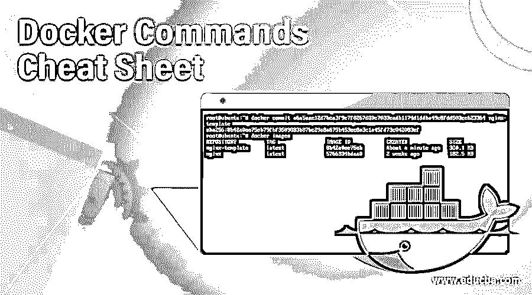
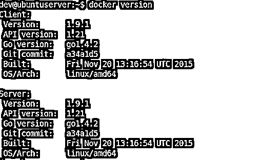
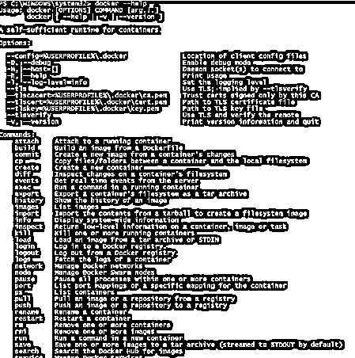
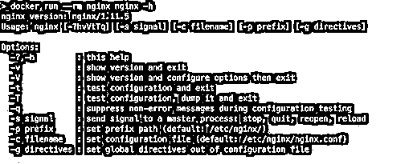
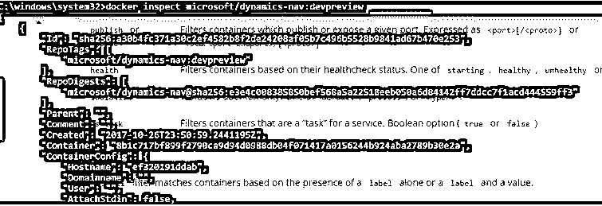

# Docker 命令备忘单

> 原文：<https://www.educba.com/docker-commands-cheat-sheet/>

## Docker 命令简介备忘单

下面的文章提供了 Docker 命令备忘单的概要。随着 DevOps 接管了整个软件行业，需要能够一起完成软件开发生命周期中所有活动的工具。Docker 是一个工具，通过使用容器来创建、部署和运行不同的应用程序。这些容器帮助开发人员为应用程序创建包，其中包含程序中需要的所有部分。这些可以是不同的库和其他依赖项，并将其发送到包中。它充当一个虚拟机。它允许应用程序使用与它们正在运行的系统相同的 Linux 内核，并且只需要即将发布的应用程序和尚未在计算机上运行的东西。

### 基本 Docker 命令备忘单

以下是一些基本的 docker 命令备忘单:

<small>网页开发、编程语言、软件测试&其他</small>

#### 1.docker 版本

该命令将给出当前安装的版本:

**代码:**

`docker version`

**输出:**

#### 2.docker 帮助

这个备忘单 Docker 命令提供了客户机理解的命令的完整列表。这里出现的大多数命令都是用来处理容器的。

**代码:**

`docker --help`

**输出:**

#### 3.码头开始

这个命令让用户启动一个特定的容器。

**语法**:

`docker start [container]`

**代码:**

`docker start iisnanobase`

**输出:**

#### 4.docker ps

该命令有助于获取所有正在运行的容器以及从中退出的容器。

**代码:**

`docker ps -a`

**输出:**

#### 5.docker exec-ti[容器][命令]

这个 Docker 命令备忘单可以用来在任何特定的容器中运行任何 shell 命令。

**语法:**

`docker exec -ti [container] [command]`

**代码:**

`docker exec demo powershell.exe ipconfig`

**输出:**

![exec -ti [container] [command]](img/b399a9a0db04afbaeb477d360c3d2b8e.png)

#### 6.docker run-ti–RM–image

这个备忘单 Docker 命令同时完成创建和启动容器的工作。它还可以在其中运行命令，并在执行完该命令后删除容器。

**代码:**

`docker run --rm nginx nginx -h`

**输出:**

#### 7.码头检查

这个备忘单 Docker 命令对于显示任何特定 Docker 对象的底层信息非常有用。

**代码:**

`docker inspect microsoft/dynamics-nav:devpreview`

**输出:**

#### 8.码头工人杀人

该命令用于通过停止容器的执行来终止容器。它的 kill 不同于“docker stop ”,因为“docker stop”给了容器适当关闭的时间，在这种情况下，它需要更长的时间来停止。另一方面，kill 命令会立即停止进程。

**代码:**

`docker kill fc5e91dfe6f6`

**输出:**

#### 9.docker 提交

该命令有助于为任何已编辑的容器创建一个新的图像，该容器已经存在。

#### 10.坞站登录

如果用户想要登录 Docker 存储库，那么用户必须使用这个命令。

**代码:**

`docker login docker.viurdata.com`

**输出:**

### 中级 Docker 命令备忘单

任何用户都可以在中级水平上使用以下命令。

#### 1.码头推送

此命令可用于将映像推送到 docker hub 存储库。

该命令的语法如下:

`docker push <username/image name>`

#### 2.docker 图像

此命令列出本地存储在计算机上的所有图像。它还列出了所有图像，包括终端上的所有中间图像。

#### 3.码头工人建造

通过使用此命令，可以从 docker 文件构建 Docker 映像。命令末尾的时间指定了上下文，这是使用 Docker 映像构建的。此外，如果文件不在运行命令的同一文件夹中，用户需要添加'-f '标志来指定文件所在的文件夹。

#### 4.码头工人拉

此命令可用于从 docker 注册表中提取图像到您的计算机。此外，可以提取图像的特定版本。

#### 5.码头标签

这有助于用任何标记来标记图像，这些标记有助于将被使用的注册表而不是本地使用的注册表。该标签可以与本地标签相同。

#### 6 docker rm $(docker ps -a -q)

当用户删除当前未处于运行状态的所有容器时，此命令非常有用。点击这个命令，所有不必要的容器将被删除。

#### 7 docker create–name 容器名称图像名称:标签

这个备忘单 Docker 命令在实例化任何图像的容器时非常有用。总是需要通过提供–name 参数来命名文件或图像。完成后，需要运行 docker start container_name 和 docker stop container_name 命令。一旦创建了容器，就可以运行它以供将来使用。

#### 8.rmi 坞站

当用户想要从本地图像存储中删除图像时，此命令非常有用。

#### 9.docker ps

为了获得当前正在运行的所有容器的列表，用户可以使用这个命令并获得一个完整的列表。

#### 10.docker-机器环境默认值

如果用户想要配置环境变量，那么这个命令将会帮助您。这里的“default”表示在没有任何额外复杂性的情况下，该命令应该运行并设置命令行变量。作为开发人员，您还可以使用 docker-machine ls 命令列出可用的机器，并启动或停止任何特定的机器。

### 高级 Docker 命令备忘单

以下是一些高级 docker 命令备忘单:

#### 1.使用多个 Docker 合成文件

这些备忘单 docker 命令使用多个 Docker 文件；开发人员必须根据应用程序的环境、试运行和生产来更改应用程序。Docker Compose 命令有助于实现这一点，因为默认情况下它已经读取了两个文件。

**代码:**

`$ docker-compose up -f my-override-1.yml my-override-2.yml`

开发人员可以使用–f 选项来 docker-compose up，以便使用多个文件。

#### 2.在图像中使用 ONBUILD 命令

这个 ONBUILD 指令指定了从正在使用的映像构建新映像时要运行的不同命令。可以认为是继承的概念。

**举例:**

**代码:**

`ONBUILD COPY package.json /app`

### Docker 命令备忘单的提示和技巧

下面，关于命令的窍门备忘单可以帮你节省很多时间。

#### 1.拖尾日志

要快速查看日志，可以使用下面的命令。

**代码:**

`sudo docker logs -t-tail 1000 my_postgres 2>&1 | grep -I error`

#### 2.复制和粘贴文件

Docker 使您能够在容器中复制和粘贴文件。这可以从主机到容器完成，反之亦然。

**代码:**

`COPY script.sh /tmp
ADD script.sh /tmp`

#### 3.停止所有容器

使用下面的命令可以停止所有容器。

**代码:**

`docker stop $(docker ps -q)`

它将仅在活动时停止运行。

**代码:**

`docker stop $(docker ps -aq)`

它将停止运行。

### 结论

Docker 是 DevOps 工作环境中的救星。凭借其不同的功能，它是可用于部署不同项目的最佳工具之一。它是开发、发布和运行不同应用程序的最佳平台。

### 推荐文章

这是一个 Docker 命令指南备忘单。这里我们已经讨论了 Docker 命令备忘单的内容和命令以及免费的提示和技巧。您也可以阅读以下文章，了解更多信息——

1.  [你一定要试试 Cheat Sheet Python](https://www.educba.com/cheat-sheet-python/)
2.  [什么是小抄字](https://www.educba.com/cheat-sheet-word/)
3.  [如何使用备忘单 MySQL](https://www.educba.com/cheat-sheet-mysql/)
4.  [棱角 2 小抄](https://www.educba.com/angular-2-cheat-sheet/)

