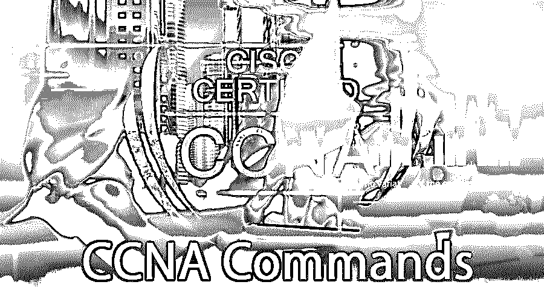

# CCNA 命令

> 原文：<https://www.educba.com/ccna-commands/>

## CCNA 命令简介

CCNA ( [思科认证网络助理](https://www.educba.com/ccna-interview-questions/))基本上是思科最受欢迎的信息技术认证之一。这是思科职业生涯助理级别认证的重点证书之一。它有助于为任何现有员工准备更好的职业生涯，特别是在下一代技术领域。

### 基本 CCNA 命令

有许多 CCNA 命令可用于各种环境，尤其是各种“显示”命令，如显示配置、接口或路由 IP 之类的东西。一些基本命令如下所述:

<small>网页开发、编程语言、软件测试&其他</small>

#### 1.显示运行环境的配置

*   **显示运行**:CCNA 中所有显示类命令的一个关键命令是‘显示运行’。通常 CCNA 用户会因为各种各样的原因非常频繁地使用这个命令。它基本上以逐页的方式提供了一个细节报告，用于解释或显示可用的当前设备的整个设置细节。它包括非常重要的接口信息，如 IP 地址。如果某个设备关闭了，它也会给出明确的信息。它还提供了设备的关键或安全配置之一，如单个设备的密码信息类型、网络设置(如 SSH 或 [telnet](https://www.educba.com/what-is-telnet/) 之类的东西),或者解释设备是否准备好登录等。它还表示信息，如保存配置时带有时间戳的最后更新日期，[包括保存用户的 VLAN](https://www.educba.com/what-is-vlan/) 信息。
*   **显示运行配置:**如果由于某种原因，人们无法理解系统设置的某些信息，或者人们对此毫无概念，那么这个命令的执行将总是有用的。在大多数情况下，这个命令提供了一些关键信息，通常我们会查看这些信息来识别一些关键的 bug。

#### 2.显示接口信息

*   **Show int** :通常用于显示特定界面的全部信息。它一个接一个地给出单个设备配置的完整信息。如果出于某种原因，执行者需要执行该命令来获取特定接口的信息，那么他们必须提供特定的类型，并在命令中迅速要求接口的编号。假设你想获得快速[以太网](https://www.educba.com/wifi-vs-ethernet/) 0/1 的详细信息，那么你需要执行一个类似‘show int fa 0/1’的命令。该命令提供了设备的详细信息，如 MAC 地址、MTU 大小、带宽标签、IP 地址，如果可用，提供子网地址，甚至提供接口的任何错误。
*   **显示界面**:该命令为执行者提供一个详细的错误报告视图；从那里，他们可以很容易地确定确切的问题在哪里，可能的根本原因是什么，知道这个问题是从哪里发生的，以及我们如何从这种情况中恢复。

#### 3.显示 IP 的路由

*   **Show ip route:** 这个 CCNA 命令通常提供关于路由表的详细信息，路由表保存了我们需要将数据发送到哪里的信息。
*   **显示 ip 路由 ospf:** 不知何故，人们对显示一个特定路由器的整个路由细节感兴趣，那么他们需要在命令后提供路由器名称。在这种情况下，只会显示 OSPF 路由器的详细信息。

#### 4.显示 IP 接口

*   **Show ip int** :这个命令实际上提供了一个接口的整个第 3 层细节。给定了呼入和呼出用户的访问列表、IP 地址、网络主节点等信息。
*   **Show ip int 0/2** :这个 CCNA 命令专门用于显示一个特定接口的第三层细节。

### 中级 CCNA 命令

CCNA 开发人员还使用了其他几个流行的命令，它们不是非常基本的命令，但是在与 CCNA 一起工作时，这些命令是必须执行的。其中一些如下所述:

#### 1.为用户显示访问列表

*   **显示访问列表**:用于显示特定设备的访问列表。但是它永远不会给出访问列表实际应用的接口的详细信息。
*   **Show ip interface** :提供详细的访问列表信息，包括接口细节和该接口上特定用户的访问列表。
*   **显示 ip 访问列表**:用于详细显示 IPV4 访问列表；它将总是在显示中排除其他可用的访问列表。

#### 2.显示 cdp 的邻居详细信息

*   **Show cdp neighbor detail** :主要用于仅显示与您使用的设备相连的 Cisco 设备的信息。它被认为是 CCNA 的第二层司令部。

### 高级命令

尽管如此，一些关键任务需要由 CCNA 司令部的用户频繁完成。这些任务还需要执行一些高级命令，主要由一些管理人员使用，以获取有关 VLAN 服务、中继端口管理或识别连接设备的正确协议的信息。这些高级命令如下所述:

**1。显示 VLAN** :这给出了在特定设备上配置的 VLAN 的全部[信息。它包括在该特定设备中配置的 VLAN 的编号、名称和特定接口信息。](https://www.educba.com/types-of-vlan/)

**2。Show interface trunk** :这个 CCNA 命令提供在特定设备上配置的所有中继端口的信息。它提供了关于哪个端口可以用于该设备上的这个[特定中继端口](https://www.educba.com/what-is-a-trunk-port/)的详细信息，并期望谁可以通过这个特定中继的 VLAN 的详细信息。

**3。Show ip protocols** :这是 CCNA 的高级命令之一，执行该命令是为了找出 Cisco 设备中可用的第三层协议[的详细信息。它提供了 RIP、EIGRP 或 OSPF 等数据。](https://www.educba.com/cisco-certification-vs-microsoft/)

### 提示和技巧

一些经常使用 CCNA 查询的普通用户通常会使用一些正确使用输出的技巧和诀窍。这些技巧通常可以解决一些特定于用户的查询，并显示执行输出以便正确理解。一些非常常用的关键技巧是:

**1。自动化一些重要的命令**:日常生活中有很多非常频繁使用的命令。假设对于一些应用程序，组织需要每天在提示中连接设备特定的信息。为了每天执行该命令，他们可以计划编写一个脚本，并在该设备上安排一些特定的作业，以获取信息并与相关人员共享。

**2。思科缓冲调优:**这是调优设备性能的关键部分之一。有些情况下，一些挂起运行的缓冲区占用了整个内存空间，因此网络工程师需要确保清除缓冲区空间的即时效果，以获得更好的性能。

### 结论

上述命令不是 CCNA 认证网络工程师可用的最终命令。在 CCNA 有很多常用的命令。但是对于常见的故障排除，高于命令的知识将足以进行进一步的学习。

### 推荐文章

这是 CCNA 命令的指南。在这里，我们讨论了基本、中级和高级 CCNA 命令以及使用技巧和诀窍。您也可以阅读以下文章，了解更多信息——

1.  [火花命令](https://www.educba.com/spark-commands/)
2.  [猪命令](https://www.educba.com/pig-commands/)
3.  [Sqoop 命令](https://www.educba.com/sqoop-commands/)
4.  [配置单元命令](https://www.educba.com/hive-command/)

