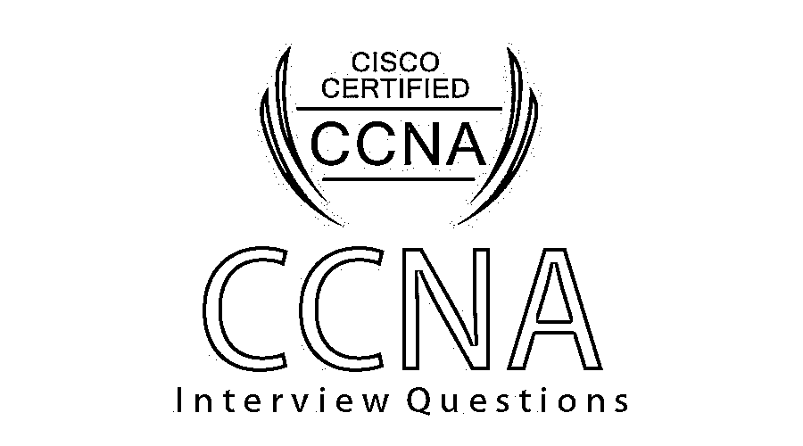

# CCNA 面试问题

> 原文：<https://www.educba.com/ccna-interview-questions/>

## CCNA 面试问答介绍

CCNA 是思科的 IT 认证。CCNA 认证有一定的等级。CCNA 认证的水平有一些内置的水平。CCNA 认证的一些目标之前，其有志于了解，配置，操作，故障排除网络和连接使用遥感技术命名为万。这些认证所涵盖的领域因专业不同而有很大的差异，人们也有这样的愿望。

**认证等级:**思科为网络工程师提供 4-5 条路径。

<small>网页开发、编程语言、软件测试&其他</small>

*   入门级(CCENT)
*   协理级(CCNA/ CCDA)
*   专业职等(CCNP/ CCDP))
*   专家级(CCIE/CCDE)
*   建筑师(最近增加了 CCAR)

这篇 CCNA 访谈问题文章将只关注 CCNA 部分的内容，但是在我们继续之前，我们的读者最好了解一下可用的流。

*   路由和交换
*   设计
*   工业网络
*   网络安全性
*   互联网服务商
*   服务提供商运营
*   存储网络
*   声音
*   数据中心和无线。

思科 CCNA 提供的认证涵盖了广泛的主题。这些是

*   广域网和局域网设计
*   OSI 模型
*   IP 寻址
*   VLAN 和无线局域网
*   路由器及其相关协议
*   [网络安全](https://www.educba.com/what-is-network-security/)与管理

**CCNA 认证有以下内容网络基础:**

1.网络基础
2。局域网交换技术。路由技术
4。万科技
5。基础设施服务
6。基础设施安全
7。基础设施管理

如果你想找一份与 CCNA 相关的工作，你需要准备 2022 年 CCNA 的面试问题。根据不同的职位描述，每次面试都是不同的。在这里，我们准备了重要的 CCNA 面试问题和答案，将帮助你在面试中取得成功。

这篇 2022 年 CCNA 面试问题的文章将呈现 11 个最重要和最常用的 CCNA 面试问题。这些面试问题分为以下两部分:

### 第 1 部分-CCNA 面试问题(基础)

这第一部分包括基本的面试问题和答案。

#### Q1。路由是什么意思？

**答:**
路由基本上是指信息在网络上的移动或传递。所选网络可以是两种网络之一——内部网络或内部网络。路由的发生总是需要源和目的地。路由器是执行路由过程的专用设备。路由器只不过是网络层设备。

#### Q2。简单解释一下路由器是怎么分类的？

**答案:**
这是 CCNA 面试时问的基本问题。路由器通常根据下列标准进行分类:

*   静态 v/s 自适应
*   扁平 v/s 分层结构
*   单路径 v/s 多路径
*   域间 v/s 域内
*   链路状态 v/s 距离矢量
*   主机智能 v/s 路由器智能。

#### Q3。什么是网络，并提及它们的类型？

**答案:**
网络是连接的意思。在网络术语中，它通常指两台或多台计算机(或设备)的连接。连接必须支持共享数据、打印机、传真等相关资源的功能。有三种类型的网络通过局域网，广域网和城域网。

**兰**–局域网
**万**–广域网
**城域网**–城域网。

#### Q4。详细解释一下网络拓扑？

**答案:**
拓扑是指可用网元之间连接的模式或布局。下面列出了[网络拓扑](https://www.educba.com/what-is-network-topology/)的基本类型

*   **星型拓扑:**这些是家里的首选。它有一个被称为“枢纽”的中央配送系统。集线器可以是交换机或路由器。这种拓扑的好处是，如果故障发生在任何网络中，那么只有这一部分受到影响，而不是整个网络。相反，如果中枢发生故障，那么整个系统可能会崩溃。
*   **环形拓扑:**这里，每个系统正好有两个邻居或连接用于通信。数据以环形传输(顺时针或逆时针)。这些一般都是学院或者学校的首选。一个网络中的故障会损坏整个环路，并导致整个网络瘫痪。
*   **总线拓扑:**为了理解这个概念，假设它是一个普通的主干。这个拓扑架构师就是这种。所有设备连接都有一个公共连接。在这种类型的连接中，设备必须向所需的设备发送连接请求。其他人可以看到该请求，但目标设备只能接受它。
*   **树形拓扑:**这些将多个星形拓扑集成到一个总线中。这里只有集线器设备可以连接到树形总线网络。
*   **网状拓扑:**这些拓扑基于路由的概念。在这里，每台设备都与其他设备相连。

#### Q5。如果是 IPv4 和 IPv6，我的 IP 地址的大小是多少？

**答案:**
对于 IPv4 其 32 位，对于 IPv6 其 128 位

### 第 2 部分-CCNA 面试问题(高级)

现在让我们来看看高级面试问题。

#### Q6。半双工和全双工是什么意思？

**答:**
如果通信是双向的，那么就是全双工，如果是单向的，那么就是半双工。

#### Q7。请说出构成 OSI 模型的各层。

**回答:**
第 1 层——物理层
第 2 层——数据链路层
第 3 层——网络
第 4 层——传输层
第 5 层——会话
第 6 层——表示层
第 7 层——应用

#### Q8。交换机、路由器和集线器之间有什么区别？

**答案:**
一个开关用来接收信号创建一个帧。它在不同的局域网网段之间转发数据包。当数据在 OSI 模型的数据链路层或网络层发送时，它是数据包控制的平台。它支持单个广播域和多个冲突域。

路由器是一种网络网关设备，用于将数据包转发到计算机网络。至少有一个局域网将路由器与其 IP 地址或局域网或广域网连接起来。一台路由器支持两个广播域。如果有任何东西进入它在中枢的端口，它就把它发送给其他人。它不太贵，也最简单。它有一个冲突域和一个广播域。

#### Q9。CCNA 有哪些不同类型的网络？

**答案:**
这是 CCNA 面试中问得最多的面试问题。有两种类型的网络:

*   对等网络
*   基于服务器的网络

#### Q10。定义一个 MAC 地址？

**答案:**
MAC 地址是媒体访问控制地址。它存储在 ROM 中，并且有唯一的定义。它被认为是网络体系结构中的媒体访问控制层。

#### Q11。解释冲突域和广播域的区别？

**答案:**
**广播域**
在广播域中，所有的接合点在数据链路层都可以通过广播到达彼此，每个设备都做好了接收各自数据的准备。它可以绑定到相同的 LAN 网段或其他 LAN 网段。
广播域使用本地网络向接收者广播数据包。边播边播，海量数据；因此，接收数据的速度较慢，并且接收其地址的数据也需要更多的时间。

**冲突域**
在冲突域中，由于同时发送更多的帧，数据冲突发生得更多。
如果同时发送两个以上的帧，则数据会在其间相互冲突，并且由于发生冲突，信息会丢失，并且设备不会接受数据，因此，发送方和接收方之间的通信会发生冲突。

因此，发送方必须再次发送数据，这样，在接收方接收数据将花费更多的时间。

### 推荐文章

这是一个 CCNA 面试问题和答案的列表指南，以便候选人可以轻松地解决这些面试问题。在本帖中，我们研究了 CCNA 面试中常见的问题。您也可以阅读以下文章，了解更多信息——

1.  [Teradata 面试问题](https://www.educba.com/teradata-interview-questions/)
2.  [CCNA vs CCNP](https://www.educba.com/ccna-vs-ccnp/)
3.  [小抄 CCNA](https://www.educba.com/cheat-sheet-ccna/)
4.  [思科认证 vs 微软](https://www.educba.com/cisco-certification-vs-microsoft/)

