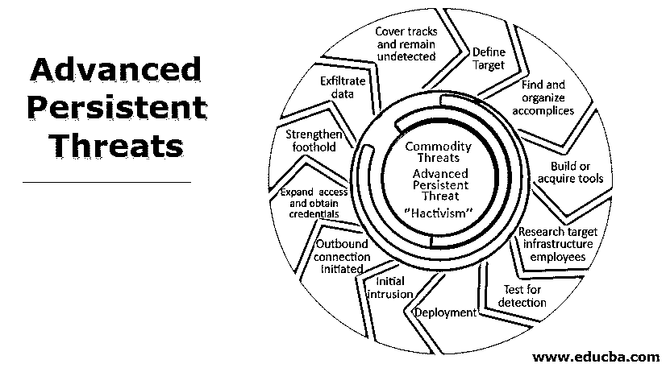

# 高级持续威胁

> 原文：<https://www.educba.com/advanced-persistent-threats/>

## 高级持久威胁(APT)简介

高级持久威胁是有针对性的攻击，是其创建者(黑客)通过复杂的方法(即绕过传统的终端保护解决方案)传递攻击负载，然后秘密执行其预定操作(如窃取信息)而不被检测到的长期操作。通常，这种攻击的目标是非常仔细地选择的，首先进行仔细的侦察。这种攻击的目标通常是大型企业、政府组织，通常是政府间的组织，它们创建对手并相互发起这种攻击，挖掘高度敏感的信息。

高级持续威胁的一些示例包括:

<small>网页开发、编程语言、软件测试&其他</small>

*   泰坦之雨(2003)
*   GhostNet (2009 年)-Stuxnet(2010 年)，它几乎摧毁了伊朗的核计划
*   水螅
*   深度熊猫(2015)

### 高级持续威胁的特征和进展

APT 在许多不同方面不同于传统威胁:

*   他们使用精密复杂的方法渗透网络。
*   它们在更长的时间内不会被发现。与此同时，传统威胁可能只是在网络或终端保护级别被检测到，或者即使他们运气好，没有通过终端解决方案，定期的漏洞检查和持续监控也会发现威胁。相比之下，高级持久威胁只是绕过所有安全层，最终到达主机，它们在那里停留更长时间并执行其操作。
*   apt 是有针对性的攻击，而传统攻击可能有针对性，也可能没有针对性。
*   他们还旨在渗透整个网络。

### 高级持续威胁的进展

以下是高级持续威胁的进展:

*   **选择和定义目标—**应该定义一个目标，即哪个组织应该成为攻击者的受害者。为此，攻击者首先通过足迹和侦察收集尽可能多的信息。
*   **寻找并组织同谋-**APT 涉及用于攻击的高级 as 尖端技术，而且大多数时候，ATP 背后的攻击者并不是一个人。第二是找到“犯罪伙伴”,他们拥有开发复杂技术来实施 APT 攻击的技能水平。
*   **建造和/或获得** **工具—**要实施 APT 攻击，需要选择正确的工具。也可以构建工具来创建 APT。
*   **侦察和信息** **收集—**在实施 APT 攻击之前，攻击者试图收集尽可能多的信息来创建现有 IT 系统的蓝图。信息收集的一个例子可以是网络拓扑、DNS 和 DHCP 服务器、DMZ(区域)、内部 IP 范围、web 服务器等。值得注意的是，鉴于组织的规模，定义目标可能需要一段时间。组织越大，准备蓝图所需的时间就越多。
*   **检测测试–**在此阶段，我们会寻找漏洞和弱点，并尝试部署较小版本的侦察软件。
*   **入口点和部署–**这一天终于到来了，在经过仔细检查后，从许多其他薄弱点中选择一个入口点来部署整个套件。
*   **初始入侵—**现在，攻击者终于进入了目标网络。从这里，他需要决定去哪里找到第一个目标。
*   **出站连接已启动–**一旦 APT 到达目标，设置自身，它就会尝试创建一个隧道，通过该隧道进行数据渗透。
*   **访问和凭证搜索的扩展—**在此阶段，APT 试图在网络中传播自己，并试图在不被检测到的情况下获得尽可能多的访问权。
*   **巩固立足点—**在这里，我们尝试寻找并利用其他漏洞。通过这样做，黑客增加了访问其他高访问位置的机会。黑客也增加了建立更多僵尸的机会。僵尸是互联网上被黑客入侵的计算机。
*   **数据泄露**——这是将数据发送到黑客基地的过程。黑客一般会试图利用公司的资源对数据进行加密，然后发送到他们的基地。通常为了分散注意力，黑客会利用噪音策略来分散安全团队的注意力，这样敏感信息就可以被转移出去而不被发现。
*   **掩盖痕迹并保持** **不被发现****–**黑客确保在攻击过程中以及一旦退出就清除所有痕迹。他们尽量保持低调。

### 检测和防止 Apt 攻击

让我们首先来看看预防措施:

*   **意识和所需的安全培训–**组织非常清楚，如今发生的大多数安全违规事件都是因为用户做了一些不应该做的事情，可能他们受到了引诱，或者他们在办公室做任何事情时没有遵循适当的安全措施，例如从不良网站下载软件、访问具有恶意的网站、成为网络钓鱼的受害者等等！因此，组织应该持续举办安全意识会议，让员工了解如何在安全的环境中工作，以及安全漏洞的风险和影响。
*   **访问控制(NAC 和 IAM)–**NAC 或网络访问控制具有多种访问策略，可以实施这些策略来阻止攻击。如果设备未通过任何安全检查，它将被 NAC 阻止。身份和访问管理(IAM)有助于防止黑客窃取我们的密码或破解密码。
*   **渗透测试–**这是测试您的网络抗渗透能力的一个很好的方法。所以，这里的组织人员本身变成了黑客，他们通常被称为道德黑客。他们必须像黑客一样思考才能渗透到组织网络内部，他们做到了！它暴露了现有的控制和漏洞。根据暴露程度，组织会采取必要的安全控制措施。
*   **管理控制—**管理和安全控制应完好无损。这包括定期修补系统和软件，安装入侵检测系统和防火墙。组织面向公众的 IP(如代理、web 服务器)应放置在 DMZ(非军事区)中，以与内部网络隔离。这样，即使黑客控制了 DMZ 中的服务器，他也无法访问内部服务器，因为它们位于另一端，是独立网络的一部分。

**让我们来看看侦探手段:**

*   **网络监控—**指挥与控制(C & C)中心是高级持久威胁的翅膀，分别携带有效载荷和机密数据进出。被感染的主机依赖于命令和控制中心来执行接下来的一系列操作，并且它们通常会定期进行通信。如果我们试图检测程序，域名查询，是发生在一个周期性的循环，这将是值得调查的情况。
*   **用户行为分析–**这包括使用人工智能和解决方案来监视用户的活动。我们的期望是，解决方案应该能够检测到主机活动中的任何异常。
*   **使用欺骗技术–**这对组织来说是双重好处。首先，攻击者被引诱到虚假的服务器和其他资源，从而保护组织的原始资产。现在，该组织还使用这些假冒的服务器来学习攻击者攻击该组织时使用的方法；他们了解他们的网络杀伤链。

### 修复和响应

如果发生任何高级持续威胁(APT)攻击，我们还必须了解响应和修复程序。首先，如果我们使用正确的工具和技术，APT 可能会陷入初始阶段，在初始阶段，影响会小得多，因为 APT 的主要动机是停留更长时间，保持不被检测到。一旦检测到，我们应该尝试从安全日志、取证和其他工具中获取尽可能多的信息。必须对受感染的系统进行重新映像，并且应该确保所有受感染的系统和网络都没有受到威胁。

然后，组织应该对所有系统进行彻底的检查，以检查它是否到达了更多的地方。然后应该修改安全控制以防止这种攻击或将来可能发生的任何类似攻击。
现在，如果高级持续威胁(APT)已经持续了几天，并且在很晚的阶段才被检测到，则应该立即使系统离线，与所有类型的网络分离，并且还必须检查受影响的任何文件服务。然后，应该对受影响的主机进行完整的重新映像；应该进行深入分析，以揭示随之而来的网络杀伤链。CIRT(网络事件响应小组)和[网络取证](https://www.educba.com/cyber-forensics/)应该参与解决所有数据泄露问题。

### 结论

在本文中，我们看到了 APT 攻击是如何工作的，以及我们如何预防、检测和响应此类威胁。人们应该对 APT 攻击中涉及的典型网络杀伤链有一个基本的概念。

### 推荐文章

这是高级持久威胁(APT)指南。在这里，我们分别讨论高级持续威胁的介绍、特征、进展、检测和预防 APT 攻击。您也可以浏览我们推荐的其他文章，了解更多信息——

1.  [网络应用安全](https://www.educba.com/web-application-security/)
2.  [网络安全挑战](https://www.educba.com/cyber-security-challenges/)
3.  [虚拟主机的类型](https://www.educba.com/types-of-web-hosting/)
4.  [防火墙设备](https://www.educba.com/firewall-devices/)

