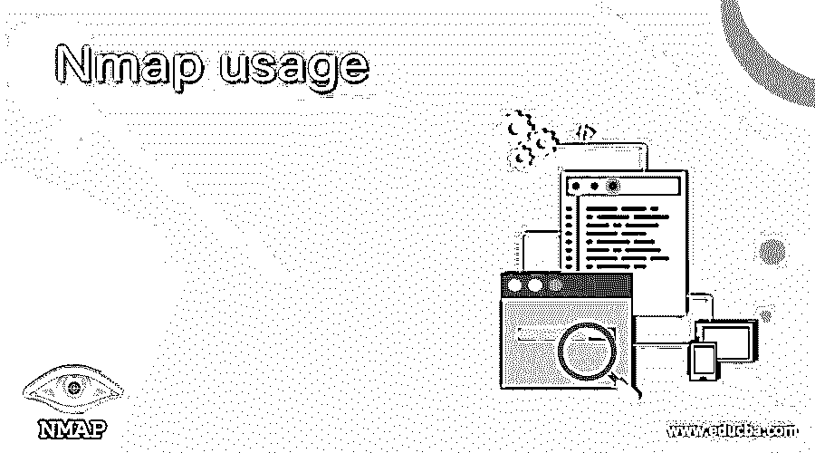

# Nmap 用法

> 原文：<https://www.educba.com/nmap-usage/>

## Nmap 用法介绍

Nmap 代表网络映射器。这是一个 Linux 命令行工具，可以扫描网络的 IP 地址和端口，并检测已安装的应用程序。Nmap 帮助网络管理员发现哪些系统连接到他们的网络，找到可用的端口和服务，并搜索漏洞。

出于各种目的，安全专业人员选择 Nmap 而不是其他扫描方法。首先，Nmap 允许您使用基本命令和配置轻松规划网络。Nmap 脚本引擎支持简单的命令(如检查主机是否启动)和复杂的脚本编写。

<small>网页开发、编程语言、软件测试&其他</small>

**特性**

Nmap 还具有以下功能:

能够快速识别一个或多个网络上的所有设备，包括移动设备、路由器、服务器、交换机等。

DNS 服务器、Web 服务器和其他流行的应用程序都是可以在系统上识别的服务。Nmap 还可以准确检测应用程序版本，这有助于检测现有漏洞。

Nmap 可以查找设备操作系统的详细信息。它将包括具体的细节，如操作系统模型，从而更容易安排进一步的渗透测试方法。您可以使用 Nmap 来攻击网络，使用 Nmap 脚本引擎中的现有脚本进行漏洞扫描和安全审计。

Nmap 的图形用户界面称为 Zenmap。它有助于开发网络可视化映射，以改进可访问性、报告和监控。

### 命令列表

下面是使用 Nmap 的各种命令的列表。

**基本扫描**

网络映射的第一步是扫描网络上的活动设备列表。

1.Ping 扫描—扫描给定子网上的活动设备列表。

> nmap -sp

2.扫描单个主机—在单个主机上搜索 1000 个已知端口。这是 SNTP、SQL、Apache 等常见服务使用的端口。

> nmap scanme.nmap.org

**隐形扫描**

发送一个 SYN 包并处理结果就是秘密扫描的完成方式。当收到 SYN/ACK 时，端口打开，然后可以启动 TCP 链接。

另一方面，秘密扫描从不完成三次握手，使得目标很难识别扫描设备。

> nmap-sS scanme.nmap.org

要执行秘密扫描，需要使用-sS 命令。与其他扫描类型相比，秘密扫描的攻击性较低且速度较慢，因此用户可能需要等待一段时间才能得到响应。

**版本扫描**

在渗透测试中，找到应用程序的版本很重要。这使您的工作变得简单，因此您可以在常见漏洞和利用(CVE)数据库中找到某个服务版本的现有漏洞。然后，使用像 Metasploit 这样的利用技术，您可以用它来攻击计算机。

> nmap-sV scanme.nmap.org

'-sV '命令用于运行版本扫描。Nmap 可以生成服务列表及其各自的版本。版本扫描并不总是 100 %正确，但它有助于获得对系统的访问。

**扫描操作系统**

Nmap 可以使用 TCP/IP 指纹提供对底层操作系统的理解。在操作系统扫描期间，Nmap 还可以尝试评估设备的正常运行时间。

> nmap-sV scanme.nmap.org

**侵略性扫描**

Nmap 具有主动模式，允许它检测操作系统、搜索脚本、版本和跟踪路由。要执行攻击性扫描，需要使用一个参数。

> nmap-A scanme.nmap.org

**多台主机扫描**

Nmap 能够同时扫描许多主机。当你负责一个大型网络系统时，这个功能就派上用场了。

扫描多台主机有多种方法

要同时扫描所有主机，请将所有 IP 地址写在一行中。

> nmap 192.164.1.1 192.164.1.2 192.164.1.3

之后，要同时扫描所有子网，请使用星号*

> nmap 192.164.1。*

然后添加逗号来分隔地址结尾。因此，没有必要键入整个域。

>国家气象卫星计划

要指定 IP 地址范围，请添加一个连字符。

> nmap 192 . 164 . 1 . 0–255

**端口扫描**

Nmap 的端口扫描是最基本的功能之一。有许多方法可以扫描端口。

要扫描单个端口，请添加-p 参数。

> nmap-p 413 192.164.0.4

**-top-ports** 标志用于指定要扫描的前 n 个端口。

> nmap–前 10 个端口 scanme.nmap.org

**从文件扫描**

通过导入包含 IP 地址列表的文件，可以扫描大量 IP 地址。

nmap -iL /input_ips.txt

**Nmap 帮助**

Nmap 提供了一个内置的帮助命令，其中列出了所有可用的标志和选项。鉴于 Nmap 提供了大量的命令行参数，它通常是有用的。

nmap -h

### 结论

在本文中，我们看到了各种命令，可以轻松快速地扫描网络、端口、主机、操作系统和防火墙。

### 推荐文章

这是 Nmap 使用指南。这里我们讨论使用 Nmap 的各种命令的介绍和列表。您也可以看看以下文章，了解更多信息–

1.  [Nmap 命令](https://www.educba.com/nmap-commands/)
2.  [什么是 Nmap？](https://www.educba.com/what-is-nmap/)
3.  [Kali Linux 使用](https://www.educba.com/kali-linux-uses/)
4.  [数据库安全](https://www.educba.com/database-security/)

