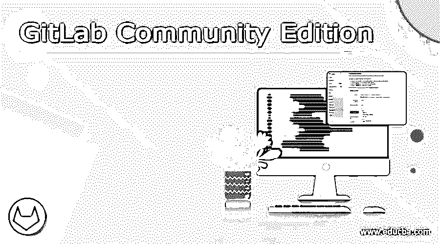

# GitLab 社区版

> 原文：<https://www.educba.com/gitlab-community-edition/>

## GitLab 社区版简介

Gitlab community edition 被定义为基于 web 的 DevOps 生命周期管理工具的一个版本或特定形式，它还通过提供 wiki 文档、跟踪问题的平台和功能来实现持续集成和部署管道，从而在 Git 存储库中引入管理。所有这些功能都是通过 GitLab Inc .开发的开源许可证实现的。GitLab 平台上还有各种其他版本，从企业版到社区版。这些版本中的每一个都有自己的一套功能，这些功能被标记为个性化功能的可用性和可用性，而不仅仅是一个特殊的版本。在本文中，我们将研究 GitLab 社区版的不同方面。

### Gitlab 社区版概述

根据 GitLab 的定义，我们知道应用程序是建立在开放的核心模型上的。作为这种模式的概述，它是一种在应用程序使用环境中创造、交付和获取价值的方式，Gitlab 组织通过这种方式将作为开源软件进行商业营销的产品货币化。开源软件中存在的那些软件属于这样一种类型，即版权所有者授予使用、研究、修改甚至为任何受众和任何目的发布其源代码的许可。此外，这些开源类型的软件列表是以一种公共协作的方式开发的，被称为开放协作。

<small>网页开发、编程语言、软件测试&其他</small>

由于开放核心模型的工作，更小的特征子集，也称为“核心”特征，作为整个应用程序的免费和有限特征版本提供给用户，但是如果需要，用户可以通过订阅应用程序的专有版本中的附加组件来升级到“商业”版本。虽然有人可能会认为开放核心模型不是真正的开源软件，但 Gitlab 仍然是其中的一种，这个话题仍然有争议。

Gitlab 的社区版是 Gitlab 的开源版本。这个版本的 Gitlab 不构成 Gitlab 的任何专有代码。如果我们谈论的是功能，我们会考虑企业版的免费层。

### Gitlab 社区版定价

在价格方面，正如我们已经谈到的，这个版本在麻省理工学院外籍人士许可下可以免费使用。快速浏览一下这种类型的许可证就知道，有了这种类型的许可证，只要原始版权和许可证通知包含在发布或分发的软件的所有副本中，就可以对应用程序做任何事情。然而，这种类型的许可证不能做的是，作者不承担任何不符合用例的责任，尽管人们肯定可以打开一个问题来修复它，并且人们还必须记住，开发是由社区主导的，因此人们不能有人负责。

### 使用信息

就使用而言，用户可以将社区版用于商业用途，修改、分发和再许可它，以及根据个人需要使用它。这实质上意味着人们可以对这个版本做任何他们想做的事情，除了记住版权和许可需要被包含在发行中。

### 如何安装 GitLab 社区版

作为参考，我们可以在 Ubuntu 服务器上安装 Gitlab 社区版。虽然有些观点会改变，即。命令、先决条件的版本，但是安装的基本流程和要点将保持不变。

首先，我们需要了解以下先决条件:

*   Ubuntu 服务器
*   RAM(最小值。4GB 虽然 8GB 是可取的)
*   安装 community edition 的 root 用户帐户的权限

**步骤 1:** 一旦满足了先决条件，我们就需要更新所有可用的存储库，并通过运行以下命令更新系统中的所有包:

`sudo apt update
sudo apt update -y`

步骤 2: 当所有的升级都完成后，我们需要安装 GitLab 依赖项，即 curl、postfix 和 ca-certificates，它们将在安装过程中提供进一步的帮助。为了执行安装，我们将执行:

`sudo apt install curl postfix openssh-server ca-certificates -y`

**步骤 3:** 为了便于安装，我们将通过使用 omnibus 包来安装 Gitlab。我们使用 omnibus 是因为流畅运行所需的所有包、服务和工具都是一次性安装的！在这一步中，我们将首先通过运行 curl 命令来分配 Gitlab 存储库:

`curl -sS https://packages.gitlab.com/install/repositories/gitlab/gitlab-ce/script.deb.sh | sudo bash`

一旦我们运行了上面的命令，我们将使用 apt 命令来安装 Gitlab Community Edition。

`sudo apt install gitlab-ce -y`

在执行了上面的命令之后，我们需要等待几分钟才能得到一条消息，表明 Gitlab 版本已经安装。一旦完成，我们将需要配置 URL 域，并包括 gitlab.example.com 访问 Gitlab。需要进行此更改的文件是:/etc/gitlab/gitlab.rb

**步骤 4:** 配置完域后，需要通过运行 sudo 来安装 letsencrypt -y，然后运行带有所需参数的 Letsencrypt 命令，从而生成 letsencrypt 证书和 DHPARAM。

**第五步:**保存上面创建的文件，在/etc/gitlab/gitlab.rb 位置编辑对应的地址。ssl_dhparam 由创建的 dhparam 文件组成。张贴这些更改；我们需要运行命令 sudo gitlab-ctl reconfigure

**步骤 6:** 最后但同样重要的是，UFW 防火墙需要根据应用程序的要求进行配置！

### 结论

在本文中，我们讨论了 Gitlab 作为一个应用程序的整个范围，从定价到使用，包括安装 Gitlab 社区版本的方法。总的来说，这篇文章将为读者提供所需的帮助，以了解他们是否需要社区版，或者是否必须根据用例升级到企业版。

### 推荐文章

这是 GitLab 社区版的指南。在这里，我们讨论 Gitlab 作为一个应用程序的整个范围，查看它对定价的概述。您也可以看看以下文章，了解更多信息–

1.  [GitLab 替代方案](https://www.educba.com/gitlab-alternative/)
2.  [什么是 GitLab](https://www.educba.com/what-is-gitlab/)
3.  [GitHub 克隆](https://www.educba.com/github-clone/)
4.  [如何安装 Github](https://www.educba.com/install-github/)

