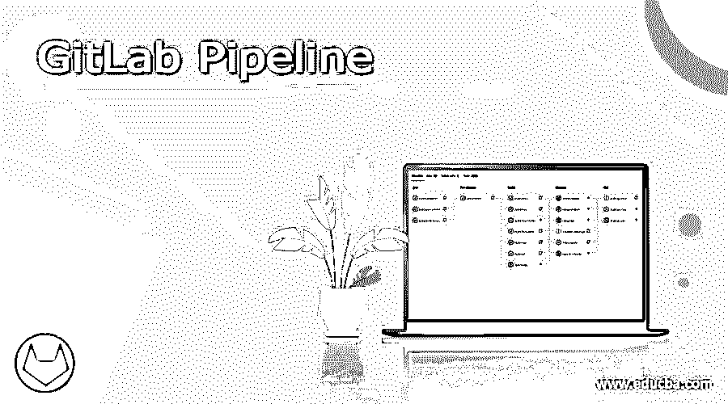
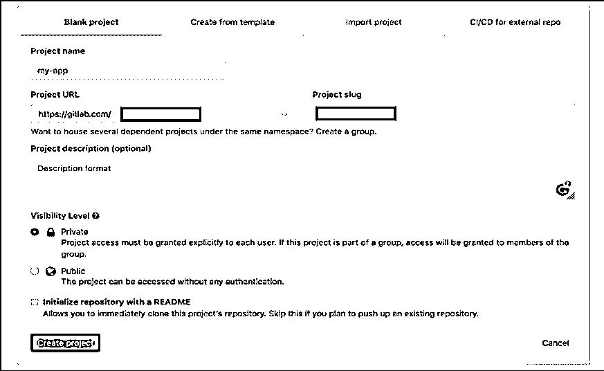
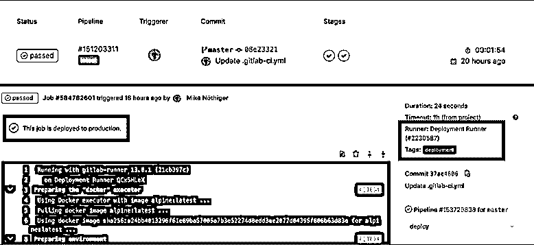

# GitLab 管道

> 原文：<https://www.educba.com/gitlab-pipeline/>

## GitLab 管道简介

当几个作业在代码的帮助下一步一步地执行时，以流水线的形式自动化就叫做 Gitlab 流水线。单个阶段中可以有许多作业，这些作业并行执行，如果成功，将进入下一个阶段。如果管道失败，用户应该调查作业失败的问题并纠正它，以便可以为下一阶段执行管道。管道对于一个项目来说很重要，它包括在工作环境中构建、测试和部署作业，并且这些作业依赖于用户。

### GitLab 管道的类型

Gitlab 管道有 CI 管道、Deploy 管道、Project 管道三种类型。虽然这些被称为类型，但是它们属于一个单一的管道，如果不将这三种类型合并到同一个管道中，我们就无法运行管道。

<small>网页开发、编程语言、软件测试&其他</small>

**CI 管道:**

持续集成管道包括从头构建一些东西，并在开发环境中测试它们。开发人员可能会想到在构建应用程序并将其投入生产后添加一些东西。这可以在持续集成的帮助下完成，我们甚至可以在部署后添加代码。这个阶段也包括测试，我们可以在代码中用不同的方法进行测试。

**部署管道:**

该管道有助于将代码或任何应用程序部署到登台环境或生产环境中。这个管道的目的是将持续集成和测试后的代码推送到用户选择的任何环境中。部署管道可以自动化，一旦代码进入准备阶段，我们就可以根据我们的要求和时间表将其投入生产。代码取自开发环境，因为它已经被 CI 管道放置。

**项目管道:**

在同一个 Gitlab 上可能会运行不同的项目，这可能会使用户不知道应该触发哪个管道。项目管道有助于描述项目和代码的依赖关系，从而有助于理解项目。在自动触发的管道中使用了 API，这是专门用于微服务的。这也有助于用户理解管道是如何从部署的一个阶段转移到另一个阶段的。

**开发工作流程:**

有各种类型的工作流，如分支流程、基于主干的流程和基于分叉的流程。

**分支流量:**

为每个任务创建单独的分支，并且当这些任务准备好被合并到流水线中时，为流水线创建合并请求。这有助于使工作流连续进行，而不会与主分支发生任何合并冲突。因此，开发人员可以在单独的分支上工作，主分支将只测试代码，从而使持续集成对开发人员来说更容易。当分支被赋予适当的名称时，很容易跟踪它们，并使开发人员的工作变得舒适。

**基于中继的流量**

在这个工作流中，只有一个分支，它可能是所有开发人员工作的主要分支。在这里，代码被实时合并，因此不需要等待其他开发人员将其合并到主分支中。有时开发人员会创建短暂的特性分支，这样一旦编码完成，它就会被合并到主分支中，使得开发能够持续进行，因为合并冲突会更少。这为开发人员节省了时间，代码将在短时间内投入生产。

**基于分叉的流程**

分叉工作流的工作方式不同于其他两种工作流，因为开发人员将在工作系统中拥有自己的私有存储库。开发人员不需要在开发代码之后将代码推送到主分支，因为一旦代码被提交到中央存储库，它就会被推送到主分支。这使得公共服务器的工作变得更加容易。开发人员进行提交并不需要写权限，维护人员可以接受开发人员的写权限，并将他们的代码合并到存储库中。分支系统类似于其他工作流，其中分支被直接合并到中央存储库中。这是一个分布式工作流，对任何开源项目都有好处。

**可视化管道**

我们可以在 Gitlab 的 pipelines 选项卡中看到管道状态，它向我们显示了为各种项目运行的不同管道。管道通过进入管道的细节来显示作业状态。管道的状态有助于我们了解作业是否成功。

点击管道，可以看到管道的所有相关作业。我们可以跟踪管道，如果需要，我们可以删除同一管道的记录。有显示持续时间、管道状态和管道详细信息的管道图。此外，我们有管道小部件来查看管道的合并和提交请求。可以从 Gitlab 页面上的作业视图中看到管道的整体状态。

管道图还可以帮助我们在需要时延迟作业，并将经常出现的实例分组到同一个管道中，并将其可视化以了解状态。我们可以根据优先级对工作进行排序，并为每个管道设置时间表。

### GitLab 管道

1.创建一个项目，并在 GitLab 中将其设置为私有或公共。

2.现在服务器应该保存到 GitLab runner 中，这样所有在这里运行的作业都将有 CI/CD 配置。使用 SSH 密钥将用户添加到服务器和 docker 组。现在，gitlab-ci.yml 文件必须配置不同阶段的作业。所有这些都必须是 PowerShell 格式。这是第一个 Gitlab 管道，这个过程继续如上所述。

### 结论

当在公共服务器中工作时，我们可能需要为有缺陷的工作回滚 Git 管道，这可以在项目概述中完成。Git pipeline 改变了开发人员的工作模式，现有开发人员和新来者都可以轻松完成这项工作。

### 推荐文章

这是 GitLab 管道指南。这里我们讨论 Gitlab 管道的简介和三种类型，以便更好地理解。您也可以看看以下文章，了解更多信息–

1.  [GIT 仓库](https://www.educba.com/git-repository/)
2.  [GitLab 替代方案](https://www.educba.com/gitlab-alternative/)
3.  [什么是 GitLab](https://www.educba.com/what-is-gitlab/)
4.  [Mercurial vs Git](https://www.educba.com/mercurial-vs-git/)

