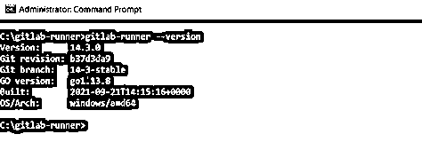

# Gitlab 运行寄存器

> 原文：<https://www.educba.com/gitlab-runner-register/>

## Gitlab runner 寄存器简介

Gitlab runner register 被定义为一个能够将 runner 与一个或多个实例绑定的进程。运行器被定义为便于作业在管道中运行的应用程序。这些应用程序需要下载并安装在自己拥有或管理的基础设施上。出于安全原因，建议将 runner 应用程序安装在不同于 Gitlab 实例的其他设备上。runner 应用程序是开源的，是用 Go 编程语言编写的，它是一个单一的二进制文件，没有特定语言的要求。在本文中，我们将查看安装后注册运行程序的步骤，并深入了解使运行程序注册成为可能的元素。

### Gitlab runner 寄存器概述

Gitlab runners 作为一个应用程序在 Gitlab 实例和安装 runner 的机器之间建立通信。作业的处理发生在安装了 Gitlab runner 的同一台机器上，但是除此之外，还可以在 Kubernetes、auto-scaled instances 等容器中运行作业。当一个跑步者被注册时，他必须选择一个执行人。执行器是流程中决定每个作业在哪里运行的部分。通过少量的配置，可以在一个虚拟机上安装运行程序，并使用另一个虚拟机作为执行器。或者，在 Docker 中安装 Gitlab runner 后，需要使用 docker executor 来运行作业。启用 Gitlab runner 注册的命令如下:

<small>网页开发、编程语言、软件测试&其他</small>

`gitlab-runner register`

有了上面的命令，就有了各种选项来实现某种动态性并帮助实现特定的目标。执行命令后，它会在配置文件中添加一个条目。在一次安装中，用户可以拥有多个配置，每次执行该命令时，都会添加一个新的配置条目，而不会删除以前的条目。为实现预期结果而提供的两个选项是:

#### 相互作用的

这是默认模式，在执行 Gitlab runner register 命令时使用。使用该命令，可以输入许多参数，即。跑步者姓名、CI 服务器 URL、注册令牌等。这些参数可以作为命令行界面中的参数输入，也可以通过设置环境变量来输入。要了解选项的详尽列表，可以执行 git lab-runner register–help

#### 非交互式

在执行 Gitlab runner register 命令时，这是一种必须绕过命令手动打开的模式——非交互式。使用该命令，可以输入许多与交互式参数相同的参数，即。跑步者姓名、CI 服务器 URL、注册令牌等。这些参数可以作为命令行界面中的参数输入，也可以通过设置环境变量来输入。这里使用的附加环境变量是 REGISTER_NON_INTERACTIVE。同样详尽的交互注册列表也适用于此。

#### git lab-跑步者列表

记住上一段，一个 runner 安装可以在一个配置文件下启用多个配置。这是一个命令，用于列出保存在使用 TOML 格式的配置文件中的所有运行程序。这种格式支持最小配置文件格式，由于语义明显，这种格式更容易理解。

#### GitLab runner 寄存器验证

使开发者能够检查注册的跑步者是否可以连接到 Gitlab。尽管这个命令不允许验证 Gitlab runner 服务是否正在使用一个 Runner。如果需要删除已经从 Gitlab 中删除的旧运行程序，必须执行以下命令:git lab-runner verify–delete

#### gitlab runner 注册注销

另一个被证明是 Gitlab runner 应用程序的精髓的特性是取消注册任何已注册的 runner 的能力，这是由前面讨论的命令执行的。该命令使用 Runners API，这是一个应用程序编程接口，用于在 Gitlab 中注册或取消注册 Runners。该命令需要完整的 URL 和需要取消注册的跑步者的令牌，或者跑步者的名称。该命令还提供了一个选项–all-runners，允许取消注册所有附加的 runners。有人可能会问，我们如何获得跑步者的名单或详细信息！为此，我们已经讨论了 GitLab-runner list 命令，该命令将显示所有跑步者的列表，我们可以选择我们关心的一个。以下是命令:

**使用 URL 和令牌**

`gitlab-runner unregister --url <URL of the runner> --token <Token of the runner>`

**使用名称**

`gitlab-runner unregister --name <Name of the runner>`

**GitLab-runner 安装**

下面是安装 Gitlab Runner(在 Windows 中)的一步一步的过程

*   根据系统特点，从 Gitlab 官方页面下载二进制 exe 文件。

*   创建一个包含 exe 文件的文件夹，并复制下载的 exe 文件。

*   在管理员模式下打开命令提示符，并导航到保存 exe 文件的位置。
*   执行命令 GitLab-runner.exe 安装。

*   安装后，可以通过运行 git lab-runner-version 来检查版本。

### GitLab 运行程序命令

我们在前面的段落中讨论了很多 Gitlab runner 命令，因此我们需要对它们进行分类，因此我们有 3 个类别:

1.  **与注册相关的命令** : gitlab-runner 注册，gitlab-runner 列表，gitlab-runner 验证，gitlab-runner 注销。
2.  **与服务相关的命令** : gitlab-runner 安装、gitlab-runner 卸载、gitlab-runner 启动、gitlab-runner 停止、gitlab-runner 重启、gitlab-runner 状态
3.  **与运行**相关的命令:gitlab-runner run，gitlab-runner run-single，gitlab-runner exec。
4.  **内部命令** : gitlab-runner 工件-下载器、gitlab-runner 工件-上传器、gitlab-runner 缓存-归档器、gitlab-runner 缓存-提取器

### 结论

在这篇文章中，我们了解了 Gitlab runner 寄存器的 360 度方面，此外，还了解了其他一些有助于 Gitlab runner 作为一个应用程序取得成功的命令。

### 推荐文章

这是 Gitlab runner 注册指南。在这里，我们讨论 Gitlab runner 寄存器的 360 度方面，此外，还研究了其他一些命令。您也可以看看以下文章，了解更多信息–

1.  [什么是 GitLab](https://www.educba.com/what-is-gitlab/)
2.  [GitLab 替代方案](https://www.educba.com/gitlab-alternative/)
3.  [捷普斯特替代方案](https://www.educba.com/jhipster-alternatives/)
4.  [动物园管理员备选方案](https://www.educba.com/zookeeper-alternatives/)

