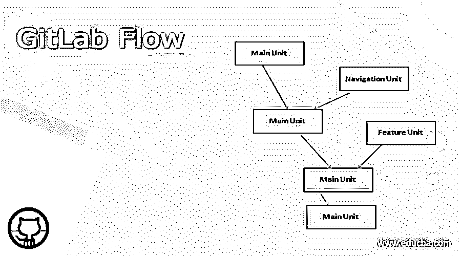
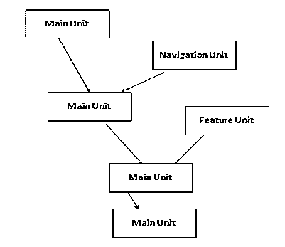
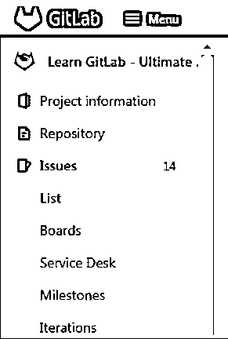
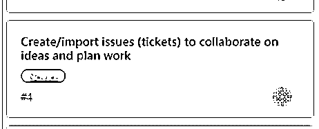
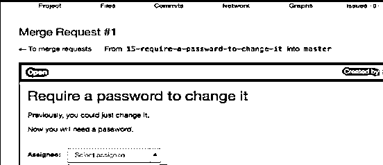

# GitLab Flow

> 原文：<https://www.educba.com/gitlab-flow/>

## GitLab 流程简介

基本上，Gitlab 允许我们实现各种不同的策略和工作流程。如今，在许多组织中，没有适当的工作流程，或者我们可以说，他们流动一些复杂的工作流程。复杂的工作流程意味着没有合适的工作流程，没有问题跟踪系统。由于这个问题，图中的新概念具备了 Gitlab 流程所需的所有先决条件。Gitlab 流程用于将所有功能驱动的开发和不同的单元与问题跟踪选项结合起来。基本上，Gitlab 流程提供了一种透明而有效的方法来实现系统。

### 什么是 GitLab 流量？

与 GitFlow 相比，GitLab Flow 是一个更直接的选项，它将突出显示驱动的事件和元素分支与以下问题结合起来。有了 GitLab Flow，所有的供应和修复都转到主分支，同时授权创建和稳定分支。GitLab Flow 整合了一系列最佳实践和规则，以确保编程推进小组遵循一个平稳的周期来合作地分派包含。Git 在扩展和混合方面有所改进，推动编程进步小组远离其他源代码控制设备，如 SVN，并采用工作流程来改进进步。从其他 rendition control 框架迁移到 Git 的关联可能会遇到区分成功工作流程的问题。

<small>网页开发、编程语言、软件测试&其他</small>

### Git 流及其问题

现在让我们看看 git-flow，看看 git-flow 中出现了什么问题，如下所示。

Git 流是利用 Git 分支的主要主张之一，它已经得到了大量的考虑。它推荐主分支和一个不同的开发分支，就像元素、释放和补丁的支持分支一样。开发发生在已开发的分支上，移动到交付分支，并最终融合到基础分支中。

Git 流表现出鲜明的规范；然而，它的复杂性提出了两个问题。主要问题是工程师应该利用开发分支，而不是基础。基本上 main 是为交付给创作的代码而持有的。调用默认的分支原则，并在很大程度上从这个原则分支并汇聚到这个原则上，这是一场表演。由于大多数工具自然地利用主分支作为缺省值，因此需要改变到另一个分支是令人恼火的。Git 流程的第二个问题是修补程序和交付分支带来的复杂性。对于某些协会来说，这些分支可能是一个聪明的想法，但对于大多数协会来说，这些分支都是多余的。这些天来，大多数协会实行不断输送，这意味着你的默认分支可以发送。持续传输消除了对热修复和排放分支的需求，包括它们提供的所有服务。这种功能的一个例子是交付分支的收敛。然而，确实存在解决这个问题的特殊设备，它们需要文档并增加了复杂性。很多时候，工程师会犯错误，例如，将变更混合到基础中，而不是开发分支中。这些错误背后的理由是，对于大多数用例来说，Git 流是非常混乱的。例如，许多活动确实交付了补丁，但却不需要做补丁。

### GitHub 流量替代方案

下图显示了 GitHub 的实际流程。

这种流动是一尘不染和清晰的，无数的协会已经以令人难以置信的成就接受了它。Atlassian 提出了一个比较程序，尽管事实上 rebases 包括分行。将所有东西整合到主分支中，并且尽可能频繁地传递意味着您限制了未发布代码的度量。该方法符合精益和一致的运输最佳实践。尽管如此，这个流程实际上留下了许多关于安排、条件、交付和问题组合的未回答的询问。通过 GitLab stream，我们为这些查询提供了额外的指导。

### 使用 GitLab 流程跟踪问题

现在让我们看看如何使用 Gitlab 流程跟踪问题，如下所示。

基本上，Gitlab 流程用于定义开发人员和问题之间的关系，或者我们可以说代码和问题跟踪器。在开发过程中如果有任何错误可能发生，那么这时候我们需要描述的是什么问题。作为开发人员，如果您对该问题有特定的原因，那么您需要通知所有团队成员，并缩小功能单元的范围。但是在 Gitlab 中，每个变化都是从问题开始的，在许多公司中，提出一个问题，它被认为是开发团队的一部分，因为他们正在进行 sprint 规划。因此，在那个时候，我们需要描述实际的问题是什么，以及该问题的状态是什么。问题跟踪显示在下面的截图中，这个截图是我们从 Gitlab 官方网站导入的，如下所示。

在上面的屏幕截图中显示了问题菜单，通过使用任何一个选项，我们可以跟踪问题。

在上面的截图中，我们展示了问题板。下面的截图显示了一个问题的合并要求如下。

### 使用要素分支

现在让我们来看看如下的工作特性分支。特性分支是 Gitlab 流程中的一个独立分支，用于根据需求实现指定项目的单个特性。当我们将新特性添加到项目中时，这意味着我们为该特性创建了一个新分支，而不是所有这些更改，您可以根据需求将其更改到主分支中。

特性分支让你一次只关注一个单独的显式赋值。它们允许您使用 Git 来监控微小的变化，同时在特性“完成”之前不让合作伙伴看到您的进展更重要的是，万一您需要跳过某个特定的组件去做一些不同的事情，例如，一个紧迫的 bug 修复，您不需要过度强调您的进展或破坏您的存储库。简而言之，我们需要遵循如下不同的步骤。

1.首先，我们需要启动主程序。
2。然后我们可以创建一个新的特征分支。
3。之后，我们需要在新创建的分支上部署变更。
4。现在根据需求将特性分支推入远程存储库。

### 结论

我们希望通过这篇文章，您可以了解更多关于 GitLab 流程的信息。从上面的文章中，我们了解了 GitLab 流程的基本思想，也看到了 GitLab 流程的表示。从本文中，我们了解了如何以及何时使用 GitLab 流。

### 推荐文章

这是 GitLab 流程指南。这里我们讨论定义，什么是 Gitlab 流？，Git 流及其问题，以便更好地理解。您也可以看看以下文章，了解更多信息–

1.  [GitLab 替代方案](https://www.educba.com/gitlab-alternative/)
2.  [GitLab vs 吉拉](https://www.educba.com/gitlab-vs-jira/)
3.  [GitLab vs GitHub](https://www.educba.com/gitlab-vs-github/)
4.  [Gitlab CI vs Jenkins](https://www.educba.com/gitlab-ci-vs-jenkins/)

