# GitLab YAML 验证器

> 原文：<https://www.educba.com/gitlab-yaml-validator/>

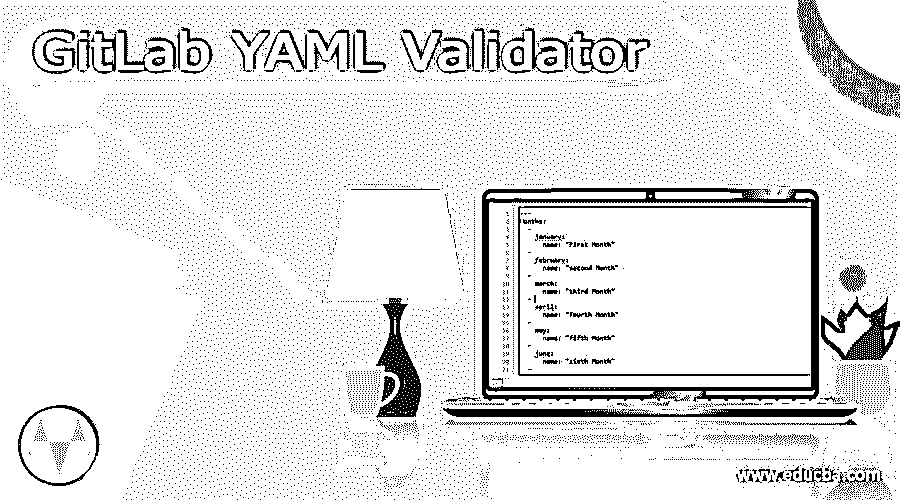

## GitLab YAML 验证器简介

以下文章提供了 GitLab YAML 验证器的概要。声明性配置是通过 YAML 完成的，它在业务视角中被广泛使用，只要我们理解 YAML 提供的规则和限制，它就可以自由和简单地了解 YAML 设置中的最佳实践，也可以为云原生环境提供可转移的技能集，因此 YAML 是配置项目管道的平台独立者之一。

### 什么是 GitLab YAML 验证器？

GitLab 识别 GitLab-ci。yml 文件，一个名为 GitLab Runner 的程序运行已经在作业计划中指明的脚本。构建代码作业是在构建阶段首先运行的作业，在本例中只运行一次。首先，它打印作业使用的 Ruby 版本，然后执行并搜索已经部署在 GitLab 环境中的生成项目文件。

<small>网页开发、编程语言、软件测试&其他</small>

### 如何使用 GitLab YAML 验证器？

通常，GitLab YAML 是常用于创建配置文件的数据序列化语言之一。此外，YAML 代表另一种标记语言，YAML 的递归含义，它不是一种取决于我们在项目中需要什么的标记语言。对于文件中未包含的数据相关区域和其他区域，还会使用 YAML 验证器进行强调。关于项目配置的更多信息，GitLab CI(持续集成)将需要一个类似配置文件的 YAML 文件(。GitLab-ci.yml)。然后另一件事，配置文件位于根目录的 GitLab 存储库中，它包含了关于项目的管道、作业和其他指定环境的更多信息。YAML 文件定义了一组必须在特定时间使用 Amplify DX YML 文件运行的作业，该文件是后来使用分支策略的特定建议创建的，专门用于运行 CI 流程。

它主要提供与第三方软件集成的工作。YML 文件首先使用将用于执行作业的自定义 Docker 图像的命名。在单个 Linux 实例中，Docker 允许在单独的“容器”中运行作业。这使得我们可以在不泄露 GitLab 中特定于项目的数据的情况下，将 curl 和 Nodes 等实用的 web 应用程序提供给作业。代码库中存放了一个名为 GitLab-ci.yml 的简单文本文件，它在整个过程中遵循项目的设置；因此，它通常是与它一起生产的。一旦生成了满足项目需求的配置文件，我们可以用各种方式修改和开发它。

### GitLab YAML 验证器示例

当我们想首先创建一个 GitLab YAML 文件示例时，我们需要在本地机器上安装 Git，如下图所示。

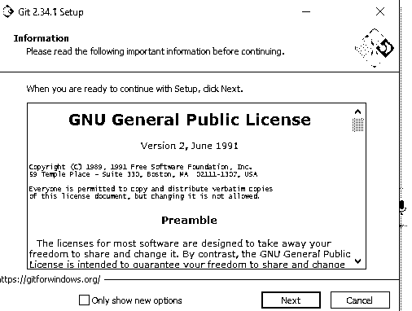

在安装 GitLab 设置之后，我们需要在 GitLab 环境中创建第一个项目，

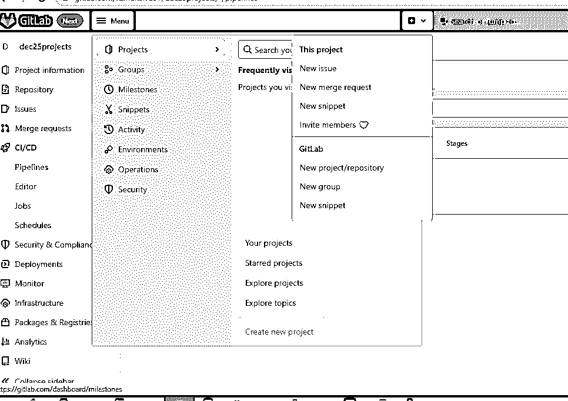

一旦我们创建了一个新的项目，我们必须在机器中创建一个本地文件夹来提交文件变更，并将文件变更从我们的本地机器推送到 GitLab 存储库，

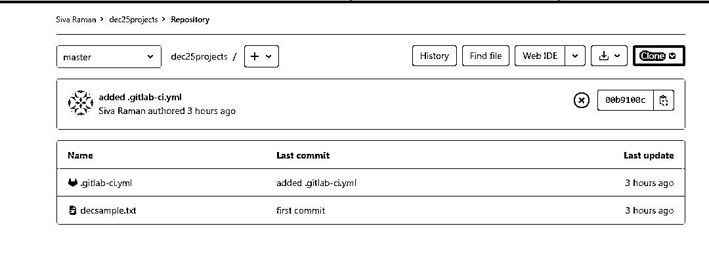

在上面的截图中，我已经将文件更改从我的本地机器提交并推送到 GitLab 存储库；这里，我使用了一个文本文件。一个 GitLab-ci.yml 文件，从我的机器上创建变更并将其推送到存储库，

#### 示例#1

**。GitLab-ci.yml:**

`demo_job_december:
tags:
- ci
script:
- "echo Welcome To My Domain"`

我已经编写了上面的示例代码来执行 YML 文件格式的脚本。在第一行中，我们可以使用任何名称(如 demo_job_december)来创建并运行 GitLab-runner，它已经从我们的本地机器安装并配置到 GitLab 存储库中。那么下一个标记是在标记部分使用的-ci；更重要的是，如果我们使用-ci，它与我们在 GitLab-runner 设置中声明的一样；请看下面的截图供参考，

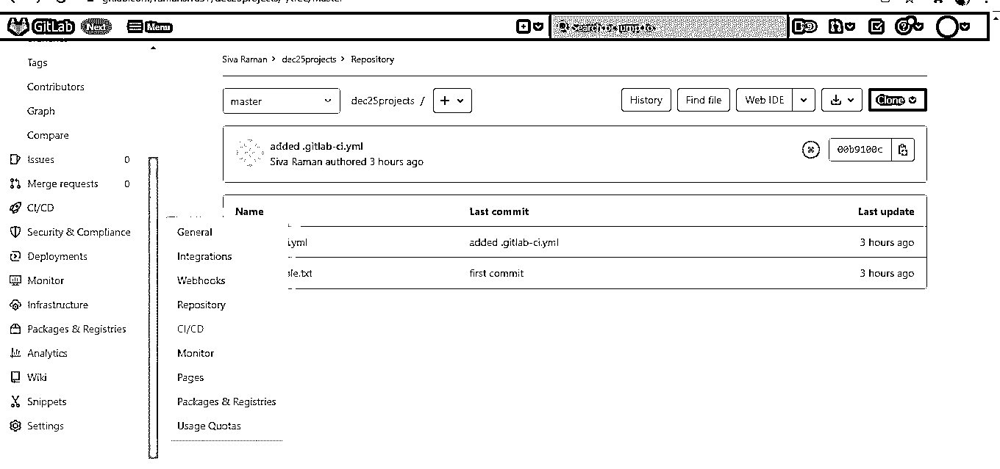

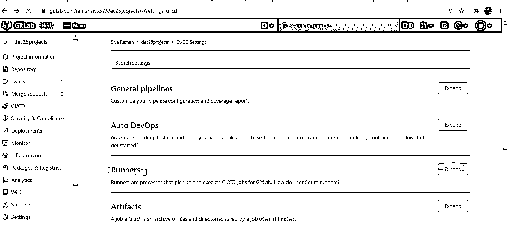

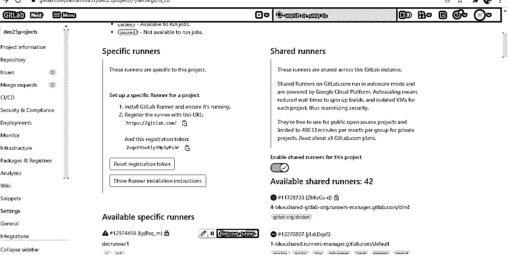

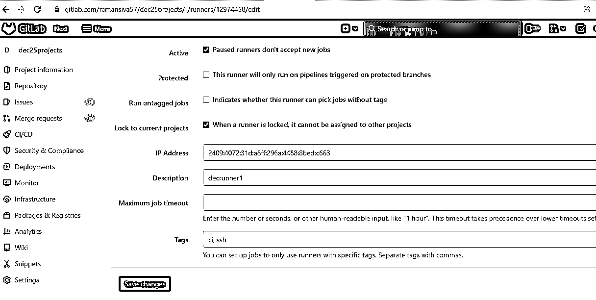

标签对于在 YML 文件中声明它应该更重要。然后我们在这里使用了 HTML 这样的普通标签，我们使用了一个简单的脚本:——“echo Welcome To My Domain”只是我在将文件保存为。GitLab-ci.yml。我们可以提交并将其推送到存储库。在此之前，我们还可以使用类似于 http://www.yamllint.com/**的在线工具来验证上述文件是否正确；像这样，我们使用不同的 YAML 文件验证工具。**

 **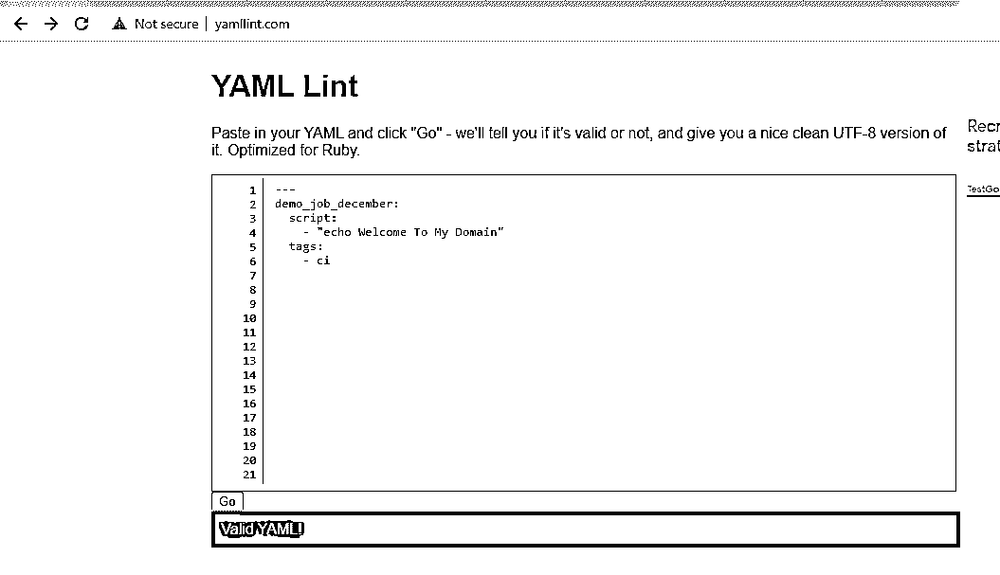

上面的工具是免费的开源 web 工具，用于验证 YAML 文件示例。此外，我们可以使用 CI Lint 验证 CI/CD 部分中的 yml 代码。

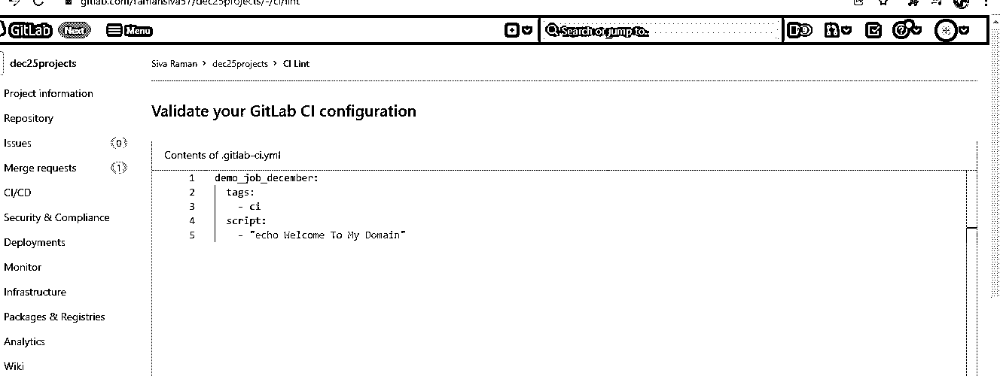

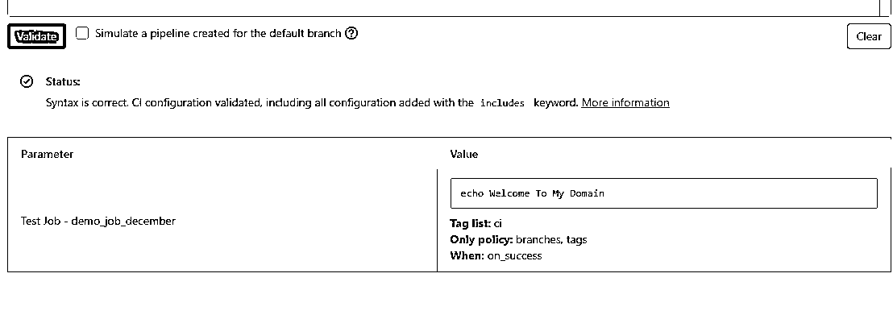

上面的屏幕截图显示了在默认的 GitLab 环境工具中验证 yml 代码，只要我们传递一个可以到达持续集成(CI)的输入参数，它就会传递类似语法正确这样的状态。CI 配置已验证，包括添加了包含的关键字值的所有配置。输出值显示为“Welcome To My domain”，标记列表:ci、Only policy 和 When:on_success

#### 实施例 2

`# An Inputs record
Months:
- january:
name: First Month
- february:
name: second Month
- march:
name: third Month
- april:
name: fourth Month
- may:
name: fifth Month
- june:
name: sixth Month
- july:
name: seventh Month
- august:
name: eigth Month
- september:
name: ninth Month
- october:
name: tenth Month
- november:
name: eleventh Month
- december:
name: twelth Month`

上面的代码是 YML 文件中人类可读的代码，我们可以使用下面的浏览器工具来验证代码，

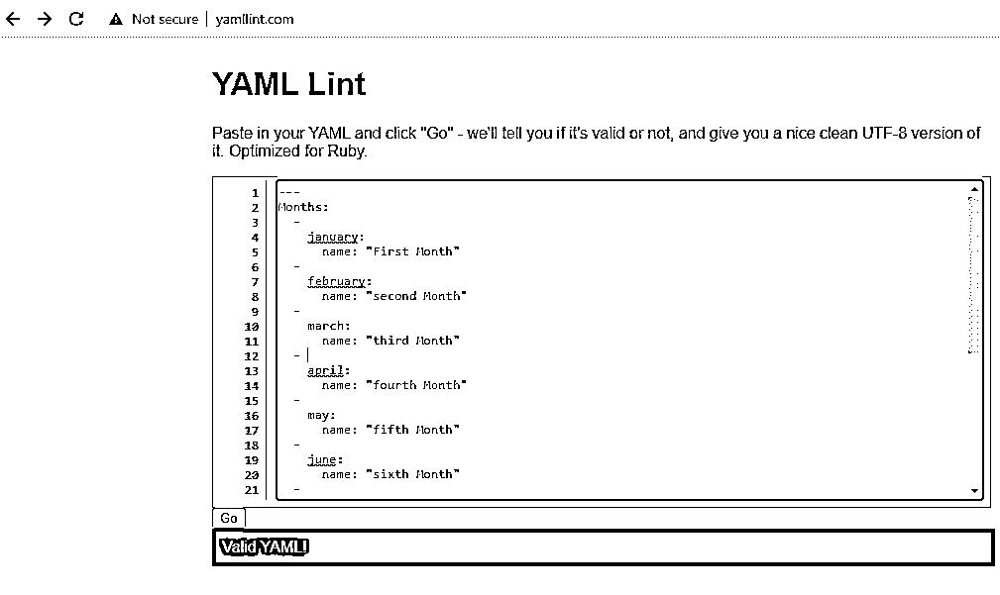

### 结论

GitLab 是开发人员的开源工具，也是我们在持续集成和持续部署(CI/CD)中最有可能使用的工具。因为 yml 是我们可以在 GitLab 项目的配置文件中使用的文件格式。GitLab-ci.yml 使用工具验证。

### 推荐文章

这是一个指南 GitLab YAML 验证器。在这里我们讨论定义，如何使用 GitLab YAML 验证器，以及详细的解释和例子。您也可以看看以下文章，了解更多信息–

1.  [GitLab 替代方案](https://www.educba.com/gitlab-alternative/)
2.  [什么是 GitLab](https://www.educba.com/what-is-gitlab/)
3.  [Gitlab 权限](https://www.educba.com/gitlab-permissions/)
4.  [GitLab 删除存储库](https://www.educba.com/gitlab-delete-repository/)

**