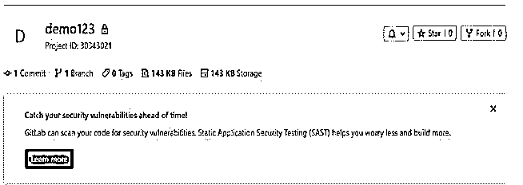
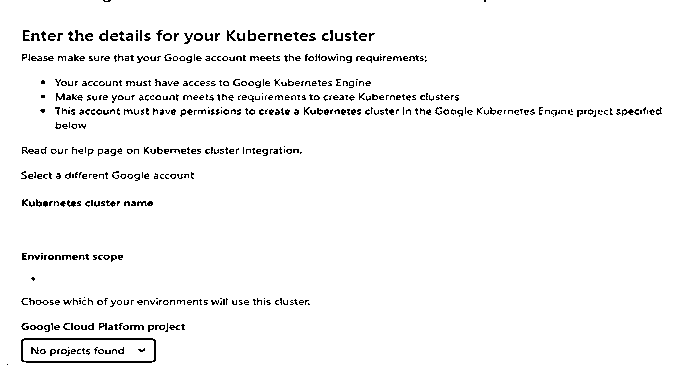

# GitLab Kubernetes

> 原文：<https://www.educba.com/gitlab-kubernetes/>

## gitlab kublers 简介

GitLab 向用户提供不同类型的功能，其中 GitLab Kubernetes 是 GitLab 提供的功能之一。通常 Kubernetes 是一个开源平台，为用户提供不同的服务。基本上，它是一个代理，根据需要在 GitLab 和 Kubernetes 之间提供安全连接。换句话说，我们可以说它提供了基于拉的部署，因此我们可以接收不同的警报，并且该警报基于不同的网络策略。Kubernetes 的主要优点是它自动管理我们应用程序的所有活动。

### What is GitLab Kubernetes?

*   GitLab Kubernetes 代理给出了 GitLab 事件和 Kubernetes 群之间的安全关联，并允许基于拉动的组织根据组织的方法得到警告。我们可以在 GitLab.com 的 GitLab 上执行 SaaS，并且在不远的将来会有更多的组件。
*   以前，将一个组附加到 GitLab 的规定方式是进行捆绑认证，并向 GitLab.com 开放 Kube API。为了利用这种混合，我们建议加入具有组管理员自由的 bunch，这样 GitLab 可以安排新的名称空间并制作调查应用程序。在任何情况下，许多客户认为这是非常不安全的，并在进一步考虑后，进行了围绕 GitLab Runner 定期工作的自定义合并。因此，我们需要改善和维护代理的不安全客户，并在 GitLab 及其团队中为他们提供受保护的、可靠的、未来确认的组合安排。
*   代理在组和 GitLab 之间提供受保护的关联。我们可以根据自己的需求，通过使用 Kubernetes 特性和 GitLab 特性来控制访问。该代理利用 WebSockets 或 gRPC 在 Kubernetes 组和 GitLab 示例之间提供了一个高度持久的关联。因为我们需要保持束侧部分无关紧要和轻量级，所以我们设想将许多代理引入到具有不同访问级别的类似组中。无论如何，这种结合是令人费解的。为了了解代理是如何工作的，让我首先介绍它的重要部分。GitLab 和 Kubernetes 基本上有两个部分:GitLab 和 Kubernetes 代理，或者我们可以说是 Kubernetes 服务器。代理是必须在组中传达的 bunch 端部分，而 kas 是 GitLab 密切监督的 GitLab 服务器端部分。由于我们需要保持束边部分尽可能薄，卡斯负责大部分的艰苦工作。

### 开始使用 GitLab Kubernetes

*   万一你想评估 GitLab.com 的代理，卡斯是由我们的 SRE 小组介绍和监督的。在使代理变得可访问之前，我们需要确保基于代理的工作流程不会损害 GitLab.com 的展示。
*   这就是为什么，现在，kas 只对特定的客户和活动开放。然而，如果你想尝试一下，请通过电子邮件联系我，或者用你的创业 ID 在某个问题上提到我，我们会批准你的创业。
*   GitLab 的 kas 示例可在 wss://kas.gitlab.com 上访问。当您向您的团队发送代理时，您应该提供此优势以及注册的专家访问令牌。否则，我们需要安装它。

### 创建 GitLab Kubernetes

下面给出了我们如何创建 GitLab Kubernetes，如下所示:

<small>网页开发、编程语言、软件测试&其他</small>

我们需要按照不同的步骤来创建它:

1.首先，我们必须在 GitLab 上有一个账户。

2.之后，我们需要创建一个项目，如下图截图所示。

在这里，我们创建了一个名为 demo123 的新项目，如上面的截图所示。

3.在下一步中，我们在项目名称下面添加了 Kubernetes 集群按钮；你只需要点击那个按钮。点击按钮后，看起来像下面的截图如下。

现在我们可以说看到上面的截图有两个选项；首先，我们可以根据需要创建一个新的集群，其次，我们可以连接一个已经创建的集群。因此，根据需要，我们可以选择任何我们想要的选项。

如果我们选择创建一个新的集群，那么我们需要填写所需的信息，如角色、集群区域等。此外，我们需要集成集群证书。因此它可以继续创建新的集群。另一方面，如果我们选择连接到一个已经存在的集群，那么我们需要登录并选择我们想要的项目。

下面的屏幕截图显示了我们需要填写的字段，如下所示:

### 运行 GitLab Kubernetes

*   GitLab Runner 可以利用 Kubernetes 在 Kubernetes 组上运行扩展。利用 Kubernetes 试剂，这是可以想象的。
*   Kubernetes 代理在与 GitLab CI 一起使用时，与 bunch 中的 Kubernetes API 相关联，为每个 GitLab CI 作业创建一个 Pod。无论如何，这个 Pod 由一个表单支架、一个合作伙伴隔间和一个额外的支架组成，用于中描述的每个帮助。gitlab-ci.yml。

### gitlab kublers 工作流程

Kubernetes 代理将合并划分为不同的进展:

*   **准备就绪:**创建针对 Kubernetes 集群的 Pod。这就产生了运行表单和管理所需的区间。
*   **预成型:**克隆，重建储备，并下载过去阶段的古代稀有物品。这是运行在一个特殊的持有人作为一个功能的吊舱。
*   **制造:**用户组装。
*   **后期表单:**创建。

### 结论

从上面的文章中，我们已经了解了 GitLab Kubernetes 的基本思想，我们也看到了它的表现形式。从这篇文章中，我们了解了如何以及何时使用它。

### 推荐文章

这是 GitLab Kubernetes 的指南。这里我们分别讨论入门、创建 GitLab Kubernetes、运行和工作。您也可以看看以下文章，了解更多信息–

1.  [GitLab 替代方案](https://www.educba.com/gitlab-alternative/)
2.  [什么是 GitLab](https://www.educba.com/what-is-gitlab/)
3.  [什么是 GIMP](https://www.educba.com/what-is-gimp/)
4.  [GitHub 克隆](https://www.educba.com/github-clone/)

