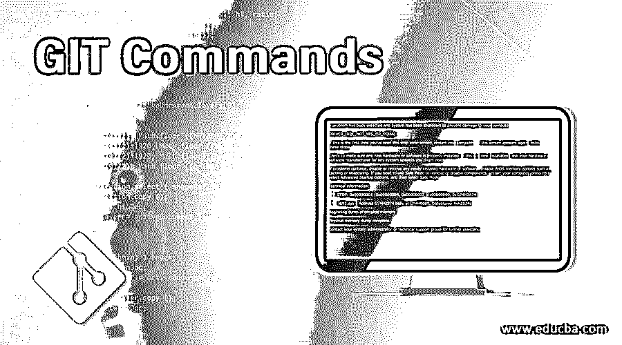

# GIT 命令

> 原文：<https://www.educba.com/git-commands/>

## GIT 命令简介

下面的文章提供了 GIT 命令的概要。GIT 是一种非常流行的版本控制方法和源代码管理工具，用于跟踪程序源代码中的所有变更。它使软件工程师的生活变得非常容易，因为它只用于跟踪一个或多个文件中的变化。它用于软件工程师之间的协作，因为每个工程师都在其分支内处理他们的代码，并且可以将他们的代码合并到主分支中，从而创建完整的代码解决方案。

它之所以成为非常受欢迎的工具，是因为它的完整性、速度以及它支持分布式方式的所有非线性工作流。每台计算机上的 GIT 目录本身就是一个完整的存储库，这与当今运行的许多客户机-服务器系统不同。在使用 GIT bash 时，有些命令您应该知道。在这篇文章中，我们将讨论这些命令。

<small>网页开发、编程语言、软件测试&其他</small>

### 基本 GIT 命令

基本的 GIT 命令如下:

*   **git config:** 它用于设置作者的姓名和您希望您承诺的电子邮件地址。

`git config –global user.email “[email address]”`

*   **git init:** 它用于启动一个新的 git 存储库。这个一般用在开头。

`git init [repo name]`

*   **git clone:** 该命令用于从 URL 克隆或复制存储库。这个 URL 通常是 bitbucket 服务器、stash 或任何其他版本控制和源代码管理存储库保存服务。

`git clone [URL]`

*   **git add:** 用于将文件添加到暂存区。除了选择单个文件名，您还可以选择给所有文件名都加上一个*。

`git add (filename),
git add *`

*   **git commit–m:**它用于在版本历史中永久地快照或记录文件。

`git commit –m [type in a message]`

在提交命令的末尾给出一个消息文本有助于识别提交代码的细节。

*   **git commit–a:**该 commit 命令用于提交任何此类文件，该文件是 git add 命令的结果。它还负责提交自那以后您对其进行了更改的任何其他文件。

`git commit -a`

*   **git diff:** 顾名思义，该命令用于显示文件之间的所有差异，直到更改尚未登台。

`git diff`

*   **git diff–staged:**用于显示临时区域文件和最新版本之间可能存在的所有差异。

`git diff -staged`

*   **git diff[第一分支][第二分支]:** 这是一个非常有效的命令，因为它用于显示两个分支之间存在的差异。一般来说，一个单独的开发人员将在他的单独的分支上工作，然后这些分支将被合并成一个主分支。

`git diff [first branch] [second branch]`

![git diff [first branch] [second branch]](img/5fc7779b6335982da9ba413705a82640.png)

*   **git reset [file]:** 这个命令，顾名思义，是用来对一个文件进行卸载的。尽管它对文件进行了拆分，但文件的内容仍然保持不变。

`git reset [file]`

![git reset [file]](img/5f42dc2241140ab9eb982b12695702cc.png)

### 中间 GIT 命令

中间的 GIT 命令如下:

*   **Git reset [commit]:** 它用于在一个指定的提交发生后，撤销所有已经被合并为提交的一部分的更改。这有助于在计算机上本地保存更改。

`git rest [commit]`

![rest [commit]](img/e5ee91311a076608ea3bdfb0ee6c3304.png)

*   **Git reset–hard[commit]:**该命令用于丢弃所有历史记录，并将我们带到最后一次指定的提交。

`git reset –hard [commit]`

![ reset –hard [commit]](img/29900adbbc55222134adb8bb24b9e9b7.png)

*   **Git status:** 这是最常用的方法之一，因为它用于列出所有准备提交的文件。

`git status`

*   **Git rm:** 如在 Unix 中，rm 用于删除；同样，rm 用于从当前工作目录中删除文件，也用于暂存删除过程。

`git rm [file]`

![ rm [file]](img/ae79f15836a71e9e7109ae86a284fb58.png)

*   **Git log:** 这用于列出当前工作分支的版本历史。

`git log`

*   **git log–follow:**这类似于 git log，但有一点不同，它列出了特定文件的版本历史，通常还包括文件的重命名。

`git log –follow [file]`

![log –follow [file]](img/c60668725fcb2d238ff4c94d176a9df4.png)

*   **git show:** 这用于显示元数据和特定提交的所有内容相关的更改。

`git show [commit]`

![show [commit]](img/9d2c9404a4cfceebd18b78d87c3c068a.png)

*   **git 标签:**这用于给代码提交赋予特定的标签。

`git tag [commitID]`

![tag [commitID]](img/be115571490a1e8c0d75665ee30e5e32.png)

*   **git branch:** [Git branch 命令](https://www.educba.com/what-is-git-branch/)用于列出存储库中本地存在的所有分支。

`git branch`

*   ****Git 分支【分支名称】:**** 这是用来创建新的分支。

`Git branch [branch-name]`

![branch [branch-name]](img/c7f4de794b31a24ccacc439344054c7b.png)

### 高级命令

高级命令如下:

*   **Git branch–d[分支名称]:** 用于删除当前指定的分支名称。

`git branch –d [branch name]`

![branch –d [branch name]](img/7bef85488876e5a4f3942f000306ce02.png)

*   **Git checkout:** 它有助于从一个分支切换到另一个分支。

`git checkout [branch-name]`

![checkout [branch-name]](img/6968fcbffe0c3573c180ecbef2efd8df.png)

### 提示和技巧

*   最常被忽略的文件是~/。gitconfig 文件，这是 git 的全局配置文件，包含非常有用的命令。
*   通过使用该命令，可以根据您的意愿修改/更改许多设置。
*   您可以根据自己的选择关闭或打开特定的命令选项，还可以设置别名。
*   另一个要提到的关键点是提交图的可视化，当您在处理一些包含许多分支结构的项目时，这非常方便。

### 结论

记住这些命令的最好方法是经常使用它们。不用担心；如果你没有一个正式的项目，你可以从 stash 中克隆任何 repo，并开始使用 GIT 来获得实践经验和良好的体验。

### 推荐文章

这是 GIT 命令的指南。在这里，我们讨论了概念、基本、中级和高级 GIT 命令以及有效使用的技巧和诀窍。您也可以阅读以下文章，了解更多信息——

1.  [GitHub 动作](https://www.educba.com/github-actions/)
2.  [GitHub 命令列表](https://www.educba.com/github-commands/)
3.  [Git 存储库设置](https://www.educba.com/git-repository-setup/)
4.  [去重复位](https://www.educba.com/git-reset-hard/)

