# GitHub 克隆

> 原文：<https://www.educba.com/github-clone/>

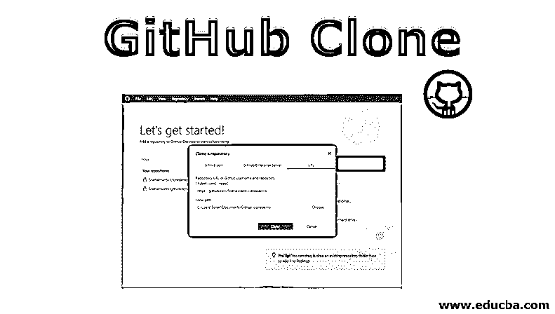

## 什么是 Git Hub 克隆？

Github clone 只不过是将已经存在的 git 存储库下载到本地系统的过程。执行 git clone 命令后，您就有了自己的本地版本的存储库。所以你现在可以开始你的项目了。基本上 GitHub 克隆，主存储库在远程服务器上可用。该远程存储库的 URL 现在与“源”相关。它允许开发人员轻松地合并他们的更改，能够下载新版本，如果需要的话做一些更改，并用最新版本更新代码。因此，参与这个项目的每个开发人员现在都能够看到更新的更改，存储它们，并在任何需要的地方进行更改。

### 如何创建克隆体？

克隆是创建实际存在于您的存储库中的代码副本的过程。一旦克隆完成，你就可以在你创建的代码副本中进行修改，并且无论何时你都可以将所有的修改拉至你的库。

<small>网页开发、编程语言、软件测试&其他</small>

所以如果你想在 Github 中克隆，你可以遵循以下步骤:

*   首先，您必须创建一个文件夹，然后打开终端，之后进入您实际想要保存存储库的指定文件夹，然后运行以下命令: **git clone git:("项目的 URL ")**
*   一旦这个命令被执行，那么它将下载所有文件到指定的文件夹。
*   运行克隆过程时包括一些重要选项，如下所示:
*   **<存储库> :** 在这里，用户应该指定他们的远程存储库的确切 URL。它会向远程服务器显示。当指向远程服务器时，它使用不同的协议[，如 HTTP](https://www.educba.com/http-methods/) 、HTTPS、SSH 或
*   **Recurse-Submodule:** 它用于处理 clones 存储库，并使用所有包含的子模块进行初始化。假设你有一个包含子模块的项目，在上面选项的帮助下，它将保证所有子模块不仅会被克隆，而且会在主项目关闭后被初始化。通过使用这种克隆过程，您不需要手动进行初始化，也不需要单独更新子模块。
*   **<目录> :** 该目录只不过是您的文件夹的一个相同的名称，该文件夹在您的本地机器上可用，存储库将下载到该目录中。如果没有定义这个选项，Git 将会创建一个新的文件夹。
*   Git 克隆像 git inits 一样被处理，我们只想执行这个命令一次。
*   一旦开发人员下载了他们的工作副本，现在他们就能够进行所有的版本控制操作，并与他们的本地存储库一起协作。
*   **回购-回购协作:** Github 的工作方式类似于 SVN，但 git 的工作流程与 SVN 不同。正如 SVN 所做的，git 也不会干扰你当前的工作拷贝和你的本地存储库。
*   这使得与 git 的合作不同于 SVN。与 SVN 合作的过程就像是依赖于中央储存库和 gits 工作副本之间的附件协作。
*   它基于存储库到存储库的交互。开发人员可以将提交从一个存储库推送到另一个存储库，而不是将 SVN 的工作副本验证到他们的中央存储库中。
*   GIT URL: Git 定义了其自包含的 URL 语法，因此可以将远程存储库位置传递给 GIT。Git 克隆是使用 git URL 的远程存储库上最常用的过程。
*   克隆过程中使用了不同的协议，如下所示:
*   **SSH:** 这是 Secure Shell 的缩写，是一种认证的网络协议，主要配置在大部分的服务器上。
*   在 SSH 协议的帮助下，您需要配置凭证以及托管服务器
*   **GIT:** GIT 自带计算，在端口(9418)执行。只是[像 SSH 协议](https://www.educba.com/ssh-vs-ssl/)没有认证。
*   HTTP: 这就是所谓的超文本传输协议。众所周知，它是互联网上用来传递网页 HTML 数据的最流行的协议之一。
*   **GitHub clone 的用法:** Git clone 表示指向已经存在的存储库的指针，并在另一个位置的新目录中创建该存储库的副本。
*   无论您的原始存储库是什么，它都将位于本地文件系统或远程机器上。Git clone 命令只是复制一个已经存在的 Git 存储库。它就像一个 SVN 收银台。
*   Git 存储库除了拥有自己的历史、管理自己的文件以及所有来自原始存储库的东西之外，什么都没有。
*   在克隆过程的帮助下，它将创建一个称为 origin 的远程连接，该连接显示指向已经呈现的原始回购。这个过程使得与中央存储库的交互变得容易。
*   借助于创建对其相应远程分支的 git 引用来自动建立连接的过程，该远程分支位于 references/remotes/origin 之下，并且出于初始化目的，remote.origin.url 和 remote.origin.fetch 这些变量被用作配置变量。
*   让我们考虑一个简单的例子来解释 git clone 在 Github 仓库中是如何工作的。这将展示如何获取我们的中央存储库的本地副本，该副本位于用户可以轻松访问的服务器上。

*   按照上面的例子，在第一步，它将在您当前工作的本地系统的 GitHub demo 目录中创建一个新的存储库，然后将它与中央存储库的内容一起发布。
*   下一步是使用命令 cd [folder_name]进入您的工作目录，与上面的例子中执行的一样。现在，您能够在代码中进行更改，提交更改，并能够与其他存储库进行交互。
*   它将帮助您克隆本地或远程存储库，在 shallow 选项的帮助下，您可以部分克隆存储库。您也可以使用空存储库进行克隆。git clone 做的另一件事是 git URL 不是唯一的语法，也是受支持的协议。
*   如果您想要克隆到一个特定的文件夹，也可以使用以下语法:

`**git clone <repo> <directory>**`

在这里，它将克隆实际位于<repo>上的存储库，通过使用<directory>指定其目录位置，它位于您的本地机器上。</directory></repo>

*   另一种类型是你可以通过使用一个特定的标签来进行克隆，比如运行一个名为**git clone–branch<标签> < repo >** 的命令

上面的命令 clone 是您的存储库，它存储在<repo>处，它将只克隆<tag>的引用</tag></repo>

*   Github 克隆的另一种最流行的类型是**浅层克隆**，它的执行方式类似于 **Git 克隆-深度=1 <回购>T3】**

它将克隆存储在<repo>的存储库，现在它只能克隆使用选项 depth=1 声明的提交的历史详细信息。通过使用上面的命令,<repo>被创建，在这里任何最近的提交都被完成，并被插入到您新克隆的存储库中。这是最著名的克隆方法，因为无论何时使用存储库，您都有很强的提交历史。有时会出现不同的问题，如磁盘空间、长时间等待和使用限制。但是浅层克隆非常有效地解决了所有这些扩展问题。</repo></repo>

### Github 克隆的例子

让我们逐步创建一个克隆存储库的示例:

**第一步:**先在 Github 上做账户设置。这有助于将所有文件放在这里。完成后，创建一个存储库。

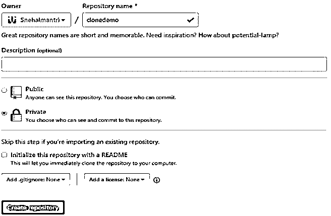

**步骤 2:** 设置好帐户后，我们在此处创建一个存储库，并在浏览器的帮助下选择创建存储库，填写所需的所有详细信息，然后创建存储库。

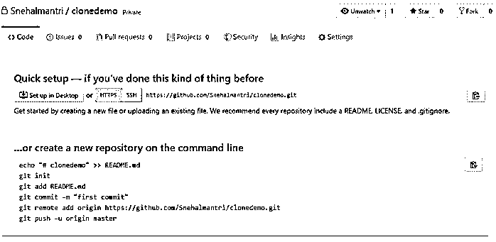

**步骤 3:** 创建存储库后，您必须在顶角填写不同的文件，在自述文件中编辑它们，或者您可以创建自己的文件并在其中编辑，一旦完成更改，下一步就是提交所有更改。

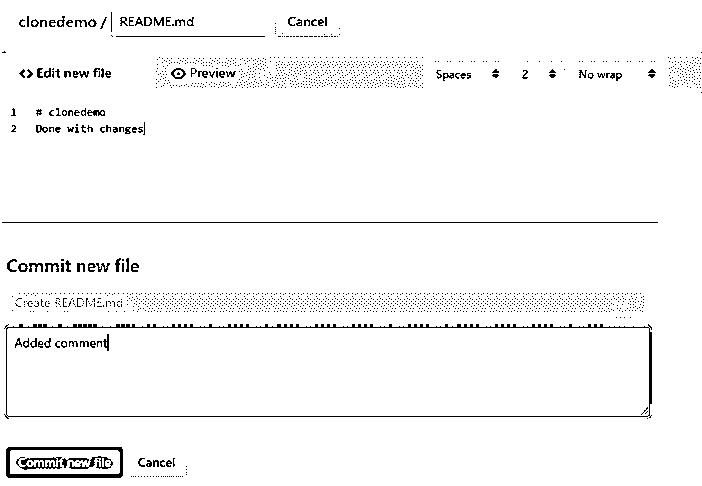

第 4 步:下一步也是最重要的一步是克隆您的存储库。

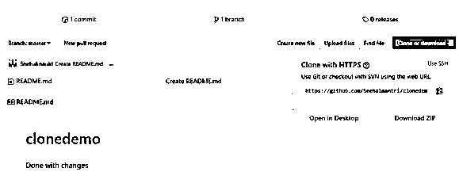

克隆时，它将在我们的本地系统上创建一个副本，如下所示:

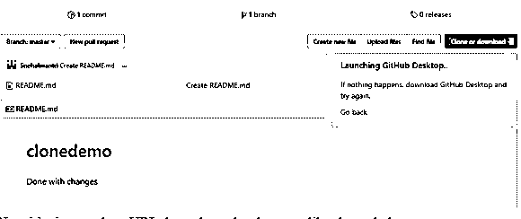

**步骤 5:** 现在是时候通过我们的本地系统克隆 URL 了，如下所示:

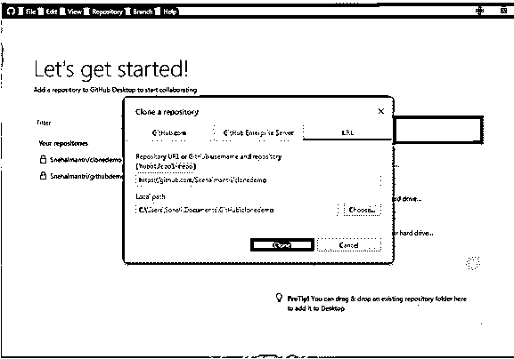

克隆过程将会继续。

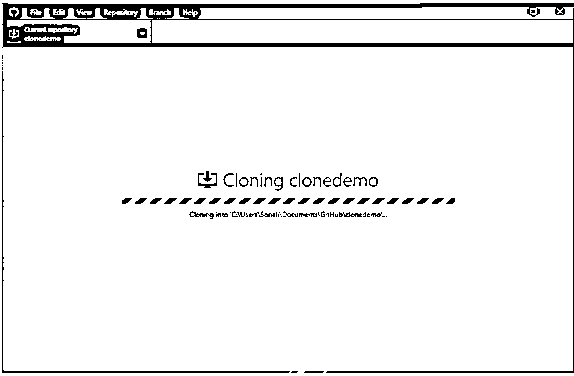

克隆完成后，所有文件都存储在本地，并显示有关它的所有详细信息。

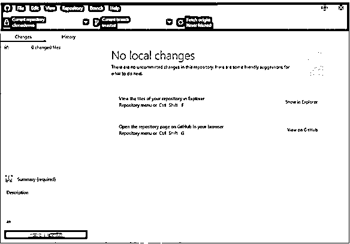

在这里你也可以看到所有的历史。

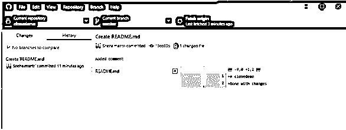

**第六步:**现在是时候将所有细节提取到原点了。

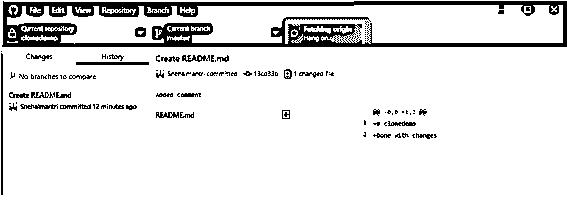

如果你想改变分支，这在 Github 中也是可能的。

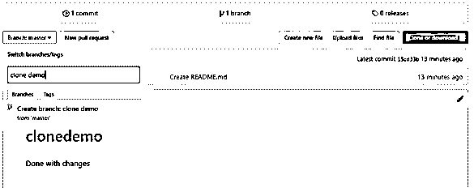

**步骤 7:** 一旦所有细节都被提取到原点，现在是时候在这里进行精细提交了，所有过程都将完成。

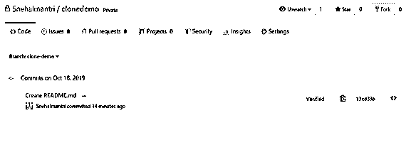

### 结论–GitHub 克隆

*   从上面的细节可以看出，Github clone 是创建目标存储库副本的过程。
*   您可以克隆到特定目录、特定标记或浅层克隆。
*   此目标回购可以是本地的，也可以是远程的。Github 允许一些网络协议与远程存储库通信。

### 推荐文章

这是一个 GitHub 克隆指南。在这里，我们讨论了什么是 GitHub 克隆，如何创建一个克隆以及例子。您也可以浏览我们推荐的其他文章，了解更多信息——

1.  [带有示例的顶级 GitHub 命令](https://www.educba.com/github-commands/)
2.  [GitHub vs SVN |区别](https://www.educba.com/github-vs-svn/)
3.  [Git 术语入门](https://www.educba.com/git-terminology/)
4.  [数据科学算法教程](https://www.educba.com/data-science-algorithms/)
5.  [GIT 版本控制系统](https://www.educba.com/git-version-control-system/)
6.  [去推](https://www.educba.com/git-push/)
7.  [什么是 Hub？](https://www.educba.com/what-is-hub/)
8.  [Git 生命周期的三个阶段以及工作流](https://www.educba.com/git-life-cycle/)
9.  [举例说明如何使用 GIT Cherry-pick？](https://www.educba.com/git-cherry-pick/)

