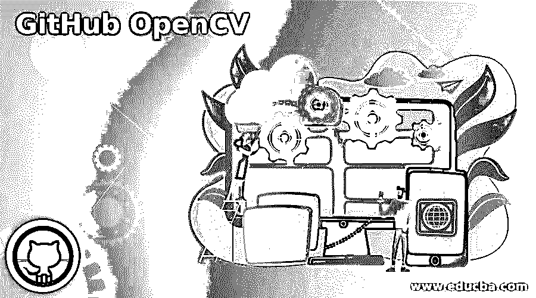
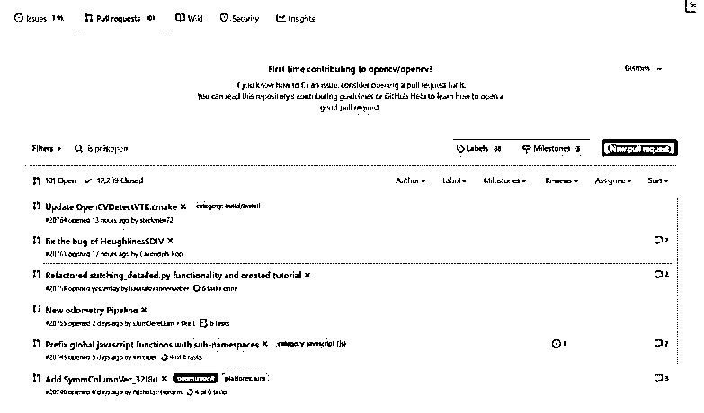
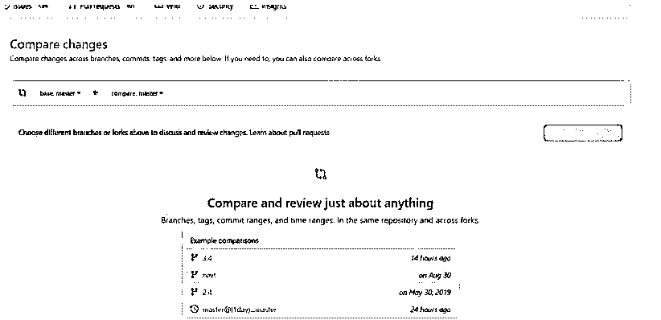
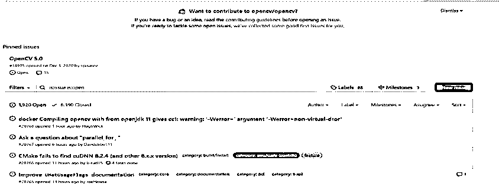
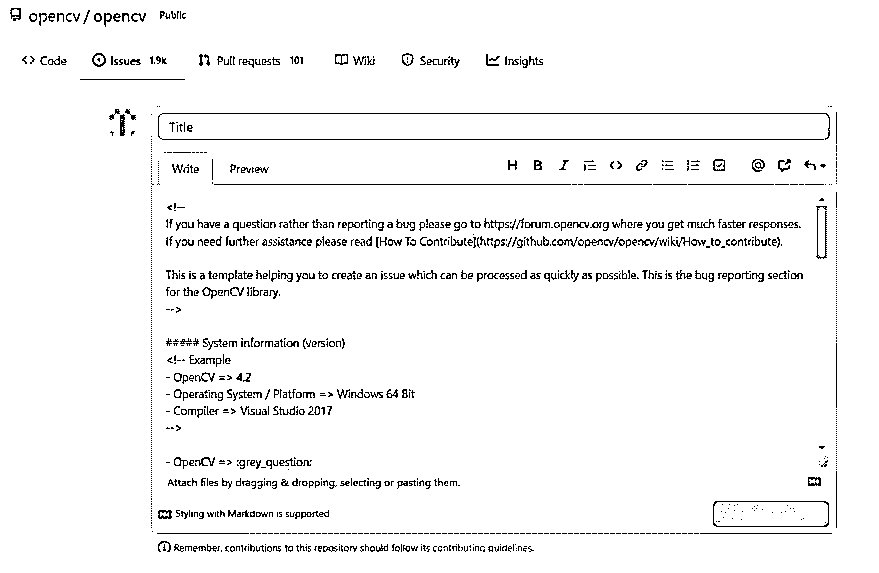
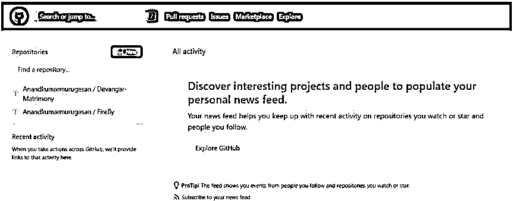
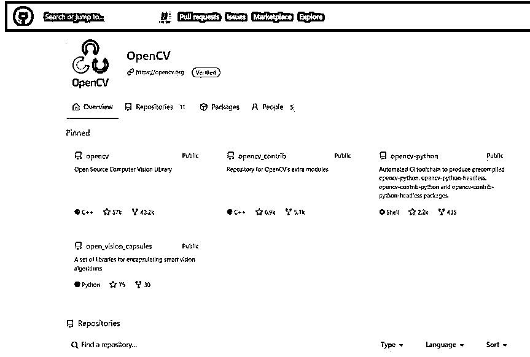
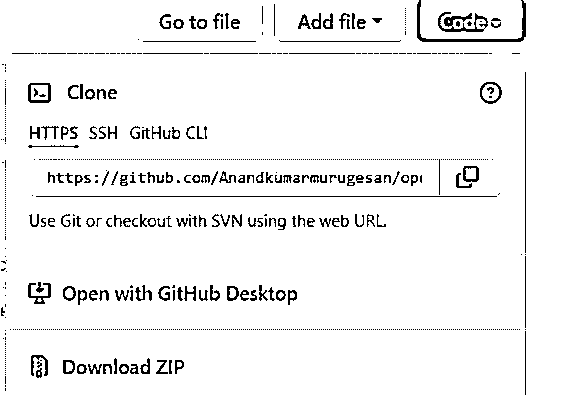

# GitHub OpenCV

> 原文：<https://www.educba.com/github-opencv/>

## GitHub OpenCV 简介

GitHub OpenCV 的关键见解是基于计算机的视觉、机器学习算法和图像级处理。甚至像实时操作这样的过程也可以通过 OpenCV 系统来实现。作为一个基于开源的系统，该系统的最初版本是 1.0。商业和学术水平的项目都可以通过 OpenCV 的方式获得，因为它是在 BSD 下授权的。

在与 OpenCV 相关联的 GitHub 系统中，可以非常高效地实现多核处理。C 和 C++是这些应用中使用的主要语言，因为这些语言可以灵活地实现多级核心处理。使用这些基于 GitHub 的 OpenCV 系统的一个关键优势是可以灵活地向系统中添加新的项目和代码。

<small>网页开发、编程语言、软件测试&其他</small>

### 它是如何工作的？

其中一些关键过程可以借助基于 GitHub 的 OpenCV 系统来完成。这些是在需要时激活系统的各种相关值。非常重要的是，确保为一个问题创建一个 PR。我们需要严格确保针对一个问题提出的 PR 不超过一个。这可以大大避免提出重复的 PR 请求，这将为我们节省大量的处理时间。它们如下:边缘检测、特征匹配和提取特征、单应过程和几何级的变换、级联分类器和允许检测面部、对象分类、对象跟踪。

下面给出了如何将 OpenCV 项目的代码贡献给 GitHub 的步骤:

*   确保为处理的每个问题至少提出一个与拉动相关的请求。
*   需要正确评估位于底部的分支；我们可能需要确保选择了正确且必要的基本分支。
*   文档和测试有望从这里开始被包含进来。之后，所有需要的文档和测试都可以添加到这里。
*   在进入提交流程之前，确保 oops 提交被清除并被进一步处理。

### 拉取请求

*   这个过程的关键是创建拉取请求；这需要紧密地关联、评估和决定，其中一些关键操作与拉请求相关联。
*   首先，在考虑执行推送请求之前，我们需要确保这个请求的构建状态。尤其是在本地系统中。所以在用户的本地系统中，我们需要确保拉请求被完美地执行，并且 PR 很好地通过拉。接下来需要给出有意义的标题；必须添加足够的信息，提交的详细信息非常接近预期，然后，如果这是为特定 PR 打开的，为什么需要提交和链接相关的问题页面。
*   非常重要的是，确保为一个问题创建一个 PR。我们需要严格确保针对一个问题提出的 PR 不超过一个。这可以大大避免提出重复的 PR 请求，这将为我们节省大量的处理时间。
*   哎呀，提交在拉请求中不受欢迎。确保遵循编码风格指南，更重要的是，我们需要确保选择准确的目标分支，并将其作为拉请求的首选。此外，一定要为每一个新的功能添加地址，或者甚至为与测试数据相关的已修复的错误添加地址。此外，图像或视频将在更大程度上影响拉取请求。最后，如果您支持优化，或者补丁应该对基本功能的整体性能产生影响，请确保进行整体性能检查。了解如何编写 PerfTests 网页以实施出色的检查，以及如何使用 Perf Tests 网页正确运行整体性能评估。

下图显示了拉取请求在中的显示方式。例如，单击创建拉取请求将生成打开的请求。

### GitHub OpenCV 问题

与 github opencv 相关的所有问题都可以通过 github 中的问题跟踪部分来处理。在这里，可以提出新的问题，可以创建里程碑，可以关联标签。下面将通过快照讨论创建问题的过程。快照指的是如何提出新问题。

### GitHub OpenCV 安装

下面列出了在 GitHub 中安装 OpenCV 项目的相关步骤，并发布了我们的代码。

1.要考虑的第一个也是关键的一点是 GIT 的安装。

2.接下来，在 GitHub 中注册您的 id 和密码，并在与 OpenCV 相关的存储库上创建一个 fork。

3.一个任务可以由我们来确定和选择；该任务可能与错误修复或任何新代码的创建有关。

4.克隆 fork 流程。

5.接下来，必须确定工作的分支。

6.必须从启动的基本分支创建新分支。

7.根据代码指南说明，确保修改和添加新代码。

8.测试套件可以在本地执行。首先，可以通过克隆来形成所需的样本数据，然后导出 OPENCV _ TEST _ DATA _ PATH =<path_to_opencv_extra>/TEST DATA，最后从构建目录本身执行每个测试。</path_to_opencv_extra>

9.GitHub foring 可以在我们的更改完成后继续执行，接下来可以从用户使用的当前分支向基本分支发出一个 pull 请求。

### 结论

这篇文章解释了什么是 GitHub OpenCV，如何使用 GitHub OpenCV，拉请求的重要性，以及如何在 OpenCV 项目中跟踪问题。

### 推荐文章

这是 GitHub OpenCV 的使用指南。这里我们讨论一下入门，它是如何工作的？拉请求、问题和 GitHub OpenCV 安装。您也可以看看以下文章，了解更多信息–

1.  [GitHub 克隆](https://www.educba.com/github-clone/)
2.  [GitHub 替代品](https://www.educba.com/github-alternatives/)
3.  [GitHub 命令](https://www.educba.com/github-commands/)
4.  [什么是 GitLab](https://www.educba.com/what-is-gitlab/)

