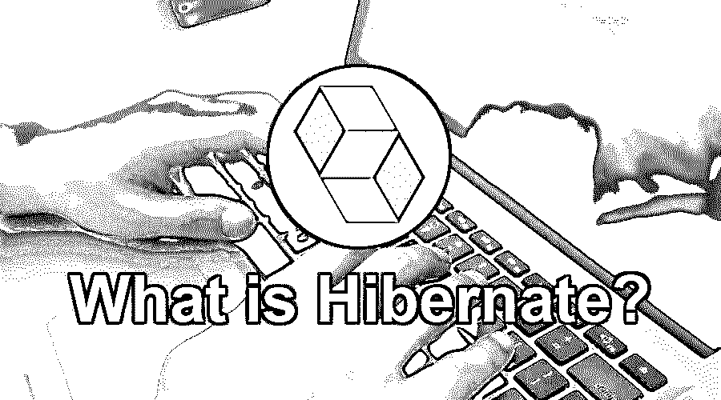

# 什么是 Hibernate？

> 原文：<https://www.educba.com/what-is-hibernate/>

## Hibernate 简介

正式名称是 Hibernate ORM，它是 Java 编程语言的对象关系映射工具或框架。它是 GNU 宽松通用公共许可证 2.1 下的自由软件。它旨在为用户提供对象关系阻抗映射的框架，并使用非常高级的对象处理功能管理持久的数据库访问。

### 体系结构

要了解更多信息，我们需要了解它的体系结构，包括:

<small>网页开发、编程语言、软件测试&其他</small>

*   Java 应用程序代码由定义应用程序业务逻辑的所有类、变量和对象组成。这些类与 Hibernate 通信。
*   然后是 Hibernate 及其核心原则，使用它们我们可以通过与数据库服务器层通信来持久化(存储或保存和检索)业务层类的对象。
*   它使用 Java 核心 API、Java 数据库连接(JDBC)、Java 事务 API(JTA)、Java 命名和目录接口(JNDI)与数据库进行通信，通过执行读取、创建、更新、删除(CRUD)操作来保持对象的状态。

它用于与数据库通信。这里我们只是创建了一些实体，它们不过是一个 java 类，将在数据库中为我们创建一个数据库表。

### 结构

这里我们遇到一个问题，如果我们已经有了核心的 java 原则，为什么还要使用 java 的 hibernate 框架。这就是答案:

*   使用最佳 JDBC 概念，例如:

1.  行集而不是结果集
2.  DataSource(连接池)而不是 DriverManager
3.  批量操作代替单独操作
4.  PreparedStatement 代替语句

*   项目开发成本是降低的一大因素。
*   没有内存泄漏
*   管理一对多等关联。，比使用 java.util.Set、List、Map 等集合属性更简单、更容易。
*   作为一个 ORM 框架，它将获得所有的优势:
*   支持二级缓存
*   对象成为记录，反之亦然。
*   另外支持对象查询语言(HQL)
*   支持多个主键生成器

### 特征

所以这都是关于 java hibernate 框架及其架构的；先说 57 天前，也就是 2019 年 2 月 23 日发布的最新 hibernate 稳定版的特性。它由 Red Hat software 开发，是一个具有许多功能的虚拟机平台:

*   它支持 JMX 和 JCA。
*   它提供了 J2EE 集成的一个特征。
*   在系统初始化时，它生成 SQL。
*   可以选择提供内部连接池和预准备语句缓存。
*   它支持版本控制的乐观锁定。
*   它提供外部连接提取。
*   它引入了惰性初始化。
*   它提供了会话级缓存和可选的二级缓存。
*   它提供双层缓存架构。
*   主键的自动生成。
*   它支持组合键的强硬概念。
*   它支持分离对象的概念。
*   它引入了自动脏检查的概念。
*   它提供透明的持久性，无需字节码处理。
*   它提供了对象/关系映射。从多对象到单行映射有不同的 O/R 映射策略，
*   多态关联，双向关联，关联过滤。它还提供 XML 映射文档。
*   它提供了不同的面向对象的查询语言。
*   最小面向对象 Hibernate 查询语言(HQL)，原生 SQL 查询
*   高度面向对象的标准概念。

### 我们为什么要用 Hibernate？

这是 hibernate 的所有最新特性。接下来是我们为什么使用它的问题，所以这里是我们更喜欢使用 hibernate 的原因:

*   事务管理
*   联合
*   遗产
*   休眠缓存
*   版本控制
*   审计功能
*   JPA 注释支持
*   连接池
*   避免尝试捕捉块
*   避免延迟加载
*   减少重复代码

### Hibernate 的优点和缺点

简要介绍了关于 hibernate 的一切，现在是时候讨论主要议程，使用 hibernate 的优点和缺点了。

#### 优势

谈到这个主题，让我们从 hibernate 的优势开始，如下所示:

ORM–维护简单且经济高效。

1.  透明持久性
2.  独立于数据库
3.  HQL——HQL 的高级特性，如分页和动态分析，在 SQL 中是不存在的。所以我们可以在 hibernate 中使用它。
4.  双层缓存
5.  版本属性
6.  开源和自由软件
7.  可扩展性很容易
8.  惰性加载——惰性加载概念只获取应用程序执行所需的必要对象。
9.  简单易学
10.  它还支持列表、集合和映射等集合。
11.  生成主键的能力
12.  它提供方言课
13.  它支持一对多、一对一、多对多和多对一等关系。

#### 不足之处

有优点的同时，缺点也很少。下面是 hibernate 的缺点:

1.  比纯 JDBC 慢一点
2.  样板代码问题
3.  在运行时生成许多 SQL 语句
4.  它不适合批量处理
5.  它很慢，因为它使用运行时反射
6.  大量的 API 需要学习
7.  有时调试和性能调整会变得很困难。
8.  不适合小型项目
9.  它不允许多次插入
10.  生成包含许多连接的复杂查询
11.  HQL 查询不能调用 [PL/SQL 程序](https://www.educba.com/what-is-pl-sql/)

### 结论

因此，在讨论了所有这些主题之后，我们还需要了解 hibernate 的未来。我们可以说，考虑到 JPA 正在快速追赶，它仍将是主导的 ORM 工具。我的印象是，它是使用最广泛的 JPA 实现(在 OpenJPA 和 EclipseLink 之前),它的本机或核心 API 仍然比 JPA 2 更强大。仅仅因为这些原因，我认为它将存在很长一段时间。在 hibernate 中最好使用 Spring MVC，因为它是最兼容的 MVC。使用像 Hibernate 这样的持久性框架，开发人员可以专注于编写业务逻辑代码，而不是编写准确而良好的持久层，包括 SQL 查询、JDBC 代码、连接管理等。所以我可以建议使用 hibernate 作为 java 框架，因为它是当今最流行的 java 框架。

### 推荐文章

这是一个关于什么是冬眠的指南。这里我们讨论了 Hibernate 的架构、特性、框架、优点和缺点。您也可以看看以下文章，了解更多信息–

1.  [休眠版本](https://www.educba.com/hibernate-versions/)
2.  [Hibernate 命名查询](https://www.educba.com/hibernate-named-query/)
3.  [休眠中的缓存](https://www.educba.com/caching-in-hibernate/)
4.  [冬眠发生器](https://www.educba.com/hibernate-generator/)