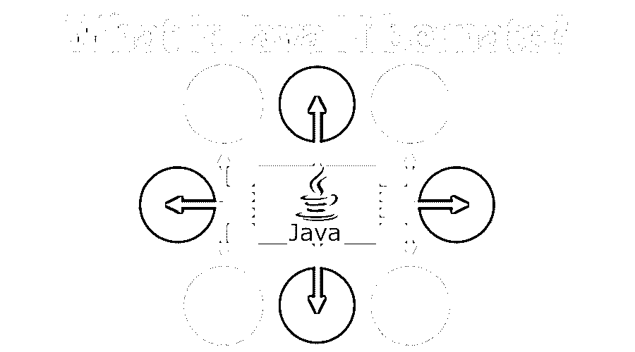

# 什么是 Java Hibernate？

> 原文：<https://www.educba.com/what-is-java-hibernate/>

## Java Hibernate 定义

Java Hibernate 是一个对象关系映射工具(ORM ),它通过提供一个框架，允许将面向对象的模型映射到 web 应用程序的关系数据库。将 Java 类中的实体映射到数据库中创建的表，以及将 Java 数据类型映射到 [SQL 数据类型](https://www.educba.com/sql-data-types/)是 Hibernate 的主要功能之一。您还可以使用 Hibernate 查询或检索数据。它将开发人员从手工处理数据库中解放出来。

### 什么是 Java Hibernate？

Hibernate 是由 Gavin King 在 2001 年创建的 Java 中的对象关系映射(ORM)框架。它简化了数据库和正在开发的 Java 应用程序之间的交互。这是一个强大而轻量级的 ORM 工具。另一个重要的是，这是一个开源的高性能工具。Hibernate 实现了 Java 持久性 API 规范，对于用 Java 开发的应用程序来说，它是一个非常强大的对象关系持久性和查询服务。

<small>网页开发、编程语言、软件测试&其他</small>

### 了解 Java Hibernate

Java 对象和数据库服务器通过 Hibernate 进行交互。Hibernate 将根据正确的 O/R 模式和识别机制来持久化 Java 对象。Hibernate 的架构是分层的，因此用户不需要真正了解底层的 API 就可以操作。在数据库和配置数据的帮助下， [Hibernate 能够向应用程序提供](https://www.educba.com/hibernate-interview-questions/)持久性服务和对象。Hibernate 的体系结构由诸如会话工厂、事务工厂、持久对象等对象组成。

[Hibernate 框架使用](https://www.educba.com/hibernate-framework/)会话工厂、会话、事务等许多对象。以及现有的 Java API 如 JDBC ( [Java 数据库连接](https://www.educba.com/jdbc-architecture/))、JTA (Java 事务 API)和 [JNDI (Java 命名目录接口)](https://www.educba.com/what-is-jndi-in-java/)。

Hibernate 架构有四层。下面列出了这些:

*   第 1 层–Java 应用层
*   第 2 层–Hibernate 框架层
*   第 3 层–后端 API 层
*   第 4 层—数据库层

### Java 中为什么需要 Hibernate？

为了从数据库中检索数据，在应用程序中一次又一次地重复编写相同的代码行会令人疲惫和恼火。此外，如果不使用 Hibernate 框架，从一个数据库切换到另一个数据库、用 JDBC 实现 oops、创建数据库表之间的关联都需要大量的工作和返工。如前所述，Java Hibernate 是一个 ORM 工具，有助于缓解使用 JDBC 进行数据库连接时面临的所有这些问题。

与 JDBC 相比，Hibernate 将自己与数据库连接起来。为了执行查询，Hibernate 使用 Hibernate 查询语言或 HQL。一旦查询被执行，Hibernate 就会将结果映射到它们各自的应用层。这种映射产生的对象完全基于 Hibernate 的配置 XML 文件中提到的属性。会话不仅可以帮助应用程序创建与数据库的连接，还可以保存和获取 Hibernate 中的持久对象。使用会话工厂(这是一个接口)可以创建一个会话实例，并使用这个实例，只是每个数据库应该只有一个会话工厂。例如，如果一个应用程序使用两个数据库，即- [MySQL 和 Oracle](https://www.educba.com/mysql-vs-oracle/) ，那么应该为 MySQL 维护一个会话工厂，为 Oracle 维护一个会话工厂。不能单独为 Oracle 或 MySQL 维护两个会话工厂。

### Java Hibernate 的优势

对象关系映射(ORM)解决了将对象域模型轻松映射到关系持久集合的问题。Hibernate 是免费的，它是一个开源的 Java 对象关系映射库，专门用于将对象映射到任何关系数据库管理系统。它也有助于在关系数据库中实现面向对象编程的概念。

让我们来看看通过实施 ORM 我们获得的一些主要优势

1.  **高收益:**如果在 JDBC 的帮助下实施应用程序，面临的最大挑战之一是开发、调整和维护与 JDBC 相关的代码所花费的时间。这个问题的答案是 ORM。通过使用 ORM，实现一个应用程序所需的时间会成倍减少，因为不需要检查代码和映射机制。数据库由一个健壮的、现成的和完全可信的 ORM 引擎有效地管理。
2.  **良好的结构:** ORM 有一个有效的设计模式，该模式被实施并测试良好。它不需要重做一个已经完成的任务，该任务也已经被尝试、测试和再次使用，因此节省了时间。

### Hibernate 的优势

Hibernate 实现了 ORM 的架构设计模式，就像其他实现一样。它有许多优点和缺点。现在我们将列出使用 Hibernate 的优点。

它们如下:

1.  **数据库独立:**在后端，Hibernate 独立于数据库的一个引擎。
2.  **内置连接池实现:** Hibernate 自动集成最可靠的连接池实现，即 C3P0。
3.  **分层架构:** Hibernate 被认为是一种分层架构，因此确保了我们没有义务去利用 Hibernate 提供的一切。我们只是利用那些我们认为对项目来说足够轻的特性。
4.  **JPA 提供者:** [Java 持久性 API](https://www.educba.com/java-persistence-api/) ，即 JPA 被认为是一种规范。JPA 有很多可用的实现，比如 EclipseLink、OpenJPA 等等。它是一个标准的 ORM 解决方案，此外，还包含 JPA 功能。因此，使用休眠有助于我们在特定于 JPA 的项目中利用 ORM 和 JPA 的所有功能。

### 结论

因此，Hibernate 是一个 ORM 工具，用于在运行时用 Java 对象映射数据库结构。Hibernate 是一个持久化的框架，使用 Hibernate 可以让开发人员专注于业务逻辑代码的编写，尽管需要编写准确且良好的持久层，包括编写 [SQL 查询](https://www.educba.com/what-is-sql/)、连接管理和 JDBC 代码。

### 推荐文章

这是关于什么是 Java Hibernate 的指南。在这里，我们讨论了 Java Hibernate 的概念、定义和理解。您也可以浏览我们推荐的其他文章，了解更多信息——

1.  [什么是 java 中的多线程？](https://www.educba.com/what-is-multithreading-in-java/)
2.  [Java 命名惯例](https://www.educba.com/java-naming-conventions/)
3.  [休眠映射](https://www.educba.com/hibernate-mapping/)
4.  [Hibernate 架构](https://www.educba.com/hibernate-architecture/)

