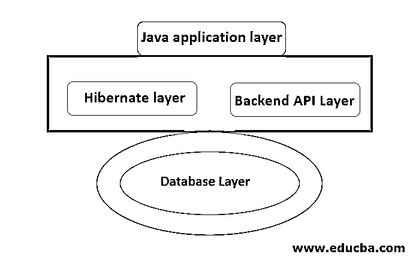
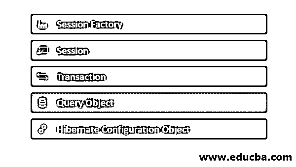

# Hibernate 框架

> 原文：<https://www.educba.com/hibernate-framework/>


## 什么是 Hibernate 框架？

[Hibernate](https://www.educba.com/what-is-hibernate/) 是一个开源的基于对象关系映射(ORM)的 java 持久化框架。它是 java 中的一个 ORM 映射工具。Hibernate 的设计是为了在通过 java 连接关系数据库时降低复杂性。Hibernate 框架旨在映射 java 对象，以在关系数据库中实现面向对象的编程。hibernate 就是这样连接到关系数据库来执行查询的:

*   Hibernate 直接连接指定的数据库，并使用 hibernate 查询语言(HQL)来执行查询，并将查询结果映射到 java 对象。
*   Hibernate 使用 Hibernate 配置 XML 文件中设置的属性将查询结果映射到 java 对象。
*   数据库连接是使用有助于保存和获取持久 java 对象的会话创建的。
*   会话是使用会话工厂接口创建的。在理想情况下，每个数据库应该只有一个会话工厂。

### Hibernate 和 JDBC 的比较

下面是一个比较表，显示了 hibernate 和 JDBC 的区别:

<small>网页开发、编程语言、软件测试&其他</small>

| **冬眠** | **JDBC** |
| Hibernate 包含提供样板逻辑的具体类。 | JDBC 只提供接口[和抽象类](https://www.educba.com/abstract-classes-in-javascript/)。 |
| 休眠抛出的所有异常都是未检查的。 | JDBC 的所有类都会抛出检查过的异常。 |
| 它不需要更多的资源管理，而是在内部完成。 | 它需要更多的资源管理，如资源的打开和关闭。 |
| 直接存储 java 对象。 | 它不能直接存储对象。 |
| 支持数据库独立查询。 | 支持数据库特定的查询。 |
| 支持缓存。 | 它不支持缓存。 |
| 支持懒加载。 | 它不支持延迟加载。 |

### Hibernate 框架体系结构

Hibernate 遵循分层架构，具有以下几层:




*   Java 应用层
*   休眠层
*   后端 API 层
*   数据库层

Hibernate 层包含以下组件:




#### 1.休眠配置对象

这是使用 hibernate 建立数据库连接[必须创建的第一个对象。理想情况下，应该在应用程序初始化期间创建一次。配置对象提供以下内容:](https://www.educba.com/hibernate-mapping/)

*   **数据库连接:**使用一个或多个配置文件建立数据库连接。文件处于休眠状态。属性和 hibernate.cfg.xml。
*   **映射:**这创建了 java 类和关系数据库表之间的映射。

#### 2.会话工厂

在步骤 1 中创建的配置对象用于创建会话工厂对象，该对象使用提供的配置文件使 hibernate 配置就绪，并为创建会话对象让路。由于会话工厂是一个很重的对象，所以它通常在应用程序的启动阶段创建一次。如果需要建立到多个数据库的连接，则需要多个会话工厂对象。另外，会话工厂是一个线程安全的对象。

#### 3.会议

会话对象建立与数据库的物理连接。它是一个轻量级对象，应该在每次需要与数据库交互时创建。如果一个对象需要被持久化或者需要被检索，那么只能使用 session 对象来完成。一旦所需的操作完成，就应该关闭会话对象，因为它们不是线程安全的。

#### 4.交易

它是一个可选对象，代表使用数据库完成的一个工作单元。事务对象确保要么所有操作都必须执行，要么都不执行。它是一个单线程的短命对象。

#### 5.查询对象

该对象使用[结构化查询语言](https://www.educba.com/what-is-sql/) (SQL)或 Hibernate 查询语言(HQL)从数据库获取数据并实例化对象。查询对象可用于限制查询返回的输出、绑定查询参数和执行查询。

**查询**

这里我们将执行一些查询，使事情变得更加清楚。让我们考虑一个实体雇员，其类的结构如下:

**代码:**

```
Package com.edubca.hibernatetest;
@Entity
@Table(name = "EMPLOYEE")
public class Employee implements Serializable
{
private static final long serialVersionUID = -1798070786993123455L;
@Id
@GeneratedValue(strategy = GenerationType.IDENTITY)
@Column(name = "empID")
private Integer empID;
@Column(name = "NAME")
private String empName;
@Column(name = "SALARY")
private Integer salary;
//Getters and setters
}
```

Hibernate 需要一个名为 hibernate.cfg.xml 的 [XML](https://www.educba.com/what-is-xml/) 文件，类似于:

**代码:**

```
<hibernate-configuration>
<session-factory>
<property name="hibernate.connection.driver_class">com.mysql.jdbc.Driver</property>
<property name="hibernate.connection.url">jdbc:mysql://localhost:3306/hibernatetest</property>
<property name="hibernate.connection.password"> edubca</property>
<property name="hibernate.connection.username">edubcauser</property>
<property name="hibernate.dialect">org.hibernate.dialect.MySQLDialect</property>
<property name="hbm2ddl.auto">create</property>
<mapping class="com.edubca.hibernatetest.Employee"></mapping>
</session-factory>
</hibernate-configuration>
```

下面的代码展示了如何使用 hibernate 在数据库中进行插入和检索:

**代码:**

```
//Create Configuration object
Configuration con=new AnnotationConfiguration().configure(new File("hibernate.cgf.xml"));
// create session factory using configuration
SessionFactory fact=conf.buildSessionFactory();
//get session from session factory
Session session=fact.openSession();
//Instantiate and populate Employee entity object
Employee emp=new Employee();
emp.setempID(1);
emp.setempName(“Yash”);
emp.setSalary(40000);
Employee emp1=new Employee();
emp1.setempID(2);
emp1.setempName(“Aman”);
emp1.setSalary(42000);
//persist emp object
session.save(emp);
//persist emp1 object
session.save(emp1);
//retrieve data from database
Query query=session.createQuery(“from Employee”);
List<Employee> list= query.list();
For(Employee e : list){
System.out.println(“Employee with ID ” + e.getempID() + “ has Name ” + e.getempName() + “ has salary ” + e.getsalary());
}
```

**输出:**

ID 为 1 的名为 Yash 的雇员的工资为 40000 英镑。ID 为 2 的雇员姓名为 Aman，工资为 42000 英镑。

### 结论

在本文中，我们详细介绍了 hibernate，包括它的架构、与 JDBC 的比较以及代码示例。我们还注意到 hibernate 提供了一种简单有效的方法来与数据库交互。

### 推荐文章

这是 Hibernate 框架的指南。在这里，我们讨论了 hibernate 和 JDBC 的架构、组件以及代码示例的比较。您也可以阅读以下文章，了解更多信息——

1.  [Java 中的框架](https://www.educba.com/frameworks-in-java/)
2.  [HADOOP 框架](https://www.educba.com/hadoop-framework/)
3.  [休眠版本](https://www.educba.com/hibernate-versions/)
4.  [休眠状态下的延迟加载](https://www.educba.com/lazy-loading-in-hibernate/)


