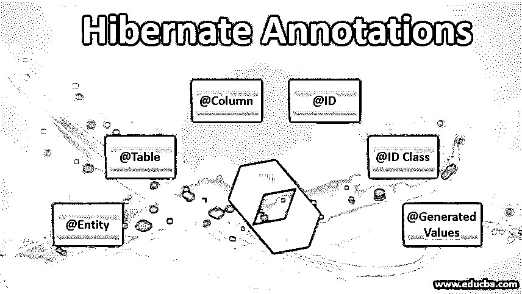

# Hibernate 注释

> 原文：<https://www.educba.com/hibernate-annotations/>




## Hibernate 注释简介

Hibernate 注释可以被视为将 JAVA 应用程序链接到后端关系数据库的元数据。Hibernate 用于将传统的关系数据库与前端 JAVA 应用程序进行映射。Hibernate 是连接面向对象语言(JAVA)和关系数据库的桥梁，或者借助于以“.”结尾的文件。hbm”包含所有必要的映射，或者相同的映射可以使用注释来完成。注释嵌入在 JAVA 中，因此不需要创建任何特殊的文件。注释可以用实体开头的“@”来标识，例如:@Entity、@table、@Id 等。

注释源自名为 javax.persistence 的主要 JAVA 包，以支持其使用。注释是基于 JPA ( [JAVA 持久性 API](https://www.educba.com/java-persistence-api/) )规范的。要实现 JAVA 注释，我们必须确保使用 JDK 5.0 或更高版本。

<small>网页开发、编程语言、软件测试&其他</small>

### 带代码片段的 Hibernate 注释

深入研究一些解释的代码片段:

在运行 hibernate 程序之前，我们需要设置一些文件。使用注释编写 hibernate 程序的步骤概述。

1.  您需要在您的设备上安装休眠注释，最好是 Hibernate 3.x，并将 hibernate-annotations.jar、lib/ejb3-persistence.jar 和 lib/Hibernate-common-annotations . jar 复制到您的 CLASSPATH 环境变量中。
2.  使用 Eclipse IDE 创建 Maven 项目。我们可以选择文件(右上角)->新建-> Maven 项目，然后在下面的弹出屏幕中选择所需的工作区。
3.  通过点击目录类型，我们可以根据您的需求选择组 ID、工件 ID 和版本。这可以从弹出菜单中选择。
4.  在 pom.xml 文件中添加依赖项和配置。您可以在步骤 1 中创建的项目下的右侧下拉列表中找到 pom 文件。
5.  因为 oracle 驱动程序不在公共 Maven 存储库中，所以需要从外部安装。安装 Maven 后，我们需要按照这个路径安装 oracle。

1.  运行命令:
2.  ```
    install-file -Dfile=Path/to/your/ojdbc14.jar -DgroupId=com.oracle -DartifactId=ojdbc14 -Dversion=12.1.0 -Dpackaging=jar
    ```

6.  现在我们可以创建一个包含注释的持久性类。这个类可以用扩展名“.”保存。JAVA”。
7.  我们必须创建一个扩展名为“. cfg.xml”的配置文件。
8.  最后，创建一个类来存储或检索数据。这将被保存为扩展名“”。JAVA”。这个文件将是主要的触发文件，它反过来调用我们最初创建的文件。

#### 创建表的查询

下面是创建表的数据库查询。

```
Create table Trainee(
code int not null auto_increment,
fname VARCHAR(30),
lname  VARCHAR(30),
PRIMARY KEY (code)
);
```

#### 解释注释的代码段

```
package com.eduCBA.mypackage;
```

//这在包下定义了一个代码。这是将代码封装在包中的一种方式。

```
import javax.persistence.Table;
```

//下面的代码将使用表注释，这就是我们从 persistence 类获取表注释特征的原因。

```
import javax.persistence.Id;
```

//Id 注释将在下面的代码中使用，这就是我们从 persistence 类获取表注释特征的原因。

```
import javax.persistence.Entity;
```

//实体注释将在下面的代码中使用，这就是我们从 persistence 类获取表注释特征的原因。

```
@Entity
```

//这是一种使用注释的方式。我们以“@”符号作为元素的前缀。该注释将该类标记为实体 bean，因此它将有一个无参数构造函数和一个受保护的访问修饰符。

```
@Table(name= "Edu_rec")
```

//名称是表实体的特征。该表来自关系数据库。要存储的表的名称是“edu _ 记录”。该注释可用于修改表的各种属性，如模式、名称等。

```
public class Trainee {
```

//将代码封装在公共类 trainee 中。

```
@Id
```

//此注释用于表示主键。

```
private int code;
private String fname, lname;
```

//声明一些私有的整数和字符串数据类型来存储唯一的标识代码，名字和姓氏来存储或获取数据库中保存的表中的数据。这些数据类型通过注释连接到表数据。

```
public int getCode() {
```

//创建这个函数是为了从数据库表中获取唯一的标识码。这段代码用于从数据库中提取数据，以便在前端显示或其他用途。

```
return code;
}
public void set code (int code) {
```

//此函数用于在数据库中没有代码的情况下设置唯一代码。这里的“This”指针指向当前代码，该代码需要更新为我们作为参数传递给该函数的代码。

```
this.code = code;
}
public String getFname () {
```

//创建此函数是为了从数据库表中获取名字。这段代码用于从数据库中提取数据，以便在前端显示或其他用途。

```
return fname;
}
public void setFname(String fname) {
```

//此函数用于在数据库中没有代码的情况下设置名字。这里的“This”指针指向当前代码，该代码需要更新为我们作为参数传递给该函数的代码。

```
this.fname = fname;
}
public String getLname() {
```

//同上唯一不同的是，我们处理的是包含姓的数据，以防出现名。

```
return Lname;
}
public void setLname(String Lname) {
```

//同上唯一不同的是，我们处理的是一个包含姓氏的数据，以防出现名字。

```
this.Lname = Lname;
}
}
```

### 结论

Hibernate 注释是一种将数据库函数嵌入 JAVA 代码本身的神奇方法，从而减少了为同一工作创建单独文件的工作量、时间和内存。JAVA 持久性库支持这些注释。当您创建独立的数据密集型项目时，这是一种灵活而有用的方法。

### 推荐文章

这是 Hibernate 注释指南。在这里，我们讨论简介，用一些代码片段深入注释。您也可以浏览我们推荐的其他文章，了解更多信息——

1.  [Hibernate 框架](https://www.educba.com/hibernate-framework/)
2.  [休眠版本](https://www.educba.com/hibernate-versions/)
3.  [休眠验证器](https://www.educba.com/hibernate-validator/)
4.  [休眠工具](https://www.educba.com/hibernate-tools/)


