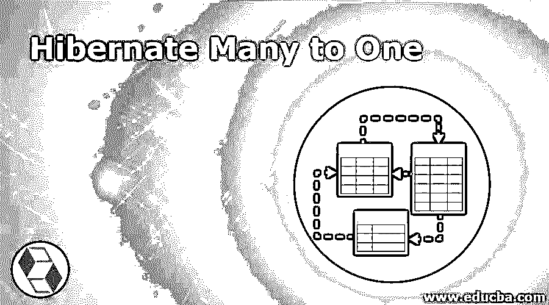
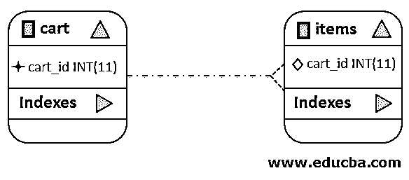
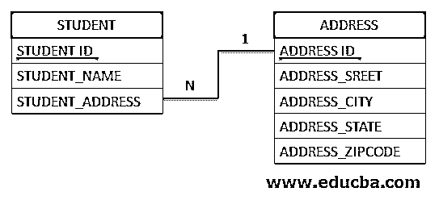

# 多对一冬眠

> 原文：<https://www.educba.com/hibernate-many-to-one/>

## 多对一 Hibernate 简介

Hibernate 多对一映射意味着一个表中的许多行被映射到另一个表中的一行。
这是理解一对多关系的关联图:

<small>网页开发、编程语言、软件测试&其他</small>

数据库建模包括定义几个一对多关系或多对一关系。同样的，当你对实体建模时。选择 JPA 和 Hibernate 来轻松完成这项任务。我们需要对表示一对多和多对一关联的属性进行注释。多对一是基于单向注释的配置。

**语法:**

`public class Cart {
//...
@OneToMany(mappedBy="cart")
private Set<Items> items;
//...
}`

使用**多对一**添加对购物车中商品的引用，可以使其成为双向关系。也就是说，我们可以双向访问商品，即从商品中访问购物车，从购物车中访问商品。

### Hibernate 多对一注释是如何工作的？

Hibernate 通过 mappedBy 属性告诉我们用哪个变量来表示子类中的父类。下面是用于开发实现一对多关联的示例应用程序的库:

*   H2 数据库。
*   冬眠 5。
*   JDK 1.8 及更高版本。
*   Maven 3 及更高版本。

下面将显示实体之间的关系。

**

** 

首先，用 hibernate 注释创建一个 java 类来创建地址和学生表。

**代码:**

`package com.tutorial.student_information;
import javax.persistence.Column;
import javax.persistence.Entity;
import javax.persistence.GeneratedValue;
import javax.persistence.GenerateionType;
import javax.persistence.Id;
import javax.persistence.ManyToOne;
import javax.persistence.Table;
@Entity
@Table(name = "STUDENT NAME")
public class Student {
private long Id;
private String Name_Of_Student;
private Address Address_Of_Student;
public Student() {
}
public Student(String Name_Of_Student, Address Address_Of_Student) {
this.studentName = Name_Of_Student;
this.Address_Of_Student = Address_Of_Student;
}
@Id
@GeneratedValue
@Column(name = "ID")
public long getId() {
return this.Id;
}
public void setId(long Id) {
this.Id = Id;
}
@Column(name = "NAME_OF_STUDENT", nullable = false, length = 150)
public String getName_Of_Student() {
return this.Name_Of_Student;
}
public void setName_Of_Student(String Name_Of_Student) {
this.Name_Of_Student = Name_Of_Student;
}
@ManyToOne(cascade = CascadeType.ALL) //cascade equals save
public Address getAddress_Of_Student() {
return this.Address_Of_Students;
}
public void setAddress_Of_Student(Address Address_Of_Student) {
this.Address_Of_Student = Address_Of_Student;
}
}`

这样，数据库设置就差不多准备好了。现在，让我们创建一个例子:
现在，在这个例子中，我们将看到如何使用 hibernate 的注释来映射多对一关系。将地址和学生的关系视为实体。

级联用于将操作与相关实体级联。例如，如果你有一个学生的对象，与之相关的地址将被自动保存。

`package com.tutorial.student_information;
import javax.persistence.Column;
import javax.persistence.Entity;
import javax.persistence.GeneratedValue;
import javax.persistence.GenerateionType;
import javax.persistence.Id;
import javax.persistence.ManyToOne;
import javax.persistence.Table;
@Entity
@Table(name = "ADDRESS_INFORMATION")
public class Address_Of_Student {
private String zipcode_number;
private String street_name;
private String state_name;
private String city_name;
private long addressId;
public Address_Of_Student() {
}
public Address_Of_Student(String zipcode_number,String state_name,String city_name,String street_name) {
this.street = street_name;
this.city = city_name;
this.state = state_name;
this.zipcode = zipcode_number;
}
@Id
@GeneratedValue
@Column(name = "ID_OF_ADDRESS")
public long getId() {
return this.Id;
}
public void setId(long Id) {
this.Id = Id;
}
@Column(name = "STREE_OF_ADDRESS_T", nullable = false)
public String getStreet_name() {
return this.street_name;
}
public void setStreet_name(String street_name) {
this.street_name = street_name;
}
@Column(name = "CITY_OF_ADDRESS", nullable = false)
public String getCity_name() {
return this.city_name;
}
public void setCity_name(String city_name) {
this.city_name = city_name;
}
@Column(name = "STATE_OF_ADDRESS", nullable = false)
public String getState_name() {
return this.state_name;
}
public void setState_name(String state_name) {
this.state_name = state_name;
}
@Column(name = "ZIPCODE_OF_ADDRESS", nullable = false)
public String getZipcode_number() {
return this.zipcode_number;
}
public void setZipcode_number(String zipcode_number) {
this.zipcode_number = zipcode_number;
} }`

**在主类:**

`package com.tutorial.student_information;
import org.hibernate.HibernateException;
import org.hibernate.Session;
import org.hibernate.Transaction;
import com.tutorial.util.HibernateUtil;
public class Main {
public static void main(String[] args) {
Session session = HibernateUtil.getSessionFactory().openSession();
Transaction transaction = null;
try {
transaction = session.beginTransaction();
Address_Of_Student address_information = new Address_Of_Student("60097", "TN", "Chennai", "OMR Road");
Student_information first_Student = new Student_information("Eswar", address_information);
Student_information second_Student = new Student_information("Joe", address_information);
session.save(first_Student);
session.save(second_Student);
transaction.commit();
} catch (HibernateException e) {
if (transaction! = null)
transaction.rollback():
e.printStackTrace();
} finally {
session.close();
}
}
HibernateUtil.shutdown():
}`

**输出:**

学生表有两条记录。

地址表有一条记录。

The many-to-one mapping association is seen as the students record the same address.

### 结论

当您对数据库建模时，您最有可能找到并定义几个关联。其中之一就是多对一关系。用 Hibernate 和 JPA 很容易做到。获取一个表示关联的属性，并用多对一对其进行注释。

### 推荐文章

这是一个多对一休眠的指南。这里我们讨论 Hibernate 多对一注释是如何工作的，以及它的例子和代码实现。您也可以浏览我们推荐的其他文章，了解更多信息——

1.  [休眠版本](https://www.educba.com/hibernate-versions/)
2.  [冬眠注解](https://www.educba.com/hibernate-annotations/)
3.  [Hibernate EntityManager](https://www.educba.com/hibernate-entitymanager/)
4.  [多对多冬眠](https://www.educba.com/hibernate-many-to-many/)