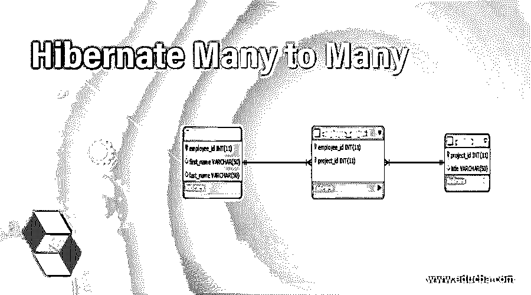
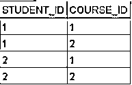

# 多对多冬眠

> 原文：<https://www.educba.com/hibernate-many-to-many/>

## 多对多 Hibernate 简介

Hibernate 多对多映射意味着一个表中的许多行被映射到另一个表中的许多行。也可以说，在实体之间进行映射的方式使得一个实体可以与另一个实体的其他实例有许多关联。

这是理解多对多关系的关联图:

<small>网页开发、编程语言、软件测试&其他</small>

数据库建模包括定义几个一对多、多对一或多对多的关系。同样，当你对实体建模时。选择 JPA 和 Hibernate 来轻松完成这项任务。对表示多对一和多对一的关联的属性进行注释是人们所需要的。多对多是一种双向的基于注释的配置。

**语法**

`public class Cart {
//...
@ManyToMany(mappedBy="cart")
private Set<Items> items;
//...
}`

使用多对多添加对购物车中商品的引用是一种双向关系。这意味着，我们可以通过两种方式访问商品，即从商品访问购物车和从购物车访问商品。

### Hibernate 多对多注释是如何工作的？

Hibernate 通过 mappedBy 属性告诉我们用哪个变量来表示子类中的父类。以下是用于开发 Hibernate 示例应用程序的库，该示例应用程序实现了一对多关联:

`H2 database
Hibernate 5
JDK 1.8 and later
Maven 3 and later`

下面将显示实体之间的关系。

首先，使用 hibernate 注释创建一个 java 类，以创建学生的课程和学生详细信息表。

**代码:**

`package com.tutorial.student_course_information;
import javax.persistence.Column;
import javax.persistence.Entity;
import javax.persistence.GeneratedValue;
import javax.persistence.GenerateionType;
import javax.persistence.Id;
import javax.persistence.JonColumn;
import javax.persistence.ManyToMany;
import javax.persistence.Table;
@Entity
@Table(name = "STUDENT_NAME")
public class Student {
private long Id;
private String Name_Of_Student;
private Set<course_details> course_details = new HashSet<course_details>();
public Student() {
}
public Student(String Name_Of_Student, Set<course_details> course_details)
this.Name_Of_Student = Name_Of_Student;
this.course_details = course_details;
}
@Id
@GeneratedValue
@Column(name = "ID")
public long getId() {
return this.Id;
}
public void setId(long Id) {
this.Id = Id;
}
@Column(name = "NAME_OF_STUDENT", nullable = false)
public String getName_Of_Student() {
return this.Name_Of_Student;
}
public void setName_Of_Student(String Name_Of_Student) {
this.Name_Of_Student = Name_Of_Student;
}
@ManyToMany(cascade = CascadeType.ALL) //cascade equals save
@JoinTable(name = “COURSE_OF_STUDENT”, joinColumns = { @JoinColumn(namw = “ID”) })
public Set<course_details> getcourse_details() {
return this.course_details;
}
public void setcourse_details(Set<course_details> course_details) {
this.course_details = course_details;
}
}`

这样，数据库设置就差不多准备好了。现在，让我们创建一个例子:现在，在这个例子中，我们将看到如何使用 hibernate 的注释来映射多对多关系。将课程和学生详细信息的关系视为实体。其中每个实例可以通过与另一个实体相关联的任何一个来访问。

级联用于将操作与相关实体级联。例如，如果你有一个学生的对象，与之相关的地址将被自动保存。

**注释:** JoinTable 用于创建课程明细页签，
**注释:** @JoinColumn 用于链接两个表。

**代码:**

`package com.tutorial.student_course_information;
import javax.persistence.Column;
import javax.persistence.Entity;
import javax.persistence.GeneratedValue;
import javax.persistence.GenerateionType;
import javax.persistence.Id;
import javax.persistence.ManyToOne;
import javax.persistence.Table;
@Entity
@Table(name = "COURSE_DETAILS")
public class course_details {
private long id_of_the_course;
private String course_details_name;
public course_details() {
}
public course_details(String course_details_name) {
this.course_details_name = course_details_name;
}
@Id
@GeneratedValue
@Column(name = "ID")
public long getId() {
return this.Id;
}
public void setId(long Id) {
this.Id = Id;
}
@Column(name = "COURSE_DETAILS", nullable = false)
public String getcourse_details_name() {
return this.course_details_name;
}
}`

**在主类中:**

`package com.tutorial.student_course_information;
import org.hibernate.HibernateException;
import org.hibernate.Session;
import org.hibernate.Transaction;
import com.tutorial.util.HibernateUtil;
public class Main {
public static void main(String[] args) {
Session session = HibernateUtil.getSessionFactory().openSession();
Transaction transaction = null;
try {
transaction = session.beginTransaction();
Set<course_name> course_name = newHashSet<course_name>()
course_name.add new course_name((“Computers”));
course_name.add course_name((“Mathematics”));
Name_Of_Student first_Student = new Name_Of_Student("Eswar",course_name);
Name_Of_Student second_Student = new Name_Of_Student("Joe", course_name);
session.save(first_Student);
session.save(second_Student);
transaction.commit();
} catch (HibernateException e) {
if (transaction! = null)
transaction.rollback():
e.printStackTrace();
} finally {
session.close();
}
}
HibernateUtil.shutdown():
}`

**输出:**

学生姓名表有两条记录。

course_name 表有两条记录。

在学生 _ 课程 _ 信息表中有四个链接的记录:

当每个学生都注册了类似的课程时，就会看到多对多的映射。

### 结论

当您对数据库建模时，您最有可能找到并定义几个关联。其中之一就是多对多关系。使用 Hibernate 和 JPA 很容易做到这一点。获取一个表示关联的属性，并用多对多进行注释。这说明一个对象与另一个实体中的许多其他对象相关。

### 推荐文章

这是一个多对多休眠的指南。这里我们讨论 Hibernate Many to Many 的介绍，以及注释如何与示例一起工作，以便更好地理解。您也可以浏览我们的其他相关文章，了解更多信息——

1.  [冬眠注解](https://www.educba.com/hibernate-annotations/)
2.  [Hibernate 架构](https://www.educba.com/hibernate-architecture/)
3.  [休眠映射](https://www.educba.com/hibernate-mapping/)
4.  [多对一休眠](https://www.educba.com/hibernate-many-to-one/)

