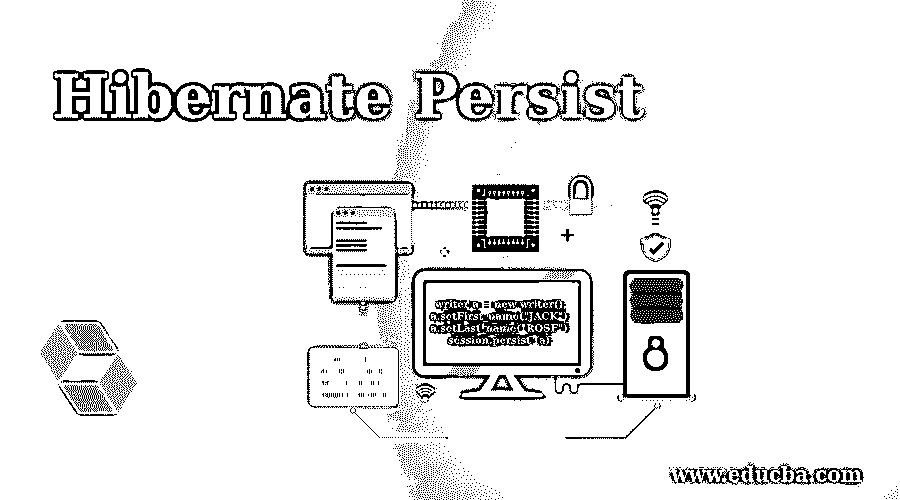

# 休眠持续

> 原文：<https://www.educba.com/hibernate-persist/>

## Hibernate Persist 简介

Hibernate Persist 用于保存实体或记录。还有其他方法，如保存和更新。persist 方法用于将瞬态实体形式的状态更改为持久状态或托管状态。Persist 是 JPA 的 EntityManager 提供的方法，也由 hibernate 会话继承。persistEvent 由 persist 方法触发，该方法同样由 hibernate 事件侦听器(默认的持久事件侦听器)处理。persist 方法并不保证在可能发生赋值的刷新时间立即将值赋给 persistence 实例。

**语法:**

<small>网页开发、编程语言、软件测试&其他</small>

`writer a = new writer();
a.setFirst_name("JACK");
a.setLast_name("ROSE");
session.persist (a);`

创建一个新的实体对象，实体对象进入它的生命周期状态，而不映射数据库的任何记录。
从语法上看，‘a’已经从暂态过渡到持久状态。在持久上下文中，对象被插入。虽然没有保存到数据库中。persist 的返回类型是 void。传递到位的对象是通过改变其主题来实现的。持久化对象由“a”引用

### Hibernate 是如何坚持工作的？

我们需要将一个实体附加到持久化的上下文中，以便使它成为可管理的或者在数据库中持久化。使用 Hibernate save 或 Java persist 方法，我们可以做到这一点。两者都很相似，只是略有不同。

**要点记住:**

*   持久方法返回类型为 void。
*   在事务之外，此方法不保存对数据库的更改。
*   持久性对象异常被引发到 session.persist()，因为这是不允许的。
*   JPA 和 Hibernate 都支持 persist 方法。
*   首先，您需要下载并安装 hibernate 包，并在您的操作系统上安装 MySQL 数据库。

创建一个 maven 项目，这意味着，Maven 依赖项和

**XML 代码:**

`pox.ml typed file will be created. pom.xl has the below code:
<project
xmlns:xsi="http://www.w3.org/2001/XMLSchema-instance"
xsi:schemaLocation="http://maven.apache.org/POM/4.0.0 http://maven.apache.org/xsd/maven-4.0.0.xsd">
<modelVersion>4.0.0</modelVersion>
<groupId>com.hibernate</groupId>
<artifactId>HibernatePersist</artifactId>
<version>0.0.1-SNAPSHOT</version>
<name>Hibernate Persist Example</name>
<packaging>jar</packaging>
</project>`

现在，我们需要通过开发来构建应用程序。这包括三个步骤:创建表和数据库、Maven 依赖项和创建 Java 类。

**数据库创建:**

`CREATE DATABASE IF NOT EXISTS persistdb;
USE persistdb;
CREATE TABLE employee (
id INT(50) NOT NULL AUTO_INCREMENT,
name VARCHAR(200) DEFAULT NULL,
designation VARCHAR(200) DEFAULT NULL,
department VARCHAR(200) DEFAULT NULL,
PRIMARY KEY (id)
);`

**美芬依赖:**

指定了 hibernate 框架的依赖关系，其余的依赖关系由 Maven 解决。以下代码是该文件的更新版本:

`<?xml version="1.0" encoding="UTF-8"?>
<project xmlns:xsi="[http://www.w3.org/2001/XMLSchema-instance](https://www.w3.org/TR/xmlschema-1/#no-xsi)" xsi:schemaLocation="http://maven.apache.org/POM/4.0.0 http://maven.apache.org/xsd/maven-4.0.0.xsd">
<modelVersion>4.0.0</modelVersion>
<groupId>com.hibernate</groupId>
<artifactId>HibernatePersist</artifactId>
<version>0.0.1-SNAPSHOT</version>
<name>Hibernate Persist Example</name>
<packaging>jar</packaging>
<dependencies>
<!-- [https://mvnrepository.com/artifact/org.hibernate/hibernate-core](https://mvnrepository.com/artifact/org.hibernate/hibernate-core) -->
<dependency>
<groupId>org.hibernate</groupId>
<artifactId>hibernate-core</artifactId>
<version>5.3.7.Final</version>
</dependency>
<!-- [https://mvnrepository.com/artifact/mysql/mysql-connector-java](https://mvnrepository.com/artifact/mysql/mysql-connector-java) -->
<dependency>
<groupId>mysql</groupId>
<artifactId>mysql-connector-java</artifactId>
<version>8.0.13</version>
</dependency>
</dependencies>
<build>
<finalName>${project.artifactId}</finalName>
</build>
</project>`

### 实现 Hibernate Persist 的示例

下面给出了 hibernate persist 的示例:

`package com.educba.hibernate.main;
import org.hibernate.Session;
import org.hibernate.SessionFactory;
import org.hibernate.Transaction;
import com.educba.hibernate.model.emp;
import com.educba.hibernate.util.HibernateUtil;
public class PersistExp {
public static void main(String[] args) {
SessionFactory sessionFactory = HibernateUtil.getSessionFactory();
//Using a transition, let's see hibernate example
Session sess = sessionFactory.openSession();
Transaction trans2 = sess.beginTransaction();
Employee emp2 = PersistExp.getTestEmp();
sess.persist(emp2);
System.out.println("Persist is called");
empp2.setName("Kumar");
// This will be saved and updated in database as well
System.out.println("Name of the employee is updated");
System.out.println("With the transaction id, the name of employee has been called="+empp2.getId()+", address="+emp2.getAddress().getId());
tans.commit();
System.out.println("*****");
//All the resources re closed
sessionFactory.close();
}
}`

**输出:**

### 结论

在数据库中，持久对象是存在的。这些持久对象由 hibernate for persistence objects 管理。当在应用程序中提交更改时，hibernate 数据库的表示是最新的。

### 推荐文章

这是一个 Hibernate Persist 的指南。在这里，我们还讨论了 hibernate 中 persist 的介绍和工作原理，并给出了一个例子及其代码实现。您也可以看看以下文章，了解更多信息–

1.  [休眠版本](https://www.educba.com/hibernate-versions/)
2.  [冬眠注解](https://www.educba.com/hibernate-annotations/)
3.  [多对多冬眠](https://www.educba.com/hibernate-many-to-many/)
4.  [Hibernate EntityManager](https://www.educba.com/hibernate-entitymanager/)