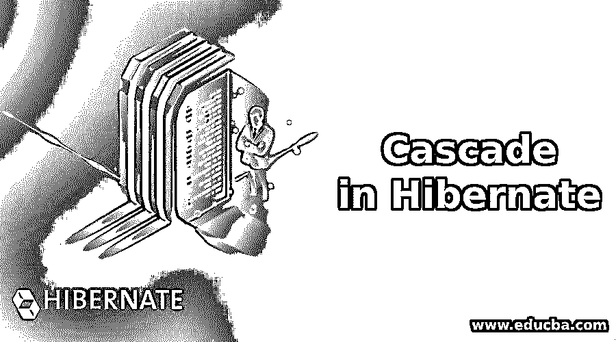
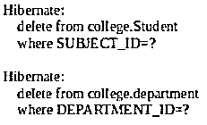
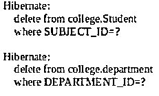
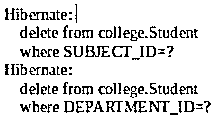
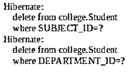

# 休眠中的级联

> 原文：<https://www.educba.com/cascade-in-hibernate/>

## Hibernate 中的级联介绍

在 hibernate 框架或相关技术中，每当从一个对象向另一个对象传播时，都会涉及到持久性操作。它完全是关于应该执行什么样的持久性操作，以及在维护持久性时应该遵循的所有属性。它适用于执行的许多类型的 hibernate 操作，并且是可传递的。这意味着指定级联的父节点的所有子节点也将应用于其子节点。

级联是在关键字 cascade 的帮助下在关联中定义的，它指定了必须级联到关联目标的所有操作，并且在集合映射时最常用。默认情况下，没有级联到关联的操作。它提供了方便的解决方案，节省了手动处理另一方状态时需要添加的代码行。

<small>网页开发、编程语言、软件测试&其他</small>

### Hibernate 支持的级联值和操作的类型

Hibernate 支持的不同类型的级联值和操作如下所示:

*   删除/移除
*   分离/驱逐
*   合并
*   锁
*   坚持
*   恢复精神
*   复制的
*   保存 _ 更新/更新
*   全部 _ 删除 _ 孤立
*   删除 _ 孤儿
*   没有人

上面提到的一些级联值现在已被弃用。但是，我们将介绍一些最常用的级联属性。有必要知道 cascade 属性可以在使用 XML 文件和使用 hibernate 框架中的注释的两种配置中使用。在 XML 文件中使用它时，我们可以使用 cascade 属性或关键字，然后以逗号分隔的格式为其分配 cascade 值。在注解的情况下，@Cascade 注解可以用来在@Cascade 注解之后的大括号{}内提及所有的 Cascade 值。在这两种方法中，如果 cascade 属性设置为 all，则意味着将执行上述所有级联值和操作。

现在，让我们看看如何在 hibernate 中使用 cascade，以及它如何使对相关引用对象执行操作变得容易，而无需为它们编写额外的代码。

### Hibernate 中级联的示例

下面是一些例子:

考虑这样一个例子，我们维护部门的数据，然后维护每个部门下的主题。部门和科目之间是一对多的关联。

#### 示例#1:级联保存-更新

将部门及其主题添加到数据库中的示例。

首先，我们将执行分别保存两个实体的任务，而不使用保存-更新的级联属性。

**代码:无级联**

`Department department = new Department();
Subject subject = new Subject();
//set the department and subject  data
subject.setDepartment(department);
department.getSubjects().add(subject);
session.save(department);
session.save(subject);`

**输出:**

**代码:带级联**

`<!-- Department.hbm.xml -->
<set name="Subject" cascade="save-update" table="subject"...>
<key>
<column name="DEPARTMENT_ID" not-null="true" />
</key>
<one-to-many class="com.college.common.Subject" />
</set>
Department department = new Department();
Subject subject = new Subject();
//set the department and subject  data
subject.setDepartment(department);
department.getSubjects().add(subject);
session.save(department);`

**输出:**

这里，我们不需要为 subject 单独指定 session.save()方法。每当保存部门时，它自动为引用的表主题构建查询。

#### 示例 2:级联删除

如果我们需要删除部门和所有引用的主题，那么当我们不使用层叠时，我们将分别删除它们。

**代码:不使用删除级联**

你需要循环所有的‘主题’，一个一个删除。

`Query q = session.createQuery("from Department where departmentId = :departmentId ");
q.setParameter("departmentId", "4715");
Department department = (Department)q.list().get(0);
for (Subject sdr :department.getSubjects()){
session.delete(sdr);
}
session.delete(department);`

**输出:**

**代码:带删除级联**

在上面的代码片段中，我们发现我们需要分别删除部门和主题记录，即使它们是相关的。这就是删除级联功能的用武之地。当我们使用 cascade="delete "时，如果我们要删除部门记录，则主题的所有引用条目也会被自动删除。

`<!-- Department.hbm.xml -->
<set name="subject" cascade="delete" table="Student" ...>
<key>
<column name="DEPARTMENT_ID" not-null="true" />
</key>
<one-to-many class="com.college.common.Subject" />
</set>
Query q = session.createQuery("from Department where departmentId = :departmentId ");
q.setParameter("departmentId", "4715");
Department department = (Department)q.list().get(0);
session.delete(department);`

**输出:**

#### 示例#3:级联删除-孤立

我们看到，当我们自动使用 delete cascade 时，我们将删除特定记录的引用记录。现在，我们将看到如何在级联的帮助下仅删除特定的子节点或仅删除主记录的一些引用记录，但在此之前，我们将看到如何在不使用级联的情况下完成此操作。

**代码:无删除-孤立级联**

你需要一个一个地删除“主题”。

`Subject sdr1 = (Subject)session.get(Subject.class,
new Integer(56));
Subject sdr2 = (Subject)session.get(Subject.class,
new Integer(57));
session.delete(sdr1);
session.delete(sdr2);`

**输出:**

**代码:带删除-孤立级联**

现在，当我们删除仅与特定部门相关的 id 为 56 和 57 的主题时，我们可以简单地使用 delete-orphan value 的级联选项来完成。

`<!-- Department.hbm.xml -->
<set name="Subject" cascade="delete-orphan" table="Student" >
<key>
<column name="DEPARTMENT_ID" not-null="true" />
</key>
<one-to-many class="com.college.common.Subject" />
</set>
Subject sdr1 = (Subject)session.get(Subject.class,
new Integer(56));
Subject sdr2 = (Subject)session.get(Subject.class,
new Integer(57));
Department department = (Department)session.get(Department.class, new Integer(2));
department.getSubjects().remove(sdr1);
department.getSubjects().remove(sdr2);
session.saveOrUpdate(department);`

**输出:**

delete-orphan 为我们提供了从子记录中删除选择性记录的功能。

### Hibernate 中的级联

在 hibernate 中，级联可以通过两种方式实现和启用。通过使用 XML 映射文件或通过使用批注。

#### 1.XML 映射文件

我们需要在 hibernate 项目的 XML 映射文件中的关系变量中声明级联。

**代码:**

`<!-- Department.hbm.xml -->
<set name="student" cascade="save-update, delete"
table="subject" ...>
<key>
<column name="DEPARTMENT_ID" not-null="true" />
</key>
<one-to-many class="com.college.common.subject" />
</set>`

#### 2.注释

使用注释时，您可以使用@Cascade 注释并提及 CascadeType。SAVE_UPDATE 启用保存和更新 cascade 或 CascadeType。删除用于在级联中启用删除操作等等。如果您想要提及多个级联操作，可以通过在逗号分隔的字符串中指定它们来实现。

**代码:**

`//Department.java
@OneToMany(mappedBy = "department")
@Cascade({CascadeType.SAVE_UPDATE, CascadeType.DELETE})
public Set<subject>getsubjects() {
return this.student;
}`

### 结论

通过这种方式，级联使启用被引用对象的功能和操作变得容易和自动，而无需为其编写特殊的代码行。但是，使用 Cascade 时应该小心，因为这可能会导致意外的行为。全部在关联中，并且不希望删除相关或引用的条目。但是它们会被删除，因为将级联设置为全部。所以，在使用层叠时要小心。

### 推荐文章

这是 Hibernate 中级联的指南。这里我们讨论 hibernate 中的简介、例子和层叠。您也可以看看以下文章，了解更多信息–

1.  [休眠版本](https://www.educba.com/hibernate-versions/)
2.  [Hibernate 架构](https://www.educba.com/hibernate-architecture/)
3.  [休眠映射](https://www.educba.com/hibernate-mapping/)
4.  [休眠会话](https://www.educba.com/hibernate-session/)

