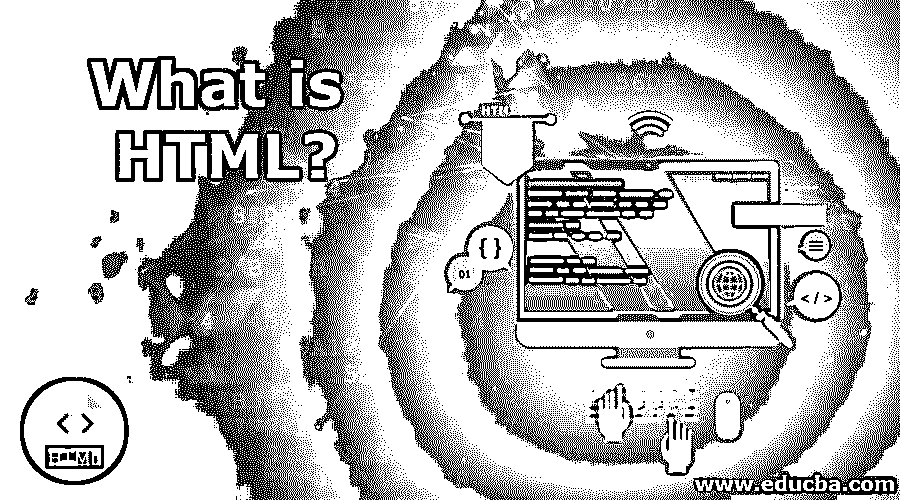

# 什么是 HTML？

> 原文：<https://www.educba.com/what-is-html/>




## 什么是 HTML？

HTML 的意思是超文本标记语言。HTML 语言是为创建网站而设计的。任何连接到互联网的人都可以浏览这些网站。它相对容易学习，大多数人一次就能掌握基础知识，而且你能创造出非常强大的东西。超文本是你上网的方式——点击一个叫做超链接的文本，它会把你带到下一页。标记是 HTML 标记所在的文本。你把它描述成某种文本。它是一种语言，因为它像所有其他语言、代码字和句法。

### 谅解

它允许将图像和对象嵌入到网页中，并创建交互式表单。它不是一种可以独立运行的可执行语言；它需要一个解释器来显示 HTML。不同的版本是 HTML 1.0、HTML 2.0、HTML 3.2、HTML4，下一个和最新的版本是 HTML5。HTML5 是 HTML 基于 XML 格式的扩展，解决浏览器中的兼容性问题，支持媒体和 JavaScript。拥有 HTML 模板可以给你的网页设计项目一个有效的设计。It 标签是不区分大小写的标记元素，它们通常成对出现，如(代表粗体)。应该提供一个格式良好的 HTML 来无错误地显示其页面。为此，所有元素都必须包含在标记中。它的属性应该在单引号和双引号之间选择。阅读 HTML 是站长写的。

<small>网页开发、编程语言、软件测试&其他</small>

### 它是如何让工作变得如此简单的？

实现是完全基于文本的，它在编辑器中打开以键入代码。它可以创建链接到下一页的超链接，这在 SEO 中是必不可少的。It 文档是预定义的。它嵌入了像 JavaScript 这样的脚本语言来增强网页的内容。像 Google，Bing，Yahoo 这样的搜索引擎可以根据相关搜索(排名)找到你自己创建的网站。它用于网络导航和网络文档。使用它非常简单，只需要几个步骤就可以创建自己的网页。

你只需要:

*   Html 代码
*   链接到下一个网页
*   图片，图形
*   链接到电子邮件
*   最后，要显示的信息列表

### HTML 的各种子集

有各种子集，如 XHTML、XML、DHTML。

*   XHTML 是一种可扩展的 HTML 语言，它是 HTML 的扩展，用 xml 编写。XHTML 使用与 HTML 相同的标记，除了 HTML 文档的一些规则，默认情况下这些规则是以小写字母书写的。HTML 是移动网页设计所熟悉的(通过手机访问浏览器需要一个 XHTML 支持者)。

*   接下来是由 ISO 标准化的 SGML(标准通用标记语言),它是一种为 HTML 定义标记语言的语言。
*   可扩展标记语言 XML 关注的是用什么数据来描述它们。他们定义了一组规则，并创建了自己的定制标签。XML 是一种元语言，由 w3c 在 XML1.0 规范中定义。
*   动态 HTML(DHTML)或 HTML4 用于创建交互式动画网站，并为 HTML 元素提供更多控制。HTML 使他们的页面随时间变化(动态的),而无需寻求服务器的帮助。功能包括网站的更新，下拉菜单向上和向下滚动按钮。
*   时间文本标记语言(TTML2)是与定时信息相关联的文本信息。

### 你能用它做什么？

*   我们可以为客户的在线营销创建出色的设计电子邮件。
*   使用 HTML，可以构建表单。要向页面添加表单，需要使用

    <form>元素。
    <表单动作="/log "方法="post" >。</form>

*   允许用户使用下拉列表选择数据。
*   通过自定义模板创建公司简讯。
*   创建个人博客来展示你正在做的事情。
*   使用 href 属性创建电子邮件。
*   使用 cookies 的客户端存储在 HTML5 中是可行的。
*   帮助开发一个具有 API 和插件特性的游戏。
*   在同一窗口中打开链接也可以在新窗口中打开。为此，需要一个目标属性来确定窗口显示的确切位置。
*   最新版本的 HTML5 带来了先进的流媒体视频和音频，并提供离线选项来观看内容。

### 工作

工作是如此简单，因为它是由一系列的文本代码保存在文件名下。可以在通过任何浏览器连接的任何操作系统上查看。文档的各个部分是一个标签，必须有主体和头。默认情况下，它的页面记录有 head、title、paragraph 标签。

代码的结构如下:

**代码:**

```
<HTML>
<HEAD>
<TITLE></TITLE>
</HEAD>
<BODY>
<h1></h1>
<p></p>
….
….
</BODY>
</HTML>
```

主体结构包含要显示的文本。标题部分包括一个页面标题。保存文件的有 filename.html。当您执行它时，您可以直接在浏览器中查看它。table 标签以表格形式显示数据。一个网页的设计包括一些列表，这些列表提供了附加值。那些列表包括有序列表

。

为了将 HTML 的基本结构增强为样式化的内容信息，使用了级联样式表(CSS)。这些风格包括字体，颜色，背景图片。css 用于控制代码中的布局和显示，包括以文件名. CSS 保存的文档的样式表。

**<link rel = " style sheet " href = " myss . CSS " type = " text/CSS "/>**

**用 CSS:**

```
<!DOCTYPE html>
<html>
<head>
<style>
body {background-color: blue;}
h1   {color: yellow;}
<p >   {color: green;}
</style>
</head>
<body>
<h1>This is a coat</h1>
<p>This iscourse.</p>
</body>
</html>
```

它的元素有内嵌元素和块级元素。内联元素覆盖了局部效果，如粗体、斜体。块级元素包括列表、段落。另一个功能是像图像地图一样，用一个图像链接许多不同的网页。

**T1】**

*   **表格:**

```
<html>
<table>
<tr>
<th></th>
</tr>
<tr>
<td>
</tr>
```

表示表格行，Indicates the table title,Represents tabular data.

*   **超链接**:链接到另一个网页。

`<A HREF= “http://www.educba.com/”>onlineWeb Site</A>`

**输出:**

在线网站

*   **添加页脚和页眉**

`<div style=” background: #333; color :#ggg; padding : 2px; margin : 5px 0 0;”</div>`

*   **表单创建:**

重要的表单元素包括<input>、<select>。</select>

### 优势

有许多优点，下面给出了一些要点:

*   应用广泛，简单易学。这里使用的标签是基本的，并且是用尖括号括起来的可读格式。
*   它是免费的，不需要购买单独的软件，其语法非常类似于 XML。
*   可以和 CSS、PHP、JavaScript 集成，支持多种语言。
*   它们很容易用名为“所见即所得”的 HTML 编辑器来设计。
*   它们很容易下载，因为文本(纯文本)是可压缩的。代码很简单。
*   它具有良好的易操作性和效率。所有浏览器都可以读取 HTML 文件和页面。
*   HTML 是静态的，而 HTML5 是动态的。它在所有浏览器中都是独立于平台的显示。
*   通过 HTML 使用 Canvas 允许 web 开发人员使用图形。
*   他们有一个叫做应用程序缓存的功能，可以存储大文件。

### 所需技能

它不需要任何学习的先决条件，因为它们很容易学习。一周之内就能学会，需要计算机方面的背景知识才能理解文档的要素。你需要一个文本编辑器如记事本来输入代码。甚至拿起学习 CSS 是强制性的，它用于指定页面样式。学习 CSS 使创建网站的整体技能更上一层楼。这两种语言对于一个优秀的 web 开发人员来说是必不可少的。

### 为什么要用？

虽然其他 web 编程技术在全球范围内广泛使用，如内容管理系统，但它在创建网页方面仍然占主导地位。像 Dreamweaver developments 这样的其他编程工具使用 HTML，因为它们的代码是干净和有效的。它可以是用 Javascript 编写嵌入式程序。当我们通过网络浏览器请求一个网页时，我们需要一个网址或链接到它的 URL。

网址的例子包括:

**https://www.educba.com/html/datamining.asp**

### 范围

设计是 IT 部门的重要组成部分，网站在今天的生活中扮演着重要的角色。HTML 的标准版本用于创建网页。但是现在，web 开发的范围已经超出了水平。对于旧版本，我们需要在浏览器上显示 flash 内容，这是我们现在在日常生活中看到的。当你点击一个网站时，其他视觉部分包括广告、视频链接等。，包括 API 和插件；hTML5 中启用了此功能。

它越来越受欢迎，并具有以下相关优势:

*   它有内置的音频视频播放功能，可以在像 Adobe Flash Player 这样的第三方开发者那里寻找。
*   为在搜索引擎中获得更高的排名而优化。
*   离线缓存的好处，在没有互联网连接的情况下，有时页面仍然可以看到内容。
*   互连各种设备。

### 我们为什么需要它？

HTML 5 是 HTML 的当前版本，为客户端表单提供了最新的增强功能。现在所有的浏览器(Chrome，Firefox，Opera，Internet Explorer)都支持 HTML5 作为更新版本。学习它让我们知道如何创建表单、标签、文档类型和查询。许多企业，如脸书、Linkedin、金融时报，认为使用 HTML5 非常重要，因为它允许跨平台部署。它们提供了 cookies，用于在浏览器中存储数据以备将来查看。此外，在电子邮件中附加图像和视频也是必不可少的。

### 谁是学习这项技术的合适受众？

任何人都可以学习它，因为它不需要任何编程技能。正确的受众包括所有初学者、网站开发者和希望编辑自己网站的人。拥有计算机学士学位的程序员，学习 it 高级概念的网页设计师，图形设计师。学习它有助于我们学习其他网络编程 CSS，JavaScript，PHP，ASP.Net 等。

### 这项技术将如何帮助你的职业发展？

对 web 程序员的需求非常高，因为他们本身就与前端 web 开发相关。如果程序员为网站创建和应用程序编写代码，他们就会被公司雇佣来发展产品和属性。熟练的程序员和程序员仍然有工作机会。通过学习 HTML 和 CSS 的基础知识，我们可以有机会从事自由职业，兼职/全职工作，在工作经验和工作培训方面提供有价值的报酬。

一旦你学会了这一点，求职者可以得到社交媒体经理的工作，初级网站开发人员，开发过程中的质量保证工程师-邮件营销服务需要定制的电子邮件模板，为客户建立一个双赢的个人网站，客户受益，我们可以体验工作和薪水。其他工作角色包括 MVC 开发人员，ASP.NET 开发人员，他们需要知识，因为它提供了跨不同平台的灵活性。

### 结论-什么是 HTML？

因此，它只是样式信息和结构，而不是编程语言，它们充当每个 web 应用程序的前端。有了知识，我们可以创建一个交互式媒体网络应用程序。web 组件(创建自己的 API)是一种允许创建 Web 应用程序的新兴技术。要开始建立网站，学习 HTML 元素最好是视觉上显示在网页上。随着包括网上购物在内的电子商务以更快的速度发展，无论是移动应用程序还是桌面应用程序，浏览器都支持标记语言，这一职业近年来蓬勃发展。在移动应用中实现 HTML5 时，性能和内存应该是一个关键的考虑因素。为了使页面内容动态，HTML 使用服务器端包含(SSI)。

### 推荐文章

这是一个什么是 HTML 的指南？在这里，我们讨论了 HTML 的工作原理、需求、范围、优势以及实施这项技术的顶级公司。您也可以浏览我们推荐的其他文章，了解更多信息——

1.  [HTML 中的锚点](https://www.educba.com/anchor-in-html/)
2.  [什么是 HTML？](https://www.educba.com/what-is-html/)
3.  [HTML5 Web Workers](https://www.educba.com/html5-web-workers/)
4.  [html 5 是什么？](https://www.educba.com/what-is-html5/)


