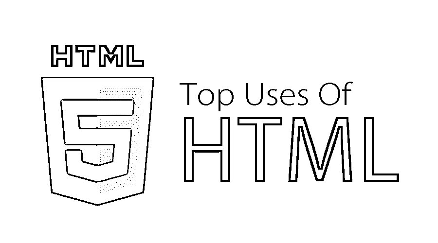

# HTML 的应用

> 原文：<https://www.educba.com/uses-of-html/>

## HTML 使用介绍

HTML 是一种广泛用于创建网页和网络应用的标记语言。HTML，当与 JavaScript 和 CSS 结合时，已经成为网络开发的一个里程碑。HTML 的一个有用的方面是，它可以嵌入用 JavaScript 等脚本语言编写的程序[，这些程序负责影响网页的行为和内容。CSS 包含会影响内容的布局和外观。任何 HTML 页面的基本构件都是 HTML 元素。结构化文档可以在结构语义文本的帮助下创建，如标题、段落、列表、链接和其他项目。浏览器实际上并不显示 HTML 标签，而是利用它们来解释页面的内容。人们需要研究各种标签，然后理解它们的行为。](https://www.educba.com/programming-languages-vs-scripting-languages/)

HTML 用于 web 文档、互联网导航等。在这篇关于 HTML 使用的文章中，我们将关注 HTML 的主要用途。

<small>网页开发、编程语言、软件测试&其他</small>

### HTML 的十大用途

请在下面的章节中找到 HTML 被广泛有效使用的地方。以下是 HTML 语言的十大用法。

#### 1.网页开发

HTML 大量用于创建显示在万维网上的页面。每个页面都包含一组 HTML 标签，包括用于连接其他页面的超链接。我们在万维网上看到的每一页都是用某种版本的 HTML 代码写成的[。](https://www.educba.com/versions-of-html/)

#### 2.Web 文档创建

互联网上的文档创建由 HTML 及其通过标签和 DOM 的基本概念，即文档对象模型来支配。HTML 标签被插入在短语之前和之后，以定位它们在页面上的格式和位置。web 文档由三部分组成:标题、头和正文。Head 包含标识文档的信息，包括标题和任何其他重要的关键字。标题可以在浏览器的栏上看到，正文部分是浏览者可以看到的网站的主要部分。所有这三个部分都是通过使用 HTML 标签来设计和创建的。每个部分都有自己特定的标签集，这些标签被专门渲染，将标题、标题和正文的概念保持在一个循环中。

#### 3.互联网导航

这是 HTML 最重要的用途之一，是革命性的。通过利用超文本的概念，这种导航是可能的。它基本上是一个引用其他网页或文本的文本，当用户点击它时，会导航到引用的文本或页面。HTML 大量用于在网页中嵌入超链接。用户可以容易地在网页上导航，也可以在位于不同服务器上的网站之间导航。

#### 4.切割边缘特征

HTML5 及其一系列标准和 API 正被用来介绍网站创建业务中的一些最新趋势。比如 polyfill 库，老浏览器支持的也一样好。当涉及到实现 HTML5 最新标准和 API 集时，像 Google Chrome 这样的浏览器是完美的选择。有一个名为 Modernizr 的 JavaScript 库，它可以检测让开发人员根据需要动态加载 polyfill 库的特性。

#### 5.网页上的响应图像

在 HTML 应用程序的基本级别上，可以设置查询来利用图像，这在本质上是响应性的。利用 HTML 中 img 元素的 srcset 属性并将其与图片元素相结合，开发人员可以完全控制用户如何呈现图像。现在可以使用 img 元素加载不同类型的大小不同的图像。可以很容易地用图片元素设置规则；我们可以用默认的源来声明 img 元素，然后对于每种情况，都可以提供一个源。

#### 6.客户端存储

以前，用户不能保存跨会话持续的用户浏览器数据。为了满足这一要求，必须构建服务器端基础设施，或者可以使用用户的 cookies。但是在 HTML5 中，使用 localStorage 和 IndexDB 进行客户端存储是可行的。这两种策略各有标准和特点。localStorage 基本上提供了基于字符串的哈希表存储。它的 API 非常简单，为开发人员提供了 setItem、getItem 和 removeItem 方法。另一方面，IndexDB 是一个更大更好的客户端数据存储。IndexDB 数据库可以在用户允许的情况下进行扩展。

#### 7.离线功能使用

一旦数据可以存储在浏览器中，开发人员就可以想出一个策略，让应用程序在用户断开连接时仍能工作。HTML5 有其应用程序缓存机制，它将定义浏览器如何管理离线情况。负责脱机功能的应用程序缓存由不同的组件组成，包括创建更新、读取清单文件和事件的 API 方法。通过使用 HTML5 中的某些属性，开发人员可以检查应用程序是否在线。开发人员还可以在网站的应用程序缓存清单文件中指定信息，如什么浏览器管理离线使用的资源。在清单文件中，还可以指定脱机可用的资源。

#### 8.HTML 的数据输入支持

HTML5 标准和 API 集可以用来支持数据录入级的工作。随着浏览器实现新的 HTML5 标准，开发人员可以简单地将标签添加到标签中，指示所需的字段、文本、数据格式等。HTML5 提出了几个新的属性来驱动屏幕键盘、验证和其他数据输入体验，以便最终用户可以有更好的数据输入。

#### 9.游戏开发用途

在 HTML5 出现之前，游戏开发是 Flash 和 Silverlight 的专属领域。由于浏览器支持 HTML5 的新规范，包括 CSS3 和光速 JavaScript 引擎，以驱动新的丰富体验，HTML5 可以使游戏开发成为可能，这在早期是 Flash 和 Silverlight 的强项。不需要实现 API 的每个特性，但是可以利用最合适的特性，同时消除其余的特性。

#### 10.使用本地 API 丰富网站

HTML5 增加了这么多新的能力和工具，这在以前只是一种想象。大量关于文件系统、[地理位置](https://www.educba.com/html-geolocation/)、拖放、事件处理、客户端存储等的新 API。，是使 HTML5 的使用比以往任何时候都更容易的功能。应用程序体验可以通过全屏、可见性和媒体捕获等其他 API 来增强。现代的 web 应用程序具有异步的特性，这可以通过使用像 API 这样的 [Websockets 和 Web worker](https://www.educba.com/websockets-vs-webrtc/)来培养。

### 结论

HTML 由于其最新的元素集和大量的 API 集而变得更加复杂。任何能掌握基本概念的人都是一个好的开始。HTML 是使用某种元素、标签及其属性的同义词的时代已经一去不复返了。有了 [HTML5](https://www.educba.com/what-is-html5/) ，一个开发者的武器库中有了很多潜在的好工具和 API，这可以让它的当代技术落后。HTML 的使用非常广泛，并且变得比以前更加复杂。这是开发者将 HTML 概念应用于实时使用的能力。

### 推荐文章

这是一个使用 HTML 语言的指南。这里我们讨论了 HTML 的基本概念和十大不同用途，如游戏开发、网页上的响应图像、网页开发等。您也可以阅读以下文章，了解更多信息——

1.  [CSS 的用途](https://www.educba.com/uses-of-css/)
2.  [机器学习的用途](https://www.educba.com/uses-of-machine-learning/)
3.  [使用角度 JS](https://www.educba.com/uses-of-angular-js/)
4.  [硒的用途](https://www.educba.com/uses-of-selenium/)

