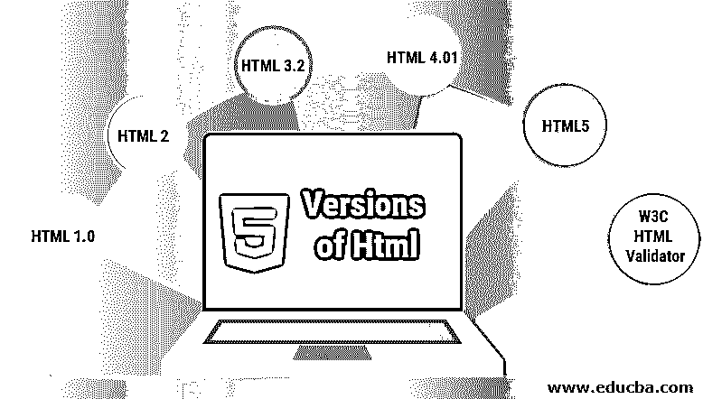

# Html 的版本

> 原文：<https://www.educba.com/versions-of-html/>

## Html 版本介绍

我们大多知道网站。网站只是网页的集合。为了创建任何网页，我们需要 HTML。HTML 是负责制作任何网页的元素。HTML 代表超文本标记语言。它是一种基本的标记语言，用于制作任何进一步构成网站的网页。HTML 从它形成的最初阶段已经进化了这么多。

让我们了解一下 HTML 的历史。

<small>网页开发、编程语言、软件测试&其他</small>

W3C 和 WHATWG 最初开发了 HTML。它最初开发于 1993 年。W3C 主要检查 Html 和其他东西的标准。自从最初发布以来，已经开发了很多版本的 Html。最初，它的版本是 1.0 或简单的 HTML。

### HTML 的不同版本

让我们详细看看 Html 各个版本的重要性

#### 1.HTML 1.0

*   HTML 的基本版本支持像文本控件和图像这样的基本元素。这是非常基础的 HTML 版本，对各种 HTML 元素的支持较少。它没有丰富的功能，如样式和其他与内容如何在浏览器中呈现相关的内容。
*   HTML 的初始版本不提供对表格、字体等的支持。，因为它为我们提供了最新版本。
*   我们还想讨论一下，在 HTML 2.0 之前，W3C 是不存在的；因此它没有显示 HTML 1 的细节。

#### 2.HTML 2

*   HTML 2.0 版本开发于 1995 年，其基本意图是改进 HTML 1.0 版本
*   现在开始开发一个标准，以便在不同的浏览器之间维护通用的规则和条例。HTML 2.0 在标记标签方面有了很大的改进。在 HTML 2.0 版本中，表单的概念开始生效。表单被开发出来了，但是它们仍然有基本的标签，比如文本框、按钮等等。
*   此外，这个表格是作为一个 HTML 标签出现的。现在，在 HTML 标记 2.0 中，浏览器也有了创建自己的特定于浏览器本身的标记层的概念。W3C 也成立了。W3C 的主要意图是在不同的 web 浏览器之间保持标准，以便这些浏览器以相似的方式理解和呈现 HTML 标签。

#### 3.HTML 3.2

*   它是 1997 年开发的。在 HTML 2.0 开发出来之后，HTML 的下一个版本是 3.2
*   在 HTML 3.2 版本中，HTML 标签得到了进一步的改进。值得注意的是，因为 W3C 标准维护，HTML 的更新版本是 3.2 而不是 3。
*   现在，HTML 3.2 对新的表单元素有了更好的支持。HTML 3.2 实现的另一个重要特性是支持 CSS。CSS 代表[级联样式表](https://www.educba.com/what-is-css/)。正是 CSS 提供了使 HTML 标签在浏览器上呈现时看起来更好的特性。CSS 有助于设计 HTML 元素的样式。
*   随着浏览器升级到 HTML 3.2，浏览器也支持[框架标签](https://www.educba.com/frame-tag-in-html/)，尽管 HTML 规范仍然不支持框架标记标签。

#### 4.HTML 4.01

*   它是在 1999 年开发的。它扩展了对级联样式表的支持。在 3.2 版本中，CSS 被嵌入到 HTML 页面中。所以，如果网站有各种各样的网页要套用每个网页的样式，我们就必须在每个网页上放置 CSS。因此出现了同一 CSS 块的重复。
*   为了解决这个问题，在 4.01 版本中出现了外部样式表的概念。在这个概念下，可以开发一个外部 CSS 文件，这个外部样式文件可以包含在 HTML 本身中。HTML 4.01 为 HTML 的更多新标签提供了支持。

#### 5.HTML5

*   这是 HTML 的最新版本。对于一个开发者来说，它可以在 2014 年使用。它提供了很多 HTML 标签支持。HTML5 提供了对新表单元素的支持，比如不同类型的输入元素；地理位置[支持标签](https://www.educba.com/html-geolocation/)等。

**让我们来看看添加到 HTML5** 中的一些标签

*   **Email—**新添加的 HTML5 标签是 Email 类型的输入元素。这是一个表单标签，虽然它也可以用在表单标签之外。这个标签检查输入值的有效性。它检查插入的值是否是有效的电子邮件。
*   **Password–**这是另一个表单标签，添加它是为了接收用户的密码。作为密码类型字段，该字段中的用户类型对用户不直接可见，而是由特殊符号表示。这些符号可以防止密码在浏览器上泄露。
*   **音频标签—**这是一个新的音频标签，在 [HTML5](https://www.educba.com/what-is-html5/) 中实现。此标签有助于向我们的网页添加音频。我们可以使用这个标签将音频片段嵌入到网页中。这个音频标签可以在网页上播放。
*   **语义标签—**语义标签也称为结构标签。结构标签是为 HTML 页面提供结构的标签。这有助于它将 HTML 页面分成不同的结构。这些结构组合成一个 HTML 页面本身，形成一个 HTML 网页。少数重要的 HTML 语义标签是图片标题、<页眉>、<页脚>
*   **Section 标签–**该标签用于对 HTML 页面中的一个部分进行语义化。一个[节标签](https://www.educba.com/html-section-tag/)代表网页上的一个节。

#### 6.W3C HTML 验证程序

HTML 验证器是一个基于 web 的工具，用于维护或检查一段 HTML 标记或 HTML 是否有效。HTML 验证器遵循 W3C 的标准来验证 HTML 页面。它遵循 W3C 标准。

### 结论

有很多版本的 HTML 正在开发中。从最初的 1.0 版本到最新的 5.2 版本，HTML 发展了很多。W3C 也维护了标准，这样所有的浏览器都有一个共同的标准可以遵循。HTML5 开发了很多新的标签和表单元素的支持。

### 推荐文章

这是 Html 版本的指南。这里我们讨论 HTML 的不同版本列表，以及它们各自的解释和版本 5 的一些标签。您也可以浏览我们推荐的其他文章，了解更多信息——

1.  [HTML 属性](https://www.educba.com/html-attributes/)
2.  [HTML 样式表](https://www.educba.com/html-style-sheets/)
3.  [HTML 框架](https://www.educba.com/html-frames/)
4.  [HTML 块](https://www.educba.com/html-blocks/)

