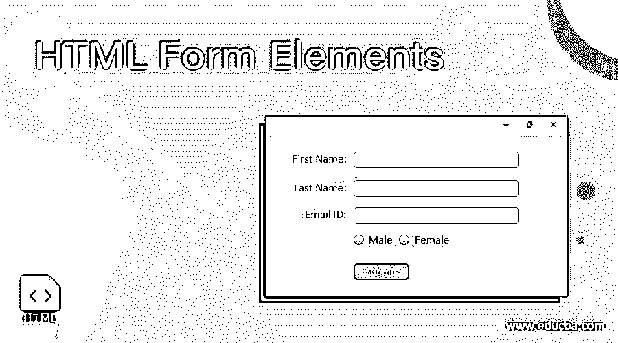
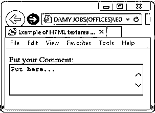

# HTML 表单元素

> 原文：<https://www.educba.com/html-form-elements/>




## HTML 表单元素介绍

在 Web 开发技术中(尤其是前端)，“HTML”是我们用来显示网页(我们在网站上看到的页面)的基本或主要标记语言。有时，在 HTML 页面中，除了其他内容显示，我们还需要接受一些用户输入(尤其是在动态网站中)。为了在 HTML 页面中获取用户输入，我们需要使用多个表单元素来正确地创建这些表单，在这些表单的帮助下，我们正确地获取用户输入并将这些输入(数据)放入后端的内部数据库中。现在，正如我们所知，HTML 代码是在各种标记元素(<>)下编写的，所以，基本上，“HTML 表单元素”是在“

<form>”标记内使用的那些元素，这些元素与其他标准和独特的属性一起，也给出了表单和结构，这让用户知道如何处理表单以及如何以结构化的方式进行处理。</form>

### 解释 HTML 表单元素**(包括语法和输出示例)**

因为有多个 HTML 表单元素来创建一个表单&以一种结构化的方式给表单一个合适的外观，下面逐一解释其中的一些。

<small>网页开发、编程语言、软件测试&其他</small>

| **SL 号** | **标签** | **含义/描述** |
|  One |  | 为用户输入定义 HTML 表单 |
|  Two | <input> | 定义输入控制 |
|  Three | <datalist></datalist> | 指定预定义选项列表 |
|  Four |  | 定义与组相关的元素 |
|  Five | <keygen> | 要定义安全输入 |
|  Six | <label></label> | 定义输入的标签 |
|  Seven |  | 为字段集定义标题 |
|  Eight |  |  定义一组相似的选项。 |
|  Nine |  |  定义下拉列表的选项。 |
| Ten |  | 要定义结果 |
| Eleven |  | 定义一个下拉列表。 |
| Twelve |  <textarea></p></td> <td width="375"><em> </em> <p>定义多行输入区域。</p></td> </tr> </tbody> </table> <div/> <div class="examplex"><strong>Note: </strong>Most of the HTML tag elements discussed here are for HTML5, the latest HTML language version. The tag element <keygen> is no longer supported in <a href="https://www.educba.com/what-is-html5/">HTML5</a>; it was actually used for the prior version of HTML.</div> <h3>语法和示例</h3> <p>下面讨论一些带有输出的 HTML 表单元素的语法和示例:</p> <h4>1.<form>“素”</form></h4> <p>该元素还可以包含许多其他元素，包括以下内容:</p> <ul> <li><input/></li> <li><output/></li> <li><label/></li> <li><select/></li> <li><button/></li> <li><option/></li> <li><textarea/></li> <li><optgroup/></li> <li><fieldset/></li> </ul> <p>带有输入和提交按钮的“<form>”柠檬示例:</form></p> <p><strong>语法:</strong></p> <pre><code class="language-html"><form action="/test_page.php" method="get"> Your Name: <input type="text" name="name"><br> <input type="submit" value="Submit"> </form></code></pre> <p><strong>代码:</strong></p> <pre><code class="language-html"><!DOCTYPE html> <html> <body> <form action="/test_page.php"> Your name: <input type="text" name="Name" value="Raju"><br> <input type="submit" value="Submit"> </form> </body> </html></code></pre> <p><strong>输出:</strong></p> <p>” element" width="286" height="164" data-lazy-src="https://cdn.educba.com/academy/wp-content/uploads/2019/08/Output-1.png" data-original-src="https://cdn.educba.com/academy/wp-content/uploads/2019/08/Output-1.png"/></p> <h4>2.<input/>“素”</h4> <p><strong> </strong>该元素是内嵌元素，属于 form-element 组。</p> <p><strong>语法:</strong></p> <pre><code class="language-html"><form action="/test_page.php"> Input name: <input type="text" name="name"><br> Input age: <input type="text" name="age"><br> <input type="submit" value="Submit"> </form></code></pre> <p><strong>代码:</strong></p> <pre><code class="language-html"><!DOCTYPE html> <html> <body> <form action="/action_page.php"> Input name: <input type="text" name="name" value=""><br> Input age: <input type="text" name="age" value=""><br> <input type="submit" value="Submit"> </form> </body> </html></code></pre> <p><strong>输出:</strong></p> <p>” element output" width="293" height="171" data-lazy-src="https://cdn.educba.com/academy/wp-content/uploads/2019/08/Output-2.png" data-original-src="https://cdn.educba.com/academy/wp-content/uploads/2019/08/Output-2.png"/></p><strong>       </strong> <h4>3.<datalist>“素”</datalist></h4> <p>它通常为<input/>元素指定一个预定义的输入列表，用户可以从预定义的列表中选择任何选项。</p> <p><strong>语法:</strong></p> <pre><code class="language-html"><input list="fruits"> <datalist id="fruits"> <option value="Mango"> <option value="Apple"> <option value="Banana"> <option value="Pomegranate"> <option value="Pineapple"> </datalist></code></pre> <p><strong>代码:</strong></p> <pre><code class="language-html"><! DOCTYPE html> <html> <body> <form action="/test_page.php" method="get"> <input list="fruits" name="fruit"> <datalist id="fruits"> <option value="Mango"> <option value="Apple"> <option value="Banana"> <option value="Pomegranate"> <option value="Pineapple"> </datalist> <input type="submit"> </form> </body> </html></code></pre> <p><strong>输出:</strong></p> <p>” element output" width="296" height="191" data-lazy-src="https://cdn.educba.com/academy/wp-content/uploads/2019/08/Output-3.png" data-original-src="https://cdn.educba.com/academy/wp-content/uploads/2019/08/Output-3.png"/></p> <h4>4.<fieldset>“素”</fieldset></h4> <p>这个元素主要用于将表单中的相关元素分组，并在相似的元素周围画一个方框。</p> <p><strong>语法:</strong></p> <pre><code class="language-html"><form> <fieldset> <legend>Celebrity:</legend> Name: <input type="text"><br> Phone: <input type="number"><br> Age: <input type="text"> </fieldset> </form></code></pre> <p><strong>代码:</strong></p><div class="ai-viewports ai-viewport-2 ai-viewport-3 ai-insert-23-35868281" style="margin: 8px 0; clear: both;" data-insertion="prepend" data-selector=".ai-insert-23-35868281" data-insertion-no-dbg="" data-code="PGRpdiBjbGFzcz0nY29kZS1ibG9jayBjb2RlLWJsb2NrLTIzJyBzdHlsZT0nbWFyZ2luOiA4cHggMDsgY2xlYXI6IGJvdGg7Jz4KPGlucyBjbGFzcz0iYWRzYnlnb29nbGUiCiAgICAgc3R5bGU9ImRpc3BsYXk6YmxvY2s7IHRleHQtYWxpZ246Y2VudGVyOyIKICAgICBkYXRhLWFkLWxheW91dD0iaW4tYXJ0aWNsZSIKICAgICBkYXRhLWFkLWZvcm1hdD0iZmx1aWQiCiAgICAgZGF0YS1hZC1jbGllbnQ9ImNhLXB1Yi04MzQ5MDgzMjc2ODM5Nzg5IgogICAgIGRhdGEtYWQtc2xvdD0iMjQ2OTk2NDM2OCI+PC9pbnM+CjxzY3JpcHQ+CiAgICAgKGFkc2J5Z29vZ2xlID0gd2luZG93LmFkc2J5Z29vZ2xlIHx8IFtdKS5wdXNoKHt9KTsKPC9zY3JpcHQ+PC9kaXY+Cg==" data-block="23"/> <pre><code class="language-html"><!DOCTYPE html> <html> <body> <form> <fieldset> <legend>Celebrity:</legend> Name: <input type="text"><br> Phone: <input type="number"><br> Age: <input type="text"> </fieldset> </form> </body> </html></code></pre> <p><strong>输出:</strong></p> <p>” element output" width="297" height="193" data-lazy-src="https://cdn.educba.com/academy/wp-content/uploads/2019/08/Output-4.png" data-original-src="https://cdn.educba.com/academy/wp-content/uploads/2019/08/Output-4.png"/></p> <h4>5.<keygen>“素”</keygen></h4> <p>此元素可能位于表单之外，但它可能仍然是表单的一部分。通常，该元素用于指定一个或多个表单。这个元素在<a href="https://www.educba.com/html5-new-elements/"> HTML5 </a>版本中是新使用的，用于生成加密密钥，在基于 HTML 的网站中通过表单传递加密数据。</p> <p><strong>语法:</strong></p> <p><code><keygen form="form_id"></code></p> <p><strong>代码:</strong></p> <pre><code class="language-html"><!DOCTYPE html> <html> <body> <form action="/test_page.php" method="get" id="secureform"> Username: <input type="text" name="user_name"> <input type="submit"> </form> <p>The below mentioned keygen field is outside of the form, but it's still a part of the above form.</p> Encryption: <keygen name="security" form="secureform"> </body> </html></code></pre> <p><strong>输出:</strong></p> <p>” element output" width="295" height="252" data-lazy-src="https://cdn.educba.com/academy/wp-content/uploads/2019/08/Output-5.png" data-original-src="https://cdn.educba.com/academy/wp-content/uploads/2019/08/Output-5.png"/></p> <h4>6.<label>“素”</label></h4> <p>这个元素基本上为输入表单提供了一个名称，让用户明白它应该是什么输入数据。它充当用户的指示器。</p> <p><strong>语法:</strong></p> <pre><code class="language-html"><label for="control id" > ... </label></code></pre> <p><strong>代码:</strong></p> <pre><code class="language-html"><!DOCTYPE html> <head> <title>Example of HTML label tag</title> </head> <body> <form> <input type="radio" name="gender" value="boy" id="boy"> <label for="boy">Boy</label> <input type="radio" name="gender" value="girl" id="girl"> <label for="girl">Girl</label> </form> </body> </html></code></pre> <p><strong>输出:</strong></p> <p>” element output" width="292" height="220" data-lazy-src="https://cdn.educba.com/academy/wp-content/uploads/2019/08/Output-6.png" data-original-src="https://cdn.educba.com/academy/wp-content/uploads/2019/08/Output-6.png"/></p> <h4>7.<legend>“素”</legend></h4> <p>这个元素实际上定义了一个<fieldset>元素的标题。它是另一个元素的支持元素，是组元素的一部分。</fieldset></p> <p><strong>语法:</strong></p> <pre><code class="language-html"><fieldset> <legend>Celebrity:</legend> Name: <input type="text"><br> Phone: <input type="number"><br> Age: <input type="text"> </fieldset></code></pre> <p><strong>代码:</strong></p> <pre><code class="language-html"><!DOCTYPE html> <head> <title>Example of HTML legend tag</title> </head> <body> <form> <fieldset> <legend>Celebrity:</legend> Name: <input type="text"><br> Phone: <input type="number"><br> Age: <input type="text"> </fieldset> </form> </body> </html></code></pre> <p><strong>输出:</strong></p> <p>” element output" width="292" height="217" data-lazy-src="https://cdn.educba.com/academy/wp-content/uploads/2019/08/Output-7.png" data-original-src="https://cdn.educba.com/academy/wp-content/uploads/2019/08/Output-7.png"/></p> <h4>8.<optgroup>“素”</optgroup></h4> <p>这个元素是一个组相关的元素，用于 HTML 表单的下拉列表中的选项。它有助于用户轻松处理长列表。</p> <p><strong>语法:</strong></p> <pre><code class="language-html"><select> <optgroup label="Kawasaki Bikes"> <option value="ninja300">Ninja 300</option> <option value="ninja450">Ninja 450</option> </optgroup> <optgroup label="Bajaj Bikes"> <option value="pulsar200">Pulsar 200</option> <option value="pulsar150">Pulsar 150</option> </optgroup> </select></code></pre> <p><strong>代号:</strong> <strong> </strong></p> <pre><code class="language-html"><!DOCTYPE html> <html> <head> <title>Example of HTML legend tag</title> </head> <body> <select> <optgroup label="Kawasaki Bikes"> <option value="ninja300">Ninja 300</option> <option value="ninja450">Ninja 450</option> </optgroup> <optgroup label="Bajaj Bikes"> <option value="pulsar200">Pulsar 200</option> <option value="pulsar150">Pulsar 150</option> </optgroup> </select> </body> </html></code></pre> <p><strong>输出:</strong></p> <p>” element output" width="252" height="221" data-lazy-src="https://cdn.educba.com/academy/wp-content/uploads/2019/08/Output-8.png" data-original-src="https://cdn.educba.com/academy/wp-content/uploads/2019/08/Output-8.png"/></p><div class="ai-viewports ai-viewport-2 ai-viewport-3 ai-insert-24-42689801" style="margin: 8px 0; clear: both;" data-insertion="prepend" data-selector=".ai-insert-24-42689801" data-insertion-no-dbg="" data-code="PGRpdiBjbGFzcz0nY29kZS1ibG9jayBjb2RlLWJsb2NrLTI0JyBzdHlsZT0nbWFyZ2luOiA4cHggMDsgY2xlYXI6IGJvdGg7Jz4KPGlucyBjbGFzcz0iYWRzYnlnb29nbGUiCiAgICAgc3R5bGU9ImRpc3BsYXk6YmxvY2s7IHRleHQtYWxpZ246Y2VudGVyOyIKICAgICBkYXRhLWFkLWxheW91dD0iaW4tYXJ0aWNsZSIKICAgICBkYXRhLWFkLWZvcm1hdD0iZmx1aWQiCiAgICAgZGF0YS1hZC1jbGllbnQ9ImNhLXB1Yi04MzQ5MDgzMjc2ODM5Nzg5IgogICAgIGRhdGEtYWQtc2xvdD0iNzcxMjkyMTg3NSI+PC9pbnM+CjxzY3JpcHQ+CiAgICAgKGFkc2J5Z29vZ2xlID0gd2luZG93LmFkc2J5Z29vZ2xlIHx8IFtdKS5wdXNoKHt9KTsKPC9zY3JpcHQ+PC9kaXY+Cg==" data-block="24"/> <h4>9.<option>“素”</option></h4> <p>该元素用于表示<select>元素下下拉列表中的一个选项；<a href="https://www.educba.com/dropdown-list-in-html/">下拉列表</a>必须包含至少一个选项。</select></p> <p><strong>语法:</strong></p> <pre><code class="language-html"><option value="option-value"> ... </option></code></pre> <p><strong>代码:</strong></p> <pre><code class="language-html"><!DOCTYPE html> <html> <head> <title>Example of HTML option tag</title> </head> <body> <form> <select> <option value="Bikes"> Bikes </option> <option value="Cars"> Cars </option> <option value="Buses"> Buses </option> </select> </form> </body> </html></code></pre> <p><strong>输出:</strong></p> <p>” element output" width="293" height="223" data-lazy-src="https://cdn.educba.com/academy/wp-content/uploads/2019/08/Output-9.png" data-original-src="https://cdn.educba.com/academy/wp-content/uploads/2019/08/Output-9.png"/></p> <h4>10.<output>“素”</output></h4> <p>此元素主要用于显示计算的输出(例如，在脚本计算中)。</p> <p><strong>语法:</strong></p> <pre><code class="language-html"><output> ... </output></code></pre> <p><strong>代码:</strong></p> <pre><code class="language-html"><!DOCTYPE html> <html> <head> <title>Example of HTML output Tag</title> </head> <body> <form oninput="result.value=parseInt(x.value)+parseInt(y.value)"> <input type="range" id="x" value="50"> + <input type="number" id="y" value="100"> = <output name="result" for="x y"></output> </form> </body> </html></code></pre> <p><strong>输出:</strong></p> <p></p> <h4>11.<select>“素”</select></h4> <p>这个元素用于从一个表单的列表中进行选择。</p> <p><strong>语法:</strong></p> <pre><code class="language-html"><select> <option value="Bike">Bike</option> <option value="Car">Car</option> <option value="Bus">Bus</option> </select></code></pre> <p><strong>代码:</strong></p> <pre><code class="language-html"><!DOCTYPE html> <html> <head> <title>Example of HTML select Tag</title> </head> <body> <form> <select> <option value="Bike">Bike</option> <option value="Car">Car</option> <option value="Bus">Bus</option> </select> </form> </body> </html></code></pre> <p><strong>输出:</strong></p> <p></p> <h4>12.<textarea>“素”</textarea>此元素用于定义多行文本输入(如地址)。**语法:**

```
<form>
<p>Put your Comment:
<textarea cols="50" rows="6">Put here...</textarea>
</p>
</form>
```

**代码:**

```
<!DOCTYPE html>
<html>
<head>
<title>Example of HTML textarea Tag</title>
</head>
<body>
<form>
<p>Put your Comment:
<textarea cols="30" rows="4">Put here...</textarea>
</p>
</form>
</body>
</html> 
```

**输出:**


### 结论

有如此多的 HTML 表单元素可用；在本文中，我们讨论了一些基本的或原生的表单元素。它帮助我们创建适当的和功能性的 HTML 表单。需要注意的一点是，大多数 HTML 表单元素需要包含一些属性。一些元素相互依赖，必须一起编码。并非所有浏览器都显示已被否决的元素。

### 推荐文章

这是 HTML 表单元素的指南。在这里，我们讨论 HTML 表单元素的基本概念示例以及代码实现和输出。您也可以浏览我们推荐的其他文章，了解更多信息——

1.  [Html 版本](https://www.educba.com/versions-of-html/)
2.  [HTML 的优势](https://www.educba.com/advantages-of-html/)
3.  [HTML 块](https://www.educba.com/html-blocks/)
4.  [HTML 框架](https://www.educba.com/html-frames/)


 |