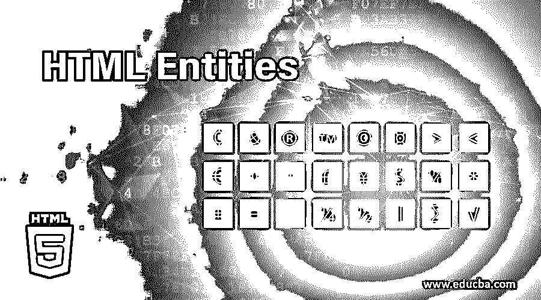
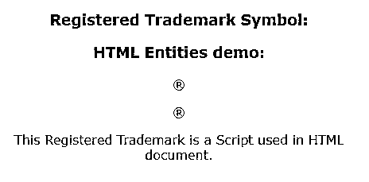

# HTML 实体

> 原文：<https://www.educba.com/html-entities/>




## HTML 实体简介

这篇文章让我们学习如何定义 HTML 实体来在浏览器上显示特殊字符，并且它们是区分大小写的。HTML 实体也称为字符实体引用，它有助于将各种字符包含到 HTML 文档中，就像所有的符号都被声明为后跟&符号的实体一样。HTML 标记中常用字符或保留字符小于/大于符号()；当浏览器识别这个字符时，它会自动解释(理解为它们是标记语言)。Html 实体的主要好处是易于使用，记住，它取代了键盘上没有的字符。这里我们将讨论不同类型的实体和基本示例来说明功能。

### HTML 实体的语法

HTML 实体给出不同种类的字符，指定图标、数学运算符，甚至复杂的几何形状。

<small>网页开发、编程语言、软件测试&其他</small>

**表示:** HTML 实体使用带(#)磅字符的&符号(&)声明，最后以分号结束；这三个要素对于避免并发症非常重要。

****语法:****

******1。使用角色实体******

 **```
& [Entity name character];
```

**2。使用编号**

```
&#Entity no;
```

**解释:**名字比数字好记。并非所有的浏览器都与保留名称兼容，但是实体编号在浏览器上是很好的。不支持此符号的浏览器显示为方框。Html 实体在这个领域被广泛使用，如不同的外语(欧洲语言)、标点符号、希腊字符和数学符号，最后是形状和箭头。实体代码对于避免难以查明的奇怪错误非常重要。HTML 实体进行组织，然后是列表，如带有使用 Unicode 的重音符号的字母/符号、语音、外国字符、货币、其他符号，如智能引号(这些带有直长破折号)。

### 表格格式的不同 HTML 实体

让我们看看不同的人物实体。

#### 1.HTML 字符实体

以下是最常用实体的实体代码，如通用货币。

| **字符** | **实体名称** | **实体编号** | **解释/描述** |
| ¢ | ¢ | ¢ ; | 它表示货币的分符号 |
| “&”号 | & | & ; | 它表示常用的&符号 |
| ® | ® | ® ; | 给出注册符号 |
| ™ | &贸易 | ™ ; | 特征 |
| © | © | © ; | 给出版权符号 |
| ¤ | &current; | ¤ ; | 它定义了一个通用的货币符号 |
| > | > | > ; | 它表示大于号 |
| < | < | < ; | 它表示小于号 |
|  |   |   ; | 它定义了不间断空格 |
| € | € | € ; | 它定义了英国的欧元符号 |
| " | " | " ; | 在给定文本中使用双引号 |
| ' | ' | ' ; | 在句子中包含撇号 |
| £ | £ | £ ; | 指定的英镑货币 |
| ¥ | ¥ | ¥ ; | 指定的日本货币符号 |
| 美元 | &dollar; | $ ; | 指定美元货币 |

#### 2.作为字符实体的数学运算符

在 HTML 代码中生成数学符号。

| % | &percnt; | % ; | 给出要计算的百分比符号 |
| ( |  | ( ; | 用作左括号 |
| ) |  | ) ; | 用作右括号 |
| * |  | * ; | 星号 |
| ÷ | ÷或&div; | ÷ ; | 包括股息单 |
| + |  | + ; | 指定的加号 |
| , |  | , ; | 指定逗号 |
| ± | ± | ± ; | 表示加号或减号 |
| – |  | - ; | 用作连字符 |
| . |  | . ; | 时期 |
| ¦ | ¦ | ¦ ; | 断开的竖线 |
| \ | &bsol; | \ ; | 定义绝对值 |
| ¼ | ¼ | ¼ ; | 分数部分 |
| ½ | ½ | ½ ; | 分数的 1/2 部分 |
| ] | &rbrack; | ] ; | 降级括号 |
| ∑ | &Sum; | ∑ ; | 求和计算中的缺陷 |
| √ | & radic&Sqrt; | √ ; | 给出平方根结果 |
| ∞ | ∞ | ∞ ; | 给出无穷大值 |
| 你是谁 | ∏ | ∏ ; | n 阵列乘积 |
| 你是谁 | ⊂ | ⊂ ; | 降级的子集 |
| -好的 | ⊃ | ⊃ ; | 集合论中的超集降级 |

#### 3.箭头符号

以下是不同的箭头符号。

| ← | ← | ← ; | 向左箭头 |
| -好的 | ↑ | ↑ ; | 向上箭头 |
| → | → | → ; | 向右箭头 |
| ↓ | ↓ | ↓ ; | 向下箭头 |
| ↔ | ↔ | ↔ ; | 左右箭头 |

#### 4.拉丁实体或重音字母

重音类型使用 Unicode 部分发出此列表。数字指定数字位置。有些可能在 Netscape 等较旧的浏览器中不受支持。

|  ¡ | ¡ | ; | 倒置感叹号 |
|  ¢ | ¢ | ; | 分符号 |
|  § | § | ; | 章节符号 |
| 敬你 | À | 至； | 大写 a，带有重音符 |
| 哦，是吗 | á | á ; | 大写字母 a，带有重音符 |
| È | È | È ; | 大写 E |
| Ð | &ETH | Ð ; | 具体情况，冰岛 |
| µ | µ | µ ; | 微型标志 |
| ñ | &ntildle | ñ ; | 指定带颚化符的小写字母“n” |

#### 5.修饰字符

HTML 实体的修饰字符如下所示。

| -什么 | ˆ |  | 修饰字母 |
| ~ | ˜ |  | 指定了一个小波浪号 |

#### 6.HTML 中的其他实体

HTML 中的其他实体如下所示。

|  | &ensp | ; | En 空间 |
|  | &emsp | ; | em 空间 |
| † | † | † ; | 降级匕首 |
| ‡ | &双匕首； | ‡ ; | 降级双匕首 |
| š | Š | Š ; | 指定上面有一个圆号的小号 |

在接下来的章节中，我们将看看 Html 文档中的实体以及我们在浏览器中看到的输出。

### HTML 实体的例子

下面是 HTML 实体的不同例子。

#### 示例# 1–不间断空格

单词之间的额外空间通过使用不间断实体给出。下面是句子间不中断空格的实现。包括一个单独的宽空间。

**代码:**

```
<!DOCTYPE html>
<html>
<head>
<title> Non-Breaking Space Example</title>
</head>
<body>
<h3>Non-Breaking Space Example</h3>
<p> <p> <b>Life is So Beautiful, must enjoy
To the peak!</b></p></p>
</body>
</html>
```

**输出:**


#### 示例# 2–在行输出中包含引号

**代码:**

```
<!DOCTYPE html>
<html>
<head>
<title>HTML Entities Demo</title>
</head>
<body>
<div id = "John &quot &amp Harry ">
</body>
</html>
```

**输出:**


#### 示例 3–使用 CSS 样式的商标符号

**代码:**

```
<!DOCTYPE html>
<html>
<head>
<title>Web Title</title>
<style>
body {
background-color: yellow;
text-align: center;
color: green;
font-family: verdana, Helvetica;
}
</style>
</head>
<body>
<h3> Registered Trademark Symbol: </h3> <h3>HTML Entities demo: </h3> <p>®</p> <p>®</p> <p> This Registered Trademark is a Script used in HTML document. </p>
</body>
</html>
```

**输出:**




#### 示例 4–使用小于和大于符号

**代码:**

```
<!DOCTYPE html>
<html>
<body>
<h2>I want to display &lt;br&gt; tag</h2>
<p>I want to display &lt;i&gt; tag</p>
</body>
</html>
```

**输出:**


### 结论

最后，我们理解了 Html 文档中实现的特殊字符的含义。在某些情况下，网页需要这些特殊的符号。所有这些实体都可以在网站上用来显示角色。我们的系统键盘支持一些技术和货币符号，使用这些符号显示在 HTML 页面上。

### 推荐文章

这是一个 HTML 实体的指南。在这里，我们以表格的形式讨论介绍和不同的 HTML 实体，以及示例和代码实现。您也可以阅读以下文章，了解更多信息——

1.  [HTML 中的引号](https://www.educba.com/quotation-tag-in-html/)
2.  [HTML 中的 Iframes 标签](https://www.educba.com/iframes-in-html/)
3.  [HTML 居中对齐](https://www.educba.com/html-align-center/)
4.  [HTML 显示块](https://www.educba.com/html-display-block/)


**