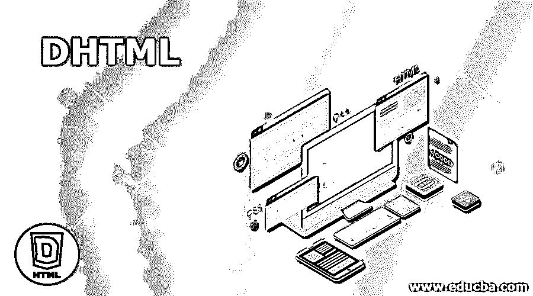

# 动态超文本链接标记语言

> 原文：<https://www.educba.com/dhtml/>

## DHTML 简介

DHTML 代表动态超文本标记语言，即动态 HTML。d HTML 和 HTML 并不互相竞争，但是可以说 DHTML 是 HTML 的扩展版本，使用了不同的 web 技术。HTML 帮助构建静态网页，而 DHTML 允许设计具有更多交互性的动态网页。它允许设计一个直观的，动态的用户界面以及动画。它不是一种特定的技术或标准，但它是一个概念，其中多种其他技术一起使用来实现一个结果。DHTML 中使用的这些不同技术被称为组件。

### 为什么我们需要 DHTML？

微软在 1997 年发布 Internet Explorer 时首次引入了 DHTML 应用程序。如果没有 DHTML，过去只能使用静态网页。使用静态网页有一些缺点和不足。用户无法与静态页面进行交互。每当用户需要一些改变时，页面需要刷新。如果不重新加载，就不能在网页上执行任何动态操作。然而，DHTML 提供了实现所有这些的能力。

<small>网页开发、编程语言、软件测试&其他</small>

DHTML 允许在客户端动态更改 web 组件，而无需重新加载网页。它为用户提供了直接交互和更改值的灵活性。DHTML 允许我们改变或更改值和函数，以便根据用户的不同来执行不同的操作。DHTML 是一个非常宽泛的概念；它将根据不同的用户、加载事件或用户提供的值来加载网页。

### DHTML 组件

正如介绍中所说，DHTML 一起使用不同的 web 技术，这些被称为 DHTML 组件。DHTML 使用以下组件的组合来使网站交互并在网站中实现动画。

*   **HTML-** 静态标记语言
*   **JavaScript-** 脚本语言
*   **CSS-** 样式表语言
*   **DOM-** 文档对象模型

#### 1.超文本标记语言

HTML 是一种客户端标记语言，用于设计静态网页。HTML 是 DHTML 的核心组件。它定义了要在网页上显示的网页组件。HTML 通过使用不同的元素和标签来定义组件的结构。然而，HTML 只允许设计静态网页；用户不能在客户端动态改变元素的值。但是，HTML 仍然是构建网站所需的基本组件。

#### 2.Java Script 语言

JavaScript 是一种客户端脚本语言，用于将静态网页动态化。JavaScript 允许根据用户需要更改变量值、改变函数和执行各种活动。JavaScript 允许在将决定发送到服务器之前，在客户端做出决定，从而让用户节省时间。我们可以通过使用 JavaScript 来设计网页的行为。JavaScript 允许在网页上实现复杂的功能和特性。它允许我们动态更新内容，制作一些动画，等等。

#### 3.半铸钢ˌ钢性铸铁(Cast Semi-Steel)

就像 HTML 是用来构建网页的，CSS 是用来设计网页和实现样式的。CSS 代表层叠样式表，是设计网页的语言。CSS 允许设计布局和其他样式来定义元素在网页上的显示方式。同一个 CSS 文件可以在多个网页上使用，这样可以节省工作量和时间。CSS 支持 JavaScript 和 DOM。通过使用这种组合，我们可以动态地改变网页的样式和布局。

#### 4.数字正射影像图

DOM 代表文档对象模型。它定义了网页上元素的逻辑结构，并提供了访问和操作元素的标准。DOM 表示网页上的主要对象和元素，以及它们之间的关系。使用 DOM、JavaScript 和 CSS，我们可以动态地改变网页的样式、结构和内容。DOM 允许我们直接精确地访问元素。

### DHTML 功能

*   DHTML 允许轻松简单地创建动态网页。
*   DHTML 提供了动态样式，通过它可以动态地改变元素的外观和样式。
*   使用 DHTML 可以改变网页的字体、颜色、风格、内容。
*   可以使用 DHTML 创建动画。
*   用户可以为网页创建动态字体。
*   DHTML 使用低带宽效果来增强网页功能。

### DHTML 的应用

DHTML 允许动态地设计网页，可以改变样式、内容、字体和很多东西，比如创建动画。用户可以使用这些功能以最具创造性的方式设计网页，并设计一些 web 应用程序或一些游戏以及任何现成的网页功能。

### 优点和缺点

以下是下面提到的优点和缺点

#### 优势

以下是提到的优点:

*   与静态网页相比，DHTML 允许创建更多的交互式动态网页。
*   与 Flash 和 Shockwave 等其他多媒体软件相比，DHTML 具有紧凑的文件大小，可以在客户机上快速下载，从而节省带宽和时间。
*   可以在客户机上改变内容，而不需要重新加载或刷新网页。
*   在今天，几乎所有的浏览器都支持它，并且不需要运行任何额外的软件。
*   它是高效的，并且文件是可维护的。因此，网页设计者可以有更多的灵活性。

#### 不足之处

下面是提到的缺点:

*   由于 DHTML 结合了多种技术，网页设计者需要对它们进行全面的控制。
*   它需要照顾一个网页在不同的浏览器中正常工作。
*   使用 DHTML 时，浏览器兼容性检查是必须的。不能保证 DHTML 在每个平台上都有相同的表现。

### 结论

DHTML 是网页设计中的一个概念，其中多种技术如 HTML、CSS、JavaScript 和 DOM 可以结合起来得到最终的结果。DHTML 允许构建不同风格的动态网页。它还允许在网页上创建动画。

### 推荐文章

这是一个 DHTML 的指南。在这里，我们讨论 DHTML 的介绍以及组件，需求，特性，应用，优点和缺点。您也可以看看以下文章，了解更多信息–

1.  [什么是 HTML](https://www.educba.com/what-is-html/)
2.  [CSS 溢出](https://www.educba.com/css-overflow/)
3.  [DOCTYPE HTML](https://www.educba.com/doctype-html/)
4.  [JavaScript DOM](https://www.educba.com/javascript-dom/)

