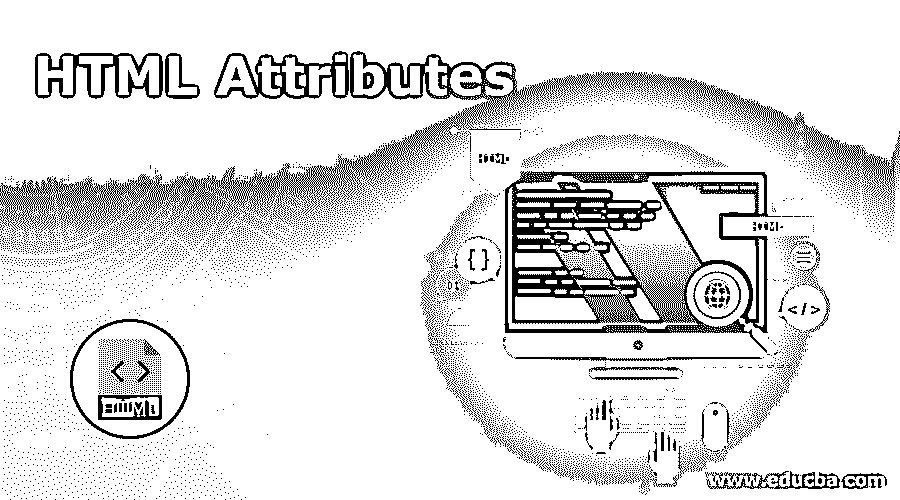

# HTML 属性

> 原文：<https://www.educba.com/html-attributes/>




## HTML 属性简介

HTML 属性可以说是在开始标签中使用的特殊单词，负责控制元素的行为。它们是 HTML 元素类型的修饰符。这个修改器可以做两个工作。它既可以修改元素的默认功能，也可以为任何没有它们就无法正常工作的元素提供功能。从语法上讲，HTML 开始标记中添加了一个属性。已经确定了不同类型的属性。

这些属性包括必需属性、可选属性、标准属性和事件属性。必需属性是特定元素类型所需的属性，以便函数正确工作。可选属性可用于修改元素类型的默认功能。大量元素类型支持标准属性，事件属性可以导致元素类型可以指定在特定环境下运行的脚本。这些属性通常以名称-值对的形式出现，并用“=”(等号)分隔。它们被写在元素名称之后的元素开始标记中。

<small>网页开发、编程语言、软件测试&其他</small>

### 不同的 HTML 属性

下面给出了不同的 HTML 属性及其详细工作原理:

#### 1.核心属性

有四个主要使用的核心属性。

*   ID: 这个 HTML 属性可以很容易地用来唯一地标识 HTML 页面中的元素。当一个元素带有一个 id 属性作为唯一标识符，从而可以识别该元素及其内容时，可以使用用户 id；当一个网页中有两个同名元素时，也可以使用用户 id。ID 属性有助于轻松识别同名元素之间的差异。
*   **Title 属性:**这个属性为一个特定的元素给出一个建议的标题。这取决于运营商的行为方式，尽管当光标经过元素时，它通常不会显示为工具提示，或者当加载元素时，它必须显示。它也用来解释鼠标悬停在其上的元素。不同的元素会有不同的行为，一般来说，它的值会在加载或者鼠标指针悬停在它上面时显示。
*   **Class 属性:**这个属性的关联是通过样式表的一个元素来完成的。用户需要指定元素的类别。在学习[层叠样式表](https://www.educba.com/cheat-sheet-css3/)时，可以学习更多关于这个属性的知识。这里的值也可以是用空格分隔的类名列表。例如:class = " class name 1 class name 2 class name 3 "
*   **Style 属性:**该属性允许您在任何元素中指定级联样式表规则。它可以为 HTML 元素提供各种级联样式表效果，如增加字体大小。它还可以更改字体系列和颜色。

#### 2.国际化属性

*   **Dir:**Dir 属性帮助你向浏览器指出文本应该遵循的方向。这个属性通常有两个值。这些可以是 LTR 和 RTL。LTR 表示从左到右，这是默认值，而 RTL 表示从右到左。当这个属性在< html >标签中使用时，它决定了文本在整个文档中应该如何表示。它还可以用来控制文本的方向，而不仅仅是标记的内容。
*   **Lang 属性:**该属性有助于展示文档中使用的主要语言。这个属性可以保存在 HTML 中，这样它就可以向后兼容 HTML 的早期版本。在新的 [XHTML](https://www.educba.com/what-is-xhtml/) 文档中，它也可以被 XML: lang 属性替换。lang 属性的值是 ISO-639 标准，有两个字符的语言代码。为了访问应用程序和不同的搜索引擎，声明语言是很重要的。
*   **XML-Lang 属性:**这个属性应该是 Lang 属性的替换。如前所述，XML-lang 属性的值必须包含国家代码。

#### 3.类属性

*   **Align 属性:**当您希望让页面的某些元素由您支配时，这个属性很有用。您可以将对齐方式更改为左侧、右侧或页面中央。所有元素的默认对齐方式都设置为左侧。这可以通过使用 align 属性来更改。
*   **Src 属性:**如果用户需要在网页中插入图片，我们需要使用带有 Src 属性的< img >标签。我们可以将图像的地址指定为双引号内的属性值。您可以使用下面的 src 属性在网页上包含图像。

**代码:**

```
<html>
<head>
<title>src Attribute</title>
</head>
<body>

</body>
</html> 
```

*   **Alt 属性:**如果主属性是< img >标签，而该标签无法显示分配给它的原始值，则该属性用作替代标签，可用于显示某些内容。这可以向在编码端使用图像的开发人员描述图像。如果主图像失败，那么可以使用替代图像来显示。
*   **宽度和高度属性:**该属性可用于调整图像的高度和宽度。

**举例:**

**代码:**

```
<html>
<head>
<title>Width and Height</title>
</head>
<body>

</body>
</html>
```

*   **Href 属性:**当用户想要将一个特定的链接指向任何地址时，使用这个属性。这个属性和<标签一起使用。当链接被放置在 href 属性中时，它被链接到显示在< a >标签中的文本。当用户点击这个文本时，用户将被重定向到链接的地址。默认选项是在同一个选项卡中打开此页面。如果您使用目标属性，那么您可以将其值设置为 _blank。这将根据您的浏览器配置重定向到另一个选项卡或另一个窗口。

#### 4.数据属性

HTML 还提供自定义数据属性，帮助您在 HTML 标签中添加与您相关的信息。这些不是特定于 HTML5 的，可以在所有 HTML 元素上使用。data -*属性帮助我们定制我们自己的数据属性；它可以将数据私下存储到页面或应用程序中。

为了定制，数据被分成两部分:

*   **属性名:**至少有一个字符长，不能有任何大写字母。此名称也可以使用“data-”作为前缀。
*   **属性值:**属性值可以是任意字符串。

数据属性的语法如下:

```
<li data-book-author="Rabindra Nath Tagore"> Gitanjali </li>
```

#### 5.DOM 属性特性

要获得 NamedNodeMap 对象，应该使用 HTML DOM 中的属性特性。它将返回节点属性组。NamedNodeMap 也表示属性对象的集合，它可以通过索引号来访问。这个索引号从 0 开始。使用它的语法是 node.attributes

返回的值是节点集合中的 NamedNodeMap 对象。如果用户使用的是 Internet Explorer 8 或任何早期版本，则 attributes 属性将返回任何元素的所有可能属性，这可能会导致比预期更多的值。

**举例:**

**代码:**

```
<!DOCTYPE html>
<html>
<head>
<title>
HTML DOM attributes Property
</title>
</head>
<body>
<h2>
HTML DOM attributes Property
</h2>
<button id = "CBA" onclick = "myeduCBA()">
Click Here!
</button>
<br><br>

Button element attributes:


<script>
function myeduCBA() {
// It returns the number of nodes
var cba = document.getElementById("CBA").attributes.length;
// Display the number of nodes
document.getElementById("sudo").innerHTML = cba;
}
</script>
</body>
</html>
The output for above program will be
Button element attributes: 2
```

#### 6.全局属性

HTML 还提供了可以用于任何 HTML 元素的全局属性。

*   **Accesskey:** 指定激活或聚焦任何元素的快捷键。
*   **Translate:** 如果使用该属性，则指定是否要翻译元素的内容。
*   **Class:** 它为一个元素指定一个或多个类名。
*   **Title:** 这个属性指定了一个元素的额外信息。
*   **Contenteditable:** 为了指定内容是否可编辑，可以使用这个属性。
*   **Tabindex:** 它指定了一个元素的跳转顺序。
*   **Dir:** 指定一个元素的任何内容的文本方向。
*   **拼写检查:**用户可以明确指定他们是否必须检查拼写和语法。
*   **可拖动:**指定一个元素是否可以拖动。
*   **Dropzone:** 指定拖放时是否复制、移动或链接被拖动的数据。

#### 7.事件属性

HTML 有能力在某些事件发生时触发动作。

*   **Onload:** 它在页面完成加载后触发。
*   **Onmessage:** 这可以说是触发消息时运行的脚本。
*   **Onstorage:** 这是一个在 web 存储区域更新时运行的脚本。
*   **Onerror:** 该脚本在发生错误时运行。
*   当用户可以离开页面时，可以使用这个脚本。

#### 8.表单事件属性

HTML 表单中的动作触发这些事件。

*   **Onblur:** 一旦元素失去焦点就会被触发。
*   **Onchange:** 一个元素的值发生变化就触发。
*   **Oncontextmenu:** 当上下文菜单被触发时运行。
*   **Onfocus:** 元素一获得焦点就被触发。
*   当元素接收到输入时，脚本必须运行。
*   **Onsearch:** 当用户在搜索字段中输入内容时触发。
*   **Oninvalid:** 当输入的元素无效时触发。

#### 9.关键事件属性

*   **Onkeydown:** 当一个键被按下时触发。
*   **onkeypress:** 当按下一个键时触发。
*   **Onkeyup:** 当用户释放一个键时触发。

#### 10.鼠标事件属性

*   **Onclick:** 当鼠标点击一个元素时触发。
*   当鼠标指针在一个元素上移动时触发。
*   Onmouseip: 当鼠标按钮从一个元素上释放时触发。
*   **Onwheel:** 当鼠标滚轮在元素上上下滚动时触发

#### 11.拖动事件属性

*   **Ondrag:** 拖动元素时触发。
*   **Ondragleave:** 当一个元素离开一个有效的拖放目标时，脚本运行。
*   **Ondrop:** 当拖放元素时触发
*   当一个元素的滚动条被滚动时，脚本运行。

### 结论

HTML 是用来创建不同 web 应用程序的最古老的技术。随着时间的推移，HTML 逐渐发展，并为现有的元素提供了许多功能。它提供了各种各样的属性，有助于提高应用程序的效率。这些包括核心属性，它们是最常用的基本属性。它还提供了支持语言更改的国际化属性。数据属性有助于存储数据，并按照用户希望的方式定制数据。除此之外，它还具有全局属性，可以在任何地方使用任何元素。它还具有事件属性，当任何类型的事件发生时都会触发这些属性。

因此，它使得 web 应用程序或网页非常具有交互性。由于所有这些特性，HTML 被证明仍然在 web 应用程序开发的游戏中。有了这些，可以和 CSS 一起使用的 style 属性使它使用起来更加美观和吸引人。所以，一定要利用现有的所有属性，以最简单的方式拥有一个令人敬畏的 web 应用程序。

### 推荐文章

这是 HTML 属性的指南。这里我们已经分别讨论了 HTML 的概念和不同属性。您也可以阅读以下文章，了解更多信息——

1.  [什么是 HTML？](https://www.educba.com/what-is-html/)
2.  [HTML 作品](https://www.educba.com/html-works/)
3.  [什么是 XML？](https://www.educba.com/what-is-xml/)
4.  [顶级 HTML 列表样式](https://www.educba.com/html-list-styles/)


