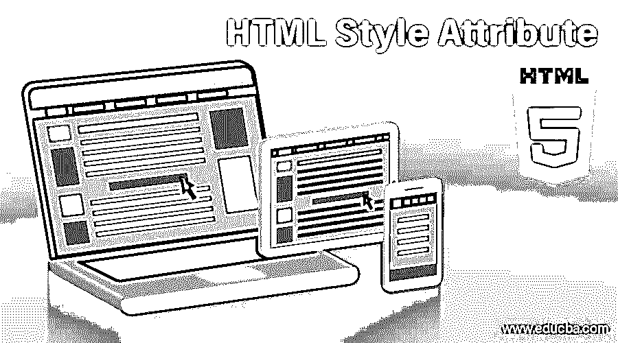
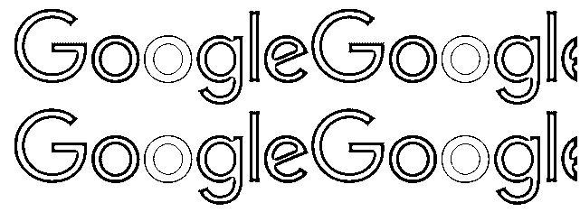
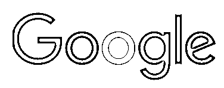

# HTML 样式属性

> 原文：<https://www.educba.com/html-style-attribute/>




## HTML 样式属性概述

HTML 代码需要在 Chrome、FireFox、IE 等浏览器中呈现的网页的 style 属性，以便它们能够按照预期的样子显示。 [HTML 标签](https://www.educba.com/basic-html-tags/)可以包含各种信息，样式属性使用内联样式控制信息在 [HTML 块](https://www.educba.com/html-blocks/)中的外观。

本文将学习更多关于 HTML 样式属性的知识，它只不过是一组定义网页在 web 浏览器中呈现方式的规则。

<small>网页开发、编程语言、软件测试&其他</small>

### HTML 样式属性列表

这里列出了可以用来影响和控制 HTML 元素设计的所有样式属性，并附有一个实际例子:

#### 1.背景颜色

利用这个 [CSS 属性](https://www.educba.com/what-is-css/)，我们可以为任何 HTML 元素设置背景颜色，比如< div >、< h1 >等。

**例子**

```
<div style="background-color:blue">My background is blue</div>
```

**输出:**


#### 2.颜色

HTML 元素中文本的字体颜色可以通过将其颜色属性设置为[右颜色名称](https://www.educba.com/color-name-in-html/)或十六进制代码或 RGB 代码来控制。

**例子**

```
<div style="color:blue">My font color is blue</div>
```

**输出:**


#### 3.边框颜色

如果我们想要添加边框，我们可以设置任何 HTML 元素的边框颜色。

**例子**

```
<p style="border: 1px solid red">My border is red</p>
```

**输出:**


正如您在上面的代码中看到的，border 属性按以下顺序接受 3 个属性:“边框宽度边框样式边框颜色”

#### 4.背景图像

我们还可以使用 background-image 属性将图像设置为背景，如下所示:

**举例:**

```
<div style="background-image: url('[https://www.google.cimg/branding/googlelogo/2x/googlelogo_color_272x92dp.png](https://www.google.cimg/branding/googlelogo/2x/googlelogo_color_272x92dp.png)');height :365px">
```

**输出:**




#### 5.背景-重复

正如您在上面的示例中看到的，当使用 background-image 属性将图像设置为背景时，默认情况下，它会水平和垂直重复该图像。然而，一些图像可能需要垂直或水平重复，或者它们可能不需要重复。这种行为可以通过针对 background-repeat 属性设置所需的值来控制，并且只能在使用背景图像时使用；否则，当用作独立属性时，它不会添加任何样式值。

值“重复-x”用于允许图像仅水平重复。

值“重复-y”用于允许图像仅垂直重复。

值“不重复”用于停止背景图像的任何类型的重复。

让我们修改上面的例子来改善背景图像。

**例子**

```
<div style="background-image: url('[https://www.google.cimg/branding/googlelogo/2x/googlelogo_color_272x92dp.png](https://www.google.cimg/branding/googlelogo/2x/googlelogo_color_272x92dp.png)');height :365px; background-repeat:no-repeat">
```

**输出:**




我们可以比较上面的例子，了解到使用背景图像，我们可以添加图像作为背景，使用背景重复，我们可以控制背景图像的重复。

#### 6.背景位置

利用这个属性，我们可以定义背景图像的位置。

**例子**

```
<div style="background-image: url('https://www.google.cimg/branding/googlelogo/2x/googlelogo_color_272x92dp.png');height :365px; width:500px;background-repeat: no-repeat;  background-position: left bottom;">
</div>
```

**输出:**


#### 7.利润

CSS 为我们提供了在 HTML 元素的四边设置边距的属性，或者我们可以在元素的某一边添加边距。

使用 margin-top 可以在元素的顶部添加边距，margin-right 将在元素的右侧添加边距，margin-left 将在元素的左侧添加边距，margin-bottom 将在元素的底部添加边距。除了使用这 4 个属性，我们还可以使用 margin 属性，并根据我们的要求设置它的值。

**例子**

```
p {
margin-top: 25px;
margin-bottom: 75px;
margin-right: 50px;
margin-left: 100px;
}
or
p
{
margin: 25px 50px 75px 100px;
}
```

#### 8.填料

padding 属性定义元素内容与其边框之间的间距。我们可以使用“padding”属性或单独的填充属性，如 padding-top、padding-bottom、padding-left、padding-right，来设置元素内容的顶部、底部、左侧或右侧的填充。

```
p {
padding-top: 25px;
padding -bottom: 75px;
padding -right: 50px;
padding -left: 100px;
}
or
p
{
padding: 25px 50px 75px 100px;
}
```

#### 9.高度和宽度

高度和宽度是最基本的 CSS 属性，用于定义任何 HTML 元素的高度和宽度。它们可以设置为像素值，如 200 像素，也可以设置为百分比，如 10%、20%等。

#### 10.文本对齐

这个属性用来设置水平方向，我们希望在这个方向上对齐一个元素的文本。该值可以设置为居中、向右或向左。

```
p {
text-align: center;
}
or
p {
text-align: left;
}
or
p {
text-align: right;
}
```

#### 11.文本装饰

属性可以用来在 HTML 中的文本上设置装饰，如下划线、划线或上划线。

**举例:**

```
<p style="text-decoration:underline">This is underline</p>
```

**输出:**


#### 12.字母间距

顾名思义，该属性用于定义单词中字母/字符之间的间距。它可以被赋予一个正或负的像素值，以增加或减少字母之间的间距。

**举例:**

```
<p style="letter-spacing:-3px">My words are overlapped</p>
```

**输出:**


#### 13.行高

行高定义垂直线之间的距离。像字母间距一样，行高也可以设置为正或负像素值。让我们回顾一下下面的例子，以便更好地理解:

#### 示例:

```
<p style="line-height: 0.7px">This paragraph has a small line-height.<br>This paragraph has a small line-height.<br>
</p>
```

**输出:**


#### 14.文本方向

有时，如果网页的内容不是英语，而是其他语言，如阿拉伯语，遵循从右到左的惯例，我们需要改变文本的方向。在这种情况下，我们可以反转文本方向。

**举例:**

```
<p style="direction: rtl"><bdo dir="ltr">I am right to left</bdo></p>
```

**输出:**


#### 15.文本阴影

该属性为文本添加阴影。

**举例:**

```
<p style="text-shadow: 3px 2px gray;"> I’ve got a gray shadow</p>
```

**输出:**


#### 16.字体系列

我们可以为元素中的文本定义字体类。我们可以定义由逗号分隔的多个字体系列作为后备系统，以处理首选字体类无法加载的情况。

*   **字体样式:**使用 font-style 属性，我们可以给文本添加斜体或倾斜效果。

**举例:**

```
<p style="font-style: oblique">This is oblique style.</p>
```

**输出:**


*   **字体粗细:**该属性定义了字体的粗细。

**举例:**

```
<p style="font-weight: 900"> This is a bold paragraph</p>
```

**输出:**


上面展示了我们的用户界面和 UX 设计积木的风格属性。随着 CSS 新版本的引入，它们会继续发展。

### 推荐文章

这是一个 HTML 风格属性的指南。在这里，我们讨论了所有样式属性的列表，这些属性可以用来影响和控制 HTML 元素的设计，并提供了一些实际的例子。您也可以看看以下文章，了解更多信息–

1.  [HTML 字体样式](https://www.educba.com/html-fonts-styles/)
2.  [HTML 列表样式](https://www.educba.com/html-list-styles/)
3.  [基本 HTML 标签](https://www.educba.com/basic-html-tags/)
4.  [HTML 的优势](https://www.educba.com/advantages-of-html/)


