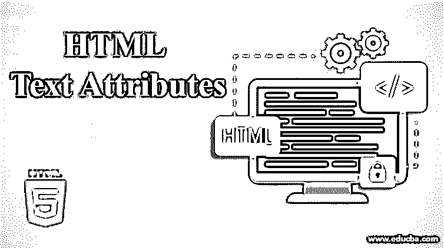
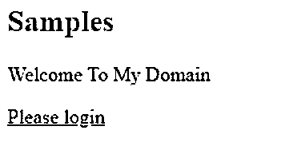
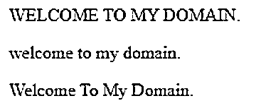

# HTML 文本属性

> 原文：<https://www.educba.com/html-text-attributes/>




## HTML 文本属性介绍

Html 有一些功能可以更好地显示网页，并且 html 文档包含一个结构，像所有 html 标签元素的嵌套格式。正如我们已经看到的，每个标签元素都包含了开始和结束尖括号(<>、>)。每一个 html 元素的扩展都是用成对的标签来表示的，比如 html 文本中的开始和结束标签。html 中有 n 个标签，用于显示用户视角中定制级别的网页。有些标签像示例

段落标签是在 html 文档下定义的关于网页中显示的文本内容。

**语法:**

<small>网页开发、编程语言、软件测试&其他</small>

html 为文本属性提供了许多标签；它还有一些元素类型的修饰符。

```
<html>
<head>
</head>
<body>
<strong> ---some text--</strong>
</body>
</html>
```

上面的代码是 html 网页中文本属性的基本语法。我们还使用一些其他的文本属性，如“*、<mark>、**、<small>、~~、*等。”这些是我们在网页中使用的 html 的基本文本属性。我们还根据用户需求使用其他一些用户定义或定制的文本属性。*~~</small>**</mark>*

### HTML 文本属性的重要性

一般来说，html 属性是 web 文档中的一种特殊的文字，因为它们会在 html 属性中执行<>打开和>关闭等操作；它将根据网页中的属性性能来控制元素的行为。文本还将 html 元素类型的修饰符归属于任一修饰符，它将在每个 html 元素类型的默认功能上注明，或者它将向某些元素类型提供功能，这些元素类型不能正确地或恰当地向 html 网页提供某些功能。

在 html 文档中，属性被添加到使用 html 开始标记和一些基本属性类型中，如“必需属性”,它是特定元素类型正常工作所需的特定元素类型，另一个属性称为“可选属性”,它将用于修改 html 元素类型的默认功能。第三种类型如“标准属性”,它支持许多 html 类型，最后“事件属性”用于使 html 元素类型指定在特定环境下运行的脚本。

一些 html 属性类型的功能将不同于修改后的 html 元素类型。html 属性将调用带有值对的名称。每一个都用“=”符号分隔，同样，在 html 元素名称和值用单引号或双引号括起来之后，用 html 元素的开始标记来书写。此外，包含某些字符的一些值将被保留；也就是说，它们将从 html 中取消引用。尽管如此，它还是不支持 XHTML，留下了一些不加引号的属性值；从 html 文档来看，它可能被认为是不安全的。

大部分的 html 元素都会带有 html 中的一些常见属性；id 属性，如 id 属性，它将提供全球格式的文档，它还像 html 元素的唯一标识符，它将使用 css 选择器样式来提供表示属性，使用浏览器将注意力集中在特定的 html 元素或任何与脚本相结合的内容上，对于其他内容，它应该进行更改，这是表示场景。在 html 的动态网页中，我们将使用像 get 和 post 等 URL 方法。用于追加网页的 URL 它将直接针对文档中的特定 html 元素，也通常是网页的子部分，id 属性显示为 http://www.examples.com/html#attributes.

像“class”这样的任何其他属性提供了分类的 html 元素，或者看起来像类似的元素。对于用于表示目的的 html 文档来说，它在语义方面非常有用。而且，类是在微格式类型中使用的，html 文档类类型看起来像“符号”类型；它表示具有该类值的所有 html 元素都与基于 web 的文档的主 html 文本相协调。这种类型的 html 元素必须与网页上的页眉和页脚注释的表示收集和组合在一起，而不是出现在 html 文档源中它们将出现的文本位置。

此外，css 样式将成为 web 文档用户的表示形式，或者作者将对两种非归属代码使用 CSS 样式属性，这看起来也与 html 元素的表示属性一致。css 样式属性将在 class 和 id 属性的帮助下调用基于 html 的文档，以便为网页选择带有样式表的 html 元素。<title>也是 html 中另一个基于子文本的属性。在大多数网络浏览器中，这个属性将被称为<a href="https://www.educba.com/html-tooltip/">网页的工具提示</a>。</title>

### HTML 文本属性的示例

以下是一些例子:

#### 示例#1

**代码:**

```
<html>
<body>
<h2>Samples</h2>
<p>Welcome To My Domain</p>
<a href="https://www.gmail.com">Please login</a>
</body>
</html>
```

**输出:**




#### 实施例 2

**代码:**

```
<html>
<head>
<style>
.sample {
text-transform: uppercase;
}
.sample1 {
text-transform: lowercase;
}
.sample2 {
text-transform: capitalize;
}
</style>
</head>
<body>
<p class="sample">Welcome to My Domain.</p>
<p class="sample1">Welcome to My Domain.</p>
<p class="sample2">Welcome to My Domain.</p>
</body>
</html>
```

**输出:**




#### 实施例 3

**代码:**

```
<html>
<head>
<style>
#sample{
font-size: 33px;
font-weight: bold;
font-family: Arial;
color: green;
transition:0.7s;
}
</style>
</head>
<body>
<p id="sample">Welcome To my Domain</p>
<script type="text/javascript">
var b = document.getElementById('sample');
setInterval(function() {
b.style.opacity = (b.style.opacity == 0 ? 1 : 0);
}, 1000);
</script>
</body>
</html>
```

**输出:**


### 结论

我们见过一些 HTML 标签类型，比如文本元素；对于网页，文本标签将用于基本的 html 文档。一些基本的标签

# 到<h10>、

等这种类型的标签将被用于每一个基于 html 的文档。一些标签将支持浏览器兼容性，而一些标签将不兼容。</h10> 

### 推荐文章

这是一个 HTML 文本属性的指南。这里我们讨论 HTML 文本属性的基本概念和重要性，以及不同的例子和它们的代码实现。您也可以看看以下文章，了解更多信息–

1.  [HTML 时间标签](https://www.educba.com/html-time-tag/)
2.  [HTML 格式的日期](https://www.educba.com/date-in-html/)
3.  [HTML 隐藏元素](https://www.educba.com/html-hide-element/)
4.  [HTML 字体](https://www.educba.com/html-schriftart/)


