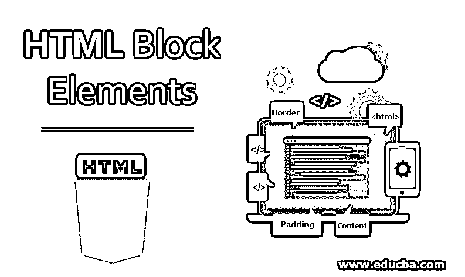
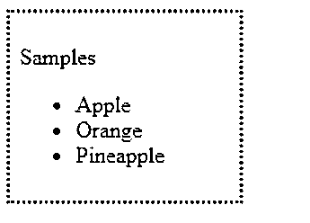

# HTML 块元素

> 原文：<https://www.educba.com/html-block-elements/>




## HTML 块元素介绍

Html 由各种元素组成，这些元素将作为每个网页的构建块。每个网页都有不同的视点，从前端和后端都会实现不同的逻辑。Html 将会有用户定义或定制的需求，这些需求将会突出 CSS 、引导框架等 web [页面。一般来说，在 CSS 样式中，HTML 元素分为两类 1 .块级元素和 2.in-lne 元素。我们已经在之前的文章中讨论过，比如 span 和 div < span >元素用于 HTML 中的行内元素，而< div >标签用于 HTML 中的块级元素。](https://www.educba.com/what-is-css/)

**语法:**

<small>网页开发、编程语言、软件测试&其他</small>

```
<html>
<body>
<div>
----------codes------
----------------------
</div>
</body>
</html>
```

一般来说，每个 HTML 都有自己的预定义结构和特性。HTML 中的块元素有一组不同的标签，我们将在文档中使用。下面列出了一些标签。

**标签:**

<address>、

、

> 、、、
> 
> 、
> 
> <fieldset>、
> 
> 、
> 、<图>、<表尾>、<表>、< h1 > - < h6 >、<表头>、< hr >、<李>、<主>、<导航【T32
> 
> </fieldset>


</address>

以上标签是 html 块元素中预定义的标签；当我们在 html 文档中调用标签时，每个标签将用于不同的功能。我们很可能在块级元素中使用

标签。代码是 HTML 中块级元素的通用语法，当需要时，我们也会使用上面提到的预定义标签；每个标签在 HTML 中都有独立和自包含的内容。

### HTML 中的 Block 元素是如何工作的？

它将使用具有格式模型的 CSS 样式；它将涵盖内嵌元素和块元素。最有可能的是，它将负责格式化块元素。格式化块元素是 HTML 中的块级元素之一。每个 CSS 元素看起来都像表单；它包含一个盒子；它有一些组件，如内容、填充和边框；这些是 CSS 样式中的不同组件。

*   **内容:**表示 HTML 元素的一般内容，如文本、图片、视频等。
*   **填充:**表示任何内容中已经被填充了顶部填充、左侧填充、右侧填充、底部填充等格式的填充。这些是财产。
*   **Border:** 表示 HTML 内容中的任何边框和填充；边框将由边框-顶部，边框-底部**，**等**设置。**

Block-elements 想要在 HTML 文档中设置边距和填充。因为在网页中，他们需要适当的对齐来使用户看起来更有吸引力。在 block-elements 部分包含边距，它存在于元素之外，填充存在于元素之内，它将围绕内容。如果元素需要背景颜色或图像，它们将被分配给它们，并且同样的颜色和图像将显示在内容和填充区域。通常，边距区域始终是透明的，它们显示父元素的背景。如果父元素的显示属性没有分配给 like body 部分，则会出现异常，在这种情况下，任何颜色或图像都显示在边距和填充区域中，否则边距就是 HTML 元素(内容和填充)外边缘之间的距离。

我们还设置边框来突出显示网页，包括边框颜色、样式、宽度和边距。在元素周围的边界外观以及所有类型的边界方面，都由我们控制。CSS 的 border-style 属性使用户能够设置他们自己的自定义边框样式，这些样式用值指定，如无、实线、双线、隐藏、点线、虚线、凹槽、山脊、插入和开始。如果我们已经将文档与边框对齐，我们不指定任何值意味着默认值是 none 这意味着没有为您的页面分配边框。除了在 css2 版本中添加的隐藏值，所有这些边框样式都包含在 css1 版本中。

在 Html 4 以后的版本中，div 元素是块级元素，用于设计具有指定划分的文档。否则，div 元素没有特定的特征格式，而且 HTML 中不赞成使用的 Align 属性可以用于其内容的中心或右侧；这是 HTML 中不赞成使用的元素的默认值。在

中，标签可以采用 CSS 样式中的任何格式，div 有嵌套的 div 标签和其他与 div 元素嵌套的元素，无论我们指定的样式、边框和对齐方式会对这些嵌套元素产生什么影响。带有边框、背景图像和其他用户自定义格式样式的 div 标签的一些基本代码。

**代码:**

```
div.sample {width:150px;background:#FF0002;border:2px dotted black;padding:7px;}
div.sample ul {color:green;}
```

以上代码是理解用 div 标签实现的 CSS 属性和功能的示例。我们将在下面的章节中讨论一些基本的例子。

### HTML 块元素的示例

下面给出了以下例子:

#### 示例#1

**代码:**

```
<html>
<head>
<style>
div.sample {width:150px;border:2px dotted black;padding:7px;}
div.sample ul {color:green;}
</style>
</head>
<body>
<div class="sample" style="color:black">
<p>Samples</p>
<ul>
<li>Apple</li>
<li>Orange</li>
<li>Pineapple</li>
</ul>
</div>
</body>
</html>
```

**输出:**




#### 实施例 2

**代码:**

```
<html>
<head>
<style>
div.sample {width:150px;border:2px dotted black;padding:7px;}
div.sample ul {color:green;}
</style>
</head>
<body>
<p>Sample green
black</p>
</body>
</html>
```

**输出:**


#### 实施例 3

**代码:**

```
<html>
<head>
<style>
.first {
background-color: green;
list-style-type: none;
text-align: center;
margin: 2;
padding: 2;
}
.second {
display: inline-block;
font-size: 30px;
padding: 23px;
}
</style>
</head>
<body>
<ul class="first">
<li><a href="#home">Home</a></li>
<li><a href="#aboutus">AboutUs</a></li>
<li><a href="#contactus">Contact Us</a></li>
</ul>
</body>
</html>
```

**输出:**


在上面的例子中，我们看到了块级元素的不同场景。前两个例子中，我们使用并对齐了菜单或选项卡或

和标签中的文本值。用于行内元素，但是

段落标签将用于阻止在用户级区域中指定的文本或值。最后一个例子将用于 HTML 中的

<nav>元素，用于导航包含一些块级内容的网页。我们已经讨论了块级元素区域的工作；我们指定了一些 CSS 属性启用了块级别的属性，如背景颜色、带有列表选项的文本样式、文本对齐、填充和边距、字体样式。这些属性的值由导航网页指定。</nav> 

### 结论

在结论部分，HTML 块元素将占用其父元素(容器)的整个空间来创建块。一般来说，浏览器会在 HTML 元素之前和之后显示带有新行和全角的块级元素。我们可以把盒子里的元素想象成一堆。

### 推荐文章

这是一个 HTML 块元素的指南。在这里，我们讨论介绍，如何在 HTML 块元素的工作，以及各自的例子。您也可以浏览我们的其他相关文章，了解更多信息——

1.  [HTML 内嵌样式](https://www.educba.com/html-inline-style/)
2.  [HTML 居中对齐](https://www.educba.com/html-align-center/)
3.  [HTML 边框样式](https://www.educba.com/html-border-style/)
4.  [HTML 中的 Fieldset 标签](https://www.educba.com/fieldset-tag-in-html/)


