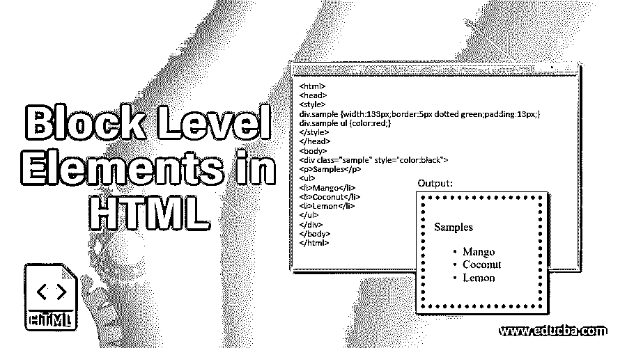
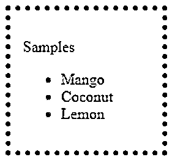
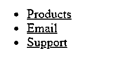

# HTML 中的块级元素

> 原文：<https://www.educba.com/block-level-elements-in-html/>




## HTML 中块级元素的介绍

HTML 有一些预定义的标签和元素；它可能具有块级、内联 html 元素等元素中的一些特性和类型。网页有一个不同的导航集，逻辑将从前端 html 实现用户定义的，或定制的要求将用于突出网页，如使用 css，引导框架。我们已经在之前的文章中讨论过，比如 span 和 div 元素用于 html 中的行内元素，而

标签用于 html 中的块级元素。html 类别的每个部分都有不同的功能集；逻辑应该在前端实现。

**语法:**

<small>网页开发、编程语言、软件测试&其他</small>

对于预定义的标签和元素，html 标签有它们自己的预定义结构和功能。html 中的块级元素有一些不同的标签集；元素将在网页中使用。下面列出了一些标签。

```
<address>,<blockquote><canvas><dd><div><dl><dt><fieldset>
,,<form>,<h1>-<h6>,,<hr>,<li>,<main>,<nav>,<noscript>,<ol>,<p>
<pre>,,<table>,<tfoot>,<ul>,<video>
```

上述标签是 html 块级标签中预定义的标签；当我们在 html 页面中调用标签时，每个标签都有不同的用法和功能。我们很可能在 html 的块级元素中使用

标签。

```
<html>
<body>
<div>
----------codes------
----------------------
</div>
</body>
</html>
```

上面的代码是 HTML 中块级元素的通用语法。我们还将使用前面提到的一些预定义的标签；如果需要，每个标签在 html 中都有独立和自包含的内容。

### 什么是 HTML 中的块级元素？

块级元素将使用 css 样式来突出显示网页，对于 web 用户来说更加复杂，用于开发 html 格式模型的业务增长。它有规则，它将涵盖内联元素和块元素。最有可能的是，它用于覆盖格式化块级元素。每一个 css 元素都会使用 html 标签创建表单，并且包含框；它可能有一些组件，如内容、填充和边框；这是 css 样式中的一些组件。

块级元素希望设置网页中的边距和填充，因为它们需要正确的对齐和视图。同时 elements 部分还包含用于存在于元素外部的边距填充；它存在于元素内部，覆盖了整个 html 主体内容。如果元素需要背景色或图像，它们会被分配，同样的内容和填充区域也会显示。通常，边距区域总是覆盖透明的并显示父元素的背景。如果父元素的显示属性没有分配给 body 部分，导致任何颜色或图像同时显示在边距和填充区域，则会出现异常。注意:边距是指 html 元素(内容和填充)的外边缘之间的距离。

我们还可以设置边框区域来突出显示下一级的网页；它包括边框颜色、样式、宽度和边距。与出现在网页中的元素以及所有类型的边框相同。CSS 有自己的 border-style 属性，使用户能够用一些值来设置他们自己的自定义边框样式，如无、实心、双线、隐藏、点线、虚线、凹槽、山脊、插入和开始。如果我们将文档与边框对齐，我们不指定任何值默认值为 none 表示没有为网页分配边框。这些[边框样式包含在](https://www.educba.com/css-border-style/)中，并且在 css1 版本中可用，除了在下一版本，即 css2 版本中添加的隐藏值。

在 Html 4 以后的版本中，div 元素是块级元素，用于设计和分隔带有指定划分的文档；该元素没有特定的特征格式，在 HTML 中也不推荐使用 Align 属性，它可以用于居中或右侧，其内容默认在

标记中，旨在采用 CSS 样式中的任何格式。此外，它还有像嵌套 div 标签这样的选项。无论我们声明和分配了什么，样式、边框和对齐都是在文档的 div 标签中指定的，影响那些特定的嵌套元素区域。用于 div 标记的一些基本属性和值是边框、背景图像和其他用户定义的格式样式。

```
div.sample {width:137px;background:green;border:7px dotted black;padding:3px;}
div.sample ul {color:blue;}
```

标记的代码是理解用 div 标签实现的 CSS 属性和功能的示例。

### HTML 中块级元素的例子

下面是 html 中块级元素的一个示例:

#### 示例#1

```
<html>
<head>
<style>
div.sample {width:133px;border:5px dotted green;padding:13px;}
div.sample ul {color:red;}
</style>
</head>
<body>
<div class="sample" style="color:black">
<p>Samples</p>
<ul>
<li>Mango</li>
<li>Coconut</li>
<li>Lemon</li>
</ul>
</div>
</body>
</html>
```

**输出:**




#### 实施例 2

```
<html>
<head>
<style>
div.sample {width:123px;border:10px dotted blue;padding:18px;}
div.sample ul {color:yellow;}
</style>
</head>
<body>
<p>Sample Home<br/>
Contactus</p>
</body>
</html>
```

**输出:**


#### 实施例 3

```
<html>
<head>
<style>
.example1 {
background-color: darkgreen;
list-style-type: none;
text-align: center;
margin: 3;
padding: 13;
}
.example2 {
display: inline-block;
font-size: 32px;
padding: 27px;
}
</style>
</head>
<body>
<ul class="first">
<li><a href="#products">Products</a></li>
<li><a href="#email">Email</a></li>
<li><a href="#support">Support</a></li>
</ul>
</body>
</html>
```

**输出:**




在上面的例子中，我们已经使用了前两个例子中的块级元素的基础，并且将菜单标签与

和标签中的文本值对齐。用于行内元素，但

段落标签将用于阻止已经在用户级区域指定的文本。在最后一个例子中，我们将使用 html 中的

<nav>元素来导航文档中包含一些块级内容的网页。我们已经分享了关于块级元素工作的信息，并且使用一些 css 属性为块级属性启用了背景颜色、文本样式和一些选项，如列表文本对齐、填充和边距字体样式；这些是在导航网页中指定了值的一些属性。</nav> 

### 结论

块级元素被用于创建块的元素的整个空间所覆盖。用户浏览器将通过在 html 元素之前和之后使用新行和全角来显示块级元素。我们可以用像堆栈一样的盒子来可视化元素。

### 推荐文章

这是 HTML 中块级元素的指南。这里我们讨论 html 中的块级元素以及不同的例子和它们的代码实现。您也可以阅读以下文章，了解更多信息——

1.  [HTML 内嵌块](https://www.educba.com/html-inline-block/)
2.  [HTML 中的内嵌标签](https://www.educba.com/inline-tags-in-html/)
3.  [HTML 中的 Span 标签](https://www.educba.com/span-tag-in-html/)
4.  [HTML 中的旁白标签](https://www.educba.com/aside-tag-in-html/)


