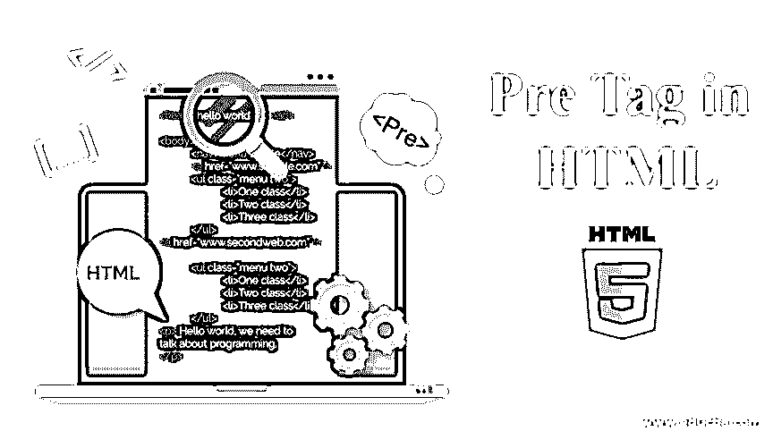

# HTML 中的前置标签

> 原文：<https://www.educba.com/pre-tag-in-html/>




## HTML 中的前置标签介绍

Web 浏览器会忽略空格、换行符和其他文本格式字符。如果你想要某种格式，那么标签或属性必须每次都使用。它用于消除这一缺点。Pre 标签用于保持文本格式不变。当 CSS 标签被应用时，它被改变。它显示内容的预格式化文本。

**语法:**

<small>网页开发、编程语言、软件测试&其他</small>

HTML 有许多不同用途的标签。

**举例:**

*   ```
    等。
    ```

像其他 HTML 标签一样，pre 标签有一个开始标签和一个结束标签。

```
<pre> content of web </pre>
```

上面的语法用在我们需要内容的预格式化文本的地方。

### HTML 中的 Pre 标签是如何工作的？

以下是对前置标签工作原理的解释:

#### 1.在 Html 中使用前置标签

**代码:**

```
<!DOCTYPE>
<html>
<head>
<title> using pre tag in html </title>
</head>
<body>
<pre>
The Web browser is ignored space,   line breaks, and other formatting characters of text.
If you wanted some   format then tag or attribute must have used every time.
Pre tag in HTML used to remove this drawback. Pre tag used to keep text format as it is.
It is   changed when CSS tags are applied.
Pre tag in HTML shows the  preformatted text of the content.
</pre>
</body>
</html>
```

**输出:**


**对上述代码的解释:**展示上面的例子。当在内容的所需部分应用前标记时，内容看起来是按原样格式化的。将前置标签应用于文本时，不会忽略空格和下一行。

#### 2.在 Html 中不使用前置标签

**代码:**

```
<!DOCTYPE>
<html>
<head>
<title> using pre tag in html </title>
</head>
<body>
The Web browser is ignored space, line breaks, and other
formatting characters of text.
If you wanted some format then tag or attribute must have
used every time.
This tag is used to remove this drawback. Pre tag used to
keep text format as it is. It is changed when CSS tags are applied.
This pre tag shows the preformatted text of the content.
</body>
</html>
```

**输出:**


**对上面代码的解释:**展示上面的例子，没有使用它。自动忽略空格、换行符和新行。网页根据他们的要求显示内容。为了留出空间和换行，我们必须使用 HTML 标签。

#### 3.使用 HTML 其他标签

**代码:**

```
<!DOCTYPE>
<html>
<head>
<title> using pre tag in html </title>
</head>
<body>
The Web browser is ignored space, &nbsp; &nbsp; &nbsp; &nbsp; line breaks, and other formatting characters of text.<br>
If you wanted some &nbsp; &nbsp;  format then tag or attribute must have used every time.<br>
This is used to remove its drawback. Pre tag used to keep text format as it is.<br> It is changed when CSS tags are applied. <br>
It shows preformatted text of the content.<br>
</body>
</html>
```

**输出:**


**对上面代码的解释:**展示上面的例子，没有使用 pre 标签。但是我们没有使用 pre 标签，而是使用了其他的 HTML 标签。< br >标签用来断行和&nbsp；用于空格的字符。

### 前置标签的使用

*   如果我们不使用标签和属性，网页会忽略空格和换行符。但是每一行，我们都要用到这些属性。
*   Pre 标记保留原始内容格式。
*   开发人员可以为块使用一个标签，而不是使用许多标签。减少编码，易于理解。

Pre 标签支持以下 web 浏览器:

*   谷歌浏览器
*   微软公司出品的 web 浏览器
*   火狐浏览器
*   歌剧
*   旅行队

### 要实现的示例

以下是在 it 中实施的示例:

#### 示例#1

将 Pre 标记与 CSS 标记一起使用。

**代码:**

```
<!DOCTYPE>
<html>
<head>
<title> using pre tag with CSS </title>
<style>
pre {
font-family: Arial;
color: yellow;
border: solid black;
background-color: black;
}
</style>
</head>
<body>
<pre>
The Web browser is ignored space, line breaks, and other formatting characters of text.
If you wanted some format then tag or attribute must have used every time.
This tag in HTML used to remove this drawback. Pre tag used to keep text format as it is.
It is changed when CSS tags are applied.
This tag in HTML shows the preformatted text of the content.
</pre>
</body>
</html>
```

**输出:**


**对上面代码的解释:**显示上面的例子是用 CSS 样式的标签。如果你使用了前置标签，那么 CSS 样式标签也可以改变内容的格式。样式标签使用 CSS 中的字体样式、边框和文本颜色。

#### 实施例 2

下面的例子。这是其他 HTML 标签和 pre 标签与 CSS 的组合。

**代码:**

```
<!DOCTYPE>
<html>
<head>
<title> using pre tag in html  with CSS </title>
<style>
pre {
font-family: Arial;
color: yellow;
border: solid black;
background-color:black;
}
</style>
</head>
<body>
<p>
The Web browser is ignored space, line breaks, and other formatting characters of text.
If you wanted some format then tag or attribute must have used every time.
This tag used to remove this drawback. Pre tag used to keep text format as it is.
It is changed when CSS tags are applied.
It shows the preformatted text of the content.
</p>
<pre>
The Web browser is ignored space, line breaks, and other formatting characters of text.
If you wanted some format then tag or attribute must have used every time.
This tag in HTML used to remove this drawback. Pre tag used to keep text format as it is.
It is changed when CSS tags are applied.
This tag in HTML shows the preformatted text of the content.
</pre>
</body>
</html>
```

**输出:**


### 结论

开发人员使用这个标签来减少编码并获得格式化的内容。web 不能忽略 pre 标签中内容的格式。

### 推荐文章

这是一个在 HTML 中使用前置标签的指南。在这里，我们讨论一个介绍，如何前标签工作和使用，例子，以实现正确的代码和输出。您也可以浏览我们的其他相关文章，了解更多信息——

1.  [HTML 中的画布标签](https://www.educba.com/canvas-tag-in-html/)
2.  [HTML 图标签](https://www.educba.com/html-figure-tag/)
3.  [HTML 部分标签](https://www.educba.com/html-section-tag/)
4.  [HTML 中的 PHP 标签](https://www.educba.com/php-tag-in-html/)


