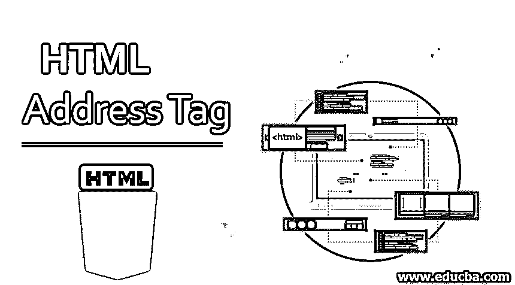
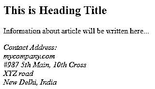
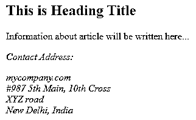
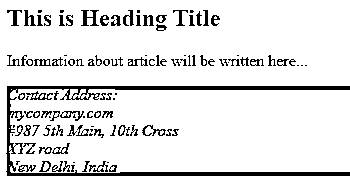
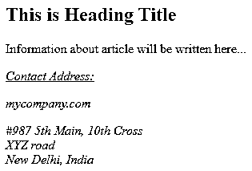
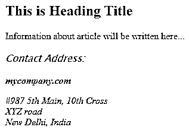
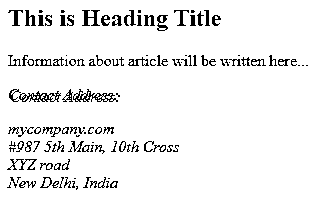
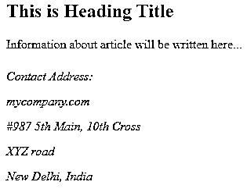

# HTML 地址标签

> 原文：<https://www.educba.com/html-address-tag/>




## HTML 地址标签介绍

<address>标签用于获取网站所有者或文章作者的详细联系信息。它可能包括地址、电话、电子邮件、网站连接等等。

<address>标签对于不同的上下文很有帮助，包括页眉中的业务联系信息，或者与作者相关的联系信息等。传统上，浏览器将斜体文本包含在

<address>标签中。这个标签通常也被称为< address>的元素。通常，< address >元素会和其他细节一起包含在< footer >元素中。除此之外，它不能用于识别地址。在本主题中，我们将[学习 HTML](https://www.educba.com/what-is-html/) 地址标签。</address>

</address>

</address>

**语法**

<small>网页开发、编程语言、软件测试&其他</small>

<address>标签的语法如下所示:</address>

```
<html>
<body>
<address>
Contact Information:<br>
www.mycompany.com<br>
#12345, Main Street<br>
Name of City, Name of State
</address>
</body>
</html>
```

### 属性

以下是下面提到的属性

#### 1.全局属性

全局属性将用于任何 HTML 元素上使用的属性。这种属性在所有 HTML 元素中都很普遍。

*   **accesskey:** 定义了激活元素的快捷键。
*   **class:** 它给出了一个元素的类名。
*   **contenteditable:** 用来表示一个元素是否可以编辑。
*   **dir:** 用于定义元素的文字方向。
*   **draggable:** 定义了元素在页面上的拖动方式。
*   **dropzone:** 用于表示连接时数据是否可以复制、移动、链接。
*   **id:** 定义了元素的具体 id。
*   **lang:** 它定义了元素内容的语言。
*   **style:** 为元素提供 CSS 样式。
*   **tabindex:** 用于定义元素的跳转顺序。
*   **标题:**用于为元素提供附加信息。
*   **翻译:**表示该元素的内容是否可以翻译。
*   **拼写检查:**定义对一个元素的内容进行拼写检查。
*   **数据:**用于在 HTML 和 DOM 描绘之间交换私有数据。
*   **hidden:** 当需要隐藏元素时，使用该属性

#### 2.事件属性

每当浏览器响应特定用户的干预时，就会发生事件。当用户点击鼠标、上传文档或图片、播放视频或在网页上执行任何其他活动时。

#### 3.Windows 事件属性

窗口事件属性在窗口对象启动时使用。

*   **onafterprint:** 需要打印文档时使用。
*   **onbeforeprint:** 在需要打印文档之前执行。
*   **onbeforeload:** 卸载单据时使用。
*   **onblur:** 该属性将在窗口没有焦点时定义。
*   **onerror:** 在下载文件时出现错误时定义。
*   **onload:** 在加载网页内容时指定。
*   **onmessage:** 当消息中有原因时使用。
*   **onoffline:** 当浏览器在离线模式下工作时，将使用该属性。
*   **ononline:** 当浏览器在在线模式下工作时，将使用该属性。
*   **onpagehide:** 当用户离开网页时指定。
*   **onpageshow:** 在用户导航到网页时指定。
*   **onpopstate:** 当窗口历史发生变化时，将使用该属性。
*   **onredo:** 当页面上有重做选项时使用。
*   **onresize:** 在用户调整窗口大小时指定。
*   **onstorage:** 当 web 存储器有更新时定义。
*   **onundo:** 当有撤销选项被取消时使用。
*   **onunload:** 卸载网页内容时指定。

#### 4.表单事件属性

可以在表单中发生的事件被视为流程中的事件。当用户打开或关闭表单、在表单之间切换或对包含数据的表单进行操作时，会发生表单事件。

*   **onblur:** 当表单元素上没有焦点时，将定义该属性。
*   **onchange:** 当一个元素的值发生变化时定义。
*   **oncontextmenu:** 当用户希望看到上下文菜单时使用。
*   **onfocus:** 当一个元素获得焦点时使用。
*   oninput: 当用户输入一个元素时使用。
*   **oninvalid:** 当页面上有无效元素时指定。
*   **onreset:** 当用户想要重置表单时，将使用该属性。
*   **onsearch:** 当用户在搜索字段中搜索某些信息时定义。
*   **onselect:** 当用户选择元素中的文本时使用。
*   **onsubmit:** 在用户提交表单时使用。

### 实现 HTML 地址标签的例子

下面举几个例子

#### 示例#1

```
<!doctype html>
<html>
<head>
<meta charset="UTF-8">
<title>
HTML Address Tag
</title>
</head>
<body>

<h2>This is Heading Title</h2>
<p>Information about article will be written here...</p>


<address>
Contact Address:<br>
mycompany.com<br>
#987 5th Main, 10th Cross<br>
XYZ road<br>
New Delhi, India
</address>

</body>
</html>
```

**输出**:

*   将上述代码保存在扩展名为. html 的文件中
*   在浏览器中运行 html 文件，您将得到如下图所示的输出




#### 示例 2–颜色属性

**代码:**

```
<!doctype html>
<html>
<head>
<meta charset="UTF-8">
<title>
HTML Address Tag
</title>
<style>
.color_prop {
color: #1c87c9;
}
</style>
</head>
<body>

<h2>This is Heading Title</h2>
<p>Information about article will be written here...</p>


<address>
<p class="color_prop">Contact Address:</p>
mycompany.com<br>
#987 5th Main, 10th Cross<br>
XYZ road<br>
New Delhi, India
</address>

</body>
</html>
```

**输出**:

在浏览器中运行上述文件，您将获得下图所示的输出:




#### 示例 3–背景颜色属性

**代码:**

```
<!doctype html>
<html>
<head>
<meta charset="UTF-8">
<title>
HTML Address Tag
</title>
<style>
.color_prop {
background-color: #1c87c9;
}
</style>
</head>
<body>

<h2>This is Heading Title</h2>
<p>Information about article will be written here...</p>


<address>
<div class="color_prop">Contact Address:<br>
mycompany.com<br>
#987 5th Main, 10th Cross<br>
XYZ road<br>
New Delhi, India
</div>
</address>

</body>
</html>
```

**输出**:

在浏览器中运行上述文件，您将获得下图所示的输出:




#### 示例 4–文本装饰

**代码:**

```
<!doctype html>
<html>
<head>
<meta charset="UTF-8">
<title>
HTML Address Tag
</title>
<style>
.style1 {
text-decoration: underline;
}
.style2 {
text-decoration: italic;
}
</style>
</head>
<body>

<h2>This is Heading Title</h2>
<p>Information about article will be written here...</p>


<address>
<p class="style1">Contact Address:</p>
<p class="style2">mycompany.com</p>
#987 5th Main, 10th Cross<br>
XYZ road<br>
New Delhi, India
</div>
</address>

</body>
</html>
```

**输出**:

在浏览器中运行上述文件，您将获得下图所示的输出:




#### 示例 5–CSS 字体

**代码:**

```
<!doctype html>
<html>
<head>
<meta charset="UTF-8">
<title>
HTML Address Tag
</title>
<style>
.style1 {
font-family:"Lucida Sans Unicode", "Lucida Grande", sans-serif;
}
.style2 {
font-weight: bolder;
}
</style>
</head>
<body>

<h2>This is Heading Title</h2>
<p>Information about article will be written here...</p>


<address>
<p class="style1">Contact Address:</p>
<p class="style2">mycompany.com</p>
#987 5th Main, 10th Cross<br>
XYZ road<br>
New Delhi, India
</div>
</address>

</body>
</html>
```

**输出**:

在浏览器中运行上述文件，您将获得下图所示的输出:




#### 示例 6–文本阴影

**代码:**

```
<!doctype html>
<html>
<head>
<meta charset="UTF-8">
<title>
HTML Address Tag
</title>
<style>
.style1 {
text-shadow: 2px 2px #1c87c9;
}
</style>
</head>
<body>

<h2>This is Heading Title</h2>
<p>Information about article will be written here...</p>


<address>
<p class="style1">Contact Address:</p>
mycompany.com<br>
#987 5th Main, 10th Cross<br>
XYZ road<br>
New Delhi, India
</div>
</address>

</body>
</html>
```

**输出**:

在浏览器中运行上述文件，您将获得下图所示的输出:




#### 示例 7–行高

**代码:**

```
<!doctype html>
<html>
<head>
<meta charset="UTF-8">
<title>
HTML Address Tag
</title>
<style>
.color_prop {
line-height: 2.0;
}
</style>
</head>
<body>

<h2>This is Heading Title</h2>
<p>Information about article will be written here...</p>


<address>
<div class="color_prop">Contact Address:<br>
mycompany.com<br>
#987 5th Main, 10th Cross<br>
XYZ road<br>
New Delhi, India
</div>
</address>

</body>
</html>
```

**输出**:

在浏览器中运行上述文件，您将获得下图所示的输出:




### 结论

到目前为止，我们已经研究了当所有者想要指定地址信息时，如何使用[地址标签。为了通过电子邮件快速联系作者，该特性通常与 HTML mailto 属性结合使用。地址标签通常包含在<部分的页脚>部分。](https://www.educba.com/address-tag-in-html/)

### 推荐文章

这是一个 HTML 地址标签的指南。这里我们讨论实现 HTML 地址标签的属性和例子以及输出。您也可以浏览我们推荐的其他文章，了解更多信息——

1.  [HTML 中的样式标签](https://www.educba.com/style-tag-in-html/)
2.  [HTML 表格中的滚动条](https://www.educba.com/scrollbar-in-html-table/)
3.  [HTML 中的引号](https://www.educba.com/quotation-tag-in-html/)
4.  [HTML 导航标签](https://www.educba.com/html-nav-tag/)


