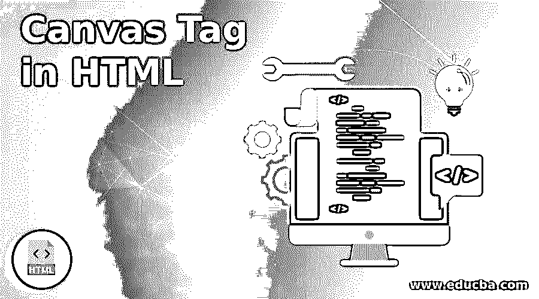
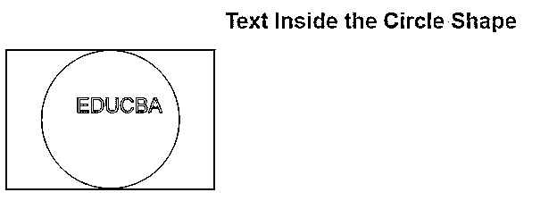
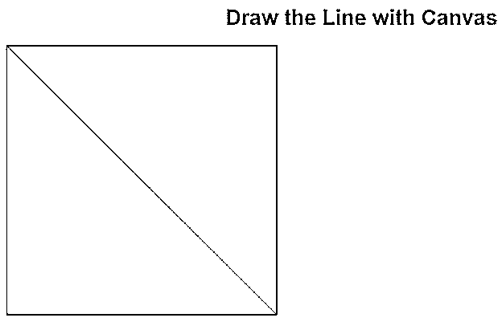
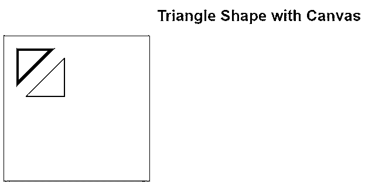

# HTML 中的画布标签

> 原文：<https://www.educba.com/canvas-tag-in-html/>




## HTML 中的画布标签介绍

画布意味着在浏览器页面上绘制图像。HTML 中的 Canvas 标记就是这样一个元素，它为 HTML 提供了一个位图表面，就像一个由像素组成的空白画布，其中可能包含两种以上的颜色。元素用于在脚本语言(如 JavaScript)的帮助下在网页上创建图形图像。

<canvas>元素创建一个空的画布来工作，就像一个图形容器，但是您将需要使用 javascript 来进行实际的创建，绘制图形、图像等。</canvas>

最初 HTML 不支持 canvas，后来 HTML5 引入了这个 canvas 特性。HTML5 中的这个

<canvas>标签用于通过使用 JavaScript 脚本绘制图形。我们也可以用这个画布标签来绘制图像。让画布元素变得美丽可以使用动画，图形，照片处理，数据可视化。这个画布特性最初是通过苹果公司在 Web Kit 中引入的。</canvas>

<small>网页开发、编程语言、软件测试&其他</small>

**实时示例:**不是为每个形状编写实现图形的独立代码，而是成为处理器上的过载。因此，为了克服这种情况，开发人员在 HTML 中提出了 canvas 标签。较少的代码可以给我们一个精确的图形动画形状。

### 句法

HTML 中的 Canvas 特性是通过应用

<canvas>标签和脚本来实现用户所需的图形形状。</canvas>

```
<canvas> //specify some properties inside canvas tag because different shape have different properties like width="" ,height="" , style=””
//code
</canvas>
<script>
//script code for animations and graphics
</script>
```

### 在 HTML 中实现 Canvas 标签的例子

下面是一个例子:

#### 示例#1

带画布的矩形内的圆示例:

**代号:**

```
<!DOCTYPE html>
<html>
<head>
<title>
Canvas in HTM5
</title>
<!--CSS Styles-->
<style>
h1
{
color: green;
text-align:center;
}
p
{
color:brown;
border: solid 2px blue;
font-size: 25px;
}
</style>
</head>
<body>
<h1>
Circle Shape inside Rectangle Shape
</h1>
<canvas id="rectangleCircle" width="300" height="200" style="border:2px solid red;">
</canvas>
<script>
var circle = document.getElementById("rectangleCircle");// with id drawing circle shape with script
var creatingCircle = circle.getContext("2d");//get the circle type from 2d shape
creatingCircle.beginPath();//circle shape begin
creatingCircle.arc(150,100,80,4,4*Math.PI);//circle x, y and size of the circle
creatingCircle.stroke();//stroke of the circle
</script>
</body>
</html>
```

**输出:**
T5】


#### 实施例 2

带画布的圆形内的文本示例:

**代码:**

```
/strong><!DOCTYPE html>
<html>
<head>
<title>
Canvas in HTM5
</title>
<!--CSS Styles-->
<style>
h1
{
color: red;
text-align:center;
}
p
{
color:green;
border: solid 2px maroon;
font-size: 25px;
}
</style>
</head>
<body>
<h1>
Text Inside the Circle Shape
</h1>
<canvas id="rectangleCircle" width="300" height="200" style="border:2px solid navy;">
</canvas>
<script>
var circle = document.getElementById("rectangleCircle");// with id drawing circle shape with script
var creatingCircle = circle.getContext("2d");//get the circle type from 2d shape
creatingCircle.beginPath();//circle shape begin
creatingCircle.arc(150,100,100,4,4*Math.PI);//circle x, y and size of the circle
creatingCircle.stroke();//stroke of the circle
creatingCircle.font = "30px Arial";//Creating a font
creatingCircle.strokeText("EDUCBA",100,90);// Creating text inside the circle
</script>
</body>
</html>
```

**输出:**




#### 实施例 3

用画布画线示例:

**代码:**

```
<!DOCTYPE html>
<html>
<head>
<title>
Canvas in HTM5
</title>
<!--CSS Styles-->
<style>
h1
{
color: blue;
text-align:center;
}
p
{
color:red;
border: solid 2px orange;
font-size: 25px;
}
</style>
</head>
<body>
<h1>
Draw the Line with Canvas
</h1>
<canvas id="lineID" width="400" height="400" style="border:2px solid orange;">
</canvas>
<script>
var line = document.getElementById("lineID");// with id drawing line shape with script
var lineCreate = line.getContext("2d");//get the line type from 2d shape
lineCreate.moveTo(0,0);//move the line
lineCreate.lineTo(400,400);//Where to where line has to move
lineCreate.stroke();//line stroke
</script>
</body>
</html>
```

**输出:**




#### 实施例 4

带画布的三角形示例:

**代码:**

```
<!DOCTYPE html>
<html>
<head>
<title>
Canvas in HTM5
</title>
<!--CSS Styles-->
<style>
h1
{
color: fuchsia;
text-align:center;
}
p
{
color:blue;
border: solid 2px skyblue;
font-size: 25px;
}
</style>
</head>
<body>
<h1>
Triangle Shape with Canvas
</h1>
<canvas id="triangleID" width="300" height="300" style="border:2px solid skyblue;">
</canvas>
<script>
var canvas = document.getElementById('triangleID');// with id drawing traingles shape with script
if (canvas.getContext)
{
var traingle = canvas.getContext('2d');//get the traingels type from 2d shape
//Creating the traingle
traingle.beginPath();
traingle.moveTo(25,25);
traingle.lineTo(105,25);
traingle.lineTo(25,105);
traingle.fill();
// Triangle can be stroked with below fuctions
traingle.beginPath();
traingle.moveTo(125,125);
traingle.lineTo(125,45);
traingle.lineTo(45,125);
traingle.closePath();
traingle.stroke();
} else
{
alert('Your browser does ot support this feature');//alert the user
document.write('Your browser does ot support this feature');//display the output
}
</script>
</body>
</html>
```

**输出:**




### 结论

canvas 标签是在 HTML5 版本中引入的。canvas 和 JavaScript 代码都为您提供了使用 canvas 标记绘制的精确形状。我们可以画圆形、矩形、直线、三角形等形状。

### 推荐文章

这是一个 HTML 中的画布标签指南。这里我们讨论 HTML 中的 Canvas 标签的介绍以及语法和例子。您也可以浏览我们的其他相关文章，了解更多信息——

1.  [HTML 中的地图标签](https://www.educba.com/map-tag-in-html/)
2.  [HTML 填充](https://www.educba.com/html-padding/)
3.  [HTML 中的框架标签](https://www.educba.com/frame-tag-in-html/)
4.  [HTML 中的小标签](https://www.educba.com/small-tag-in-html/)


