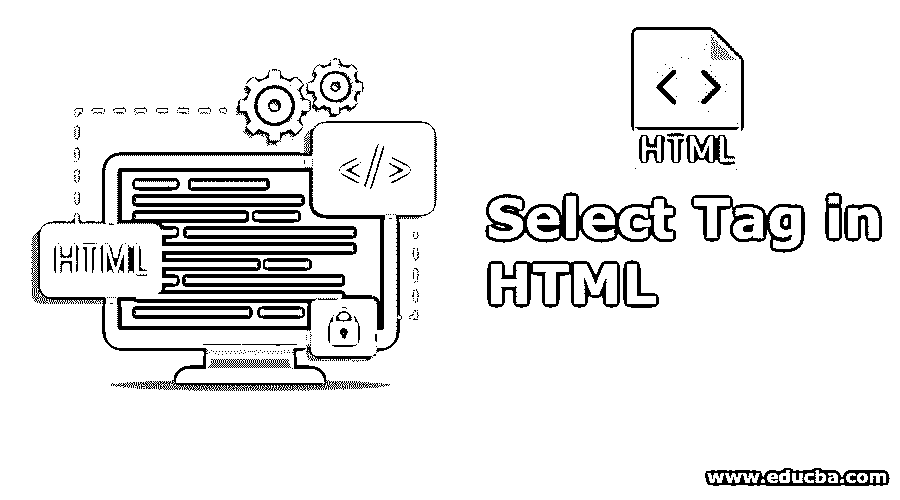
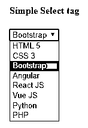
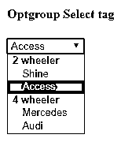
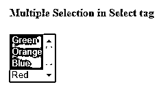
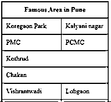

# 选择 HTML 中的标签

> 原文：<https://www.educba.com/select-tag-in-html/>




## HTML 中选择标签的介绍

HTML 中的 Select 标签提供了从选项列表中选择的功能，例如下拉菜单或多选菜单。它是一个标签，可以用在用于创建和实现网页的 HTML 代码的表单中。语法是这样的:' <select><option>值</option> <option>值</option> …</select>，其中列表中的每一项都将被 option 标签所包围，而 select 将允许用户选择功能。为了方便其他选择方法，如 opt 组和多选，可以在<select>标签中使用<optgroup>标签，也可以用</optgroup></select>分别代替<select>标签。</select>

### HTML 中 Select 标记的语法

选择标签可以使用 <select>…</select> 标签。

<small>网页开发、编程语言、软件测试&其他</small>

该标签的语法如下:

```
<select>
<option> Value  </option>
<option> Value  </option>
</select>
```

上面的语法<select>标记创建了一个选择列表，带有选项菜单，可以从列表中选择任何选项。默认情况下，它会将第一个选项显示为选中的选项。</select>

也可以使用选择列表中的<select>标签选择多个选项。这个语法与普通的</select>标签相同；唯一的区别是使用多个关键字；它将允许用户从列表中选择多个选项。

具体如下:

```
<select multiple>
<option value=" "> Content Name </option>
<option value=" "> Content Name </option>
<option value=" "> Content Name </option>
<option value=" "> Content Name </option>
</select>
```

标签最重要的用途之一是在列表中创建一个选项组。它将创建多个选项作为一个组，该组的标题将以粗体标题显示。

其语法如下:

```
<select >
<optgroup label  = "labelname">
<option value=" "> Content Name </option>
<option value=" "> Content Name </option>
<option value=" "> Content Name </option>
<option value=" "> Content Name </option>
<optgroup>
</select>
```

**size:** 上面的语法也可以用 size 来定义，所以它将只显示定义好的 size

仅选项这类似于:

```
<select value="" size="4">
<option value=" "> Content Name </option>
<option value=" "> Content Name </option>
<option value=" "> Content Name </option>
<option value=" "> Content Name </option>
</select>
```

**自动填充:**选择标签也用于自动填充到如下字段值中:

```
<select >
<option value=" " autocomplete="off"> Content Name </option>
<option value=" "> Content Name </option>
<option value=" "> Content Name </option>
<option value=" "> Content Name </option>
</select>
```

**自动对焦:**我们可以一次聚焦列表中的一个特定选项，如下所示。一个人只能在一页中使用一次自动对焦。

```
<select autofocus>
<option value=" "> Content Name </option>
<option value=" "> Content Name </option>
<option value=" "> Content Name </option>
</select>
```

**link:** Select 标签用于通过如下语法定义的指定选项打开表单链接:

```
<form action="" id="name">
</form>
<Select name="" form="Id_name">
<option value=" "> Content Name </option>
</select>
```

**必填:**此选项进入 select 标签定义了一个在实际提交表单前从已定义列表中强制选择的选项。

```
<select name="value" required>
<option value=" "> Content Name </option>
<option value=" "> Content Name </option>
</select>
```

**placeholder:** 我们知道，如果使用 select 标签那么它会把第一个选项视为默认选项，但是如果我们想把某个选项显示为默认，那么我们可以把 selected 关键字设置为具体的选项如下:

```
<select name="value" >
<option value=" "> Content Name </option>
<option value=" " selected> Content Name </option>
</select>
```

**禁用:**在禁用格式的选择标签显示选项中还有一个有用的技巧，如下所示:

使用这个可以显示选项，但是不可能采取任何行动。

```
<select name="value" >
<option value=" " disabled> Content Name </option>
<option value=" "> Content Name </option>
</select>
```

### HTML 中 Select 标记的示例

以下是下面提到的例子。

#### 示例#1

在本例中，我们将显示一个简单的选择标记作为选择列表 optgroup，用于一次选择多个选项，如下所示:

**代码**

```
<!DOCTYPE html>
<html>
<head>
<meta name="viewport" content="width=device-width, initial-scale=1.0">
<style>
.div-container {
display: table;
width: 100%;
}
.block {
display: table-cell;
padding: 10px;
}
</style>
</head>
<body>
<div class="div-container">
<div class="block">
<h4>Simple Select tag </h4>
<select name="Web Languages">
<option> HTML 5  </option>
<option> CSS 3</option>
<option> Bootstrap  </option>
<option>Angular </option>
<option> React JS </option>
<option> Vue JS</option>
<option>Python  </option>
<option>PHP</option>
</select> <br>
</div>
<div class="block" >
<h4>Optgroup Select tag </h4>
<select>
<optgroup label="2 wheeler">
<option value="Honda">Shine</option>
<option value="Suzuki">Access</option>
</optgroup>
<optgroup label="4 wheeler">
<option value="m">Mercedes</option>
<option value="o">Audi</option>
</optgroup>
</select>
</div>
<div class="block" >
<h4>Multiple Selection in Select tag </h4>
<select multiple>
<option> Green  </option>
<option> Orange</option>
<option> Blue </option>
<option>Red </option>
<option> Yellow </option>
</select>
</div>
</div>
</body>
</html>
```

**输出:**










#### 实施例 2

这个例子定义了如何通过<select>标签从链接中打开</select>

**代码**

```
<!DOCTYPE html>
<html>
<head>
<title>select Tag form link</title>
</head>
<body>
<form action = "C:\Users\Sonali\Desktop\HTML colspan.html" method = "post">
<select name = "list">
<option value = "menu 1">Colspan tag</option>
<option value = "menu 2" selected>Font Tag</option>
</select>
<input type = "submit" value = "Submit" />
</form>
</body>
</html>
```

**输出:**选择 Colspan 标签值，用 submit 按钮选择后，列表会打开链接的表单。





#### 实施例 3

列表中有多个选项，但它会根据定义的大小显示选项。

**代码**

```
<!DOCTYPE html>
<html>
<head>
<title>select Tag form link</title>
</head>
<body>
<select name = "places" size="5">
<option>Aurangabad</option>
<option>Beed</option>
<option>Chennai</option>
<option>Delhi</option>
<option >Egatpuri</option>
<option >Firozabad</option>
<option >Fatimpur</option>
<option >Goa</option>
<option >Harihareshwar</option>
<option >Indonesia</option>
<option >Japan</option>
<option >Kolkata</option>
<option >Latur</option>
<option >Mumbai</option>
<option  >Nagpur</option>
<option >Oty</option>
<option  >Pune</option>
<option >Qatar</option>
<option >Raipur</option>
<option  >Sholapur</option>
<option >Tamil Nadu</option>
<option  >Uttarakhand</option>
</select>
</body>
</html>
```

**输出:**


### 结论

HTML 中的 Select 标签用于显示选择列表以从选择列表中选择一个或多个选项。

标签可以与选择的、必需的、禁用的、必需的、自动填充、自动聚焦、链接、大小、倍数、占位符、optgroup 等值一起使用。

### 推荐文章

这是一个在 HTML 中选择标签的指南。这里我们讨论 HTML 中的 Select 标签的例子以及语法和输出。您也可以看看以下文章，了解更多信息–

1.  [HTML 图例标签](https://www.educba.com/html-legend-tag/)
2.  [HTML 导航标签](https://www.educba.com/html-nav-tag/)
3.  [HTML 中的 Span 标签](https://www.educba.com/span-tag-in-html/)
4.  [HTML 中标签的类型](https://www.educba.com/types-of-tags-in-html/)


