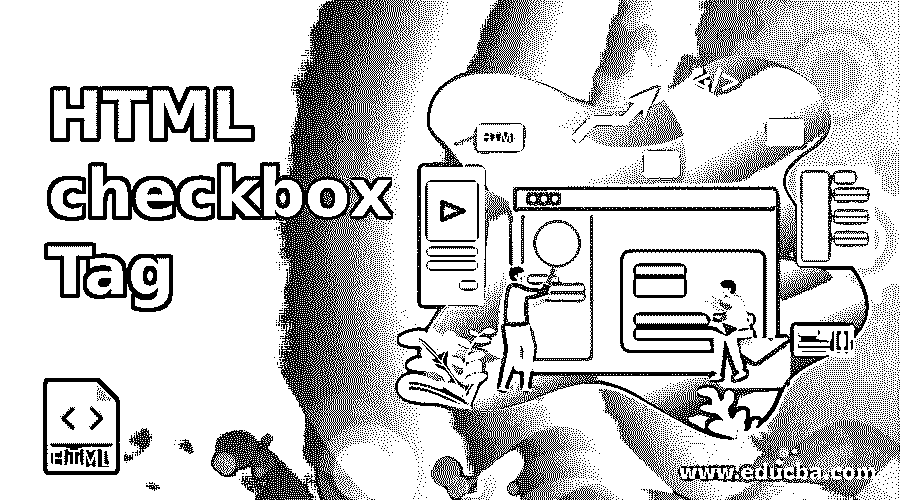
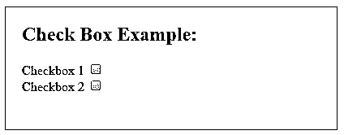
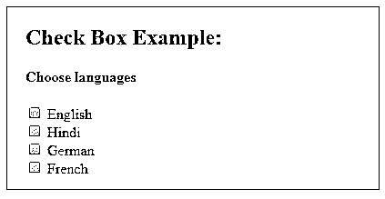
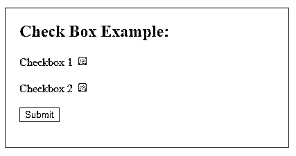

# HTML 复选框标记

> 原文：<https://www.educba.com/html-checkbox-tag/>




## HTML 复选框标记简介

复选框是 HTML 中可用的一种输入元素，它允许用户选中它或不选中它，并允许用户选择或取消选择网页上显示的选项。复选框允许应用程序以框的形式显示供选择的输入，并为用户提供选择或取消选择所显示选项的访问权限。HTML 复选框可以以是/否声明或协议类声明的形式供用户选择；根据该值，可以实现不同的功能。

**语法:**

<small>网页开发、编程语言、软件测试&其他</small>

就像其他输入类型参数一样，在复选框的情况下，我们将把输入类型更改为“checkbox”。

```
<input type = "checkbox">
```

就像其他类型的输入一样，我们可以在语法中添加额外的参数。

**HTML 复选框标签的功能**

*   HTML checkbox 标记将值 true 或 false 作为参数“checked”分配给 input 元素。
*   当我们单击复选框时，它会将该元素的值修改为 true 或 false，然后可以进一步用于检查。

### HTML 复选框标记的示例

以下是 HTML 复选框标记的示例:

#### 示例 1–创建一个简单的复选框。

**代码**:

```
<!DOCTYPE html>
<html>
<head>
<title>
Checkbox in HTML
</title>
<style>
.results {
border : green 1px solid;
background-color : aliceblue;
text-align : left;
padding-left : 20px;
height : 150px;
width : 95%;
}
.resultText {
font-size : 20px;
font-style : normal;
color : blue;
}
</style>
</head>
<body>
<div class = "results">
<h2> Check Box Example: </h2>
<!-- Declare input box with type as checkbox, we have also assigned name to this element-->
Checkbox 1 <input type = "checkbox" name = "checkbox1" >
</br>
Checkbox 2 <input type = "checkbox" name = "checkbox2" >
<p id = "result"> </p>
</div>
</body>
</html>
```

**输出**:




这里，我们在网页上声明了两个输入元素，分别为 checkbox 1 和 Checkbox 2。我们没有对点击复选框采取任何行动。

#### 示例 2–多个选择元素。

**代码**:

```
<!DOCTYPE html>
<html>
<head>
<title>
Checkbox in HTML
</title>
<style>
.results {
border : green 1px solid;
background-color : aliceblue;
text-align : left;
padding-left : 20px;
height : 200px;
width : 95%;
}
.resultText {
font-size : 20px;
font-style : normal;
color : blue;
}
</style>
</head>
<body>
<div class = "results">
<h2> Check Box Example: </h2>
<!-- Declare two input boxes with type as checkbox -->
<h4> Choose languages </h4>
<div>
<input type = "checkbox" name = "English">
<label for = "English"> English </label>
</div>
<div>
<input type = "checkbox" name = "Hindi" >
<label for = "Hindi" > Hindi </label>
</div>
<div>
<input type = "checkbox" name = "German" >
<label for = "German" > German </label>
</div>
<div>
<input type = "checkbox" name = "French" >
<label for = "French" > French </label>
</div>
<p id = "result"> </p>
</div>
</body>
</html>
```

**输出:**




这个例子展示了我们如何同时创建多个复选框输入元素。这里，我们总共创建了四个用于选择语言的复选框元素。请注意，我们可以一次选择多个复选框；这与单选按钮输入相反，单选按钮输入只能从所有显示的元素选项中选择一个选项。

#### 示例# 3–检查属性。

从前面的例子中可以看出，在加载网页时，复选框是未选中的。如果我们想显示一个默认选中的复选框，我们可以在 checkbox 元素中使用“checked”属性。

**代码:**

```
<!DOCTYPE html>
<html>
<head>
<title>
Checkbox in HTML
</title>
<style>
.results {
border : green 1px solid;
background-color : aliceblue;
text-align : left;
padding-left : 20px;
height : 200px;
width : 95%;
}
.resultText {
font-size : 20px;
font-style : normal;
color : blue;
}
</style>
</head>
<body>
<div class = "results">
<h2> Check Box Example: </h2>
<!-- Declare two input boxes with type as checkbox -->
<h4> Choose languages </h4>
<div>
<input type = "checkbox" name = "English" checked>
<label for = "English"> English </label>
</div>
<div>
<input type = "checkbox" name = "Hindi" checked>
<label for = "Hindi" > Hindi </label>
</div>
<div>
<input type = "checkbox" name = "German" >
<label for = "German" > German </label>
</div>
<div>
<input type = "checkbox" name = "French" >
<label for = "French" > French </label>
</div>
<p id = "result"> </p>
</div>
</body>
</html>
```

**输出:**


这里，在四个复选框元素中，我们将两个复选框默认为选中状态。注意:默认情况下，前两种语言显示为选中状态。

#### 示例 4–HTML 表单中的复选框。

使用复选框的另一种方式。它将以 HTML 形式添加，我们将看到如何识别复选框是否被选中。

**代码**:

```
<!DOCTYPE html>
<html>
<head>
<title>
Checkbox in HTML
</title>
<style>
.results {
border : green 1px solid;
background-color : aliceblue;
text-align : left;
padding-left : 20px;
height : 200px;
width : 95%;
}
.resultText {
font-size : 20px;
font-style : normal;
color : blue;
}
</style>
</head>
<body>
<div class = "results">
<h2> Check Box Example: </h2>
<form>
<div>
Checkbox 1 <input type = "checkbox" name = "checkbox1" id = "selected" value = "Yes" >
</div>
<br>
<div>
Checkbox 2 <input type = "checkbox" name = "checkbox2" id = "selected" value = "Yes" >
</div>
</br>
<div>
<button type = "submit" > Submit </button>
</div>
</form>
<p id = "result"> </p>
</div>
</body>
</html>
```

**输出:**




这里，我们在表单元素中包含了复选框元素。这对于在服务器上处理复选框的值很有用。当表单提交到服务器时，复选框的值也将随表单一起发送。该值可以在生成的 URL 中看到；它被创建为复选框的名称，后跟 checkbox 元素中的 value 属性。

例如，在我们的例子中，当两个复选框都被选中时，URL 将包含“checkbox1=Yes&checkbox2=Yes”。

### 结论

HTML 中的复选框是一种输入元素，用于选择或取消选择用户显示的选项。在本文中，我们已经看到了相同的多个用例。

### 推荐文章

这是一个 HTML 复选框标签的指南。这里我们分别讨论 HTML checkbox 标签的简介、功能和不同的例子。您也可以看看以下文章，了解更多信息–

1.  [HTML 中标签的类型](https://www.educba.com/types-of-tags-in-html/)
2.  [HTML 向左浮动](https://www.educba.com/html-float-left/)
3.  [在 HTML 中嵌入标签](https://www.educba.com/embed-tag-in-html/)
4.  [HTML 中的画布标签](https://www.educba.com/canvas-tag-in-html/)


