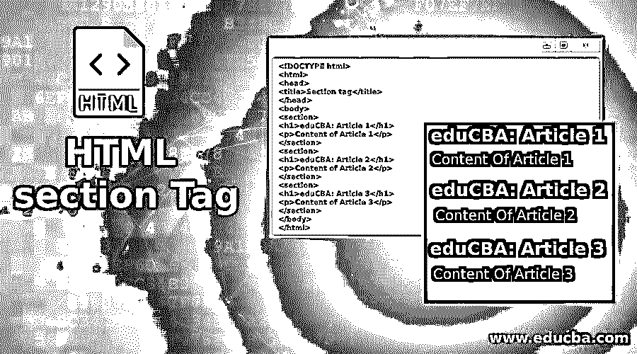
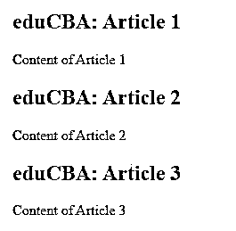
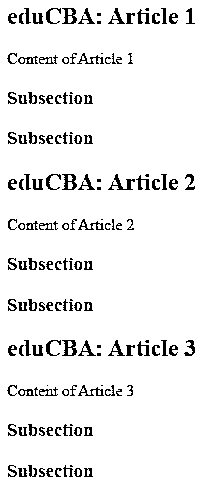
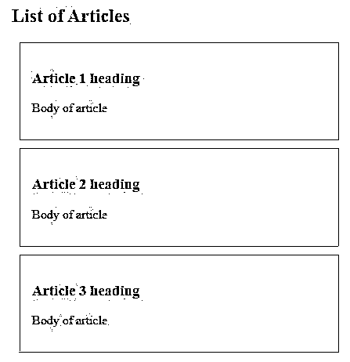
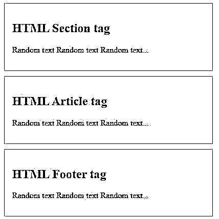

# HTML 部分标签

> 原文：<https://www.educba.com/html-section-tag/>




## HTML 节标签介绍

下面的文章提供了 HTML section 标签的概要。HTML

标签用于定义文档的章节，如页眉、章节、页脚等。标签将网页内容分成小节和子小节。它通常在需要两个页脚或页眉或任何其他新部分时使用。Section 标记通常对相关内容的一般块进行分组。使用

标签的主要优势在于它是一个语义元素，向开发者和浏览器描述了它的含义。


### 章节标签需要注意的要点

HTML5 中的部分标签需要开始和结束标签，即

……..

<small>网页开发、编程语言、软件测试&其他</small>

*   标签用于将内容分成两部分，即，它将内容分成小节和子小节。

*   section 标记允许的内容类型是流动内容意味着作为父级的

    <address>标记不能有嵌套的

    <address>元素，那么相同的

    <address>内容不能有

    <address>标记作为其父级、分段内容和可触及内容。</address>

    </address>

    </address>

    </address>

*   重要的是，

    元素不能是

    <address>元素的后代。</address>

    

*   每个

    都应该被可视化，通常通过引入一个标题标签作为

    元素的子元素。

    

*   如果我们需要单独联合一个

    元素的内容，那么我们可以使用一个

    标签来代替。

    

*   元素不应用作通用容器；这就是的作用，尤其是当切片仅用于造型目的时。一个经验法则是

    标签应该逻辑地出现在文档的轮廓上。

    

*   元素是一个语义元素，它向人类和用户代理提供关于所包含内容的含义，集中在文档的一个部分。它是一个通用的语义元素，所以当其他语义容器元素(article、side 和 nav)都不合适时，应该使用它。

**语法:**

下面是提到的语法:

**HTML/XHTML**

```
<body>
 ... 
<body>
```

**CSS**

```
section{
--your css code—
}
```

### Html 部分标记的属性

下面是提到的一些属性:

#### 1.特定于标签的属性

没有与

标签一起使用的特定属性。

#### 2.全局属性

与所有其他 HTML 标签相似，

标签也支持 HTML5 中的全局属性。

以下是全局属性:

*   奥纳博特
*   自动完成
*   onautocompletererror
*   onblur
*   oncancel
*   在线播放
*   在线播放
*   昂哥
*   onclick
*   无糖的
*   oncontextmenu
*   oncuechange
*   ondblclick(点击鼠标)
*   忍无可忍
*   不可忍受
*   翁德拉贡特
*   ondragexit
*   软骨叶
*   翁德拉戈弗
*   ondragstart
*   ondrop
*   老化变化
*   一个提示
*   统一的
*   不良事件
*   专注，
*   oninput
*   on 无效
*   onkeydown
*   onkeypress
*   onkeyup
*   装载
*   onloadeddata
*   onloadedmetadata
*   onloadstart
*   onmousedown
*   onmouseenter
*   onmouseleave
*   onmousemove
*   onmouseout
*   onmouseover
*   是 mouseup
*   onmousewheel
*   暂停
*   monplay
*   播放中
*   onprogress
*   最新变化
*   onreset
*   onresize
*   onscroll
*   被发现
*   观察
*   onselect
*   昂秀
*   onsort
*   安装
*   昂松宾
*   暂停
*   按时更新
*   ontoggle
*   on volume exchange
*   等待中

#### 3.事件属性

没有与

标签一起使用的事件属性。

### 

标签中的 CSS 文本格式属性

下面给出了 CSS 文本格式属性:

*   文本颜色
*   文本对齐
*   文本装饰
*   文本转换
*   行高
*   文本方向
*   文本阴影
*   单词间距

### 

标签中的 CSS 字体属性

下面给出了 CSS 字体属性:

*   字体样式:正常|斜体|倾斜|首字母|继承
*   字体变体:normal | small-caps | initial | inherit
*   font-weight:normal | bold | bold | light | number | initial | inherit
*   font-size:medium | xx-small | x-small | small | large | x-large | xx-large | small | large | length | initial | inherit
*   font-family:family-name | generic-family | initial |继承

### 

<address>标签的 CSS 测试阴影属性</address>

下面给出了 CSS 测试阴影属性:

```
<style>
address{
text-shadow: 1px 1px #FF0000;
}
</style>
```

### HTML 部分标签的例子

以下是 HTML 部分标签的示例:

#### 示例#1

代码:

```
<!DOCTYPE html>
<html>
<head>
<title>Section tag</title>
</head>
<body>

<h1>eduCBA: Article 1</h1>
<p>Content of Article 1</p>


<h1>eduCBA: Article 2</h1>
<p>Content of Article 2</p>


<h1>eduCBA: Article 3</h1>
<p>Content of Article 3</p>

</body>
</html>
```

**输出:**




#### 实施例 2

嵌套的节标记。

只有当子节和小节具有相同的字体属性时，

标签才可以嵌套，其中子节的字体大小小于小节。子部分用于组织复杂的数据。

**代码:**

```
<!DOCTYPE html>
<html>
<head>
<title>Section tag</title>
</head>
<body>

<h1>eduCBA: Article 1</h1>
<p>Content of Article 1</p>

<h1>Subsection</h1>
<h1>Subsection</h1>


<h1>eduCBA: Article 2</h1>
<p>Content of Article 2</p>

<h1>Subsection</h1>
<h1>Subsection</h1>


<h1>eduCBA: Article 3</h1>
<p>Content of Article 3</p>

<h1>Subsection</h1>
<h1>Subsection</h1>


</body>
</html>
```

**输出:**




#### 实施例 3

**代码:**

```
<!DOCTYPE html>
<html>
<head> . . . </head>
<body>

<h1>HTML Section tag example</h1>

<main>
 An article on HTML Section tag
</main>
 Body of an article 

Copyright &copy;2020- EDUCBA.
<address> A- 406, Boomerang, Chandivali Farm Road,
Yadav Nagar, Chandivali, Powai,
Maharashtra, Mumbai - 400072\. </address>

</body>
</html>
```

**输出:**


#### 实施例 4

**代码:**

```
<!DOCTYPE>
<html>
<head>
<style&gt
section{
border:1px solid pink;
padding:15px;
margin:10px;
}
</style>
</head>
<body>
<h2> List of Articles</h2>

<h3>Article 1 heading</h3>
<p> Body of article </p>


<h3>Article 2 heading</h3>
<p> Body of article </p>


<h3>Article 3 heading</h3>
<p> Body of article </p>

</body>
</html>
```

**输出:**




#### 实施例 5

在 HTML5 中创建

标签时，我们可以使用 class 或 id 属性，其中每个 id 都应该是惟一的，并且 class 可以在必要时多次使用。

我们应该始终有一个标题元素(H1 到 H6)作为部分的一部分。如果不能给这个部分一个标题，我们可以使用

元素，这可能更合适，并且永远不要仅仅为了放置样式而使用

标签。

**代码:**

```
<!DOCTYPE>
<html>
<head>
<style>
section{
border:1px solid pink;
padding:15px;
margin:10px;
}
</style>
</head>
<body>

<h2>HTML Section tag</h2>
<p>Random text Random text Random text...</p>


<h2>HTML Article tag</h2>
<p>Random text Random text Random text...</p>


<h2>HTML Footer tag</h2>
<p>Random text Random text Random text...</p>

</body>
</html>
```

**输出:**




### 结论

元素是一种结构化的 HTML 元素，用于将所有相关的元素组合在一起。每个

通常包括一个或多个标题元素和表示相关内容的附加元素。

是一个新的 HTML5 元素，用于定义文档的重要部分。最好在文章中使用，以定义导航或在页眉或页脚中使用。如果内容的某个部分应该有自己的标题，并且该标题会列在理论或实际的目录中，那么它应该作为

放置。


### 推荐文章

这是一个 HTML 部分标签的指南。这里我们讨论介绍、Html section 标签的属性和例子。您也可以看看以下文章，了解更多信息–

1.  [HTML 中的地址标签](https://www.educba.com/address-tag-in-html/)
2.  [基本 HTML 标签](https://www.educba.com/basic-html-tags/)
3.  [HTML 中的画布标签](https://www.educba.com/canvas-tag-in-html/)
4.  [HTML 图标签](https://www.educba.com/html-figure-tag/)


