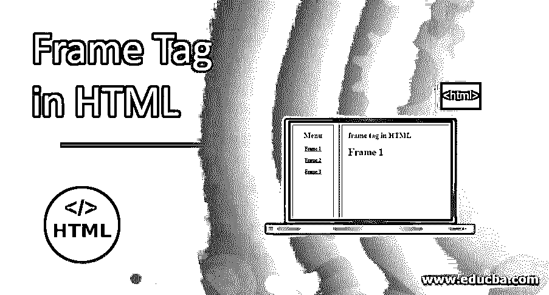
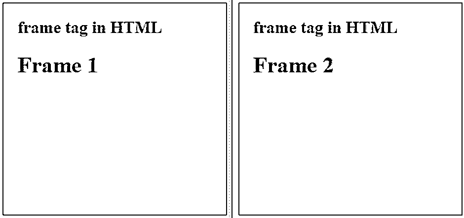
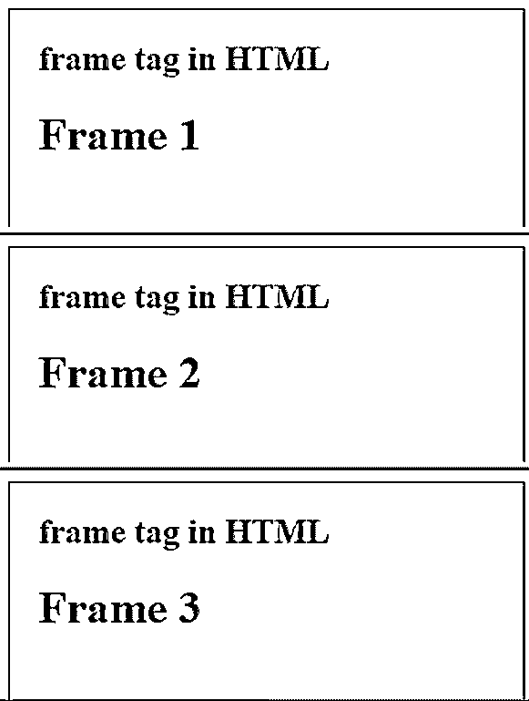
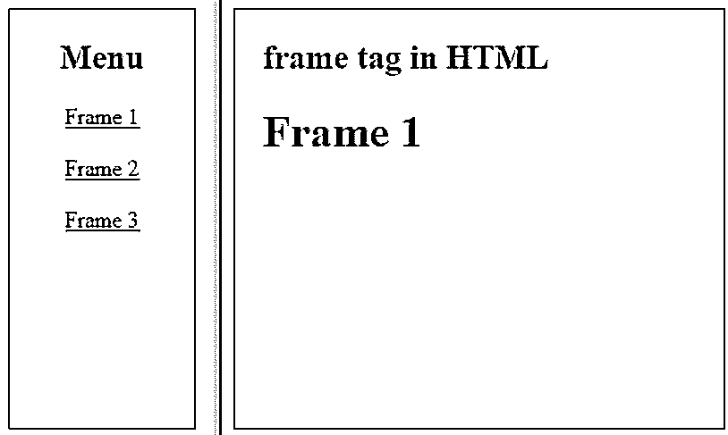

# HTML 中的框架标签

> 原文：<https://www.educba.com/frame-tag-in-html/>




## HTML 中的框架标签介绍

HTML 框架标签用于在单个网页上以区域的形式显示多个站点。这个标签允许设计一个网页，使得具有不同内容的多个网页可以被组合并单独显示在一个网页上。这是通过将单个网页分成不同的部分来实现的，这些部分可以称为框架。单个帧可以单独加载。框架标签与框架集标签一起使用，其中框架集标签可以被视为容器，并且其中的多个框架标签将代表多个站点。

**语法:**

<small>网页开发、编程语言、软件测试&其他</small>

框架标签的基本语法如下，

```
<frame src = "URL">
```

src 属性指定文件的来源。标签支持一些其他属性，但 src 是主要属性。

如上所述，标签与标签一起使用。框架集可以被认为是多个框架的集合，其中每个框架将代表要加载到同一页面上的单个站点。框架标签将与框架集标签一起使用，如下所示，

```
<frameset>
<frame src = " ">
<frame src = " ">
.
.
<frame src = " ">
</frameset>
```

请注意，框架集标签有结束标签，但框架标签没有。

### HTML 中框架标签的例子

html 中的框架标签示例如下:

#### 示例# 1–水平对齐框架

有三个文件 frame1、frame2 和 main。

##### Frame1.html

**代码:**

```
<!DOCTYPE html>
<html>
<head>
<title> Frame tag Example </title>
<style>
body {
text-align: center ;
background-color: rgb(120, 120, 120, 0.30 ) ;
}
.results {
border : green 1px solid;
background-color : aliceblue;
text-align : left;
padding-left : 20px;
height : 300px;
width : 95%;
}
</style>
</head
<body>
<div class = "results">
<h2> frame tag in HTML </h2>
<h1> Frame 1 </h1>
</div>
</body>
</html>
```

##### Frame2.html

**代码:**

```
<!DOCTYPE html>
<html>
<head>
<title> frame tag Example </title>
<style>
body {
text-align: center ;
background-color: rgb(120, 120, 120, 0.30 ) ;
}
.results {
border : green 1px solid;
background-color : aliceblue;
text-align : left;
padding-left : 20px;
height : 300px;
width : 95%;
}
</style>
</head
<body>
<div class = "results">
<h2> frame tag in HTML </h2>
<h1> Frame 2 </h1>
</div>
</body>
</html>
```

##### Main.html

**代码:**

```
<!DOCTYPE html>
<html>
<head>
<meta name = "viewport" content=
"width = device-width, initial-scale = 1.0">
<title>
frame tag in HTML
</title>
<frameset cols = "50%, 50%" >
<frame src = "frame1.html" >
<frame src = "frame2.html" >
</frameset>
</head>
<body>
</body>
</html>
```

**Output** :这里我们使用了 cols 属性将它们指定为一列，每一帧的宽度都设置为 50%。




#### 示例 2–垂直对齐框架

有四个文件 frame1、frame2、frame3 和 main。

##### Frame1.html

**代码:**

```
<!DOCTYPE html>
<html>
<head>
<title> Frame tag Example </title>
<style>
body {
text-align: center ;
background-color: rgb(120, 120, 120, 0.30 ) ;
}
.results {
border : green 1px solid;
background-color : aliceblue;
text-align : left;
padding-left : 20px;
height : 300px;
width : 95%;
}
</style>
</head
<body>
<div class = "results">
<h2> frame tag in HTML </h2>
<h1> Frame 1 </h1>
</div>
</body>
</html>
```

##### Frame2.html

**代码:**

```
<!DOCTYPE html>
<html>
<head>
<title> frame tag Example </title>
<style>
body {
text-align: center ;
background-color: rgb(120, 120, 120, 0.30 ) ;
}
.results {
border : green 1px solid;
background-color : aliceblue;
text-align : left;
padding-left : 20px;
height : 300px;
width : 95%;
}
</style>
</head
<body>
<div class = "results">
<h2> frame tag in HTML </h2>
<h1> Frame 2 </h1>
</div>
</body>
</html>
```

##### Frame3.html

**代码:**

```
<!DOCTYPE html>
<html>
<head>
<title> Frame tag Example </title>
<style>
body {
text-align: center ;
background-color: rgb(120, 120, 120, 0.30 ) ;
}
.results {
border : green 1px solid;
background-color : aliceblue;
text-align : left;
padding-left : 20px;
height : 300px;
width : 95%;
}
</style>
</head
<body>
<div class = "results">
<h2> frame tag in HTML </h2>
<h1> Frame 3 </h1>
</div>
</body>
</html>
```

##### Main.html

**代码:**

```
<!DOCTYPE html>
<html>
<head>
<meta name = "viewport" content=
"width = device-width, initial-scale = 1.0">
<title>
frame tag in HTML
</title>
<frameset rows = "30%, 30%, 30%" >
<frame src = "frame1.html" >
<frame src = "frame2.html" >
<frame src = "frame3.html" >
</frameset>
</head>
<body>
</body>
</html>
```

**输出:**这里我们已经在 frameset 标签上使用了 cols 属性来水平划分框架，高度已经用百分比提到了。




#### 示例 3–使用链接导航不同的框架

在本例中，frame1.html、frame2.html 和 frame3.html 这三个文件是相同的。

我们将使用带有框架标签的名称属性。

##### Main.html

**代码:**

```
<!DOCTYPE html>
<html>
<head>
<meta name = "viewport" content=
"width = device-width, initial-scale = 1.0">
<title>
frame tag in HTML
</title>
<frameset cols = "30%, * " >
<frame src = "menu.html" name = "menu" >
<frame name = "frame" >
</frameset>
</head>
<body>
</body>
</html>
```

##### menu.html

**代码:**

```
<!DOCTYPE html>
<html>
<head>
<title> Frame tag Example </title>
<style>
body {
text-align: center ;
background-color: rgb(120, 120, 120, 0.30 ) ;
}
.results {
border : green 1px solid;
background-color : aliceblue;
text-align : center;
height : 300px;
width : 95%;
}
</style>
</head
<body>
<div class = "results">
<h2> Menu </h2>
<a href = "frame1.html" target = "frame"> Frame 1 </a> </br> </br>
<a href = "frame2.html" target = "frame"> Frame 2 </a> </br> </br>
<a href = "frame3.html" target = "frame"> Frame 3 </a>
</div>
</body>
</html>
```

在 frameset 标记中，我们将两个框架分为第一个框架 30%的宽度和第二个框架的剩余宽度。第一个框架将以超链接的形式列出菜单。对于第二个框架，我们为它指定了一个名称，在 menu.html 中，我们将目标设置为每个链接的框架名称。所以，这个链接会指引框架，内容会显示在同一个框架上。

**输出:**




**Note:** <frame> tag is not supported in a HTML5, instead <iframe> tag can be used.

### 推荐文章

这是一个 HTML 框架标签的指南。这里我们还讨论了 HTML 中框架标签的介绍，以及相应的语法和例子。您也可以看看以下文章，了解更多信息–

1.  [HTML 框架集标签](https://www.educba.com/html-frameset-tag/)
2.  [HTML 文章标签](https://www.educba.com/html-article-tag/)
3.  [HTML 中标签的类型](https://www.educba.com/types-of-tags-in-html/)
4.  [HTML 中的画布标签](https://www.educba.com/canvas-tag-in-html/)


