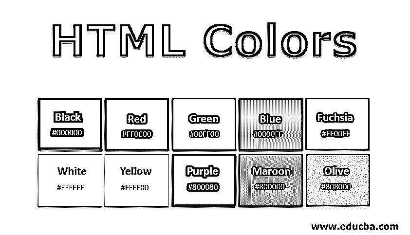
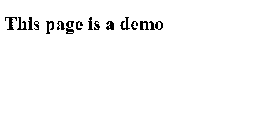
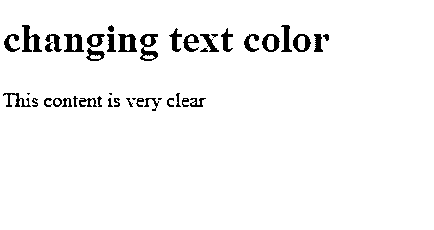
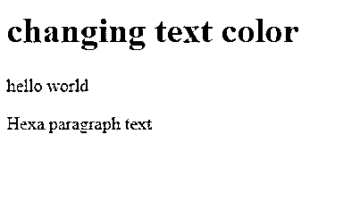
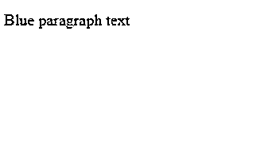
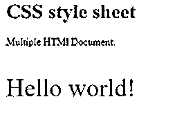
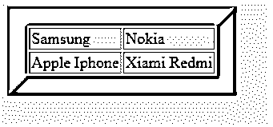
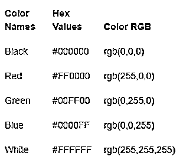
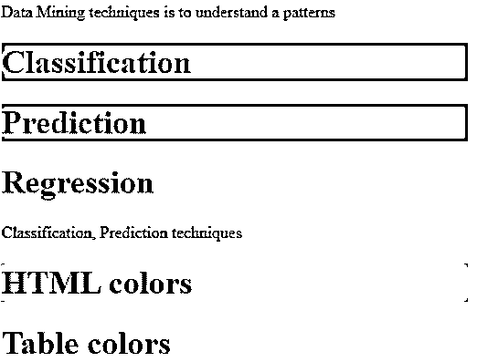
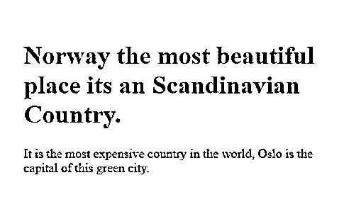

# HTML 颜色

> 原文：<https://www.educba.com/html-colors/>




## HTML 颜色介绍

这篇文章讲述了如何在使用 HTML 的网站中以简单和容易的方式使用颜色。颜色在创建外观和感觉良好的网站中起着重要的作用。HTML 内置没有单独的标签；相反，它使用样式属性或颜色属性。确切地说，颜色是使用层叠样式表(CSS)嵌入到 HTML 元素中的。颜色给网页带来优雅的外观。给网页添加颜色包括设置背景色、表格、段落等。

### 如何在 HTML 中设置背景颜色？

让背景颜色变亮会让网站看起来更漂亮、更醒目。这是通过使用颜色，十六进制颜色代码。RGB 和 RGBA 颜色值(Alpha 值从 0 到 1)。

<small>网页开发、编程语言、软件测试&其他</small>

使用 Html 的 body 元素中的 Style 属性将十六进制颜色直接应用于 Html 代码。十六进制是数字和字母的组合。下面是说明网页背景颜色的例子。

**代码:**

```
<!DOCTYPE html>
<title>My Sample</title>
<html>
<head>
<title>HTML BG Color</title>
</head>
<body style="background-color:red;">
<h1> This page is a demo </h1>
</body>
</html>
```

**代码片段:**




要添加背景色，可以使用 bgcolor 属性来显示< body bgcolor=’ ‘>。它兼容除 HTML 5 之外的所有浏览器。

**代码:**

```
<h3 style="color: blue">Color Name</h3>
<h3 style="color: #0000ff">Hexadecimal</h3>
<h3 style="color: rgb (0,0,255)">RGB Value</h3>
```

### 如何给 HTML 中的文本应用颜色？

将颜色应用到 HTML 文本非常容易；我们可以通过三种方式添加/改变文本的颜色，即十六进制颜色、HSL 值[和颜色名称](https://www.educba.com/color-name-in-html/)。以下是将颜色应用于相应网页的三种不同技术。

#### 1.颜色名称

这是非常简单的使用英文颜色名称，当应用程序是直截了当的这些颜色名称被使用。指定颜色名称是直接的方法，W3C 已经宣布了 16 种基本颜色(黑色、黄色、红色、栗色、灰色、石灰色、绿色、橄榄色、银色、浅绿色、蓝色、藏青色、白色、紫色、紫红色、蓝绿色)

#### 2.high-speedlaunch 高速快艇

色调饱和度和亮度颜色值。色调定义为 0 到 360 度，饱和度和亮度从 0 到 100 %。

#### 3.十六进制颜色

为了获得精确的结果，应用了六位十六进制数。具体来说，前两个数字表示红色，接下来的两个数字表示绿色，另外两个数字表示蓝色值，前面带有“#”。

以下示例解释了将颜色应用于文档的不同方式。

**代码:**

```
<head>
<title>EDUCBA</title>
<style type="text/css">
h1{
color:#97cae0;
background-color: hsl(200, 50%, 20%);
color: hsl(200, 20%, 90%);
}
h4{
color:rgb(0, 255, 0);
background-color: hsl(130, 10%, 30%);
color: hsl(280, 20%, 80%);
}
li{
color:rgba(12, 88, 120, 1);
background-color: hsl(210, 36%, 50%);
color: hsl(145, 45%, 81%);
}
</style>
</head>
<body>
<h1>EDUCBA</h1>
<h4>List of operating System</h4>
<ul>
<li> Windows</li>
<li>MACINTOSH</li>
<li>LINUX</li>
<li>UBUNTU</li>
</ul>
</body>
</html>
```

**输出:**


有不同的方法来做文本颜色，因为 HTML 有很多可定制的应用程序。

*   应用样式部分
*   创建单个 CSS 样式表
*   文本换行

### 如何使用

让我们看看使用 HTML 颜色的各种方法:

#### 1.使用 HTML 颜色换行

下面的代码用简单的 HTML 代码改变了段落中文本的颜色。网站上有 140 个不同颜色的名字。

下面的代码演示了如何使用

**代码:**

```
<!DOCTYPE html>
<title> Text color</title>
<html>
<head>
<title>HTML BG Color</title>
</head>
<body >
<h1> changing text color </h1>
<p> This content is very clear </p>
<p style="color: pink;"> pink paragraph text </p>
</body>
</html>
```

**输出:**




#### 2.使用 HEXCOLOR

同样，该示例使用 style 部分声明十六进制颜色，后跟一个“#”符号。

**代码:**

```
<!DOCTYPE html>
<html>
<head>
<title> Color Picker</title>
</head>
<body >
<h1> changing text color  </h1>
<p> hello world </p>
<p style="color:#8e47b1"> Hexa paragraph text </p>
</body>
</html>
```

**输出:**




#### 3.使用 RGB 颜色

红、绿、蓝各使用 8 位，它们的值从 0 到 255 不等，产生各种颜色。以下示例根据 RGB 颜色的值选取颜色。

**代码:**

```
<!DOCTYPE html>
<html>
<head>
<title> Color Picker</title>
</head>
<body>
<p style="color:rgb(0,0,255);">Blue paragraph text</p>
</body>
</html>
```

**输出:**




#### 4.使用样式表的方法

**代码:**

```
<!DOCTYPE html>
<html lang="en">
<head>
<meta charset="UTF-8">
<title> Style Sheet in HTML</title>
<style type="text/css">
@import url("https://cdn.educba.com/examples/css/style.css");
p {
color: green;
font-size: 26px;
}
</style>
</head>
<body>
<h1>The styles for Html documents</h1>
<p> Each tag to be styled with colors.</p>
</body>
</html>
```

**输出:**


#### 5.创建单独的 CSS 样式

**代码:**

**。html 文件:**

```
<!DOCTYPE html>
<html>
<head>
<link rel="stylesheet" type="text/css" href="lcolor.css">
</head>
<body>
<h1>  CSS style sheet</h1>
<p>Multiple HTMl Document.</p>
<p class="lcolor">Hello world!</p>
</body>
</html>
```

**外部 CSS 文件 lcolor.css:**

**代码:**

```
.lcolor { font-size: 40px;
color:red }
```

**输出:**




### 如何在 HTML 中设置边框颜色？

这是使用属性 border color= " "完成的。这是使用 Html 元素完成的，甚至我们可以创建 3D 效果。使用不同的属性应用边框颜色，如 border= "width "，bordercolor= "color def "，bordercolorlight= " "。CSS 有一些增强的边框属性，有助于创建边框。以下示例显示了如何为相应的表格设置单个边框颜色。这里表示表格行，

| Represents table data, and starts with the tag. And their borders

are applied using their width and color. |

**代码:**

```
<!DOCTYPE html>
<html>
<head>
<table border="8" bordercolor="Orange">
<tr>
<td>Chicago</td>
<td>new york</td>
<td> Texas</td>
<td> California </td>
</tr>
</table> </head>
</html>
```

**输出:**


现在让我们来看看分别设置两种边框颜色。下面的代码使用 table 属性及其元素。

**代码:**

```
<!DOCTYPE html>
<html>
<head>
<TABLE BORDER=20 BORDERCOLORLIGHT= BLUE BORDERCOLORDARK= ROSE> <TR> <TD> Samsung</TD> <TD> Nokia</TD> </TR> <TR> <TD> Apple Iphone</TD> <TD>  Xiami Redmi</TD> </TR> </TABLE>
</head>
</html>
```

**输出:**




**使用< div >标签**

它用于对所有元素进行分组，并有助于查看网页的特定位置。在下面的代码中，我们使用了两个

,一个用于段落，另一个通过设置边框像素来实现样式属性，并通过给出宽度来增加厚度，我们还添加了填充以在左侧演示它们。

**代码:**

```
<!DOCTYPE html>
<html lang="en">
<head>
<meta charset="utf-8" />
<title> Sample border color using div</title>
</head>
<body>
<div><p> Nature is beautiful</p></div>
<div style="border:4px dashed #c62d64;padding-left:3px;"><p> div with a border color.</p></div>
</body>
</html>
```

**输出:**


**示例:**这解释了如何使用 class 和 list 标签设置填充和边距的颜色。

**代码:**

```
<!DOCTYPE HTML>
<HTML>
<HEAD>
<TITLE>Borders</TITLE>
<STYLE type="text/css">
UL {
background: Green;
margin: 10px 10px 5px 5px;
padding: 4px 4px 4px 4px;
}
LI {
color: red;
background:yellow;
margin: 11px 11px 7px 6px;
padding: 10px 0px 10px 10px;
list-style: none
}
LI.colorbord {
border-style: dashed;
border-width: small;
border-color: orange;
}
</STYLE>
</HEAD>
<BODY>
<UL>
<LI> DOM model
<LI class="colorbord">Document object model helps in creating document tree
</UL>
</BODY>
</HTML>
```

**输出:**


### 如何在 HTML 中使用值指定颜色？

红色、蓝色、绿色的基本颜色值从 0 到 255 不等。颜色值对于产生亮度很重要。

下表显示了颜色的示例值。




**示例:**下面的示例显示了背景设置中不同的颜色值。

**代码:**

```
<!DOCTYPE html>
<html>
<body>
<p> Data Mining techniques is to understand a patterns</p>
<h1 style="background-color:rgb(255, 91, 61);">Classification</h1>
<h1 style="background-color:#e66465;">Prediction</h1>
<h1 style="background-color:hsl(10, 70%, 100%);"> Regression</h1>
<p>Classification, Prediction techniques</p>
<h1 style="background-color:rgba(255, 80, 91, 0.4);"> HTML colors</h1>
<h1 style="background-color:hsla(100%, 9%, 62%, 0.5);"> Table colors</h1>
</body>
</html>
```

**输出:**




### 如何在 HTML 中使用 RGB 颜色值？

RGB 直接表示红色、绿色和蓝色，并使用 RGB 功能。它将这三个值作为参数，并将它们声明为整数，有时是百分比。无论我们想要什么颜色，它的强度被赋予一个更高的值 255，因为一个整数值落在 0 到 255 之间。例如，为了具有蓝色，优选表示为(0，0，255)。这里前两个值标记为 0，0，最后一个值是蓝色的 255。

**示例:RGB 颜色**

**代码:**

```
<!DOCTYPE html>
<html>
<style>
div {
background-color: rgb(255, 0, 180);
color: rgb(0, 255, 255);
padding: 30px;
}
</style>
<body>
<div>
<h1>Norway the most beautiful place it’s a Scandinavian Country. </h1>
<p> It is the most expensive country in the world, Oslo is the capital of this green city. </p>
</div>
</body>
</html>
```

**输出:**


### 如何在 HTML 中指定颜色的明度？

颜色的明度是由我们偏好的亮度定义的；它是用百分比来衡量的。大多数网页设计师希望使用比 RGB 更亮的颜色，这可以根据需要进行调整。这里黑色设置亮度为 0%，白色设置为 100%。它是使用函数 hsl()指定的。

**代码:**

```
<!DOCTYPE html>
<html>
<style>
div {
background-color: hsl(150, 50%, 60%);
color: hsl(100%, 0%, 0%);
padding: 30px;
}
</style>
<body>
<div>
<h1>Norway the most beautiful place its an Scandinavian Country.</h1>
<p>It is the most expensive country in the world, Oslo is the capital of this green city.</p>
</div>
</body>
</html>
```

**输出:**




在上面的例子中，你可以尝试不同的颜色值。

### 结论–HTML 颜色

所以，总结一下，我们已经看到这有不同的性质。在早期，web 开发有许多方法来为他们的网站指定颜色，而现在，最流行的颜色是 RGB 和十六进制颜色代码(RGB 是众所周知的)。有不同的应用程序实现颜色，如滑动比例，调色板等。

### 推荐文章

这是一个 HTML 颜色的指南。在这里我们讨论介绍，如何在 HTML 中设置背景颜色，如何在 HTML 中给文本应用颜色，等等。您也可以浏览我们推荐的其他文章，了解更多信息——

1.  [HTML 表格标签](https://www.educba.com/html-table-tags/)
2.  [在 HTML 中创建表格](https://www.educba.com/create-tables-in-html/)
3.  [HTML 字体样式](https://www.educba.com/html-fonts-styles/)
4.  [HTML 表单元素](https://www.educba.com/html-form-elements/)


