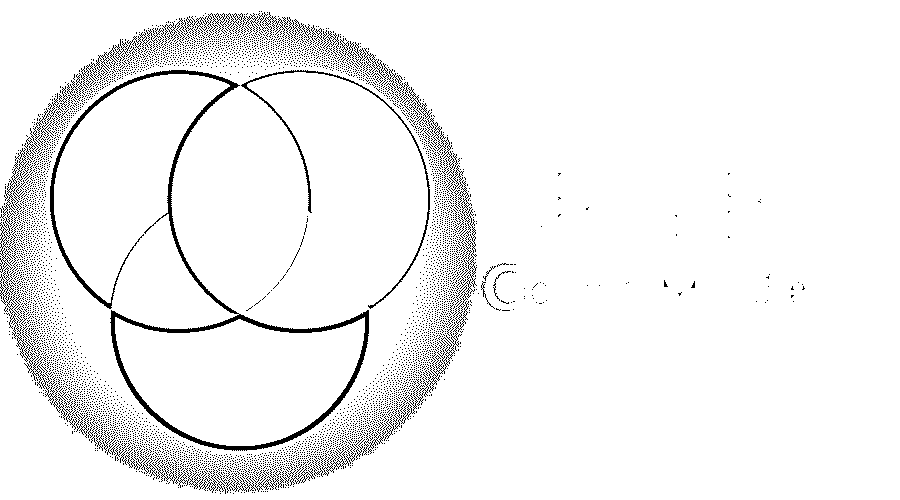

# RGB 颜色模型

> 原文：<https://www.educba.com/rgb-color-model/>

## 什么是 RGB 颜色模型？

RGB 颜色模型是一种加色模型，其中红色、绿色和蓝色以各种比例混合在一起，形成不同的颜色阵列。这个名字是由红、绿、蓝三原色的首字母命名的。在这个模型中，颜色是通过添加组件来准备的，白色包含所有颜色，黑色不包含任何颜色。RGB 颜色模型用于各种数字显示器，如电视和视频显示器、计算机显示器、数码相机和其他基于光的显示设备。

### 了解 RGB 颜色模型

颜色模型是使用几种原色创建更多颜色的过程。有两种颜色模型:加色模型和减色模型。在加色中，模型光用于显示颜色。而在减色模式中，印刷油墨用于产生颜色。最常用的加色模式是 RGB 颜色模式，CMYK 颜色模式用于打印。

<small>网页开发、编程语言、软件测试&其他</small>

RGB 颜色模型是使用红色、绿色和蓝色的加色模型。RGB 颜色模型的主要用途是在电子设备上显示图像。在 RGB 颜色模型的这个过程中，如果三种颜色以最少的强度叠加，那么就形成了黑色，如果加上全强度的光，那么就形成了白色。为了形成不同的颜色阵列，这些原色应该以不同的强度叠加。根据一些研究，每种原色的强度可以从 0 到 255 不等，从而产生了近 16，777，216 种颜色。

### 为 RGB 颜色模型工作

正如我们上面已经讨论过的，RGB 颜色模型背后的基本原理是加色混合。它是将红、绿、蓝三原色以不同的比例混合在一起以产生更多不同颜色的过程。

对于每一种原色，它可以有 256 种不同的色调。因此，通过添加三原色的 256 种色调，我们可以产生超过 1600 万种不同的颜色。视锥细胞或光感受器是人眼负责颜色感知的一部分。在 RGB 颜色模型中，通过同时刺激不同的视锥细胞，原色的组合产生了我们感知的不同颜色。

如上图所示，红、绿、蓝光的加入会让我们感知到不同的颜色。例如，如果我们将蓝光和绿光按一定比例组合，就会导致青色的形成。如果我们把红光和绿光结合起来，就会产生黄光。

### RGB 颜色模型的使用

以下是 RGB 颜色的一些用途，如下所示:

#### 1.显示器中的 RGB

RGB 颜色模型的主要应用是显示数字图像。它用于阴极射线管、LCD 显示器和 LED 显示器，如电视机、计算机显示器或大屏幕。这些显示器上的每个像素都是通过使用三个小且非常接近的 RGB 光源构建的。这些颜色在普通的观看距离下不能被分开区分，并且不能作为单一的纯色观看。

RGB 也用于分量视频显示信号。它由红、绿、蓝三种信号组成，通过三个独立的引脚或电缆传输。这些视频信号是标准 SCART 连接器能够承载的最佳质量信号。

#### 2.相机中的 RGB

使用 CMOS 或 CCD 图像传感器的用于摄影的数码相机大多使用某种类型的 RGB 颜色模型。目前的数码相机配备了 RGB 传感器，有助于以重要的方式进行光强评估。并且这导致每个图像中的最佳曝光值。

#### 3.扫描仪中的 RGB

图像扫描仪是一种扫描物理文档并将其转换为数字形式并传输到计算机的设备。有不同类型的此类扫描仪，其中大多数基于 RGB 颜色模型工作。这些扫描仪使用电荷耦合器件或接触式图像传感器作为图像传感器。彩色扫描仪通常以 RGB 值读取数据，然后用某种算法处理这些数据，将其转换为其他颜色。

### 优势

*   在屏幕上显示数据不需要转换。
*   它被认为是各种应用的基色空间
*   这是一个计算实用的系统。
*   借助于附加性能，它被用于视频显示器
*   它只涉及 CRT 应用。
*   这个模型很容易实现

### 不足之处

*   RGB 值通常不能在设备之间传输
*   感觉上不一致。
*   对于颜色识别来说并不完美
*   难以确定具体颜色
*   颜色之间的差异不是线性的

### RGB 颜色模型的示例

下面是 RGB 模型的一个示例，如下所示:

#### 1.摄影

彩色摄影中的 RGB 实验始于 19 世纪 60 年代初。从而完成了组合三个经过颜色过滤的独立镜头的过程。大多数标准相机捕捉相同的 RGB 品牌，因此它们创建的图像看起来几乎与我们的眼睛看到的完全一样。

#### 2.电脑图形图像

RGB 颜色模型是计算机图形学中使用的主要颜色表示方法[之一。它有一个由三原色组成的颜色坐标系。](https://www.educba.com/what-is-computer-graphic-design/)

#### 3.电视机

1928 年，世界上第一台 RGB 彩色电视问世。1940 年，哥伦比亚广播系统开始了 RGB 场序制彩色系统的实验。在现代，RGB 荫罩技术用于 CRT 显示器。

### 结论

科学家们发现了三种颜色，红色、绿色和蓝色，在混合时会产生许多其他颜色。他们称这些颜色为原色。当红色和绿色结合时，产生黄色，蓝色和绿色产生青色，红色和蓝色产生品红色。而这项技术后来被做成色彩模型，命名为 RGB 色彩模型。

这种颜色模型的主要目的是用于电子系统中图像的感测、表示和显示。RGB 颜色模型的发展在数字领域创造了巨大的发展。它被用于不同的电子设备，如电视、显示器、照相机、打印机等。

### 推荐文章

这是 RGB 颜色模型的指南。这里我们讨论了一些基本概念，定义，使用 RGB 颜色模型的优点和缺点。您也可以浏览我们推荐的其他文章，了解更多信息——

1.  [Photoshop 中的铅笔工具](https://www.educba.com/pencil-tool-in-photoshop/)
2.  [免费 Adobe Lightroom】](https://www.educba.com/adobe-lightroom-for-free/)
3.  [什么是 Adobe Illustrator？](https://www.educba.com/what-is-adobe-illustrator/)
4.  [Photoshop 中的模糊工具](https://www.educba.com/blur-tool-in-photoshop/)

