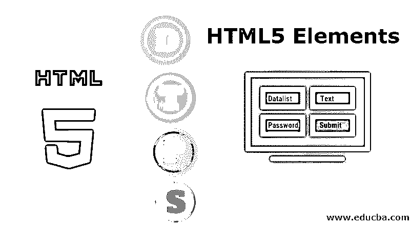

# HTML5 元素

> 原文：<https://www.educba.com/html5-elements/>




## HTML5 元素介绍

我们大多知道网站。网站只是网页的集合。创建我们需要的任何网页。HTML 是负责制作任何网页的元素。HTML 代表超文本标记语言。它是一种基本的标记语言，用于制作任何进一步构成网站的网页。 [HTML](https://www.educba.com/introduction-to-html/) 从它形成的最初阶段已经进化了这么多

W3C 和 WHATWG 最初开发了 HTML。它最初开发于 1993 年。W3C 主要检查 Html 和其他东西的标准。从最初的 1.0 版本到 5 版本，HTML 已经有了很大的发展。HTML5 有很多新的 HTML 标签。

<small>网页开发、编程语言、软件测试&其他</small>

### HTML 标签，它们的用途和例子

以下是 HTML 的一些标签及其用法，示例如下

#### HTML5 中的新元素

1)**<****datalist>–**它是 HTML5 中的新表单元素。它有助于实现自动完成功能，即出现一个输入框，用户可以在其中插入文本以查看列表中的元素

**举例:**

```
<!DOCTYPE html>
<html>
<body>
<form>
<input list="favoriteCusine" name="favoriteCusine">
<datalist id="favoriteCusine">
<option value="Noodles">
<option value="Continental">
<option value="Thai">
<option value="Asia-Pacific">
<option value="Safari">
</datalist>
</form>
</body>
</html>
```

现在，请复制上面的代码片段并粘贴到 HTML 文件中。现在，在浏览器中打开文件

**<** **输出>–**该标签表示对 HTML 文件进行的任何计算的输出

**例子**

```
<!DOCTYPE html>
<html>
<body>
<form oninput="x.value=parseInt(minInput.value)+parseInt(maxInput.value)">0
<input type="range" id="minInput" value="50">100
+<input type="number" id="maxInput" value="50">
=<output name="x" for="minInput maxInput"></output>
</form>
</body>
</html>
```

现在，请复制上面的代码片段并粘贴到 HTML 文件中。现在，在浏览中打开文件。

2)**<input type = " text ">–**该元素用于接收用户的输入。用户输入的文本通常是文本形式

**例子**

```
<!DOCTYPE html>
<html>
<body>
<form>
<div>
Favorite Football Player:
<input type="text" name="fPlayer">
</div>
<div>
Favorite Football Team:
<input type="text" name="fTeam">
</div>
<input type="submit">
</form>
</body>
</html>
```

现在，请复制上面的代码片段，粘贴到 [HTML](https://www.educba.com/html-blocks/) 文件中。现在，在浏览器中打开文件。

3)**<input type = " password ">–**该元素用于接收用户的密码。

**例子**

```
<!DOCTYPE html>
<html>
<body>
<form>
<div>
User name
<input type="text" name="uName">
</div>
<div>
Password:
<input type="password" name="pwdField">
</div>
<input type="submit">
</form>
</body>
</html>
```

现在，请复制上面的代码片段并粘贴到 HTML 文件中。现在，在浏览器中打开文件。

4) **<输入类型= "提交">–**该标签呈现一个提交按钮。此按钮用于提交表单

**示例–**在下面的示例中，用 php 文件路径更新动作值

```
<!DOCTYPE html>
<html>
<body>
<form action="./dummy.php">
<div>
Favorite Football Player:
<input type="text" name="fPlayer">
</div>
<div>
Favorite Football Team:
<input type="text" name="fTeam">
</div>
<input type="submit">
</form>
</body>
</html>
```

现在，请复制上面的代码片段并粘贴到 HTML 文件中。现在，在浏览器中打开文件。

5)**<input type = " radio ">–**该元素有助于从可用的多个项目中接收用户的一个输入。用户可以选择列表中任何可用的项目

**例子**

```
<!DOCTYPE html>
<html>
<body>
<h2>Radio Buttons for faavorite cusine</h2>
<form>
<input type="radio" name="cusine" value="asian">Asian<br>
<input type="radio" name="cusine" value="thai">Thai<br>
<input type="radio" name="cusine" value="japanese">Japanese<br><br>
<input type="submit">
</form>
</body>
</html>
```

现在，请复制上面的代码片段并粘贴到 HTML 文件中。现在，在浏览器中打开文件。

6)**<input type = " checkbox ">–**该元素帮助从可用的多个项目中接收来自用户的多个输入。用户可以从列表中选择任意数量的项目

**例题**

```
<!DOCTYPE html>
<html>
<body>
<h2>Checkbox for faavorite cusine</h2>
<form>
<input type="checkbox" name="cusine" value="asian">Asian<br>
<input type="checkbox" name="cusine" value="thai">Thai<br>
<input type="checkbox" name="cusine" value="japanese">Japanese<br><br>
<input type="submit">
</form>
</body>
</html>
```

现在，请复制上面的代码片段并粘贴到 html 文件中。现在，在浏览器中打开文件。

7)HTML**put type = " number ">–**该元素有助于从用户处获取数值。用户可以在字段中插入唯一的数值

**例子**

```
<!DOCTYPE html>
<html>
<body>
<h2>Number fields example</h2>
<form>
Enter number
<input type="number" name="num">
<input type="submit">
</form>
</body>
</html>
```

现在，请复制上面的代码片段并粘贴到 HTML 文件中。现在，在浏览器中打开文件。

8)**<input type = " email ">–**该元素帮助验证用户插入的值是否是有效的电子邮件。如果电子邮件无效，它会在提交时显示错误

**例子**

```
<!DOCTYPE html>
<html>
<body>
<h2>Number fields example</h2>
<form>
Enter valid email id
<input type="email" name="emailField">
<input type="submit">
</form>
</body>
</html>
```

现在，请复制上面的代码片段并粘贴到 html 文件中。现在，在浏览器中打开文件

除此之外，HTML5 还加入了许多新元素。其中一些是——

*   范围
*   统一资源定位器
*   电话
*   声音的
*   把…嵌入

**除了 HTML 元素。它还增加了新的语义元素。一些重要的语义元素是-**

*   

*   <mark></mark>

*   <main></main>

*   <nav></nav>

*   <details></details>
*   

### 结论

有很多 HTML%的标签正在开发中。从最初的 1.0 版本到最新的 5.2 版本，HTML 发展了很多。这些标签有助于为用户提供更好的界面，并在用户机器本身上提供多种验证。

### 推荐文章

这是 HTML5 元素的指南。这里我们讨论介绍，HTML 标签，它们的用途，以及它们相应的例子。您也可以浏览我们推荐的其他文章，了解更多信息——

1.  [Html5 vs Html4](https://www.educba.com/html5-vs-html4/)
2.  [Html5 新元素](https://www.educba.com/html5-new-elements/)
3.  [HTML5 标签](https://www.educba.com/html5-tags/)
4.  [HTML5 语义元素](https://www.educba.com/html5-semantic-elements/)


