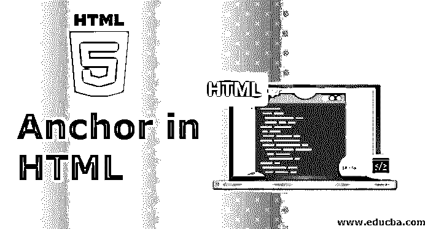
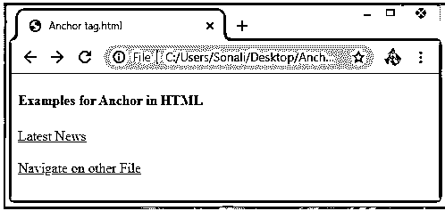
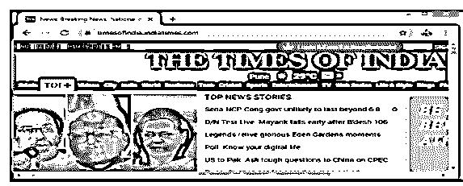
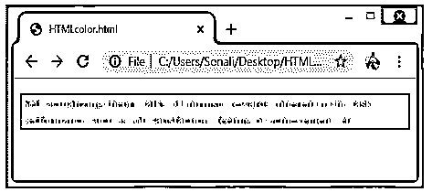
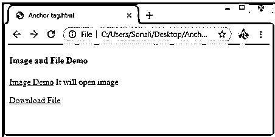
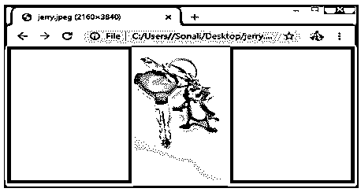
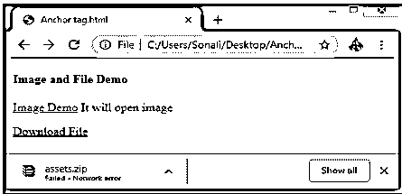

# HTML 中的锚点

> 原文：<https://www.educba.com/anchor-in-html/>




## HTML 中的锚点介绍

HTML 锚定标签是 HTML 中最重要的元素之一，用于在网站之间导航，从一个页面移动到另一个页面，鼠标点击打开某种图像或文本。它用于定义包含的超链接的开始和结束。这通常被搜索引擎用来定义目标 URL。它信息丰富，与登录页面更相关。

**这些链接在不同的场景中代表不同的含义，如**

<small>网页开发、编程语言、软件测试&其他</small>

*   带有红色下划线的链接表示活动链接
*   带下划线和紫色的链接表示访问过的链接。
*   带下划线和蓝色的链接表示未访问过的链接。

**语法:**

让我们看看定义

```
<a href="Link_URL">Link Home</a>
```

如上所示，语法


#### **1。href 属性**

该属性用于定义超链接，在其中可以熟悉其目的地址。超链接在网页文档和目标链接之间起着连接器作用。

*   它可以是其他网站，图像或文件。Href 是超文本参考的缩写，用来定义我们需求的目的地址。= '符号用于定义属性与其连接值的连接。
*   在上面的语法中，href 被认为是一个属性，其中之间的链接被称为它的值。放置在
*   例如:[印度时报](”http://timesofindia.indiatimes.com”)

#### 2.名称属性

*   它对于定义大页面或定义细分非常有用。
*   例子:所以在这个例子中我们在锚名处添加#tag。找到或跳转到像家这样的定义好的位置对浏览器是有帮助的。#name 可以放在文件名之后。

#### 3.目标属性

*   目标属性用于定义目标页面，或者可以打开定义的目标页面。
*   它被用作目标属性用来链接其他页面的一个常用选项。
*   如果目标属性定义了一个空值，如“target=_blank ”,那么它将在目标位置打开一个新的选项卡。

#### 4.标题属性

*   title 属性是一个重要的属性，用于在单击链接时特别注意可以轻松移动到的位置。
*   如果用户将鼠标指针移动到链接引用上，属性点中给出的标题文本将显示在那里。
*   它就像一个工具提示或链接导航的细节。这种方法使网页或文档更加用户友好。

### HTML 中锚点的使用

*   有两种情况下，我们可以锚定标签，如内部链接和外部链接。
*   内部链接是那些显示我们领域的其他页面的实体，外部链接用于显示不属于我们领域的网页。
*   让我们来看看 anchor 标签是如何与这两个链接一起工作的。内部链接作为网站之间的导航器，显示导航菜单，这对每个访问网站的人都很有用，可以很容易地在所需的菜单上导航。正如上面在 title 属性中所讨论的，内部链接对于在特定内容上导航很有用。
*   这些也被搜索引擎网络爬虫用来精确地定义网站的页面以及用于共享权限的目的。
*   外部链接在
*   有时其他网站上传某种外部链接，指向我们网站的链接被认为是反向链接，这些链接允许进入我们的网站，这有利于提高我们网站在 SERP 中的地位。(搜索引擎结果页面)。
*   让我们的访问者在我们的网站上停留更长时间的另一个好处是，在编写外部链接时使用 target="_blank ",这会打开一个新的标签页。
*   我们要用作理想锚文本的文本标识关键字，这些关键字更适合网页。
*   使用绝对链接和相对链接可以看到目标链接的完整描述。它包含有助于完成域名到达目的地的协议。
*   用于链接给定网页的相对 URL，显示相对于当前页面位置的确切位置。
*   每当内部链接被写，这是显示同一网站的其他网页，在这种情况下，我们要写相对的网址。

**例题**

这里我们将展示一些使用实际

#### 1.HTML 代码

```
<h4>Examples for Anchor in HTML </h4>
<a href="https://timesofindia.indiatimes.com/">Latest News </a><br><br>
<a href="HTMLcolor.html">Navigate on other File</a><br>
```

**输出:**
**


T8】**

**点击最新消息，输出是:** 


点击链接浏览其他文件，会显示另一个网页为:



#### **2。HTML** 代码

```
<h2>Reach to EDUCBA </h2>
<ul>
<li><a href="https://www.educba.com/">Website</a></li>
<li><a href="mailto:m.bluth@example.com">Email US</a></li>
<li><a href="tel:+123456789">Phone</a></li>
</ul>
```

**输出:**


输出显示了一些链接，这些链接是蓝色的，它们是未访问的，紫色的链接显示已访问的链接，这用于显示链接的差异。

#### **3。** HTML **代码**

```
<h4>Image and File Demo</h4>
<p><a href="C:\Users\\Sonali\Desktop\jerry.jpeg">Image Demo</a> It will
open image</p>
<a href="./generate-zip?id=4" download="assets.zip">Download File</a>
```

**输出:**




点击图像演示时，将打开图像:


当点击另一个链接时，它将下载文件为:


### HTML 中的结论锚

HTML 中的锚标记用于定义一个链接，该链接将直接导航到目标位置。它基于主要组件，如 hre 属性、name 属性和 target 属性。

### 推荐文章

这是一个 HTML 中的锚的指南。这里我们也讨论它们的介绍、语法、工作和例子。您也可以看看以下文章，了解更多信息–

1.  [HTML 文本链接](https://www.educba.com/html-text-link/)
2.  [基本 HTML 标签](https://www.educba.com/basic-html-tags/)
3.  [HTML 中的图片链接](https://www.educba.com/image-link-in-html/)
4.  [HTML5 vs JavaScript](https://www.educba.com/html5-vs-javascript/)


