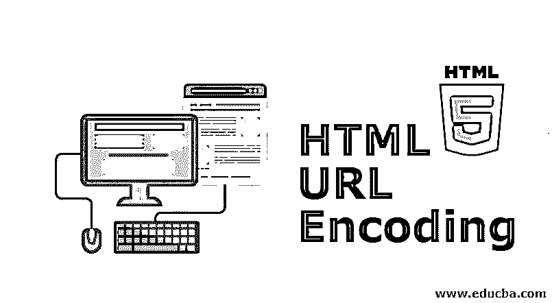

# HTML URL 编码

> 原文：<https://www.educba.com/html-url-encoding/>




## HTML URL 编码简介

在本文中，我们将详细了解 HTML URL 编码。HTML URL 是万维网上全球或 IP 地址的统一资源定位器的首字母缩写。Web 服务器使用 web 浏览器的 URL 获取页面。

**例子:**【https://www.google.com】T2 是其中一个网址。

<small>网页开发、编程语言、软件测试&其他</small>

ASCII 字符集对于 HTML URL 编码非常重要。使用 ASCII 字符集将 URL 发送到互联网。非 ASCII 字符是受限制的，因为它们可能会产生冲突，以找到服务器的页面路径。由于这个问题，HTML 使用 URL 编码。

HTML URL 编码，将非 ASCII 字符转换成可以发送到互联网的格式。可以使用“%”转换用户，继续使用两个十六进制数字。

### 如何在 HTML 中进行 URL 编码？

*   HTML 语言使用[https://www.google.com/](<a)T3。如果你做任何一个网站，想从一个页面转到另一个页面，那就写文件名。< a href="page1.html" >
*   由于创建冲突，某些字符被限制为网址名称；非 ascii 字符替换为“%”以继续两个十六进制数字。
*   URL 不包含空格。它取代了加号(+)或%20。在 HTML 页面的形式中，空格出现在“输入”文本输出中，然后加号显示出来。URL 名称中间接出现空格，然后显示%20。
*   URL 标签包含大写字母(A- Z)、小写字母(a- z)、十进制数字(1-9)和一些特殊字符。


在表单中，如果我输入空格，那么 URL 编码就是 HTML+CSS。

```
<a href="my file.html">
```

在任何 URL 中，如果我们给定空间，那么 URL 编码将作为 my%20file.html 出现。

1.  **保留字符:**URL 地址中有一些具有某种意义的字符，我们可以使用命名目的。我们可以使用两种方式，像加号(/)用于 URL 的一个单独部分。另一方面，我们可以/encoding by % 2f，而在地址名称中没有意义。
2.  **不安全字符:**很多字符在 URL 地址中伴随着很多误解，就像 URL 名称中的空格。不要在 URL 地址名< a href="pa ge.html" >中取空格，而要写< a href ="pa%20ge.html" >。然后网址名称好像是“pa ge.html”。
3.  **非 ASCII 控制字符:**这些字符包括一组 80-Ff 的十六进制值，需要进行格式转换。
4.  **ASCII 控制字符:**在 URL 内不起作用。

### HTML URL 编码的示例

以下是详细解释的 HTML URL 编码的示例:

#### 1.保留字符编码

下面是用于编码保留字符的表格。

| **字符** | 美元 | “&”号 | + | , | / | : | ; | = | ? | @ |
| **网址编码** | 24% | 26% | %2b | %2c | %2f | %3a | %3b | %3d | %3f | 40% |

#### 2.不安全字符

下面是用于编码不安全字符的表格。

| **字符** | 空间 | " | < | > | # | % | { | } | &#124; | \ | ^ | ~ | [ | ] |
| **网址编码** | 20% | 22% | %3c | %3e | 23% | 25% | %7b | %7d | %7c | %5c | %5e | %7e | %5b | %5d |

#### 3.非 ASCII 控制字符

下面是用于编码非 ASCII 字符的表格。

| **字符** | **网址编码** | **字符** | **网址编码** | **字符** | **网址编码** | **字符** | **网址编码** |
| € | %80 | ˜ | %98 | « | %ab | ¿ | %bf |
| ‚ | %82 | ™ | %99 | ¬ | %ac | 敬你 | %c0 |
| ƒ | %83 | š | %9a | ­ ª | %aa | 哦，是吗 | %c1 |
| „ | %84 | › | %9b | ® | %ae | Â | %c2 |
| … | %85 | 你呢 | %9c | г﹞ | %af | Ã | %c3 |
| † | %86 | -你好 | %9d | ° | %b0 | 你呢 | %c4 |
| ‡ | %87 | ž | %9e | ± | %b1 | 哦，天啊 | %c5 |
| -什么 | %88 | 1 月 | %9f | ² | %b2 | 哦，不 | %v6 |
| ‰ | %89 | × | %d7 | ㈩ | %b3 | -好的 | %c7 |
| Š | %8a | ¡ | %a1 | ´ | %b4 | È | %c8 |
| ‹ | %8b | ¢ | %a2 | µ | %b5 | -是吗 | %c9 |
| Œ | %8c | £ | %a3 | ¶ | %b6 | Ê | %ca |
| Ž | %8e | ¤ | %a4 | · | %b7 | Ë | %cb |
| ' | %91 | ¥ | %a5 | ¸ | %b8 | Ì | %cc |
| ' | %92 | ¦ | %a6 | -是吗 | %b9 | Í | %cd |
| " | %93 | § | %a7 | º | %ba | Î | %ce |
| " | %94 | ¨ | %a8 | » | %bb | Ï | %cf |
| • | %95 | © | %a9 | ¼ | %bc | Ð | %d0 |
| – | %96 | — | %97 | ½ | %bd | Ñ | %d1 |
| ã | %e3 | 好吧 | %de | ¾ | %是 | Ò | %d2 |
| æ | %e6 | ß | %df | 一座岛 | %d8 | 哦，天啊 | %d3 |
| 你呢 | %e4 | 敬你 | %e0 | 哦，天啊 | %dd | Ô | %d4 |

#### 4.ASCII 控制字符

下面是用于编码 Ascii 字符的表格。

| **ASCII 字符** | **URL 编码** |
| NUL–空字符 | %00 |
| SOH–标题的开始 | %01 |
| STX–文本的开始 | %02 |
| ETX——正文结束 | %03 |
| EOT–传输结束 | %04 |
| ENQ-询问 | %05 |
| ACK–确认 | %06 |
| 贝尔-贝尔(响铃) | %07 |
| BS–退格 | %08 |
| HT-水平制表符 | %09 |
| 低频线馈电 | %0A |
| 垂直制表符 | %0B |
| FF 格式馈送 | %0C |
| 回车 | %0D |
| 所以-移出 | %0E |
| SI-移入 | %0F |
| DLE-数据链路逃逸 | %10 |
| DC1-设备控制 1 | %11 |
| DC2-设备控制 2 | %12 |
| DC3-设备控制 3 | %13 |
| DC4-设备控制 4 | %14 |
| NAK 否定应答 | %15 |
| 同步 | %16 |
| ETB 端传输块 | %17 |
| 可以取消 | %18 |
| EM–媒体结束 | %19 |
| 子替代品 | %1A |
| ESC- escape | %1B |
| 文件分隔符 | %1C |
| GS-组分隔符 | %1D |
| RS-记录分隔符 | %1E |
| 美制单位分隔符 | %1F |

### HTML 中 URL 编码的重要性

如果 URL 是保留的、不安全的并且不是 ASCII 字符，那么 URL 地址会变得更加复杂并且不可理解。当 web 浏览器搜索 URL 地址时，Web 服务器会搜索 URL 的名称或路径。如果 URL 名称不是 ASCII，那么很难在 HTML 中找到 URL 编码的 URL 重要性。

网址必须容易找到，普遍接受和理解的所有网络浏览器，也是一个网络服务器。有些字符在 URL 中造成误解，因为如果它不用于任何目的，它们就用于某些目的。可能发生了时间冲突，并且路径没有到达用户。

为了克服一切困难，使用户容易将非 ASCII 字符转换成 ASCII 码，用%想出了两个十六进制。

### 结论

HTML 中的 URL 编码知道如何将非 ASCII 字符集转换成有效的 ASCII 格式。这是普遍接受的，网络浏览器工作没有任何错误。编码网址可以轻松安全地运行。为了避免命名和命名目的的冲突，URL 编码是必要的。

### 推荐文章

这是一个 HTML URL 编码的指南。这里我们讨论 HTML URL 的介绍，如何在 HTML 中执行 URL 编码，以及它的例子和重要性。你也可以看看下面的文章来了解更多-

1.  [HTML 中的框架](https://www.educba.com/html-frames/)
2.  [HTML 中的 Alt 标签](https://www.educba.com/alt-tag-in-html/)
3.  [HTML 命令](https://www.educba.com/html-commands/)
4.  [HTML5 元素](https://www.educba.com/html5-elements/)


