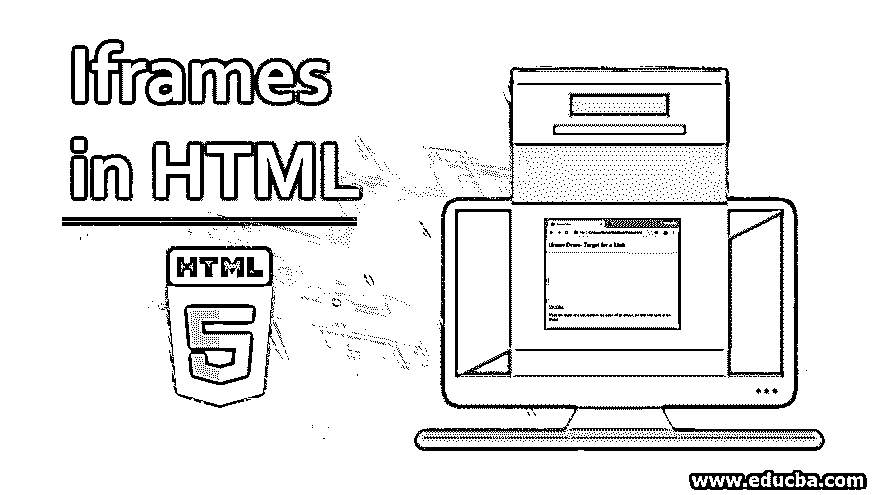
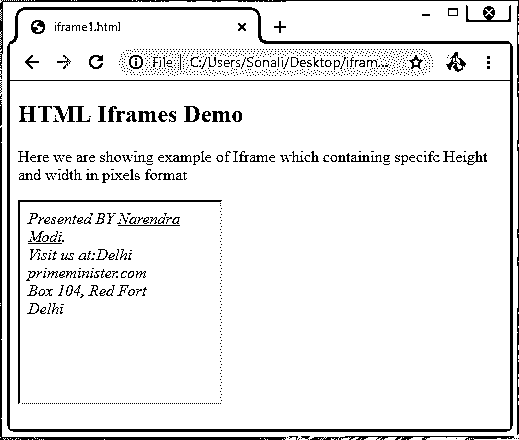
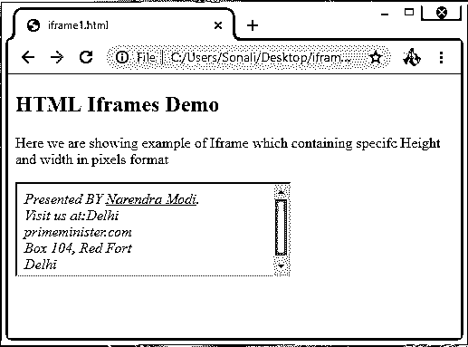
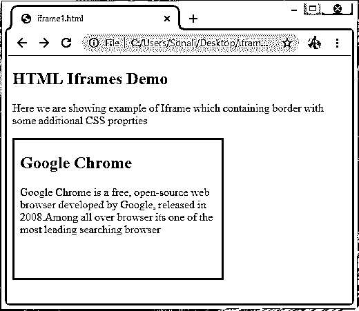
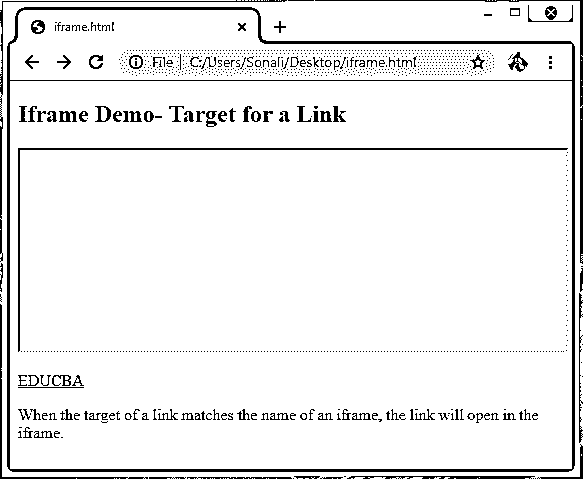

# html 中的 iframe

> 原文：<https://www.educba.com/iframes-in-html/>




## HTML 中的 Iframes 简介

HTML 中的 Iframes 只不过是作为 HTML 文档添加另一个 HTML 文档的内嵌框架。它主要用于网页或 [web 开发流程](https://www.educba.com/career-in-web-development/)中，通过另一个来源包括其他内容，如网页上的广告。

大多数网页设计师使用 Iframe 在网站或网页上展示交互式应用程序。使用 JavaScript 或 HTML 中的目标属性可以做到这一点。

<small>网页开发、编程语言、软件测试&其他</small>

Iframe 的主要目的是在一个网页中显示另一个网页。应该使用名为<iframe>的标签显示内嵌框架。它就像网页上的一个矩形块，浏览器可以在其中显示另一个带有滚动条和边框的文档。</iframe>

**语法**

*   现在我们将看看 Iframe 将如何使用:

```
<iframe src ="URL"></iframe>
```

*   这里<iframe>是一个标签，HTML iframes 将在这里被定义。将包括用于定义内嵌框架页面的 URL 的 Src 属性。</iframe>

**举例:**

```
<iframe src ="[www.edubca.com](https://www.edubca.com/)" ></iframe>
```

*   也可以给我们的 Iframe 以像素格式指定一些特定的高度和宽度，如下所示:

```
<iframe src ="URL" height="value" width="value"></iframe>
```

*   在上面的语法中，所有的东西都是一样的；此外，我们可以用像素格式指定高度和宽度，定义如下

**举例:**

```
<iframe src ="[www.edubca.com](https://www.edubca.com/)" height="300" width="300"></iframe>
```

*   下面的语法显示了通过 CSS 使用值通过[定义 iframe 的高度和宽度的另一种方法:](https://www.educba.com/what-is-css/)

```
<iframe src ="URL" style="height: value in pixels; width: value in pixels"></iframe>
```

*   所有的事情都和上面一样，只是在指定值上做了一个改变。

**举例:**

```
<iframe src ="[www.edubca.com](https://www.edubca.com/)" style="height:300px; width:300px;"></iframe>
```

*   iframe 增加的另一个特性是，我们可以通过使用 border none 属性删除已经定义的边框。其语法如下:

```
<iframe src ="URL" style="border : none;"></iframe>
```

*   在 CSS 的帮助下，还可以对边框做很多事情，比如改变它的大小，对边框应用一些颜色等等。

通过使用以下语法，可以将 iframe 用作链接的目标:

```
<iframe src ="URL" name="iframe_a"></iframe>
```

*   在上面的语法中，src 是我们正常的 URL 这里，链接的目标属性将引用我们的 iframe 标记中的 name 属性。

**举例:**

```
<iframe src ="[www.edubca.com](https://www.edubca.com/)" name="iframe_a"></iframe>
```

### Iframes 标记属性

Iframes 中使用了不同的属性标签。这些建议如下:

*   **Src:** 该属性用于插入需要包含在框架中的文件。URL 指定要在 iframe 中加载的目标网页。
*   **Name:** Name 是一个属性，用来给帧一个标识名。当你创建一个链接来打开另一个网页时，这是最有用的。
*   **allowfullscreen:** 这个属性允许你以全幅格式显示你的框架。所以我们必须设置值为 true 来实现这个功能。
*   **Frameborder:** 这是一个有用的属性，允许你显示或者不显示框架的边框。值 1 表示显示边框&，0 表示不显示边框。
*   **Marginwidth:** 允许您定义框架左右&之间的间距
*   **Marginheight:** 这允许你定义框架顶部&和底部之间的空间。
*   **滚动:**这些属性控制[滚动条](https://www.educba.com/scrollbar-color/)是否显示到框架中。包括的值有“是”、“否”或“自动”
*   **高度:**用于定义框架的高度。无论是%还是像素
*   **宽度:**用于定义框架的宽度。无论是%还是像素
*   **Longdesc:** 在这个属性的帮助下，你可以链接另一个页面，对你的框架内容进行冗长的描述。

### HTML 中的 Iframes 示例

下面是 HTML 中 Iframes 的一些例子，解释如下:

#### 示例#1

让我们考虑一个例子，我们将展示如何创建一个具有特定高度和宽度的 iframe。

**代码:**

```
<!DOCTYPE html>
<html>
<body>
<h2>HTML Iframes Demo</h2>
<p>Here, we are showing an example of Iframe which containing specific Height and width in pixels format</p>
<iframe src="C:\Users\Sonali\Desktop\HTML block elements.html" height="300" width="300"></iframe>
</body>
</html>
```

**输出:**




#### 实施例 2

让我们考虑另一个例子，我们将展示如何创建一个具有特定高度和宽度的 iframe。但是在这个例子中，我们通过 CSS 指定高度和宽度。这里我们可以看到滚动条根据内容大小进行了调整。

**代码:**

```
<!DOCTYPE html>
<html>
<body>
<h2>HTML Iframes Demo</h2>
<p>Here, we are showing an example of Iframe which containing specific Height and width in pixels format</p>
<iframe src="C:\Users\Sonali\Desktop\HTML block elements.html" style="height:100px;width:300px;"></iframe>
</body>
</html>
```

**输出:**




#### 实施例 3

这里我们考虑一个例子，我们将通过添加一些额外的 CSS 属性来给 iframe 添加边框，以显示边框大小的变化、边框颜色的变化等。所以我们可以给 iframe 添加尽可能多的样式。

**代码:**

```
<!DOCTYPE html>
<html>
<body>
<h2>HTML Iframes Demo</h2>
<p>Here we are showing an example of Iframe which containing a border with some additional CSS proprties</p>
<iframe src="C:\Users\Sonali\Desktop\iframe.html" style="border:3px solid Blue; height: 200px;"></iframe>
</body>
</html>
```

**输出:**




#### 实施例 4

让我们考虑另一个例子，我们将展示目标属性如何使用 iframe 打开网页链接。

**代码:**

```
<!DOCTYPE html>
<html>
<body>
<h2>Iframe Demo- Target for a Link</h2>
<iframe height="200px" width="100%" src="C:\Users\Sonali\Desktop\iframe1.html" name="iframe1_a"></iframe> <p><a href="https://www.educba.com/courses/">EDUCBA</a></p>
<p>When the target of a link matches the name of an iframe, the link will open in the iframe.</p>
</body>
</html>
```

**输出:**




**目标输出:**

如上所示，例如，我们可以单击目标链接 EDUCBA，这样它将打开如下所示的网页。


### 结论

iframe 是一个内嵌框架，它本身包含另一个 HTML 文档。它是网页设计中最强大的 HTML 元素。您可以添加其他来源的内容。它使用不同的 HTML 属性，如全局属性、事件属性等。

### 推荐文章

这是 HTML 中 Iframes 的指南。这里我们讨论了 HTML 中 iframes 的语法、标签属性，以及各种示例和代码实现。您也可以阅读以下文章，了解更多信息——

1.  [HTML 框架](https://www.educba.com/html-frames/)
2.  [HTML 文本链接](https://www.educba.com/html-text-link/)
3.  [在 HTML 中创建表格](https://www.educba.com/create-tables-in-html/)
4.  [HTML 中的框架标签](https://www.educba.com/frame-tag-in-html/)


