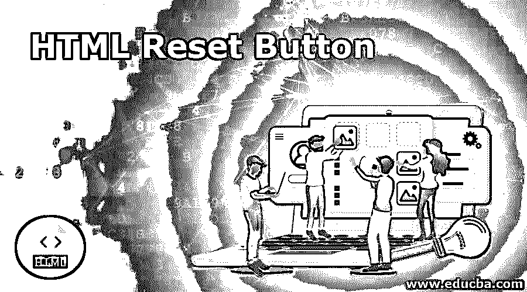
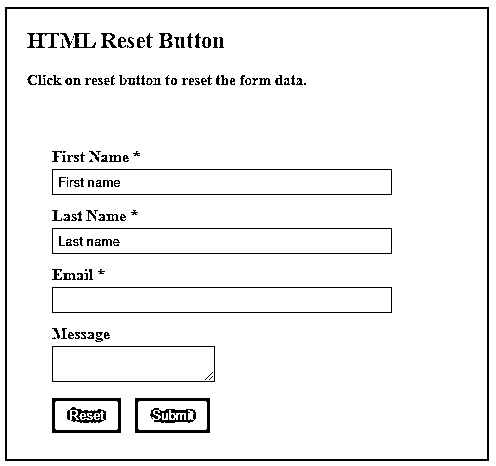
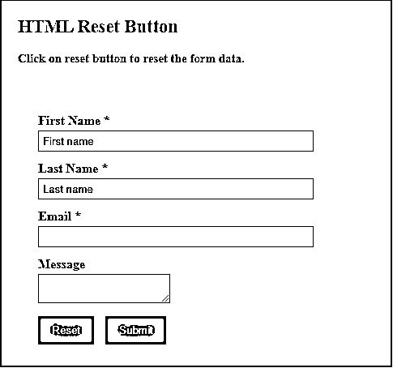

# HTML 重置按钮

> 原文：<https://www.educba.com/html-reset-button/>




## HTML 重置按钮介绍

在浏览器中填写表单时，为用户提供在 web 表单上执行多项操作的灵活性非常重要。其中一个特殊类型的按钮称为重置，允许重置用户输入的表单中的值。该按钮为用户提供了执行复位操作的灵活性。这个按钮基本上清除了用户在同一个表单上输入的任何数据。重置后，表单将填充默认值。本文将会看到 reset 按钮在多种场景中的用法以及如何使用它。

### HTML 重置按钮的语法

复位操作可在<input>标签或<button>标签上定义。在这些标签上使用 type 属性来定义这一点，并将值“reset”传递给它。</button>

<small>网页开发、编程语言、软件测试&其他</small>

#### 1.输入标签

**语法:**

```
<input type = "reset">
```

这里，input 是用于定义 Input 元素的标签，type 是用于定义 Input 元素类型的属性。值 reset 是可以传递给该属性的值之一。

#### 2.按钮标签

**语法:**

```
<button type = "reset">
```

reset 是可以传递给 Button 元素的 type 属性的值之一。如前所述，这将重置表单。该标签支持的另外两个值是“按钮”和“提交”。

### 实现 HTML 重置按钮的示例

以下是 HTML 重置按钮的示例:

#### 示例 1–使用输入标签重置按钮

**代码**:

```
<!DOCTYPE html>
<html>
<head>
<title>
Reset button in HTML
</title>
<style>
.form-data {
border : #81D4FA 2px solid;
background-color : #03a9f400;
text-align : left;
padding-left : 20px;
height : 450px;
width : 95%;
}
.form {
margin:5px auto;
max-width: 700px;
padding: 25px 15px 15px 25px;
}
.form li {
margin: 12px 0 0 0;
list-style: none;
}
.form label {
margin: 0 0 3px 0;
padding: 0px;
display: block;
font-weight: bold;
}
.form .field {
width: 80%;
height: 20px;
}
.form input[ type = submit], .form input[ type = reset] {
background: #2196F3;
padding: 10px 17px 10px 17px;
margin-right: 10px;
color: #fff;
border: none;
}
.form input[type = submit]:hover, .form input[ type = reset]:hover {
background: #2173f3;
}
.heading {
font-weight: bold;
border-bottom: 2px solid #ddd;
font-size: 15px;
width: 98%;
}
</style>
</head>
<body>
<div class = "form-data">
<div class = "heading">
<h2> HTML Reset Button </h2>
<p> Click on reset button to reset the form data. </p>
</div>
<div>
<form action = "#" >
<ul class = "form" >
<li>
<label> First Name  * </label>
<input type = "text" name = "firstName" placeholder = " First name" class = "field"/>
</li>
<li>
<label> Last Name  * </label>
<input type = "text" name = "lastName" placeholder = " Last name" class = "field" />
</li>
<li>
<label> Email  * </label>
<input type="email" name="field3" class="field" />
</li>
<li>
<label> Message </label>
<textarea name = "message" id = "message" class = "field-message"></textarea>
</li>
<li>
<input type = "reset" value = "Reset">
<input type = "submit" value = "Submit" />
</li>
</ul>
</form>
</div>
</div>
<script type = "text/javascript">
</script>
</body>
</html>
```

**输出:**




试着在输入框中输入，如果不刷新重置按钮，输入的数据将被清除。注意，为了进行重置，我们不需要刷新页面；数据将在同一个加载的页面上被动态清除。

#### 示例 2–使用按钮标签重置按钮

**代码:**

```
<!DOCTYPE html>
<html>
<head>
<title>
Reset button in HTML
</title>
<style>
.form-data {
border : #81D4FA 2px solid;
background-color : #03a9f400;
text-align : left;
padding-left : 20px;
height : 450px;
width : 95%;
}
.form {
margin:5px auto;
max-width: 700px;
padding: 25px 15px 15px 25px;
}
.form li {
margin: 12px 0 0 0;
list-style: none;
}
.form label {
margin: 0 0 3px 0;
padding: 0px;
display: block;
font-weight: bold;
}
.form .field {
width: 80%;
height: 20px;
}
.form button[ type = submit], .form button[ type = reset] {
background: #2196F3;
padding: 10px 17px 10px 17px;
margin-right: 10px;
color: #fff;
border: none;
}
.form button[type = submit]:hover, .form button[ type = reset]:hover {
background: #2173f3;
}
.heading {
font-weight: bold;
border-bottom: 2px solid #ddd;
font-size: 15px;
width: 98%;
}
</style>
</head>
<body>
<div class = "form-data">
<div class = "heading">
<h2> HTML Reset Button </h2>
<p> Click on reset button to reset the form data. </p>
</div>
<div>
<form action = "#" >
<ul class = "form" >
<li>
<label> First Name  * </label>
<input type = "text" name = "firstName" placeholder = " First name" class = "field"/>
</li>
<li>
<label> Last Name  * </label>
<input type = "text" name = "lastName" placeholder = " Last name" class = "field" />
</li>
<li>
<label> Email  * </label>
<input type="email" name="field3" class="field" />
</li>
<li>
<label> Message </label>
<textarea name = "message" id = "message" class = "field-message"></textarea>
</li>
<li>
<button type = "reset" value = "Reset"> Reset </button>
<button type = "submit" value = "Submit"> Submit </button>
</li>
</ul>
</form>
</div>
</div>
<script type = "text/javascript">
</script>
</body>
</html>
```

**输出:**




**Note:** that the reset button automatically works when placed inside the form element. The reset button inside that form associates automatically with it. Only the reset button placed inside of the form tag will be applicable to that form, not from the outside. Also, multiple numbers of reset buttons can be placed inside one form, and these all reset buttons will work properly. It is advised to use reset buttons with caution as there are chances of clicking the reset button mistakenly by the user, and the user will lose all typed data.

### 结论

HTML 重置按钮提供了一个强大的功能，可以在不刷新网页的情况下自动重置表单中输入的数据。重置按钮通常用在表单元素中。

### 推荐文章

这是一个 HTML 重置按钮的指南。在这里，我们讨论 HTML 重置按钮及其示例的简要概述，以及它的代码实现。您也可以浏览我们推荐的其他文章，了解更多信息——

1.  [不同类型的 HTML 框架与语法](https://www.educba.com/html-frames/)
2.  [前 8 个 HTML 布局元素](https://www.educba.com/html-layout/)
3.  [学习 CSS 填充的例子](https://www.educba.com/css-padding/)
4.  [如何创建 HTML 对齐中心？](https://www.educba.com/html-align-center/)


