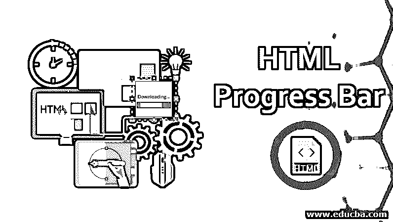
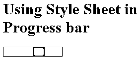

# HTML 进度条

> 原文：<https://www.educba.com/html-progress-bar/>




## HTML 进度条介绍

根据 W3C 标准，进度条意味着使用一个 progress 元素来完成一个特定的任务。Progress 标记用于显示进度条，并表示网页上任何文件的上载进度；这个标签已经在 HTML 中使用，最终，这个标签使 web 开发人员可以轻松地显示这个栏。这个标签与<meter>标签完全不同，代表磁盘空间的使用情况。并且在 HTML5 中得到支持，HTML5 上的不断增长有助于引入一个有趣的工具。</meter>

**语法:**

<small>网页开发、编程语言、软件测试&其他</small>

这个 progress 元素有开始和结束标记，下面显示了标记的基本语法。它用于暗示任何进程的状态。进度条有内嵌显示方式。

```
<Progress bar>
……
</Progress bar>
```

### 属性

属性提供了一个信息元素，类似于 HTML 中的浏览器行为。HTML 中有三种不同的属性，即事件属性和全局属性。除了这些属性之外，progress 元素还有两个新属性，如下所示:

**max–**默认值为 1.0，表示完成任务所需的工作总数。

**值–**这指定了必须完成的工作量。默认值被指定为小于 1.0。如果没有 Val 属性，进度条是不确定的。

进度条的示例包括附加文件、首次加载文档或网页加载。

### 在 HTML 中创建进度条的方法

进度条由两种不同的状态定义:确定的和不确定的。在不确定进度条的情况下，value 属性被赋值为 null，这很容易设置样式。对于下面所有的例子，当达到确定的状态时，它们由两个新的属性 max 和 Val 定义。它使用一些类似运动的外观来用水平条指示任务。如果相应的工作不依赖于任务，则分配< meter>标签。说到浏览器兼容性，它支持除 Internet Explorer 之外的所有浏览器(部分支持)。根据浏览器的兼容性，进度条可能会有所不同。在整篇文章中，我们将集中讨论具有 max 和 Val 属性的条形的确定状态。

例子:现在，让我们看看带有 min 和 val 属性的进度条的基本实现。

```
<!DOCTYPE html>
<html>
<body>
Downloading on process:
<progress value="19" max="90">
</progress>
<p><strong>Note:</strong> The progress tag is used to represent a progress bar for quite period of time. </p>
</body>
</html>
```

**输出:**


#### 1.使用 CSS

接下来，我们将看到如何使进度条在所有平台上看起来一致。进度条是用一个值选择器标记的，我们也可以根据进度条的宽度和高度来显示一个时尚的进度条。当被不同的浏览器使用时，这就变得复杂了。浏览器本身做出一些调整来口径任务的完成。通过应用空间效果使 html 栏看起来更真实。

下面是一个简单的基本例子:

```
<!DOCTYPE>
<html>
<head>
<h1> Using Style Sheet in Progress bar </h1>
<style>
progress{width:400px;height:40px}
</style>
</head>
<body>
<progress value="60" max="100"></progress>
</body>
</html>
```

**输出:**


#### 2.使用方框阴影和颜色

使用 stylesheet，我们可以通过给背景颜色、指定高度等方式给这个元素添加样式规则。可以通过应用 rgba()函数来应用颜色。进度条元素可以用不同的颜色来显示结果。这是用属性“class”映射的。通常，进度条从左到右移动以指示任务，因为它们从初始的“0”开始，并且一旦到达目标就显示结果。

```
<!DOCTYPE>
<html>
<head>
<h1> Using Style Sheet in Progress bar demo </h1>
<style>
progress{width:200px;height:20px;background-color:pink;
border-radius: 4px;position: absolute;
right: 0px;
top: 80px;
box-shadow: 0 3px 6px rgba(255, 255, 0, 255) inset;}
</style>
</head>
<body>
<progress value="40" max="100"></progress>
</body>
</html>
```

**输出:**


***NOTE:** Different browser handles the bar a bit variants. Chrome uses Webkit Stylesheet by replacing native styles.*

**样本:**

进度条::–WebKit-进度条

使用 class 属性，进度条的大小甚至可以有小、中、大的变化。

#### 3.使用跨度

下面的代码是不确定的，显示一些进程正在进行一段时间。

```
<!DOCTYPE>
<html>
<head>
<h1> Using Style Sheet in Progress bar </h1>
<style>
progress{width:120px;height:20px}
</style>
</head>
<body>
<progress max="100">
20%
</progress>
</body>
</html>
```

**输出:**




#### 4.使用 JavaScript 示例

以下规则必须使用 javascript 来完成。如果需要，创建

元素，然后创建样式表，最后将它们嵌入在一起。下面的代码显示了 JavaScript 的基本进度条。

**例#1:**

```
<!DOCTYPE>
<html>
<body>
<script>
var pgx=2;
function bar(){
var prog = document.getElementById ('progress demo');
setInterval (function ()
{
if(pgx<90){
pgx++;
prog.value =pgx;
}
bar();
}, 100);
}
</script>
<progress id="progress demo" min="2" max="100"></progress>
<br/><br/>
<button onclick="bar()"> submit</button>
</body>
</html>
```

**输出:**


**例 2:**

```
<!DOCTYPE html>
<html lang="en">
<head>
<title>implementation of HTML progress Tag</title>
</head>
<body>
<h2> <i>Task in scheduled Progress </i></h2>
<p>Process: <progress id="bar" value="1" max="100">0%</progress></p>
<script type="text/javascript">
var k = 0;
var progb = document.getElementById("bar");
function count(){
if(k < 100){
k = k + 1;
progb.value = k;
progb.getElementsByTagName("span")[0].textContent = k;
}
setTimeout("count()", 400);
}
count();
</script>
</body>
</html>
```

**输出:**


***NOTE:** Even you can add some animation effects to the progress bar. To do so, we have to assign some interval timings by assigning some value to it and directing incrementing infinitely, to make the situation control conditional statement is used.*

### 结论

因此，这篇文章解释了如何创建一个高度灵活和轻量级的 HTML 进度条。最后，我们简要地看了这个概念，因为它们是活动指标。该元素指示如何加载页面或进行一些注册过程，并且可能表示最大值的百分比 100。当时间任务的长度未知时，这种模式通常用于安装或加载页面场景。这甚至是一个用 Html5 实现的很酷的效果。

### 推荐文章

这是一个 HTML 进度条的指南。这里我们讨论一个介绍，以及如何使用各种方法在 HTML 中创建一个进度条。您也可以看看以下文章，了解更多信息–

1.  [HTML 中的页脚标签](https://www.educba.com/footer-tag-in-html/)
2.  [HTML 中的地图标签](https://www.educba.com/map-tag-in-html/)
3.  [HTML onclick 按钮](https://www.educba.com/html-onclick-button/)
4.  [HTML 中的旁白标签](https://www.educba.com/aside-tag-in-html/)


