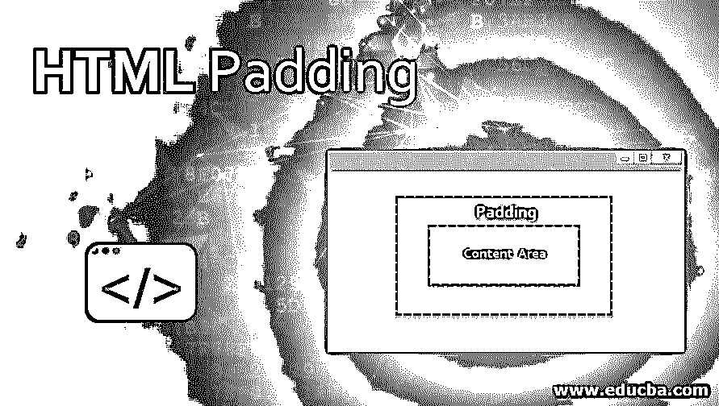
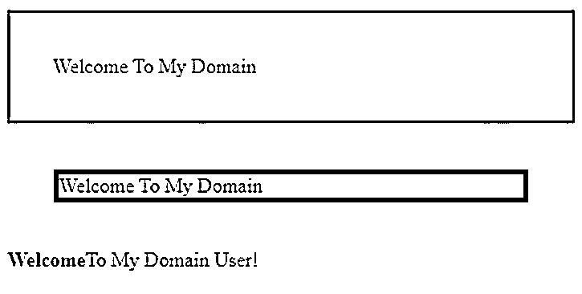
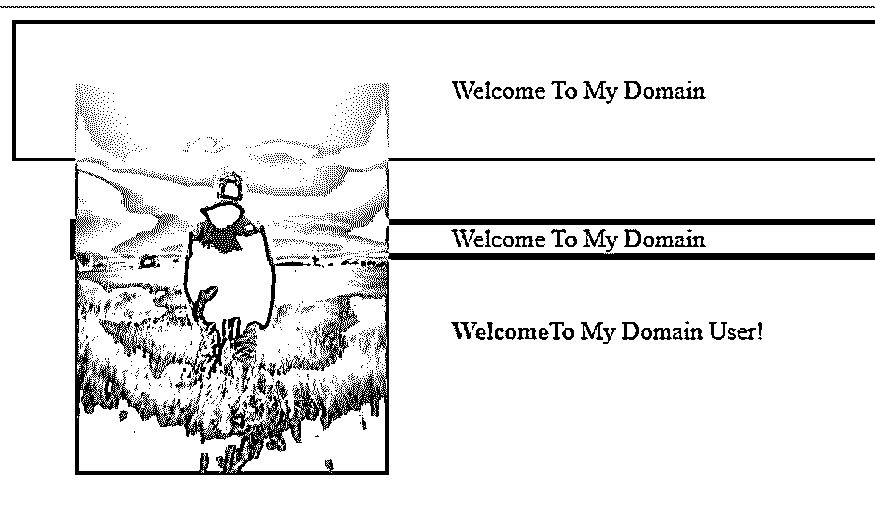

# HTML 填充

> 原文：<https://www.educba.com/html-padding/>




## HTML 填充介绍

一般来说，填充是指 HTML 中任何事物之间的空间，指的是 HTML 内容与其边框之间的空间。HTML 填充也是一种属性，用于更吸引人地使用网页并突出网站。它也有一些类型，如顶部填充、左侧填充、右侧填充、底部填充等。我们可以用相似的类型填充格式来对齐单词或文本。填充在 HTML 元素中创建了额外的空间，边距也为 HTML 元素创建了额外的空间。我们还使用了 [CSS 样式，它们的](https://www.educba.com/what-is-css/)属性用于所有的填充区域。

**语法:**

<small>网页开发、编程语言、软件测试&其他</small>

每个 HTML 标签都有自己的属性和元素特性。同样，语法也不同，如果用户需要，它们将用于所有其他 HTML 标记。下面是 HTML 中填充元素的基本语法。

```
<html>
<head>
<style>
.sample
{
Font-size:1 px;
Background-color:green;
Margin:28px;
Padding:30 px;
}
</style>
</head>
<body>
</body>
</html>
```

上述语法有助于创建示例网页，并将使用 CSS 样式中的填充样式作为 HTML 中的 head 部分。基于此，如果我们在 HTML 的其他部分和标签中使用它，语法会有所不同。

### HTML 中的填充是如何工作的？

与边距相比，填充是在一些 HTML 元素内部创建的额外空间，而边距是在 HTML 元素外部创建的。每一个元素，比如填充和边距，它们指的是框模型，填充、边距和边框都与 HTML 容器的框模型相结合。在该模型中，用于 HTML 内容的区域的中间部分，即文本或图像、视频等。，如果用户需要在网页中进行定制开发，可以用一些填充、边距和边框来包围。

我们不会在必要时使用所有这些，但记住盒子模型应用于网页上的每个标签或元素是很有帮助的。一些 CSS 样式和属性使用允许用属性的数量替换的值的字符串，并且它们用使用空格分隔的值来表示。

具有内部边距和边框区域以及 HTML 内容区域外部的框中的填充(padding 属性)用于指定框容器中的统一填充样式。三个或四个值是根据我们在客户要求的代码中的声明独立指定的。

填充概念有一些用于计算长度的可能值，注意它不应该是负值；此外，计算百分比，包括框的宽度，高度，它也不包括负值。借助于在图像和像 HTML 内容这样的数据流之间创建缓冲区，我们可以在 HTML 网页的图像端使用填充。它是用来给图像一点喘息的空间，这样它们就不会被文本或其他图像所干扰。

我假设我们在网页图像的左侧使用图像，数据内容紧密相连，没有令人分心的靠近图像，但当在右侧面板使用相同的图像时，填充在图像和文本之间创建了一个缓冲区，从用户的角度来看，这将有助于愉快的阅读体验。我们还可以使用带有一些样式属性的 HTML 编辑器等编辑操作在图像画布中添加填充，并在用户选择图像后切换到富文本编辑器。根据用户或客户的指示，选择性填充，例如 10 像素的边界，被添加到我们在网页中选择或上传图像内容的图像的所有边上；此外，我们可以根据用户需求，通过使用一些填充样式(如将底部填充选项改为右侧填充)来有选择地添加填充。

#### 4 个填充值

在 HTML 代码中调用 javascript 函数后，我们可以在 javascript 函数中使用填充来自动创建和调整边框样式或填充样式的大小(T2)。通常，padding 属性设置或返回 HTML 元素的填充，该属性从单个值到四个值；我们将在下面讨论每个填充值。

*   **单值:**例如 div { padding:12px }-HTML 内容的所有四个边都有一个类似 12px 的填充值。
*   **两个值:**div { padding:12px 13px }-顶部和底部填充为 12px，左右填充为 13px。
*   **三个值:**div { padding:12px 13px 14px }-顶部填充将为 10px，左右填充为 13px，底部填充为 14px。
*   **四个值:**div { padding:12px 13px 14px 15px }-上填充为 12px，右填充为 13px，下填充为 14px，左填充将为 15px。

### HTML 填充的示例

下面给出了 HTML 填充的示例:

#### 示例#1

**代码:**

```
<html>
<head>
<style>
.sample {
border: 2px solid green;
padding: 34px;
}
.sample2 {
border: 4px solid green;
margin: 37px;
}
</style>
</head>
<body>
<p class="sample">Welcome To My Domain</p>
<p class="sample2">Welcome To My Domain</p>
<p><strong>Welcome</strong>To My Domain User!</p>
</body>
</html>
```

**输出:**




#### 实施例 2

**代码:**

```
<html>
<head>
<style>
.sample {
border: 2px solid green;
padding: 34px;
}
.sample2 {
border: 4px solid green;
margin: 37px;
}
</style>
</head>
<body>

<p class="sample">Welcome To My Domain</p>
<p class="sample2">Welcome To My Domain</p>
<p><strong>Welcome</strong>To My Domain User!</p>
</body>
</html>
```

**输出:**




#### 实施例 3

**代码:**

```
<html>
<head>
<style>
#sample {
border: 2px solid green;
padding: 34px;
}
.sample2 {
border: 4px solid green;
margin: 37px;
}
</style>
</head>
<body>
<div id="sample">Welcome</div>
<br>
<button type="button" onclick="samples()">To My Domain</button>
<script>
function samples() {
document.getElementById("sample").style.padding = "2px 3px 4px 5px";
}
</script>
</body>
</html>
```

**输出:**


上述三个示例第一个示例是填充概念的基本示例；在第二个例子中，我们将使用填充样式在网页中添加额外的图像。最后一个例子是我们使用 javascript 函数来自动设置或调整填充样式。

### 结论

我们已经讨论了实时场景中的一些 HTML 概念，无论我们在网页中使用 HTML 标签，不仅是在 web 模式中，而且是在用户兼容性方面；它将根据用户要求接受移动(android 和 ios)模式。

### 推荐文章

这是一个 HTML 填充指南。这里我们讨论基本的概念，填充在 HTML 中是如何工作的，以及相应的例子。您也可以浏览我们的其他相关文章，了解更多信息——

1.  [HTML 中的前置标签](https://www.educba.com/pre-tag-in-html/)
2.  [HTML 中的 Span 标签](https://www.educba.com/span-tag-in-html/)
3.  [HTML 导航标签](https://www.educba.com/html-nav-tag/)
4.  [HTML 向左浮动](https://www.educba.com/html-float-left/)


