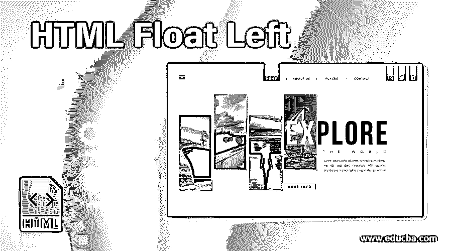
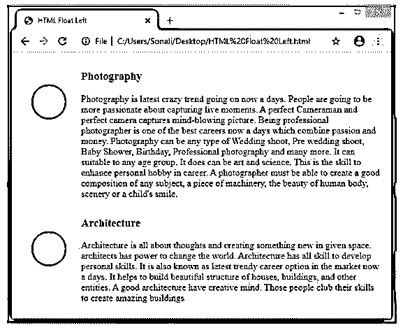
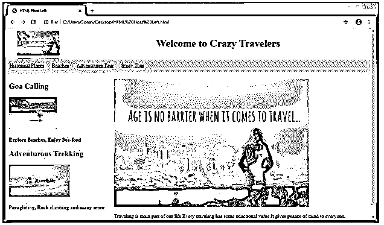
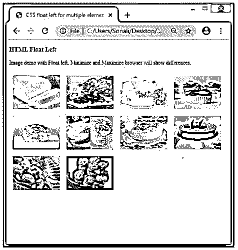
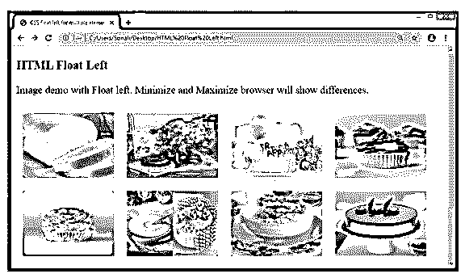

# HTML 向左浮动

> 原文：<https://www.educba.com/html-float-left/>




## HTML 向左浮动简介

构建 HTML 网页的元素对齐是最重要的任务之一。这可以通过使用一个名为 float 的 CSS 属性及其位置值来实现。Float 属性可以与 Right、Left、none、inline-start、inline-end 等值一起使用。HTML 中的 Float Left 标记负责将所有文本或元素显示在所包含容器的左侧或 HTML 主体部分的左侧位置。每当使用这个左浮动元素时，它会改变内容的正常流向，并向容器的左侧移动。

### 句法

*   在 HTML 中定义左浮动位置的语法如下:

```
float:position_value;
```

*   如上面的语法所示，浮动元素将显示它们的位置值。它可能是左，右或没有。Ex: float:左；
*   有些情况下，我们想改变浮动元素下面的元素的位置。因此，我们希望通过清除 floats 在放置任何其他元素之前清除元素。
*   浮动元素帮助我们将内容移动到同一个父元素中，该父元素将继续移动，并将所有这些元素包装在浮动元素周围。
*   基于浮动的布局的另一个选择是 Flexbox，它用于设计现代网站布局。
*   在设计任何网页时，我们都会用到页眉、导航菜单、侧边栏、导航条、页面的主要内容和页脚。所有这些都被视为一个容器元素，它被存储为 HTML 内容。
*   一个人可以在他们的网页中使用一个以上的左浮动元素。因此，它将有助于设计多栏布局。
*   最好的网站设计被认为是使用 3 个嵌套的 div 块，这有助于设计页面的布局，包括一个容器块，以及一个用于存储所有元素的全宽页面和一个称为侧栏内容块的块。这两个块与 HTML 属性 float left 对齐。
*   左浮动属性对内联元素和块级元素都很有用。它对于在 div 的左侧显示图像也很有用。
*   浮动元素只能应用于代码结构中水平放置的元素。

### HTML 向左浮动的示例

下面给出了 HTML 浮动左的例子:

<small>网页开发、编程语言、软件测试&其他</small>

#### 示例#1

这是一个显示段落内容左对齐的示例。

**代码:**

```
<!DOCTYPE html>
<html lang="en">
<head>
<title>HTML Float Left</title>
<meta charset="UTF-8">
<meta name="viewport" content="width=device-width, initial-scale=1">
<style>
.img {
float: left;
width: 60px;
height: 60px;
margin: 25px;
border-radius: 40px;
background-color: lime;
}
.hd {
margin-top: 30px;
}
.pg {
margin: 10px;
overflow: hidden; /* This is important */
}
</style>
</head>
<body>
<div class='column'>
<div class='img'>
</div>
<h3 class='hd'>Photography</h3>
<p class='pg'>Photography is latest crazy trend going on now a days. People are going to be more passionate about capturing live moments. A perfect Cameraman and perfect camera captures mind-blowing picture. Being professional photographer is one of the best careers now a days which combine passion and money. Photography can be any type of Wedding shoot, Pre wedding shoot, Baby Shower, Birthday, Professional photography and many more. It can suitable to any age group. It does can be art and science. This is the skill to enhance personal hobby in career. A photographer must be able to create a good composition of any subject, a piece of machinery, the beauty of human body, scenery or a child's smile. </p>
</div>
<div class='column'>
<div class='img'></div>
<h3 class='hd'>Architecture</h3>
<p class='pg'>Architecture is all about thoughts and creating something new in given space.
architects has power to change the world. Architecture has all skill to develop personal skills. It is also known as latest trendy career option in the market now a days. It helps to build beautiful structure of houses, buildings, and other entities. A good architecture have creative mind. Those people club their skills to create amazing buildings </p>
</div>
</body>
</html>
```

**输出:**




#### 实施例 2

这是网页的一个小布局，内容在容器的左侧对齐。

**代码:**

```
<!DOCTYPE html>
<html lang="en">
<head>
<title>HTML Float Left</title>
<meta charset="UTF-8">
<meta name="viewport" content="width=device-width, initial-scale=1">
<style>
* {
box-sizing: border-box;
}
body {
margin: 0;
}
.header {
padding: 8px;
text-align: center;
background: lightblue;
color:black;
}
.navbar {
overflow: hidden;
background-color: lightcyan;
}
.navbar a {
float: left;
display: block;
color: black;
text-align: center;
padding: 12px 12px;
}
.navbar a.left {
float: left;
}
.navbar a:hover{
background-color: #eee;
color: black;
}
.row {
display: flex;
flex-wrap: wrap;
}
.sidebar {
background-color: #f1f1f1;
padding: 10px;
}
.main {
background-color: white;
padding: 20px;
}
.logoimg {
float:left;
}
</style>
</head>
<body>
<div class="header">
<div class="logoimg" style=""></div>
<h1>Welcome to Crazy Travelers</h1>
</div>
<div class="navbar">
<a href="#">Historical Places</a>
<a href="#">Beaches</a>
<a href="#">Adventoures Tour</a>
<a href="#">Study Tour</a>
</div>
<div class="row">
<div class="sidebar">
<h2>Goa Calling</h2>
<div></div>
<h4>Explore Beaches, Enjoy Sea-food</h4>
<h2>Adventurous Trekking</h2>
<div ></div>
<h4>Paragliding, Rock climbing and many more</h4>
</div>
<div class="main">

<p> Travaling is main part of our life.Every travaling has some eductional value.It gives peaace of mind to everyone.</p>
</div>
</div>
</body>
</html>
```

**输出:**

**

** 

#### 实施例 3

**代码:**

```
<!DOCTYPE html>
<html>
<head>
<title>CSS float left for multiple elements</title>
<style>
.imgs {
float: left;
width: 140px;
height: 100px;
margin: 10px;
}
</style>
</head>
<body>
<h3>HTML Float Left</h3>
<p>Image demo with Float left. Minimize and Maximize browser will show differences. </p>


</body>
</html>
```

**输出:**

*   1 <sup>st</sup> 带有左对齐浮动左属性的屏幕输出，最小化屏幕的输出如下:




*   正常屏幕下的 2 <sup>和</sup>输出

**

** 

*   3 <sup>rd</sup> 最大化屏幕输出




### 结论

HTML float 可以与 left、right、inline-start、inline-end 等值一起使用。HTML 浮动左对齐用于将网页或 HTML 文档的内容靠左对齐。每当在代码中使用 Float left 时，它负责将内容放在容器的左侧。它大部分时间用于将侧边栏和其他内容融入网页布局。

### 推荐文章

这是一个 HTML 浮动左指南。这里我们讨论 HTML float left 的简介、语法和各种例子。您也可以看看以下文章，了解更多信息–

1.  [用 HTML 设计网页](https://www.educba.com/design-web-page-in-html/)
2.  [HTML 图例标签](https://www.educba.com/html-legend-tag/)
3.  [HTML 文本属性](https://www.educba.com/html-text-attributes/)
4.  [HTML 中的嵌套表格](https://www.educba.com/nested-table-in-html/)


